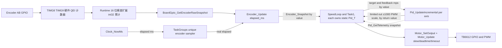
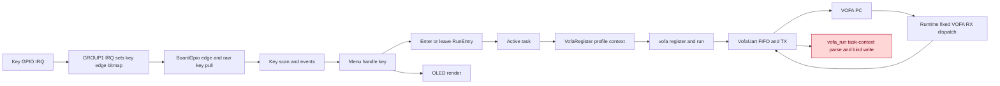
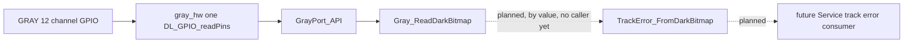

# NUEDC API 平台架构拓扑图（2026_Diansai · MSPM0G3519）

最后复核：2026-07-17（M02：新增 Middleware `TrackError_FromDarkBitmap` 循迹误差估计器，零调用者预期状态）  
适用工程：`2026_Diansai`（MSPM0G3519，LQFP-100，SDK 2.11.00.07；由旧工程 `NUEDC`/G3507 移植，见 `agent/MIGRATION_G3507_TO_G3519.md`）  
事实来源：当前工作区 `hc-team/**/*.c`、`hc-team/**/*.h`、仓库根 `board.syscfg`  
状态：当前实现拓扑，不是目标架构示意图  
维护规则：任何代码修改前必须先阅读本文件；修改完成后必须同步更新本文件和末尾日志。

## 1. 阅读规则

- Mermaid **类图**把每个模块的公共 API 打包成一个类；类之间的箭头表示源码依赖、调用或共享状态。
- Mermaid **逻辑图**表示初始化、调度和数据流。实线是当前正常调用，红色节点/连线说明违反根目录 `AGENTS.md` 的存量交叉依赖。
- 本图以当前代码为准。计划中尚未实现的 Board/Clock/UART 拉取接口不得提前画入当前图。
- 私有 `static` 函数不逐项列出，但其所属 `.c` 文件必须由对应模块类覆盖。
- API 新增、删除、改名、移动，模块新增/删除，依赖方向、资源所有权、数据处理位置或单位发生变化时，必须同步修改图。

## 2. Driver API 类图 → `agent/topology/driver.md`

## 3. Middleware 与 App API 类图 → `agent/topology/app.md`

## 4. 当前启动与调度逻辑图 → `agent/topology/app.md`

> 2026-07-17 起拓扑按层分文件存放：§2 在 `topology/driver.md`，§3/§4 在 `topology/app.md`；
> 本文件保留 §1、§5–§10，仍是唯一入口、风险登记与更新日志所在。章节编号不重排。
> 同步义务对三个文件一体生效：类图改动落在分层文件，日志/风险登记/覆盖清单落在本文件（AGENTS.md §14）。

## 5. 关键数据流逻辑图

### 5.1 编码器、PID 与直流电机

必须检查的数据处理：QEI 硬件判向（G3519 起编码器不再产生 GPIO 中断，GROUP1 仅服务按键）、`Mspm0Runtime_GetEncoderCounts()` 的 16→32 位模差扩展（前提：两次读数间位移 < 32767 计数）、Encoder `s_direction_sign` 全链路唯一方向修正点、速度 `m/s`、PID 输出限幅和 Motor 硬件限幅。任何修改都要证明没有重复反向、滤波、缩放或限幅。QEI 方向约定与旧版软件判向可能镜像，上板方向/PPR 校准由用户自理（`agent/MIGRATION_G3507_TO_G3519.md` §4.3）。**限幅唯一所有者是 `Pid_T.cfg.out_limit`**（M01 后 Middleware 内收敛，2026-07-17）；`Motor_SetOutput` 对入参做拒收校验而非二次钳位（不构成重复限幅）。Consumers 各自持有 `static Pid_T`（SpeedLoop/Task1/TaskGroups 各一份），无跨消费者共享实例。

### 5.2 视觉与步进电机

```mermaid
flowchart LR
  VisionUART[Vision UART IRQ DMA] --> RuntimeVision[Runtime fixed IRQ dispatch]
  RuntimeVision --> VisionFifo[VisionUart private FIFO]
  VisionFifo --> VisionBus[VisionBus task-context parser]
  VisionBus --> VisionCoord[VisionCoord frame and state]
  VisionCoord --> Platform2D[VisionHdl control]
  Platform2D --> PIDAxis[PID axis output]
  PIDAxis --> Emm42[Emm42 command packing]
  Emm42 --> StepBus[StepMotorBus queue]
  StepBus --> StepTx[StepmotorUart private TX]
  StepTx --> RuntimeStep[Runtime fixed RX TX DMA dispatch]
  RuntimeStep --> Stepper[EMM42 hardware]
  Stepper --> RuntimeStep
  RuntimeStep --> StepRx[StepmotorUart private FIFO]
  StepRx --> StepBus

  classDef violation fill:#ffd6d6,stroke:#b00020,color:#700018
  class StepBus violation
```

### 5.3 按键、菜单、OLED 与 VOFA

### 5.4 灰度与循迹误差（planned，2026-07-17 M02 起零调用者预期状态）

M02 只交付 `TrackError_FromDarkBitmap` 本体，未接线到 `Gray_ReadDarkBitmap`；虚线表示计划中的数据流，不是已存在的调用边（§15.1 零调用者预期状态）。`bit0_is_left` 是位序左右的唯一修正点（`driver/gray/gray.h` 位序警告的落点），`pitch_mm` 是机械安装事实，两者均无默认值、由未来接线者提供。存量债 `app/tasks/track_follow/Calculate_Track_Error`（V03）与本模块语义不等价（int16 ±55 + 丢线记忆回退 ±27 vs. float mm + 丢线返回 false），移交细节见 `agent/phase3_middleware_rewrite/plan_middleware_first_order.md` §5.2。

## 6. 交叉依赖与风险登记

| ID | 当前交叉/风险 | 证据位置 | 违反规则 | 计划归属 |
|---|---|---|---|---|
| V01 | ~~Runtime SysTick 调用 App Scheduler~~ **closed 2026-07-13** | `driver/clock/clock.c` 拥有 SysTick；`task_scheduler.c` 主循环按 elapsed 推进 | Driver 不得反向调用 App | Phase 2 P1 |
| V02 | **closed 2026-07-16（P5 R02/R06）**：Runtime UART callback 表与 `Set*Callback`/`Send*`/`Busy` 接口已删除，IRQ/DMA 改为固定分发到 `board_uart` 角色 Driver | `mspm0_runtime.h/.c`、`sys_init.c`、`driver/board_uart/*`；R02 零命中，R06 clean 构建与 map 复核 | Driver 不得调用上层注册回调 | Phase 2 P5 |
| V03 | App 直接调用 SysConfig、NVIC、DL HAL **partially closed 2026-07-16（P5 R03）** | `sys_init.c` 已改为调用 `Board_Init()`/`Board_EnableInterrupts()`；`tasks/platform_2d/vision_bus.c`、`tasks/platform_2d/stepmotor_bus.c`、`tasks/uart_stress/uart_stress.c` 已清零；`tasks/track_follow/track_follow.c` 仍直接调用 `__enable_irq` 或包含 `ti/driverlib` | App 不得包含 DL HAL | Phase 2 P1 及后续模块 |
| V03-DUP | **登记 2026-07-17（M02）**：`track_follow.c` 内 `Calculate_Track_Error`（V03 存量债）与新 Middleware `TrackError_FromDarkBitmap`（`middleware/track_error/`）语义不等价的过渡态双实现——旧版 int16 ±55 + 丢线记忆回退 ±27，新版 float mm + 丢线返回 false。本轮零改动旧实现，所有权在上层重置删除 `track_follow.c` 时移交新模块（同 D12 先例） | `hc-team/app/tasks/track_follow/track_follow.c`（旧）、`hc-team/middleware/track_error/track_error.c`（新） | 同一数据变换只允许一个所有者（过渡期内并存，非新增违规，随 V03 关闭时刻一并消除） | 上层重置删除 `track_follow.c` 时消除 |
| V04 | **closed 2026-07-16（P3.T2 E04/E05）**：Motor 头不再包含 pid.h，`Motor_T`/`p_pid`/`g_tMotors` 已删除 | 依赖扫描零命中；`motor.h` 仅标准类型与自有枚举 | Driver 不应暴露 Middleware 内部对象 | Phase 2 P3 |
| V05 | **closed 2026-07-16（P2F E04/E05）**：Encoder 不再写 `g_tMotors`，deprecated API 与公开参数表已删除 | `Encoder_Update()`/`Encoder_GetSnapshot()`；依赖扫描零命中 | 模块不得修改其他模块全局 | Phase 2 P2-FIX |
| V06 | **closed 2026-07-16（P3.T2 E04）**：`encoder_sign` 随 `Motor_T` 删除；Runtime 正交判向 + Encoder `s_direction_sign` 单点修正 | 依赖扫描零命中 | 同一数据处理必须只有一个所有者 | Phase 2 P2-FIX/P3 |
| V07 | TaskGroups/SpeedLoop/Task1 直接编排 Driver 与 PID | 对应 App task 文件 | Task 应只调 Service | Driver 完成后迁入 Service |
| V08 | **closed 2026-07-16（P5 R04）**：Emm42 Driver 改为纯协议组包，`extern` App transport 已删除 | `emm42.c`、`stepmotor_bus.c`；R04 零命中 | Driver 不得依赖 App 符号 | Phase 2 P5 |
| V09 | **closed 2026-07-16（P5 R02）**：VOFA RX 仅在 `vofa_run()` 任务上下文解析，ISR 链只搬运到 `VofaUart` FIFO | `uart_vofa.c`、`driver/board_uart/vofa_uart.c`；R02 零命中且 `vofa_rx_isr` 删除 | ISR 只允许最小搬运/置位 | Phase 2 P5 |
| V10 | Service 目录当前没有有效源 API | `hc-team/app/service/` | 缺少 Driver 与 Middleware 的业务桥 | Driver API 稳定后补齐 |
| V11 | **closed 2026-07-16（P3.T3 E09）**：左右 PWM 统一为 80 MHz/period 7999（10 kHz），compare 按同一 period 换算，比例一致 | `board.syscfg` 单源 + 生成配置 `CLK_FREQ=80000000`/`period=7999` ×2 + `motor_hw.c` 单一常量 | 电机硬件安全与单位口径不一致 | Phase 2 P3.T3 |
| V12 | **closed 2026-07-16（P3.T1/T2 E01）**：`Motor_Update` 状态机实现 slew 限速、换向过零+5ms 死区、100ms 命令超时归零，主机 7 项测试覆盖 | `motor.c` 状态机 + `tests/host/test_motor.c` | 电机保护缺失 | Phase 2 P3 |
| V13 | **partially closed 2026-07-17（M01/`3ab13fe`）**：PID 部分已关闭——`pid.c` 重写为调用者持有上下文的纯算法模块，5 个 `g_t*PID` 全局（`g_tAnglePID`/`g_tLeftMotorPID`/`g_tRightMotorPID`/`g_tTrackPID`/`g_tPositionPID`）连同旧公式/闭环函数全仓删除，改由消费者各自持有 `static Pid_T`。残余仅剩 Scheduler `g_eSysFlagManage` 与 TrackFollow `TrackN`，随上层重置处置。**登记名漂移已于 2026-07-17 修正**：本行与类图历史写的 `g_PID_instances` 从未存在于源码，已更正为实际（已删除的）5 个 `g_t*PID` 符号名 | `g_eSysFlagManage`、`TrackN`（PID 侧证据：全仓扫描旧 5 个全局符号零命中） | 模块状态必须私有，禁止跨模块直接写 | Scheduler/TrackFollow 随上层重置关闭 |
| V14 | UI 直接调用 Key/OLED Driver，并在 UI 头暴露 Key 类型 | `menu_core.*`、`menu_pages.c` | UI 应通过 App 接口/Service，不直接操作 Driver | App Service/UI 阶段 |
| V15 | VOFA Scheduler 直接依赖 VOFA Driver 和 TrackFollow（**PID 一支 2026-07-17 M01 已消除**——`vofa_register.c` 不再 `#include pid.h`，调参持久化改为模块内 static ctx 暂存/恢复，`VofaRegister_API ..> PID_API` 边已删） | `vofa_register.*` | Scheduler 不应成为跨层共享状态中心 | VOFA Service 阶段 |
| V17 | **closed 2026-07-16（P6 R02/R04）**：EEPROM 器件删除，I2C_AUX 只剩 `driver/oled/oled_hardware_i2c.c` 独占；未引入多余 I2C 总线层 | `driver/eeprom/` 删除；`rg -l 'I2C_AUX' hc-team` 仅命中 OLED driver `.c` | 多器件共享总线却无所有者；单器件独占时禁止过度抽象 | Phase 2 P6 |
| P1-SCOPE | P1 完成范围收窄：UART 角色迁移交 P5、按键共享 IRQ 交 P4；P1F.T1 仅关闭 Runtime 死接口与时间包装 | `plan1_fix_runtime_closeout.md` §1；P1F E01–E05 | 无新增违规；避免跨计划重复关闭 | P1-FIX / P4 / P5 |
| V16 | **closed 2026-07-16（HT.T1 E01/E04）**：主机测试套件 `tests/host/` 已从旧 `NUEDC` 仓库迁入当前仓库，可在本仓库复跑 32 项基线（Encoder 14 + PID 5 + Motor 7 + Key 6） | `tests/host/` 7 个源文件；`rtk make -C tests/host all` 全绿；`git ls-files tests/host` 恰好 7 个文件且无 `.exe` | 测试是交付内容；验收协议依赖主机测试基线 | HT.T1 done，P5 前置满足 |
| V18 | **closed 2026-07-17（P9.T2 E04）**：`emm42.h` 曾声明 13 个总线动作函数，而它们实现在 App 层 `stepmotor_bus.c:702-861` —— Driver 头对外宣称 Driver 提供这些能力，实则不提供，单独链接 `emm42.o` 得未定义引用。13 个声明已迁往 `stepmotor_bus.h`（实现所在层），声明数守恒 13→0 / 0→13 | `driver/step_motor/emm42.h`、`app/tasks/platform_2d/stepmotor_bus.h`；E04 实测 | Driver 头不得声明 App 层实现的符号 | Phase 2 P9.T2 |
| V19 | `uart_vofa.h:16` `typedef uint8_t u8` 污染全局命名空间 | `driver/uart_vofa/uart_vofa.h` | 公共头不得向全局命名空间注入通用短别名 | `extern "C"` 守卫已于 P9.T2 补齐；`u8` 属跨模块 churn，随 VOFA Service 阶段 |
| V20 | `board.h:5-7` 断言「No other project layer may include `ti_msp_dl_config.h`」措辞过宽，与 8 个模块的实际设计冲突（clock/board_gpio/oled/board_uart 均为各自外设的指定边界文件）。真正规则应为「TI HAL 只能出现在各模块的边界文件里」 | `driver/board/board.h:5-7` | **文档措辞缺陷，非代码缺陷** —— 登记以免后人据此误判 | 后续文档批次 |

登记表只允许基于代码证据新增或关闭。修复完成后不要直接删除记录：先把状态改为“closed + 日期 + 验证”，下一次阶段收口时再归档。

## 7. 源文件覆盖清单

| 层 | 模块/API 包 | 覆盖文件 |
|---|---|---|
| Driver | Clock | `driver/clock/clock.c/.h` |
| Driver | Board | `driver/board/board.c/.h` |
| Driver | Board GPIO | `driver/board_gpio/board_gpio.c/.h` |
| Driver | Runtime | `driver/mspm0_runtime/mspm0_runtime.c/.h` |
| Driver | Board UART Roles | `driver/board_uart/vision_uart.c/.h`、`driver/board_uart/vofa_uart.c/.h`、`driver/board_uart/stepmotor_uart.c/.h`、`driver/board_uart/imu_uart.c/.h` |
| Driver | Motor | `driver/motor/motor.c/.h`（纯状态机，无 TI 头）、`motor_hw.c/.h`（唯一 TI 头位置） |
| Driver | Encoder | `driver/encoder/encoder.c/.h` |
| Driver | Gray | `driver/gray/gray.c/.h`（散射逻辑，无 TI 头，主机可测）、`gray_port.h`（HAL 边界）、`gray_hw.c`（唯一 TI 头位置；引脚全经 syscfg 生成宏，零手抄）。2026-07-17 P9.T1 新建：器件 NCHD1「迹」12 路阵列，公共面仅 `Gray_ReadDarkBitmap()`。零外部调用者 —— §15.1 预期状态 |
| Driver | Key | `driver/key/key.c/.h` |
| Driver | OLED | `driver/oled/oled_hardware_i2c.c/.h`（公共面仅 Init/Clear/ShowChar/ShowString/Process/IsReady；`oledfont.h` 仅 driver 私有字模） |
| Driver | IMU | `driver/imu/imu.c/.h`（2026-07-17 P8 重写：器件更换为内置 Kalman 解算的单轴模组，5 字节定长帧，只出 Yaw 与 GyroZ；旧 `IMU.c/.h`(0x7E 九轴协议)已删除。RX 已接线，仍零外部调用者 —— 待 Service 层消费；MPU6050/I2C_IMU 已于 2026-07-16 移除） |
| Driver | EMM42 | `driver/step_motor/emm42.c/.h`（纯协议组包，无 TI 头。2026-07-17 P9.T2：13 个 App 实现的声明已迁出，本头此后只声明 `emm42.c` 自己实现的符号 —— V18 关闭） |
| Driver | VOFA UART | `driver/uart_vofa/uart_vofa.c/.h` |
| Middleware | PID | `middleware/pid/pid.c/.h`（2026-07-17 M01 重写：调用者持有上下文的纯算法模块，`Pid_Init/Pid_Reset/Pid_SetGains/Pid_SetLimits/Pid_UpdateIncremental/Pid_UpdatePositional/Pid_GetTelemetry`；无模块级实例，无 Driver/DL HAL/App 引用） |
| Middleware | Track Error | `middleware/track_error/track_error.c/.h`（2026-07-17 M02 新建：无状态纯函数 `TrackError_FromDarkBitmap()`，加权重心量化深色位图→带符号横向误差 mm；仅依赖 `<stdbool.h>`/`<stdint.h>`，无 Driver/DL HAL/App 引用。零外部调用者 —— §15.1 预期状态；与存量 `app/tasks/track_follow/Calculate_Track_Error`（V03）双实现并存，语义不等价，移交细节见 phase3 计划表 §5.2） |
| App System | Main/Init | `app/system/main.c`、`sys_init.c` |
| App Scheduler | Scheduler/Registry/VOFA | `app/scheduler/task_scheduler.*`、`run_registry.*`、`vofa_register.*` |
| App UI | Menu | `app/ui/oled/menu_core.*`、`menu_pages.*` |
| App Tasks | Task groups | `app/tasks/task_groups.c/.h` |
| App Tasks | Speed loop | `app/tasks/speed_loop/speed_loop.c/.h` |
| App Tasks | Task1 | `app/tasks/task1/task1.c/.h` |
| App Tasks | Track/Gray | `app/tasks/track_follow/*`、`gray_test/*` |
| App Tasks | UART tests | `app/tasks/uart_test/*`、`uart_stress/*` |
| App Tasks | Platform 2D | `app/tasks/platform_2d/2DPlatform_LaserStrike.*`、`stepmotor_bus.*`、`vision_bus.*`、`vision_coord.*` |
| App Service | 预留层 | `app/service/` 当前无有效 `.c/.h` API |
| Utils | 空目录 | `hc-team/utils/` 当前无有效 `.c/.h` API |

新增源文件时必须先确定它属于哪个 API 包；无法归类时停止编码，不得把文件塞进 `utils` 或任意 task 目录。

## 8. 每次代码执行前检查

1. 在类图中找到将修改的 API 包及所有入边、出边。
2. 在逻辑图中从数据源追到最终执行器，阅读上下游 API 的实际实现。
3. 检查是否新增 Driver→App、Middleware→Driver、Task→Driver/Middleware 或循环依赖。
4. 检查单位、方向、滤波、校准、限幅和状态是否已有所有者。
5. 涉及 Motor 时检查 V11/V12 与 P0 闸门；未关闭前禁止带载执行。
6. 若图与代码不一致，先修正本图再继续设计。

## 9. 每次代码执行后更新

1. 更新顶部“最后复核”日期。
2. 更新类图中的公共 API；删除的 API 必须同时从图中删除。
3. 更新真实依赖箭头和数据流，不得只更新目标架构。
4. 更新交叉依赖登记：新增、保持或关闭，并附验证证据。
5. 更新源文件覆盖清单。
6. 在下方日志新增一行。即使拓扑没有变化，也必须记录“已复核，无拓扑变化”。
7. 验证 Mermaid 代码块闭合、节点名称唯一，文档能正常渲染。

## 10. 更新日志

| 日期 | 代码/文档变更 | 拓扑更新 | 复核结果 |
|---|---|---|---|
| 2026-07-13 | 创建 Phase 2 Driver 计划并首次建立全仓库 API 拓扑；同步 `AGENTS.md` 强制维护流程 | 建立 Driver/App 类图、启动/调度图、三条数据链和 V01-V15 登记 | 当前存在多处存量交叉；Motor P0 闸门有效 |
| 2026-07-13 | P1 复审第二轮：memcpy 显式模映射消除所有 implementation-defined 转换，Makefile RM 容错，拓扑删除虚设依赖/更新关闭项，P2.1 状态修正 | 删除 BoardGpio_API→Encoder_API 虚设箭头；修正 5.1 交叉点文本移除已关闭 V01；Encoder_API 新增 u32_mod_i32/i64_narrow_i32 内部帮助函数 | 13 项主机测试通过（-ftrapv），固件编译通过；P2.1 硬件口径仍待确认 |
| 2026-07-13 | P1 复审修复：编码器 int64_t 回绕防溢出、Runtime 原子快照、clock.h 注释修正、Makefile/测试加固、基线文档口径更新 | Encoder_API 新增 Encoder_Update/Encoder_GetSnapshot；数据流标注 PRIMASK 原子读取；无新增交叉依赖 | 13 项主机测试全部通过（含 -ftrapv），固件编译无 warning/error |
| 2026-07-13 | Makefile clean：Windows 分支改用 cmd.exe /D /C if exist del，每文件独立命令，无 `-` 吞错 | 无拓扑变更 | Windows 实测通过：`make clean` 返回 0，`test_encoder.exe` 与 `test_encoder` 均不存在 |
| 2026-07-13 | 新增 REASONIX 嵌入式重写项目级 Skills：规划、施工、独立验收，并固化常见 AI 失败模式与施工者 Prompt | 仅新增 `.agents/skills/reasonix-embedded-*`，不改变代码 API 拓扑 | 三个 Skill 均通过 `quick_validate.py`；路径断言脚本成功/失败路径通过；前向测试能限制任务范围并拒绝无后置条件证据的完成声明 |
| 2026-07-13 | 将流程明确为 Codex 计划 → REASONIX 施工 → REASONIX 独立自检 → Codex 最终验收；新增 `reasonix-embedded-self-check` 和统一证据行/状态标签 | 仅更新 `.agents/skills/reasonix-embedded-*`，不改变代码 API 拓扑 | 四个 Skill 均通过 `quick_validate.py`；CLEAN-1 前向测试按 E01 完成生成、存在断言、clean、缺失断言并输出 `SELF_CHECK_PASS` |
| 2026-07-16 | Codex 建立 P3/P4/P5 施工计划与验收契约（`plan3_motor_rewrite.md`、`plan4_key_rewrite.md`、`plan5_uart_role_drivers.md`），逐条核实 V02/V03/V04/V05/V06/V08/V09/V11/V12 证据行号 | 已复核，无拓扑变化；计划中的目标接口（Motor 新 API、BoardGpio 按键位图、board_uart 三角色）未提前画入当前图 | 证据核实与当前图一致；各违规项状态保持 open，关闭须凭对应计划的 E 行证据 |
| 2026-07-16 | REASONIX `SELF_CHECK_BLOCKED`（P1/P2 前置不成立 + StepMotor 921600×5ms 吞吐缺口）；Codex 建立收口契约 `plan1_fix_runtime_closeout.md`、`plan2_fix_encoder_closeout.md`，修订 plan3/4/5 前置条件与 P5 §0.1 吞吐契约（drain-until-empty、StepMotor 命令-应答流量模型），核实 runtime 死接口与 deprecated Encoder API 调用点 | 已复核，无拓扑变化；P1 范围收窄裁定（P1.3/P1.4→P5、P1.5.2→P4）登记于 plan1_fix §1，拓扑边待各 E 行验收后更新 | 阻塞裁定成立；全部违规项保持 open；施工顺序固化为 P1F.T1→P2F.T1→(P3/P4)→P5 |
| 2026-07-16 | FIX-BAUD：用户将三路 UART 统一为 230400（`board.syscfg:226,260,293`）；Codex 同步 6 文件 7 处代码注释与 plan1/plan5/phase1 文档中的旧波特率说明（`plan_fix_baud230400_comments.md`），P5 §0.1 吞吐数字按 230400 重算（线速缺口消除，drain 裁定不变） | 已复核，无拓扑变化；纯注释/文档同步，API 与依赖边不变 | `rg '921600\|115200\|460800' hc-team` 零命中；`rtk make -C Debug all` 退出码 0（SysConfig 按新波特率重新生成）；230400 实测归 P5 硬件行 E14 |
| 2026-07-16 | P1F.T1：删除 Runtime 8 个零调用接口与 `GetTickMs`/`InitTick` 包装；12 个调用点改为 `Clock_NowMs()` | Runtime_API 精确保留仍有调用者的 UART/Delay 接口；OLED、MPU6050、IMU、Task1、StepMotorBus、VisionBus、VisionCoord 时间边改指向 Clock；登记 P1 范围移交 | E01/E02 全仓零命中；E03 Host 13 项通过；E04 clean 固件构建退出 0、编译诊断 0、map 零命中；E05 对照施工前后状态确认本任务仅触及允许源文件与强制拓扑，既有 WIP 未归因于本任务；E06/E07 属 P1F.T2，仍开放 |
| 2026-07-16 | P2F.T1：PID 双轮入口改为目标/反馈按值输入、双输出指针；Encoder 删除 Motor 兼容写入、公开参数表与 10 个 deprecated API；TaskGroups 唯一采样所有者计算真实 elapsed，SpeedLoop/Task1 消费快照并显式输出 Motor | 删除 PID→Motor、Encoder→Motor 边；更新 Encoder/PID API 与 5.1 数据流；V05 关闭、V04 Middleware 侧关闭、V06 软件所有权收口 | RED 为六参调用遭旧两参声明拒绝；独立审查发现并修复首拍 elapsed/基线错位；E01 正则误报已透明更正；Host 19 项通过，E03–E05 零命中，clean 固件构建退出 0；硬件 E07–E09 仍开放 |
| 2026-07-16 | Codex 验收 P1F.T1+P2F.T1：独立复跑 E 行扫描（全零命中）与 Host 19 项测试，聚焦审读 PID 契约/采样所有者/重入修复，裁定 `CODEX_SOFTWARE_ACCEPTED`，提交 `455a968` | 已复核，无新增拓扑变化（施工时已同步） | 通过；P1F.T2/P2F.T2 硬件行开放 |
| 2026-07-16 | 用户裁定简化流程：撤销 REASONIX 自检阶段，删除 `reasonix-embedded-self-check` skill；execute/accept/plan 三个 skill 改为“施工行级报告 + Codex 精简验收”，E 行预算 ≤6/任务、单次构建证据复用；五份计划状态标签同步为 `CONSTRUCTION_*`/`CODEX_*`；plan3 消除“禁斜坡”与 AGENTS.md §8.1 的冲突，改为 Motor 私有 slew limit | 已复核，无代码 API 拓扑变化 | `rg 'SELF_CHECK' .agents` 仅余历史记述；硬件门与 Motor P0 不受简化影响 |
| 2026-07-16 | 用户裁定取消硬件验收（软件验收唯一制）：五份计划硬件行作废（P1F.T2/P2F.T2/P4.T3 removed，plan3 T3 改为 syscfg PWM 统一纯软件任务，P5 E14–E16 降为用户自测参考，UART2 归属改为用户书面确认）；skills 同步（验收结论收敛为 `CODEX_ACCEPTED`/`CODEX_REJECTED`，电机软件安全设计保留为主机可证验收项）；P1F.T1/P2F.T1 升格 `CODEX_ACCEPTED`，P1/P2 标 done | 已复核，无代码 API 拓扑变化 | 软件行即终局；板上实测由用户自理 |
| 2026-07-16 | P3.T1 验收 `CODEX_ACCEPTED`：新文件 `motor_new.c/.h`+`motor_hw.h`+主机测试实现带 slew/换向死区/命令超时的 Motor 状态机（占位常量 slew=100‰/ms、deadtime=5ms、timeout=100ms，待 T3/用户确定），不进固件构建 | 无拓扑变化（新符号在 T2 并入 `Motor_API` 时更新类图与覆盖清单） | Codex 复跑：负面扫描零命中，Host 26 项（Encoder14+PID5+Motor7）全绿；观察项：`pending_direction` 冗余记账，T2 并入时删除 |
| 2026-07-16 | 用户重命名 syscfg 全部外设组并新增 `UART_IMU`（物理 UART3，230400）；Codex 基线同步 16 文件宏名并按角色核对 DMA 通道（步进 TX CH2→CH3、VOFA RX CH5→CH2），修复 clean 构建失败（提交 `5131f6e`） | 类图/数据流按角色命名不受影响；`UART_IMU` 专用端口使 IMU 与步进共享发送链问题获得配置级解法（P5.T3 契约待修订） | `rtk make -C Debug all` 退出 0；宏名旧引用全仓零命中 |
| 2026-07-16 | P3.T2 验收 `CODEX_ACCEPTED`：`motor_new` 并入 `motor.c`+`motor_hw.c`，全部消费者改用 `Motor_SetOutput`/`Motor_Update`，`Motor_T`/`g_tMotors`/`Motor_SetPwm`/`Motor_GetSpeed`/`encoder_sign` 全删；`pending_direction` 冗余项已清 | `Motor_API` 更新为新 5 API；删除 `Motor_API→PID_API` 边；V04/V06/V12 closed、V11 partially closed（频率统一归 T3）；覆盖清单加 `motor_hw.c/.h`；5.1 数据流更新 | Codex 复跑：E04–E06 扫描零命中，Host 26 项全绿，E07 clean 构建退出 0、map 含 `Motor_Update`（构建阻塞由 syscfg 改名引起，基线修复后完成，非施工缺陷）；观察项：`Motor_Update` 使用名义周期常量而非实测 elapsed，slew 在调度抖动下偏保守，可接受 |
| 2026-07-16 | P4.T1：Key Driver 改为 `BoardGpio` 拉取边沿/电平位图，`key.c` 去除 TI 头依赖，新增主机按键测试 | `BoardGpio_API` 新增 `ConsumeKeyIrqEdges/GetKeyRawLevels`；`Key_API` 删除 `Key_NotifyIrq`；删除 `Runtime_API ..> Key_API` 与 `Key_API --> DL_HAL`，新增 `Key_API --> BoardGpio_API`；5.3 数据流改为 `GROUP1 IRQ -> BoardGpio -> Key_Scan` | E01 Key 6 项主机测试通过且 `hc-team/driver/key` 对 TI 头扫描零命中；E02 Host 全套 32 项通过，无 Encoder/PID/Motor 回归 |
| 2026-07-16 | P3.T3 验收 `CODEX_ACCEPTED`：syscfg 单源统一左右驱动 PWM 为 10 kHz（80 MHz/8000），`motor_hw.c` 收敛为单一 period 常量；P3 整体 done | V11 closed（生成配置双通道 `CLK_FREQ=80000000`、`period=7999` 为证据） | Codex 复核生成值与 diff；构建退出 0、0 警告 |
| 2026-07-16 | P4.T1/T2 验收 `CODEX_ACCEPTED`：`Key_NotifyIrq` 符号全仓零命中（T2 目标随 T1 完成）；runtime GROUP1 ISR 只置私有边沿位图，原子读清经 `BoardGpio` 拉取；Codex 将 `Mspm0Runtime_ConsumeKeyIrqEdges` 的裸 `extern` 声明归位到 `mspm0_runtime.h`；P4 整体 done | `Runtime_API` 新增 `+Mspm0Runtime_ConsumeKeyIrqEdges()`（经 BoardGpio 消费）；其余同上行 | Codex 复跑：E03/E04 扫描零命中、Host 32 项全绿、固件构建 0 警告退出 0 |
| 2026-07-16 | P5 统一施工（Vision→VOFA→StepMotor/EMM42/UartStress/IMU）：新增 `board_uart` 四角色 Driver，Runtime 删除全部 UART 回调/Send/Busy 接口，Vision/VOFA/StepMotor RX 全部改为任务态 drain-and-parse，IMU 改走 `UART_IMU` 最小 TX 角色 | 顶部复核日期改为 P5；Driver/App 类图新增 `VisionUart_API`/`VofaUart_API`/`StepmotorUart_API`/`ImuUart_API`，删除 Runtime callback/VOFA ISR/Emm42 extern 依赖；5.2/5.3/启动图改为固定分发 + 私有 FIFO；V02/V08/V09 closed，V03 partially closed | 以 R01-R06 为准：Host 全套通过、负面扫描零命中、clean 固件构建退出 0 且 map 含四个新角色符号 |
| 2026-07-16 | 调试串口迁移（用户裁定，Codex 自施工自验收）：`UART_HOST_LINK`(VOFA) 由 UART0/PA10/PA11 迁至 **UART5/PA1(TX)/PA0(RX)/230400/DMA**；PA10/PA11 收归 **`UART_BSL_ENTRY` = UART0/9600/无 DMA/无中断**，专供无线 BSL 烧录。仅改 `board.syscfg`，生成物由 SysConfig 产出 | `VofaUart_API --> DL_HAL` 边标注更新为 UART5 PA1/PA0；顶部复核日期更新。**无新增/关闭违规**（配置迁移，非违规修复） | R01 Host 76 项全绿；R02 clean 固件构建 exit 0 且 0 warning；R03 `UART_HOST_LINK_INST=UART5`、IRQ 改指 `UART5_IRQHandler`；R04 `UART_BSL_ENTRY_INST=UART0` @9600 且引脚与 SDK BSL 示例逐字吻合；**R05 `git status hc-team tests` 为空——驱动零改动，证实 UART 实例号为 Driver 以下私有事实**；R06 DMA 触发改指 UART5 且 UART0 无 NVIC。**已知缺口**：`UART_BSL_ENTRY` 暂无消费者（ENTRY 字节 0x22 监听器未实现，属独立特性）；PA0/PA1 板上尚未引出，待硬件组新画 |
| 2026-07-16 | P6：删除 `driver/eeprom/at24cxx.*` 死代码，OLED 公共头收口为 6 个显示能力接口，I2C 等待上限按 400 kHz + 80 MHz 算式替代 `50000u`，新增主机 OLED 测试 | 顶部复核日期改为 P6；Driver 类图删除 `EEPROM_API` 与其 I2C 边，`OLED_API` 收敛为 6 个公共接口并标注 `I2C_AUX` 独占；新增并关闭 V17；覆盖清单删除 EEPROM 行并更新 OLED 行 | 以 P6 R01-R06 为准：Host 76 项通过，EEPROM/旧 OLED 公共符号零命中，clean 固件构建退出 0，map 含 `OLED_ShowString`/`OLED_IsReady` 且不含 `at24cxx_*`/`oled_pow` |
| 2026-07-16 | plan5 修订 4：P5.T3 的 IMU 处置改为迁移到最小 `imu_uart` TX 角色（`ImuUart_Init/TryWrite`，UART_IMU 无 DMA）；"UART2 归属确认"前置作废；Codex 核实 IMU 模块零外部调用者（休眠代码），禁止推测性 RX FIFO（归 P7） | 已复核，无代码 API 拓扑变化（imu_uart 为批准的未来接口，不提前画入） | `rg -c 'IMU_UART_\|IMU_Update_Yaw\|IMU_Get_Reset\|IMU_Calibrate' hc-team --glob '!hc-team/driver/imu/*'` 零命中；P5.T1–T3 全部可派工 |
| 2026-07-16 | G3507→G3519 迁移后拓扑本地适配（仅文档同步，未改代码）：工程移入 `2026_Diansai`（MSPM0G3519/LQFP-100，SDK 2.11.00.07，配置源为仓库根 `board.syscfg`）；编码器改 TIMG8/TIMG9 硬件 QEI（PA7/PA6、PA3/PA2），GROUP1 仅服务按键；步进总线物理实例 UART2→UART7（PB15/PB16 不变）；MPU6050/I2C_IMU 已移除（提交 `37ff7fc`）；灰度 8 路升级 12 路（提交 `c60f4eb`，`TRACK_SENSOR_COUNT=12`） | 删除 MPU6050_API 类、System/Task1→MPU6050 边与覆盖清单行；5.1 数据流改为 QEI 硬件计数；事实来源路径改为根 `board.syscfg`；登记 V16（`tests/host` 未迁入） | 对照 `hc-team` 源码与 `agent/MIGRATION_G3507_TO_G3519.md` 复核：`rg 'MPU6050' hc-team` 仅余 task1.c 一条移除说明注释；公共 API（Encoder/BoardGpio/Runtime）与依赖边未变 |
| 2026-07-16 | 计划目录整理（仅文档，未改代码）：phase2 已验收计划（P1/P1F/P2/P2F/P3/P4/FIX-BAUD 共 7 份）移入 `done/`，作废的 GROUP1 判向基线移入 `obsolete/`；新建 `agent/README.md`（目录导航 + 项目脉络）与 HT.T1 派工契约 `plan_host_tests_restore.md`（tests/host 迁入恢复 32 项基线，P5 前置） | 已复核，无代码 API 拓扑变化；V16 计划归属更新为 HT.T1 | 工作区 `git status` 中 `hc-team` 零改动；phase2 顶层只余索引与两份待派工计划 |
| 2026-07-16 | HT.T1 验收：从 `../NUEDC/tests/host/` 迁入 7 个主机测试源文件，恢复 `tests/host` 32 项基线（Encoder 14 + PID 5 + Motor 7 + Key 6）；`.gitignore` 补齐主机测试可执行产物忽略；`hc-team` 与 `board.syscfg` 保持零改动 | V16 closed；tests 不进入类图；无新增 API 边 | `rtk make -C tests/host all` 全绿；`rg -n 'ti_msp_dl_config|ti/driverlib' tests/host` 零命中；`git ls-files tests/host` 恰好 7 个文件；`git status --porcelain hc-team board.syscfg` 为空；`rtk make -C Debug all` 通过 |
| 2026-07-16 | 流程自闭环（用户裁定，仅文档/skills，未改代码）：取消第二个施工者，三个 `reasonix-embedded-*` skill 合并为 `.agents/skills/embedded-closed-loop`（决策→施工→验收由单 agent 全占），删除 3 份 GPT 承包商注册 `openai.yaml` 与施工者派工 Prompt；4 份 reference 经 `git mv` 保留历史。代偿机制：**契约含全部 E 行须在写生产代码前先提交**，验收比对带时间戳的冻结契约，由 git 充当消失的第二方；E 行改错须单独提交说明。标签 `CODEX_*` 退役为 `ACCEPTED`/`REJECTED`。顺带回退 CCS 自动写入 `.cproject` 的失效索引项（指向已删 `docs/pin_table_v2`）与重复 Debug 构建配置块 | 已复核，无代码 API 拓扑变化 | `git grep -ri "reasonix|codex" .agents` 零命中；`git status --porcelain hc-team board.syscfg tests Debug` 为空；日志表 REASONIX 历史记述按惯例不回改。教训登记：本次 `sed -i` 曾静默剥掉全文 687 行 CRLF，被 `--ignore-all-space` 与 `cat -A` 发现并回退，改用 Edit 工具重做 |
| 2026-07-16 | QEI/灰度引脚重映射（`plan_qei_gray_pinmux.md`，自闭环施工+验收）：编码器 4 脚中 3 个是核心板晶振/振荡器脚（PA3=SYSCTL.LFXIN、PA6=SYSCTL.HFXOUT、PA2=SYSCTL.ROSC，经 TI 器件数据核实），核心板为现成模块、晶振实焊，固件不可绕过 —— 采纳硬件组方案：`QEI_LEFT` 迁 **TIMG9/PB7/PB9**、`QEI_RIGHT` 迁 **TIMG8/PB10/PB11**；12 路灰度让出 PB7/PB9/PB10/PB11，IN5/IN10/IN11 迁 PB20/PB14/PB0，**IN4 迁 PB8 而非引脚表建议的 PA7**（唯一偏离：PA7 跨端口会消灭 `GPIO_LINE_SENSOR_PORT` 组级单端口宏并破坏 12 路原子采样；PB8 是 PB7 物理邻脚）。释放 PA2/PA3/PA6/PA7。仅改 `board.syscfg` | **无 API 边变化**：5.1 数据流 `TIMG8 TIMG9 硬件 QEI 计数器` 不含引脚与左右归属，迁移后仍为真。左右轮与 timer 的绑定互换由 syscfg `$name` 吸收（QEI_LEFT/RIGHT 继续与物理轮子绑定），**无新增/关闭违规** | E01 clean 固件构建 exit 0 且 0 warning；E02 `QEI_LEFT_INST=TIMG9`/`QEI_RIGHT_INST=TIMG8`；E03 `GPIO_LINE_SENSOR_PORT=(GPIOB)` 仍存在（12 路同端口未破）；**E04 `git status hc-team tests` 为空 —— 驱动零改动，再次证实外设实例号为 Driver 以下私有事实**；E05 主机 76 项全绿 0 FAIL；E06 引脚表与 `board.syscfg` 逐行交叉核对 0 冲突（原 11 行 Q4 冲突全消），原表 44 脚零丢失、只增 PB8，并删除 2 行与陀螺仪共用 PA25/PA26 的「作废」重复记录。**遗留风险：`encoder.c:41` `s_direction_sign[]={-1,1}` 按旧板 AB 极性标定，新板须实测重标（禁止新增第二个反转开关）；核心板晶振实焊情况待硬件组书面确认** |
| 2026-07-17 | P8/P8B 收官：两份已验收契约扫入 `agent/phase2_driver_rewrite/done/`（9 份）；README 目录地图改为真实状态。**纯文档，零代码改动** | **已复核，无拓扑变化**（§14.4）。巡查副产物（登记，未施工）：`plan5`/`plan6`/`plan_debug_uart_remap`/`plan_qei_gray_pinmux`/`plan_p7` 五份状态均为 `(CODEX_)ACCEPTED` 却仍在根目录；`plan_host_tests_restore.md` 状态行写 `pending` 但 HT.T1 实为已验收（V16 closed/`d57b728`）；`plan_pin_table_v2_migration.md` 状态行写 `BLOCKED` 但已被 `plan_qei_gray_pinmux.md` 取代 —— **后两者是陈旧状态行，非真实冲突**，未擅自改写 | `git status --untracked-files=all` 复核：代码路径下 143 个条目全部为未跟踪的参考资料，已暂存 **0**。**施工事故（记录在案）**：首次提交时 `git add -A` 误将用户施工期间放入的 `hc-team/12路灰度传感器检测20240331（STM32F103C8T6）/`（约 80 文件，含 STM32 固件库/PDF/JPG）整个扫入，且提交信息谎称「纯文档，零代码改动」。**根因是量具错误第四次**：核实用的 `git status --untracked-files=no` 恰好排除了未跟踪文件 —— **而要查的对象正是未跟踪的**。已 `reset --soft` 撤销后以 `--untracked-files=all` 重新核实。**教训：核实「有没有多余东西被提交」时，口径必须能看见未跟踪文件** |
| 2026-07-17 | P8B：IMU 链路提速 **230400 + 500 Hz**（契约 `plan_p8b_imu_230400_500hz.md`，冻结于 `92e11f5`）。`board.syscfg` 的 `UART_IMU` 115200→230400；`imu.h` 枚举**末尾追加** `IMU_OUTPUT_RATE_500_HZ`（RRATE 0x0D）；`imu_uart.c` 的 TX 有界轮询超时按 230400 重算、FIFO 注释按 500 Hz 重算 | `ImuUart_API --> DL_HAL` 边波特率标注 115200→230400。无新增/删除 API，无依赖方向变化 | E01 clean 构建 exit 0/诊断 0；E02 主机 **101 PASS / 0 FAIL**（98 基线 + 3 新增）；E03 `UART_IMU_BAUD_RATE`=230400；E04 `imu_uart.c` 中 `115200` **0 命中**；E05 未暴露 1000 Hz（**0 命中**）；E06 生成物 diff 仅波特率行，`QEI|PWM_DRIVE` 漂移 **0**。**裁定理由经审查后更正入账**：用户「底盘 500Hz 更精准」不成立（速率与精度在本器件解耦，内部采样 50kHz、Kalman 常驻，精度指标各档相同；且 100Hz 控制环自身滞后 10ms 已远大于 5ms↔2ms 之差）。**真实依据是云台前馈延迟**：180°/s 转弯时 200Hz 的 5ms 数据龄=0.90° 指向误差，为器件自身 0.2° 精度的 4.5 倍；500Hz 压至 0.36° 同量级；1000Hz 的 0.18° 跌破噪声底故不暴露 | 
| 2026-07-17 | 用户裁定入规范：**App 上层将整体重置，当前只做 Driver 层下层接口，不管上层调用者**。`AGENTS.md` 新增 §15（不重排既有编号 —— §8.1/§14 等被 11 处文档引用）；新建严格计划表 `agent/phase2_driver_rewrite/plan_driver_first_order.md`；新增 `docs/IMU陀螺仪配置指南.md`（面向厂商上位机的配置动作）。**纯文档，零代码改动** | **已复核，无拓扑变化**（§14.4）。巡查副产物（登记，未施工）：`driver/gray/` **不存在**，12 路灰度采样在 `app/tasks/track_follow/track_follow.c:26,61` 直接 `#include ti_msp_dl_config.h` 并调 `DL_GPIO_readPins` —— 这是 **V03 至今 partially closed 而非 closed 的唯一残留点**，且处于用户暂缓裁定下 | `git diff --stat` 仅 4 个文档文件；`hc-team/**` 与 `board.syscfg` 零触碰 |
| 2026-07-17 | P8：新单轴 IMU 驱动重写（契约 `plan_p8_imu_rewrite.md`，冻结于 `f0ef8f0`）。**器件已更换**：旧 0x7E 九轴协议 → 新 5 字节定长帧单轴模组（内置 Kalman 解算，只出 Yaw 与 GyroZ）。删除 `IMU.c/.h`(616 行)，新增 `imu.c/.h`；`imu_uart` 补 RX FIFO；`mspm0_runtime` 新增 `UART_IMU_INST_IRQHandler`（唯一不走 DMA 的接收角色）；`board.syscfg` 的 `UART_IMU` 230400→115200 且开启外设级 RX 中断 | `IMU_API` 类改为 6 个新接口；**违规边 `IMU_API --> DL_HAL : exposed TI header` 关闭**（E02 实测 IMU 层零 TI 依赖）；新增边 `Runtime_API --> ImuUart_API`、`IMU_API --> Runtime_API`；`ImuUart_API` 补 `Read`/`GetRxOverflowCount`；覆盖清单 IMU 行改写 | E01 clean 固件构建退出 0、诊断 0（`imu.o` 实测重编、`.out` 实测重链，非空转）；E02 `hc-team/driver/imu/` 中 `ti_msp_dl_config|DL_|delay_cycles` **0 命中**；E03 旧器件 API 全工程 0 命中，`git ls-files` 施工前 2 → 施工后 0；E04 主机 **98 PASS / 0 FAIL**（76 基线 + 22 新增 IMU 用例）；E05 `UART_IMU_BAUD_RATE=115200` 且 `SYSCFG_DL_UART_IMU_init()` 内 `DL_UART_MAIN_INTERRUPT_RX` 命中 1；E06 变更文件全在 allowed_files。**契约修订 2 次且均单独提交**：E05 符号名（`27e50d7`）、E03 模式自始不可满足（`93bf75f`）。**教训：证据行的模式必须在冻结前先对现有代码树跑一遍**（量具错误第三次）；**`core.ignorecase=true`，证明文件删除只能用 `git ls-files`，`ls` 会假阴性** |
| 2026-07-17 | P7：巡查推翻原范围 —— Step Motor 已于 P5 拆完（`emm42.c` 已是纯组包），IMU 无外部调用者且 RX 未接线（`mspm0_runtime.c` 中 IMU 字样 0 处）。**IMU 部分经用户 2026-07-17 裁定推迟**（IMU 与 12 路灰度后续要改，避免与重写冲突），已施工的 IMU 改动全部回退，本次仅交付 emm42 残渣清理（契约 `plan_p7_imu_stepmotor.md`，冻结于 `16e0c96`） | 类图去 `Emm42_RunCommandTask()`。**违规边 `IMU_API --> DL_HAL : exposed TI header` 保持 open** —— IMU 未施工，该边仍是真实现状 | E01/E03/E05/E06 全过（构建 0 告警、emm42 残渣 0 命中、主机 76 PASS）。巡查副产物（未修，随 IMU 一并推迟）：`IMU.c` 三处延时按 32MHz 计算而 `CPUCLK=80MHz`，实际时长仅标称 40%；因 IMU 是死代码从未暴露。**教训：`git show HEAD:` 输出的是已归一化的 blob，不能用来判断工作区行尾，只能用 `cat -A` 看工作区文件本身。** |
| 2026-07-17 | **P9.T1：12 路灰度 Driver 移植（D12 —— Driver 层最后一块缺口，用户当日消息解除暂缓裁定）**。契约冻结于 `b421682`，代码 `b423593`。器件为武汉无名创新 NCHD1「迹」12 路阵列。公共面按 §15.3 判据收敛为**单个** `Gray_ReadDarkBitmap()`；结构沿用 motor 范式（`gray.c` 散射逻辑零 TI 依赖 + `gray_hw.c` 唯一 HAL + `gray_port.h` 边界 + 主机假件）。★ **兑现了 board.syscfg 用 PB8 换来却从未用上的性质**：一次 `DL_GPIO_readPins` 读全 12 路，而 `track_follow.c:59-65` 一直是 12 次分读（路间时间偏斜） | 新增 `Gray_API`/`GrayPort_API` 两类与 `Gray_API --> GrayPort_API`、`GrayPort_API --> DL_HAL` 两条边；覆盖清单新增 Gray 行。**V03 保持 open** —— `track_follow.c` 未动（§15.2 禁止在 App Task 里制造调用者），V03 的关闭时机是上层重置**删除**该文件之时，不是 D12 建成之时 | 契约 6 行全过：E01 clean 构建 exit 0/诊断 0（`gray.o`/`gray_hw.o` 实测编译、`.out` 实测重链）；E02 `gray.c/.h`+`gray_port.h` 中 TI 依赖 0 命中；E03 主机 **109 PASS / 0 FAIL**（101 基线 + 8 新增）；E04 `gray_hw.c` 中 `DL_GPIO_readPins` 恰好 1 次、`DL_GPIO_PIN_` 0 次（零手抄引脚号）；E05 `hc-team/app`+`board.syscfg` 状态空；E06 变更全在 allowed_files。**变异验证**：恒等映射变异被 4 条用例逮住、把读取挪进循环被调用计数用例逮住。**观察项**：`Gray_ReadDarkBitmap` 因零调用者被 `--gc-sections` 从镜像剔除 —— 已用对照证明是链接器行为而非缺陷（零调用者的 `Imu_Update` 在 map 中同为 0，有调用者的 `Imu_Init` 为 3），属 §15.1 预期状态 |
| 2026-07-17 | **P9.T2：Driver 层整理**（契约 `19214a8`，E05 修订 `7ddc040`，代码 `6befee8`）。零行为变化：声明搬家 + static 收窄 + 死符号删除 + 注释增补。删死符号 6 处、`Motor_Brake` 收回为私有 `motor_brake_one`（两轮同属一个运动体，只刹一轮会把车甩转）、删空目录 `driver/eeprom/`、`uart_vofa.h` 补 `extern "C"`、9 个文件补 `@file` 契约块 | **V18 closed**：`emm42.h` 的 13 个 App 实现声明迁往 `stepmotor_bus.h`。★ **不改写 V08 历史结论** —— V08 判据是「`emm42.c` 不再 `extern` App 符号」，P5 R04 扫的是 `.c` 里的 `extern`，**看不见头文件声明**，故这是 P5 量具照不到的新缺陷而非误闭。新登记 **V19**（`u8` 命名空间污染）、**V20**（`board.h:5-7` 措辞过宽，与 8 个模块实际设计冲突，属文档错非代码错） | E01 clean 构建 exit 0/诊断 0；E02 主机 109 PASS/0 FAIL 零回归；E03 死符号 6→0；E04 声明守恒 13→0 / 0→13；E05 `Motor_Brake` 1→0 且 EEPROM_GONE；E06 `@file` 覆盖 0/9→9/9。**★ 量具错误第 5 次**：E05 原用裸模式 `Motor_Brake`，它是必须保留的公共 API `Motor_BrakeAll` 的前缀 —— **自冻结起不可满足**，已单独提交修订（`7ddc040`）。**根因与 P8 不同**：P8 教训是「模式须在冻结前对现有树跑一遍」，本次**跑了**（得 2，据此写「2→须 0」），错在**只看计数没看命中的是哪几行**。**修订后教训：跑一遍不够，必须读它匹配到了什么；计数不是证据，命中的行才是。** 另：T2 新注释里写 `Emm42_Send*/Move*`，其中 `*/` 提前终止块注释致 15 条诊断，被 E01 逮住 —— 构建证据行的价值即在此 |
| 2026-07-17 | 拓扑分层拆分后首轮 navigator 巡检：发现 `agent/topology/driver.md` 的 `Motor_API` 类块仍列 `+Motor_Brake(id)`，而该符号已在 P9.T2（`6befee8`）收回为私有 `motor_brake_one`，公共面只余 `Motor_BrakeAll()`——属拆分前遗留的类图漏改，非新增违规 | 删除 `driver.md` 中 `+Motor_Brake(id)` 一行，`Motor_API` 类块与 `motor.h` 当前公共面（`Motor_Init`/`Motor_SetOutput`/`Motor_Update`/`Motor_BrakeAll`）一致 | 以 `motor.h` 源码为准核实：公共头仅剩 4 个符号，`motor_brake_one` 未导出；本次为纯拓扑修正，`hc-team` 零改动 |
| 2026-07-17 | **P9.T3：删除两份参考工程 + 器件事实转录 + Driver 层总汇报**。删除 `hc-team/12路灰度传感器检测20240331（STM32F103C8T6）/`（73 文件）与 `hc-team/IMU_NEW_EXAMPLE/`（71 文件）共 144 个文件。★ **转录先于删除**：二者从未进过 git，删除不可逆，故先提交 `docs/12路灰度传感器配置指南.md`（`f443c7f`）再删。新增 `docs/driver层总汇报.md` | **已复核，无拓扑变化**（§14.4）—— 纯文档与未跟踪文件删除，`hc-team` 代码零改动 | E07 两目录施工前实测 73+71 个文件、施工后 `GRAY_REF_GONE`+`IMU_REF_GONE`；E08 `git status --untracked-files=all hc-team/` 为**空**（参考工程消失且无残渣，Driver 零改动）。**厂商示例里的循迹算法（-11..+11 偏差映射、停止线检测）刻意未随驱动迁入** —— 那属 Middleware 不属 Driver；其设计前提（10mm 线宽下最多 2 路同时压线）已记入灰度指南 §5 |
| 2026-07-17 | **Agent 框架接线（仅工具链，`hc-team/**`、`board.syscfg`、`AGENTS.md` 与全部冻结契约零改动）**。★ **查明本仓库此前没有任何 Claude Code 框架在生效**：官方只原生加载 `CLAUDE.md`（本仓库无此文件），根 `AGENTS.md` 从不自动入上下文；`embedded-closed-loop` 位于非官方路径 `.agents/skills/`（官方为 `.claude/skills/`），**自 2026-07-16 创建起从未被加载过一次**；`agent/` 是计划文档而非子 agent（官方位置 `.claude/agents/` 此前为零）。故既往每次开工的真实成本是手工 Read ≈84KB（`AGENTS.md` 27KB + 本拓扑 56KB + 计划表 10KB）后才能写第一行代码，且 §4/§14 全靠模型注意力执行。变更：① 闭环协议 `git mv` 至 `.claude/skills/embedded-closed-loop`（**现行协议路径以此为准**，覆盖各计划中的 `.agents/skills/` 引用；按惯例历史日志、README 变更表、`done/` 冻结契约中的旧路径不回改）；② 新增三个子 agent：`topo-navigator`（§14.1 编码前检索拓扑切片）、`arch-auditor`（§9.8 分层与链路评审）、`topo-updater`（§14.3/4 拓扑同步）—— 均在独立上下文消化本拓扑的 56KB，主上下文不再承担；③ §4 与 §14 改由 hook 机械执行（`.claude/hooks/`）：`arch-guard.ps1`（PostToolUse 快速反馈）+ `topo-guard.ps1`（Stop 闸门，exit 2 阻断，带 `stop_hook_active` 循环保护），层规则单一实现于 `arch-scan.ps1`，基线生成与检查共用同一函数以防漂移 | **已复核，无拓扑变化**（§14.4）—— 未触碰任何 API、依赖箭头、数据流或资源所有权。★ **§11 存量债务首次被机械量化**：全仓库扫描得 **38 条跨层违规，全部位于 `hc-team/app/**`；`hc-team/driver/**` 与 `hc-team/middleware/**` 零违规** —— §15「Driver 先行」裁定确实产出了合规的 Driver 层。38 条冻结为基线 `.claude/hooks/arch-baseline.txt`，hook 只对基线外的**新增**违规报警（§11.1）；修复一条即从基线删一行，使其不可能被悄悄重新引入 | 扫描器 **5 探针全过**：Driver→App、Middleware→DL HAL、新建 Task→Driver 三个真阳性；`track_follow.c`（V03 存量）正确放行、Driver→DL HAL 合法调用正确放行两个真阴性 —— **零误报**。★ 若无基线机制，硬挡会立刻卡死 17 个 app 文件的任何编辑。Stop hook 三分支实测：无改动 exit 0 / 改码未动拓扑 exit 2 阻断 / `stop_hook_active=true` 放行。**★ 承 P9.T2「量具错误第 5 次」教训**：本次未止于「扫描返回 38 条」这个计数，而是逐条读命中行确认层归属，并用 5 个探针验证真阳性与真阴性两侧 —— 计数不是证据，命中的行和它放行了什么才是。**实测差异（官方文档未载）**：skills 热加载（迁移后当场出现在技能清单），**subagents 与 settings.json hooks 不热加载，须下次会话生效** |
| 2026-07-17 | **Agent 框架第二步（纯文档/工具链，`hc-team/**` 与 `board.syscfg` 零改动）**：① 新建根 `CLAUDE.md`（73 行 <200 红线）——官方唯一原生自动加载文件，承载 §4 矩阵、§12 停止条件、§15 裁定、构建入口与 agent/skill 接线，AGENTS.md 仍是唯一权威；② AGENTS.md §8.1/§8.2 拆为按需加载 skills `motor-safety`/`data-chain`（`.claude/skills/`，正文逐字照抄 + 本工程既有事实，AGENTS.md 原文零改动，skill 内标注双向同步义务）；③ 本拓扑按层拆分——§2 → `agent/topology/driver.md`（197 行）、§3/§4 → `agent/topology/app.md`（328 行），本文件瘦身为索引（215 行，保留 §1/§5–§10），**章节编号不重排**（§2/§3 锚点被 11 处文档引用）；§14 路径声明、`agent/README.md`、`topo-navigator`/`topo-updater` 定义同步（`topo-guard.ps1:61` 自首日即预留 `agent/topology/*` 匹配，hook 零改动） | **已复核，无 API/依赖边变化**——纯文件重组。拆分经双向验证：写前切片重建断言 + 写后用三个新文件反拼原文与 `git show HEAD:` 逐字节比对 `RECONSTRUCT_MATCH`（716 行全 CRLF 无 BOM，避开 P8 sed 剥 CRLF 事故同类风险） | 首轮试跑（同日）：三子 agent 并行全部跑通，navigator/auditor/updater 各约 2.2万~2.7万 tokens；skills 热加载当场生效再次实测成立，subagent 定义更新须下次会话生效 |
| 2026-07-17 | **Driver 层验收封包**：`arch-auditor` 评审 5 条 findings 全为文档/注释陈述错误，已处置——① `mspm0_runtime.c:8` 头注释修正 QEI timer 归属（实际 QEI_LEFT=TIMG9、QEI_RIGHT=TIMG8，单源 `board.syscfg`）；② `board.h:20` 注释 `Motor_StartPwm()`→`Motor_Init()`；③ `oledfont.h` 删除无用 `#include "ti_msp_dl_config.h"`（头内无 TI 符号）；④ 新增 `docs/driver层验收封包报告.md`；⑤ `docs/driver层总汇报.md` §6 边界清单补列 `board_gpio.c`。均为注释/文档修正，**API 面零变化** | 补一条漏画的边：`BoardGpio_API --> DL_HAL`（`board_gpio.c` 实测 `#include "ti_msp_dl_config.h"` + `<ti/driverlib/dl_gpio.h>`，`BoardGpio_GetKeyRawLevels` 内直调 `DL_GPIO_readPins`；此前类图只画到 `Runtime_API` 的过渡边，缺这条——不是新违规，Driver→DL HAL 允许且 `board_gpio.c` 本就是该模块 TI 边界文件，纯拓扑补边）。其余已复核，无拓扑变化 | 主机测试 109 PASS / 0 FAIL；固件 clean 重建 exit 0/诊断 0；`board_gpio.c` 源码核实 `#include` 行 10/12/13/15 与 `DL_GPIO_readPins` 调用行 19 |
| 2026-07-17 | **网表对照 + QEI 左右命名对调**（用户裁定，仅 `board.syscfg` 改动）：硬件组网表证实 U33/U34 插座上电机与编码器左右命名交叉，裁定固件改名吸收——QEI1.`$name` `QEI_LEFT`→`QEI_RIGHT`（物理仍为 TIMG9/PB7/PB9，= U34 = 右轮）、QEI2.`$name` `QEI_RIGHT`→`QEI_LEFT`（物理仍为 TIMG8/PB10/PB11，= U33 = 左轮）。**与 2026-07-16 QEI/灰度引脚重映射一行记录的归属方向相反**（该行历史事实不回改，按惯例保留）；`mspm0_runtime.c:8-10` 头注释同步新归属，零代码 API 改动。契约见 `docs/给硬件组的修改方案.md` §5，提交 `6943172` | 复核 `agent/topology/driver.md`（Encoder_API 类块、5.1 数据流边 `EncGPIO→QEI→RawCount→BoardGpio→Encoder`）与索引 §1/§5/§6/§7：均不含左右↔timer 绑定的具体陈述（只提「TIMG8 TIMG9 硬件 QEI 计数器」这一通用事实），**故拓扑边无需改动**——左右命名由 syscfg `$name` 单源吸收，符合既有「无 API 边变化」结论的同一模式；**已复核，拓扑边无变化** | 生成头 `QEI_LEFT_INST=TIMG8`、`QEI_RIGHT_INST=TIMG9`（独立复读过）；主机测试 109 PASS / 0 FAIL；固件构建 0 警告 0 错误；`git status hc-team tests` 除 `mspm0_runtime.c` 头注释外为空 |
| 2026-07-17 | **M01：PID 全量重写**（契约 `0062332`，代码 `3ab13fe`）。`middleware/pid/pid.c/.h` 改为调用者持有上下文的纯算法模块：删除旧 `pid_Init/pid_closeloop_angle/pid_closeloop_motor/pid_closeloop_track/pid_formula_positional/pid_formula_incremental/pid_out_limit` 及 5 个 `g_t*PID` 全局（`g_tAnglePID`/`g_tLeftMotorPID`/`g_tRightMotorPID`/`g_tTrackPID`/`g_tPositionPID`），新增 `Pid_Init/Pid_Reset/Pid_SetGains/Pid_SetLimits/Pid_UpdateIncremental/Pid_UpdatePositional/Pid_GetTelemetry` + `Pid_Config_T`/`Pid_Telemetry_T`/`Pid_T`（运行时字段私有，调用者不得直读写）。上游机械适配：`sys_init.c` 删除 PID 初始化调用（无模块级实例可初始化）；`vofa_register.c` 不再 `#include pid.h`，调参持久化改走模块内 static ctx；`speed_loop.c`/`task1.c` 各持有 `static Pid_T s_left_pid/s_right_pid`，`task_groups.c` 持有 `s_vofa_left_pid/s_vofa_right_pid`（惰性初始化）；`2DPlatform_LaserStrike.c` 的 `StepperAxisRuntime_t` 内嵌 `Pid_T`，改走 `Pid_SetGains/Pid_SetLimits/Pid_UpdatePositional/Pid_GetTelemetry`。`tests/host/test_pid.c` 13 用例全走新 API，`test_encoder` 目标直接链接 `pid.c` | `agent/topology/app.md` 与 `driver.md` 的 `PID_API` 类块换成新 7 个符号；删除边 `System_API --> PID_API : init`、`VofaRegister_API ..> PID_API`（V15 该支消除）与启动图节点 `MiddlewareInit[PID init]`；`TaskGroups_API ..> PID_API`/`SpeedLoop_API --> PID_API`/`Task1_API --> PID_API`/`Platform2D_API --> PID_API` 保留（V07 未关，仅 API 名随符号更新）；索引 §5.1 数据流改为「Consumers 各自持有 `Pid_T`，按值传 target/feedback (m/s)，返回限幅后 out（±1000 PWM 尺度），遥测经 `Pid_GetTelemetry`」，并注明 `Pid_T.cfg.out_limit` 是限幅唯一所有者、`Motor_SetOutput` 是拒收校验非二次钳位；V13 该行症状改为 partially closed（PID 支已关，残余 `g_eSysFlagManage`/`TrackN` 随上层重置处置），并修正历史登记名漂移（`g_PID_instances` 从未存在于源码，更正为实际的 5 个 `g_t*PID`）；§7 覆盖清单 `middleware/pid` 行更新为 M01 状态 | 施工方 + `arch-auditor` 双重确认：全仓扫描旧 5 个 `g_t*PID` 全局符号零命中；`grep -rln pid.h hc-team` 仅剩 5 个真实消费者（`speed_loop.c`/`task1.c`/`task_groups.c`/`2DPlatform_LaserStrike.c`/`pid.c` 自身），`sys_init.c`/`vofa_register.c` 已确认不再引用；`pid.h` 源码核实类型/API 与本行描述逐字一致 |
| 2026-07-17 | **M02：循迹误差估计器**（契约 `77e5926`，E02 修订 `76656dd`，allowed_files 修订 `100ecdb`，代码 `f07601d`）。新增 Middleware `middleware/track_error/track_error.c/.h`：唯一公共 API `TrackError_FromDarkBitmap(const TrackError_Config_T*, uint16_t dark_bitmap, float *out_error_mm)`——无状态纯函数，加权重心量化，坐标 `(index−5.5)×pitch_mm`（index 按车左→车右，+误差=线右偏），丢线（低 12 位全 0）返回 false 不写输出；配置 `TrackError_Config_T{ pitch_mm, bit0_is_left }`，`bit0_is_left` 是位序左右唯一修正点（`gray.h` 警告落点，待 H2 实测定值），`pitch_mm` 为机械安装事实无默认值；仅依赖 `<stdbool.h>`/`<stdint.h>`，无 Driver/App 引用，零外部调用者（§15.1 预期状态）。评审后一行修正（未随本次提交）：`TRACK_ERROR_CENTER_INDEX` 由字面量 `5.5f` 改为 `((float)(TRACK_ERROR_CHANNEL_COUNT - 1u) / 2.0f)`，消除路数与中心值两个编码点 | `agent/topology/app.md` 新增 `TrackError_API` 类块（无入边/出边，与 M01 前 `PID_API` 同型）；索引 §5 新增 5.4 灰度与循迹误差数据流（虚线标注 planned，未接线到 `Gray_ReadDarkBitmap`）；§6 新增 `V03-DUP`（登记与存量 `track_follow.c::Calculate_Track_Error` 的过渡态双实现，语义不等价，移交时机=上层重置删除该文件）；§7 覆盖清单新增 Middleware Track Error 行 | 施工方 + `arch-auditor` 双重确认：主机测试 128 PASS / 0 FAIL（117 基线 + 11 新增）；固件 clean 构建 0 诊断，`track_error.o` 实测进链接；Middleware 纯净扫描（无 Driver/App/TI 头）零命中；App 零引用扫描零命中（`task1.c` 既有 `s_track_error` 变量名巧合，与本模块不相干，已收窄证据模式排除） |
