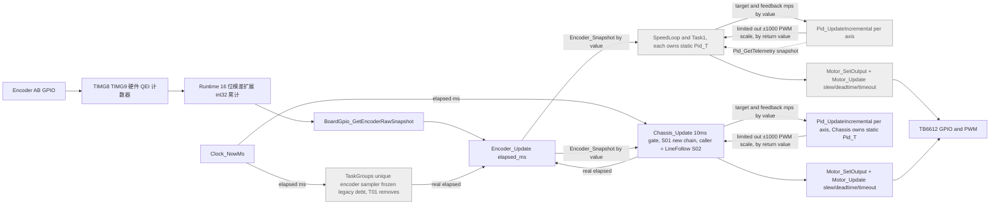
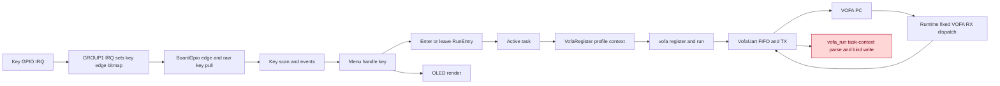
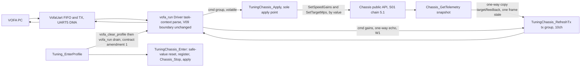
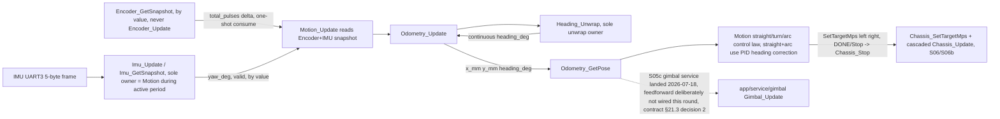

# NUEDC API 平台架构拓扑图（2026_Diansai · MSPM0G3519）

最后复核：2026-07-19（W5：动态调参框架落地——三提交 `18fc9b4`/`bd9a67b`/`1b52184`，契约 `plan_app_first_order.md` §25。新建 Driver `driver/param_store`（片内 flash 参数 blob 存储，公共面 `ParamStore_Read(buf,len)→bool`/`ParamStore_Save(buf,len)→bool`；`param_store.c` 逻辑框定（magic+格式版本+CRC16、擦前写、读回校验，payload 语义不可知，可主机测试）+ `param_store_port.h`（seam，仿 `gray_port.h`）+ `param_store_hw.c`（唯一触 `DL_FlashCTL`，末 1KB 扇区 0x0007FC00）；零上游调用者，仅 `param_tune`）。新建 App Service `app/service/param_tune`（按钮调参持久化编排，公共面 `ParamTune_Init/Get{Kp,Ki,Kd}_milli/Set{Kp,Ki,Kd}_milli/Save`；Model A 无增益副本——get/set 委派 `LineFollow_Get/SetGains`，save 序列化当前增益经 `ParamStore_Save`；int32 milli↔float ×1000 换算唯一所有者）；`line_follow` 加对称 `LineFollow_GetGains`（读自持 outer PID cfg 实值，additive，不新增边）。`app/ui/menu`：`Menu_Param_T` 加可选 `action` 字段（K3 触发即调 action 并停留 `PARAM_LIST`，不进 `EDIT`；`menu.c` 内核零改，派发落在 `menu_param.c` 的 `PARAM_LIST` 分支）。`app_compose.c` 新增平级 `TUNE` 组（`MENU_GROUP_PARAM`）：`s_tune_params[]`（LF Kp/Ki/Kd 三项 get/set→`param_tune` + `SAVE` 动作项 `action=ParamTune_Save`）、`s_groups[]` 由 DEBUG 单组增至 DEBUG+TUNE 两组、`AppCompose_Install` 末调 `ParamTune_Init()`（开机载入持久增益或默认值应用到 `line_follow`）。数据流：按钮→hmi→menu/menu_param→param_tune accessor→`LineFollow_SetGains`（应用）/`ParamTune_Save`→`param_store`→片内 flash；开机 `param_store` 读回→`param_tune`→`line_follow`。风险登记新增 V28（接线注意：未来循迹运行条目若先 `LineFollow_Init` 会归零增益，其 `on_enter` 须在其后重调 `ParamTune_Init` 重推持久增益；`param_store` 扇区未在链接脚本显式 carve，靠镜像 <508KB 才安全，建议级已知风险；`LineFollow_SetGains` 本世界唯一写者=`param_tune`，单一所有者佐证）；V17 补注 param_store 是全新片内 flash Driver，不复活 `driver/eeprom/`。`agent/topology/driver.md` 新增 `ParamStore_API` 类块；`agent/topology/app.md` 新增 `ParamTune_API` 类块 + `ParamStore_API`/`DL_HAL` 驱动侧 stub + 6 条边（`ParamTune→LineFollow`/`ParamTune→ParamStore`/`ParamStore→DL_HAL`/`AppCompose→ParamTune` 实调 + 2 条 opaque fn ptr 边）、`LineFollow_API` 加 `GetGains`、§4 启动图补 `ParamTune_Init` 装配步骤 + TUNE 组两条运行时步骤；§7 新增 App Service Param Tune 行 + Driver Param Store 行）；W4：新增第三个 DEBUG 诊断 App Service——`app/service/gray_check`（12 路灰度数字量遥测，公共面 `GrayCheck_Start/Update/Stop`，下游 `driver/gray`（`Gray_ReadDarkBitmap`）+`driver/uart_vofa`（tx×12 无 cmd），只 `(bitmap>>i)&1` 单向镜像、零反相/去抖/滤波/左右重排，是继 `line_follow.c:183` 之后第二个 `Gray_ReadDarkBitmap` 调用点——gray 是无状态原子读、无累计器，双读点无数据冒险，单活动条目不变量互斥缓解，见 §6 V21 W4 补注）；`app/system/app_compose.c` 的 `s_entries[]` 由 3 条增至 4 条（+GrayTest idx3）、`s_debug_entries[]={0,1,2,3}`；`agent/topology/app.md` 新增 `GrayCheck_API` 类块+2 条出边、§4 启动图补一条运行条目步骤；§6 V21 补 W4 段（四条目互斥、`Gray_ReadDarkBitmap` 第二调用点）；§7 更正既有不一致——Gray Driver 行「零外部调用者」更正为「line_follow（S02 起）+ gray_check（W4 起）两消费者」（与 §5.4 及源码事实一致），新增 App Service Gray Check 行，App Compose 行同步条目数（3→4）；driver.md 无变化（既有 gray/uart_vofa 节点，仅新增上游消费边，落在 app.md）；W3：新增两个 DEBUG 诊断 App Service——`app/service/encoder_test`（编码器脉冲遥测，公共面 `EncoderTest_Start/Update/Stop`，下游 `driver/encoder`+`driver/uart_vofa`，是继 `chassis.c` 之后第二个 `Encoder_Update` 调用点，单活动条目不变量互斥缓解，见 §6 V21 W3 补注）与 `app/service/motor_check`（电机方向自检，公共面 `MotorCheck_Start/Update/Stop`，两轮同向 ±200 前后 2s 循环，下游仅 `driver/motor`，零复做限幅/换向/超时）；`app/system/app_compose.c` 的 `s_entries[]` 由 1 条增至 3 条（+EncoderTest idx1 +MotorDir idx2）、`s_debug_entries[]={0,1,2}`；`app/ui/menu/menu.c` RUN_ACTIVE 显示所有权契约修订（§23.0）——menu 统一画 row0 `RUNNING` 横幅+清 row1..3，取代原「菜单不写显示行、整屏让 on_step」旧约定，当前无条目 opt-in 故无双写；`agent/topology/app.md` 新增 `EncoderTest_API`/`MotorCheck_API` 类块+3 条出边、§4 启动图补两条运行条目步骤；§6 V21 补 W3 段（三条目互斥、Encoder_Update 第二调用点）；§7 新增 App Service Encoder Test/Motor Check 两行，App Compose 行与 Menu（新）行同步条目数/横幅契约；driver.md 无变化（既有 encoder/motor/uart_vofa 节点，仅新增上游消费边，落在 app.md）；S05c：App Service 层新建 `app/service/gimbal`（+私有子模块 `gimbal_stepbus`）云台视觉瞄准服务落地，接完视觉三闭环最后一环——握手→ARMING→AIMING 状态机 + 像素闭环 + 确定性安全停；下游合法依赖 `middleware/vision_aim`（S05b，逐拍透传 `cur_pulse` 不复算几何）、`driver/uart_vision`（S05a，Poll/GetLatestCoord+Seq/SendTopic/GetTopicAck+Seq 六面全消费）、`driver/clock`；`gimbal_stepbus` 服务内私有 Service→Driver 直连步进 TX 派发（脉冲→dir/magnitude 拆分 + `emm42` 组包 + `stepmotor_uart` 发送/RX drain），不复刻冻结的 `stepmotor_bus.c` mgmt 队列；单一所有者：轴累计脉冲位置状态与坐标/握手时效判定唯一在 `gimbal.c`；odometry 前馈本轮**未接线**（契约 §21.3 设计定案 2，仅预留读点）；`agent/topology/app.md` 新增 `Gimbal_API`/`GimbalStepbus_API` 类块 + 6 条出边；索引 §5.2 数据流 `CoordOut -.-> VisionAimMod -.-> FutureGimbal` 虚线占位改为已建成实线链路（`VisionAimMod → GimbalSvc → GimbalStepbusMod → Emm42Gimbal → StepTx`），`GimbalSvc → FutureFeedforward` 保留虚线；§5.6 `Pose -.-> S05` 标签更新为「已落地，前馈未接线」；§6 V07 补充 S05c 替代路径（对 stepmotor_bus 违规群本体保持 open）、V10 标记「S05 云台待补」为完成、V26 落地复核通过、V22 补注前馈未接线；§7 新增 App Service Gimbal 行，Driver Vision Codec 行更新首个真实调用者，Middleware Vision Aim 行更新首个真实调用者；S05b：Middleware 新建 `middleware/vision_aim` 视觉坐标→轴脉冲映射——纯几何映射把视觉像素坐标(float32 x/y)转云台 X/Y 双轴有符号脉冲增量(int32/轴)，公共面 `VisionAim_Init`/`VisionAim_Map`；死区/比例步长/floor-1 最小步/步长限幅/极性 `sign[axis]`/轴程限幅几何唯一所有者，轴累计物理位置状态不归本层（归未来 S05c 逐拍传入 cur_pulse）；仅依赖 C 标准库，零 Driver/App 依赖（接口收 float，不收 `UartVision_Coord_T`）；`agent/topology/app.md` 新增 `VisionAim_API` 类块（零边）；§5.2 `CoordOut -.->|S05b planned, not built| FutureMapping` 槽位改为已建成节点 `VisionAimMod`（下游 S05c 仍 planned）；§6 新增 V26 登记单一所有者声明；§7 新增 Middleware Vision Aim 行；零调用者（S05c 未开工，同 M01/M02/M03 先例）；S05a：Driver 层新建 `driver/uart_vision` 视觉协议编解码——坐落于 `board_uart/vision_uart` 字节层之上（Driver→Driver 同层受控），坐标控制帧 RX `0xAA55`+len+CRC16-MODBUS（float32 原样透传）+ 选题/握手帧双向 `0xFF`+主+子+`0xFE`；`vision_uart` 同步增补 TX 面（`TryWrite/IsTxIdle/ConsumeTxDone`+ISR，镜像 stepmotor_uart）；零调用者，是冻结旧协议 `app/tasks/platform_2d/{vision_bus,vision_coord}.*`（`0x55AA`+和校验+int16，仍是 `task_groups.c:292` 唯一活跃消费者）的替代面 Driver 部分；`agent/topology/driver.md` 新增 `UartVision_API` 类块 + TX 出边；§5.2 新增虚线新链+双 drain 风险说明；V07 补充 S05a 替代路径；§7 新增 Driver Vision Codec 行；S07：App Service 层第七个模块 `route` 分段路线执行服务落地——段表驱动 `FOLLOW_UNTIL`（元素事件，`LineFollow_*`）/`STRAIGHT`/`TURN`/`ARC`（`Motion_*`）四类基元，Route_Update 每拍至多推进一个子服务、进 motion 段前 catch-up 排空 odometry、段间隔拍刹停交接、段级 timeout 兜底；只 include `line_follow.h`/`motion.h`（同层 Service→Service），零 `scheduler.h`/`track_elements.h`/driver/middleware/`chassis.h`；对任何数据变换零复做；`agent/topology/app.md` 新增 `Route_API` 类块 + 两条出边（→LineFollow_API/→Motion_API）；V21 扩条登记 route 不构成第四个 `Chassis_Update` 推进点，V23 扩条登记 route 经 motion 间接排空 IMU 不构成第二个排空点；§7 新增 App Service Route 行；零调用者（T01 未写，同款过渡态）；S06b：App Service `motion` 圆弧原语深化——新增 `Motion_StartArc(radius_mm, arc_deg)`+`MOTION_ARC` 状态+cfg `arc_speed_mps`/`track_width_mm`，双轮速度比前馈+odometry 连续航向误差修正，完成判据用 IMU 航向；`track_width_mm` 是新落定单一所有者但非第二航向权威（§6 V22 补注）；ARC 复用既有第三推进点/IMU 排空独占点/航向保持 PID 实例，不新增任何越层边或所有者（V21/V22/V23 均补注非新增）；§5.6 图与说明段同步、§7 Motion 行同步；S02b：App Service `line_follow` 循迹服务深化，M03 `speed_plan`（基速调制）与 M02 `track_elements`（元素检测）从虚线接线候选转为首个真实调用者——`SpeedPlan_Update` 输出替换原静态 `base_speed_mps` 常量成为 `line_follow_apply` 合成点的 base，`TrackElements_Update` 并列消费同一张深色位图（非二次采样）；新增公共出口 `LineFollow_PollElementEvents()`（元素确认上升沿事件，S07 段切换触发源，零消费者=预期）；§5.4 两段虚线转实线、V24/V25「零调用者」更新为「line_follow 消费」、§7 三行覆盖清单同步；M03：Middleware 新增 `speed_plan`，基速调制器落地，是 `TrackError_FromDarkBitmap` 输出之外的又一个并列消费者、把 `\|error_mm\|` 映射为巡航基速目标+有界斜坡+自持限幅 `[min,straight]`，零调用者，§5.4 补虚线段、V25 新登记；M02：Middleware 新增 `track_elements`，循迹元素几何检测器（断线/横线/左岔/右岔）落地，是 `TrackError_FromDarkBitmap` 之外灰度→循迹链末端第二个并列位图消费者，不采样、bit0_is_left 同源非二次反转，零调用者，§5.4 补虚线段、V24 新登记；S06：App Service 层第六个模块 `motion` 落地，是 M01 里程计的首个真实调用方与 IMU FIFO 排空节奏（`Imu_Update`）的新落定唯一所有者，§5.6 虚线转实线、V21 第三泵、V22 补注、V23 新登记；M01：Middleware 新增 `odometry`（`heading`+`odometry` 两个同层子模块），里程计+航向 unwrap 落地，是 IMU Driver RX 的首个真实消费链，heading_sign/mm_per_pulse 单一所有者落定（V22 新增）；UI01：App UI 层菜单重写 `app/ui/menu`（`menu`+私有子模块 `menu_param`）落地，分问选择+参数表导航面收口 §5.3 补注、V14 提供 UI 侧替代面、V21 登记 UI01 与单活动条目不变量关系；S04：App Service 层第四个模块 `hmi` 落地，人机输入/显示服务收口 §5.3 补注、V14 提供替代路径；S03：App Service 层第三个模块 `tuning`+`tuning_chassis` 落地，VOFA 调参链路收口 §5.5 新增，V19 关闭；S02：`line_follow`+`lost_line` 落地，多环级联接线 `line_follow → chassis`，§5.4 灰度→循迹误差链从 planned 转为已接线首个真实消费者；S01：`chassis` 落地，§15 上层重置裁定解除）  
适用工程：`2026_Diansai`（MSPM0G3519，LQFP-100，SDK 2.11.00.07；由旧工程 `NUEDC`/G3507 移植，见 `agent/MIGRATION_G3507_TO_G3519.md`）  
事实来源：当前工作区 `hc-team/**/*.c`、`hc-team/**/*.h`、仓库根 `board.syscfg`  
状态：当前实现拓扑，不是目标架构示意图  
维护规则：任何代码修改前必须先阅读本文件；修改完成后必须同步更新本文件和末尾日志。

## 1. 阅读规则

- Mermaid **类图**把每个模块的公共 API 打包成一个类；类之间的箭头表示源码依赖、调用或共享状态。
- Mermaid **逻辑图**表示初始化、调度和数据流。实线是当前正常调用，红色节点/连线说明违反根目录 `AGENTS.md` 的存量交叉依赖。
- 本图以当前代码为准。计划中尚未实现的 Board/Clock/UART 拉取接口不得提前画入当前图。
- 私有 `static` 函数不逐项列出，但其所属 `.c` 文件必须由对应模块类覆盖。
- API 新增、删除、改名、移动，模块新增/删除，依赖方向、资源所有权、数据处理位置或单位发生变化时，必须同步修改图。

## 2. Driver API 类图 → `agent/topology/driver.md`

## 3. Middleware 与 App API 类图 → `agent/topology/app.md`

## 4. 当前启动与调度逻辑图 → `agent/topology/app.md`

> 2026-07-17 起拓扑按层分文件存放：§2 在 `topology/driver.md`，§3/§4 在 `topology/app.md`；
> 本文件保留 §1、§5–§10，仍是唯一入口、风险登记与更新日志所在。章节编号不重排。
> 同步义务对三个文件一体生效：类图改动落在分层文件，日志/风险登记/覆盖清单落在本文件（AGENTS.md §14）。

## 5. 关键数据流逻辑图

### 5.1 编码器、PID 与直流电机



必须检查的数据处理：QEI 硬件判向（G3519 起编码器不再产生 GPIO 中断，GROUP1 仅服务按键）、`Mspm0Runtime_GetEncoderCounts()` 的 16→32 位模差扩展（前提：两次读数间位移 < 32767 计数）、Encoder `s_direction_sign` 全链路唯一方向修正点、速度 `m/s`、PID 输出限幅和 Motor 硬件限幅。任何修改都要证明没有重复反向、滤波、缩放或限幅。QEI 方向约定与旧版软件判向可能镜像，上板方向/PPR 校准由用户自理（`agent/MIGRATION_G3507_TO_G3519.md` §4.3）。**限幅唯一所有者是 `Pid_T.cfg.out_limit`**（M01 后 Middleware 内收敛，2026-07-17）；`Motor_SetOutput` 对入参做拒收校验而非二次钳位（不构成重复限幅）。

**过渡态双采样所有者（2026-07-17 S01 起）**：图中灰色节点是旧链（`TaskGroups`/`SpeedLoop`/`Task1`），冻结存量债，随上层重置 T01 整体删除；彩色节点是新链（`app/service/chassis`），是新架构下编码器采样节奏的唯一所有者，`Chassis_Init`/`Chassis_Update` 各自持有 `static Pid_T[CHASSIS_SIDE_COUNT]`，与旧链的 `static Pid_T` 互不共享实例。**两链当前不同时运行。2026-07-19 W2 起运行时角色已互换**：旧链所依附的 `main.c` 不再调用 `SysRun`，`TaskGroups`/`SpeedLoop`/`Task1` 整条旧驱动路径运行时不可达（源码未删，仍冻结）；新链经 `app/system/app_compose.c` 的 `SpeedTune` 条目（`Tuning_EnterProfile→Tuning_Update→TuningChassis_PumpInner→Chassis_Update`）已是**唯一真实驱动电机的路径**，但仅在该条目被 `Menu` 选中激活期间推进（S02 `line_follow → Chassis` 一支仍是同层 Service 合法调用边，`LineFollow_Update` 本身仍零调用者，未接入条目表，等 T01 接线）。采样所有权移交的完成判据不变——T01 整体删除旧链源码时正式关闭本条过渡态记录；移交前不构成「同一数据变换多个所有者」违规（同 M02 的 V03-DUP 处置先例）。**W3 补注（2026-07-19）**：新增 DEBUG 条目 `EncoderTest`（`app/service/encoder_test`）在其激活期内也调 `Encoder_Update(elapsed)`+`Encoder_GetSnapshot()`，是继 `chassis.c` 之后**第二个** `Encoder_Update` 调用点——单活动条目不变量（`app_compose.c` `s_entries[]` 现有 3 条，任意时刻至多一条被 `Scheduler_Run` 推进）结构性保证两者永不同拍，属互斥缓解而非运行期双采样，不构成新的「同一数据变换多所有者」违规（详见 §6 V21 W3 补注）；方向修正仍唯一在 `encoder.c` `s_direction_sign`，`EncoderTest_Update` 只读已修正快照做 tx 镜像，不加第二次方向修正/单位换算。

### 5.2 视觉与步进电机

```mermaid
flowchart LR
  VisionUART[Vision UART IRQ DMA] --> RuntimeVision[Runtime fixed RX dispatch, VISION_TX DMA IRQ clear]
  RuntimeVision --> VisionFifo[VisionUart private RX FIFO + TX buffer]
  VisionFifo --> VisionBus[VisionBus task-context parser 0x55AA plus checksum int16, frozen legacy, T01 removes]
  VisionBus --> VisionCoord[VisionCoord frame and state, frozen legacy]
  VisionCoord --> Platform2D[VisionHdl control, frozen legacy]
  Platform2D --> PIDAxis[PID axis output]
  PIDAxis --> Emm42[Emm42 command packing]
  Emm42 --> StepBus[StepMotorBus queue]
  StepBus --> StepTx[StepmotorUart private TX]
  StepTx --> RuntimeStep[Runtime fixed RX TX DMA dispatch]
  RuntimeStep --> Stepper[EMM42 hardware]
  Stepper --> RuntimeStep
  RuntimeStep --> StepRx[StepmotorUart private FIFO]
  StepRx --> StepBus

  VisionFifo -.->|S05a replacement face, 2026-07-18, zero callers| UartVisionCodec[UartVision_Poll self-sync framing, 0xAA55+len+CRC16-MODBUS coord frame float32, 0xFF+main+sub+0xFE topic frame]
  UartVisionCodec --> CoordOut[UartVision_GetLatestCoord + GetCoordSeq]
  UartVisionCodec --> AckOut[UartVision_GetTopicAck + GetTopicAckSeq]
  UartVisionCodec -.->|UartVision_SendTopic via TryWrite| VisionFifo
  CoordOut --> VisionAimMod[VisionAim_Map positional PD: deadband+kp*error+kd*de+step-clamp+polarity+travel-limit, no D filter, no I]
  VisionAimMod --> GimbalSvc[Gimbal_Update S05c: coord-staleness judgement + cur_pulse accumulation + prev_error_px state + dispatch orchestration]
  AckOut --> GimbalSvc
  GimbalSvc --> GimbalStepbusMod[GimbalStepbus_TrySend*: pulse to dir/magnitude split]
  GimbalStepbusMod --> Emm42Gimbal[Emm42_Build*Frame RPM clamp sole owner]
  Emm42Gimbal --> StepTx
  GimbalSvc -.->|S05c not wired this round, contract §21.3 design decision 2| FutureFeedforward[future Odometry_GetPose feedforward read point]

  classDef violation fill:#ffd6d6,stroke:#b00020,color:#700018
  class StepBus violation
  classDef frozen fill:#eeeeee,stroke:#888888,color:#555555
  class VisionBus,VisionCoord,Platform2D frozen
```



必须检查的数据处理：`VisionUart` 私有 RX FIFO 当前仅有一个活跃消费者——`VisionBus_Service5ms()`（`task_groups.c:292` 调用，冻结存量债，`0x55AA`+和校验+`int16` 协议，T01 删除）；**S05a 新建的 `UartVision_Poll()` 尚零调用者（预期状态，同 §15.1）**，未接入任何调度点，故当前不构成对同一 `VisionUart_Read()` FIFO 的双重 drain——一旦 T01/未来 Service 把 `UartVision_Poll()` 接入调度，必须同时移除 `VisionBus_Service5ms()` 的调用点，否则两者会竞争同一条销毁式 FIFO（读出即出队），造成两套协议交替吃字节、双方都拿不到完整帧。坐标 float32 原样透传、不做单位/极性变换。**S05b 补充（2026-07-18）**：`middleware/vision_aim`（`VisionAim_Init`/`VisionAim_Map`）已落地，承接坐标→轴脉冲映射——死区/比例步长/floor-1 最小步/步长限幅/极性 `sign[axis]`/轴程限幅几何唯一所有者。**S05c 补充（2026-07-18，已接线）**：`app/service/gimbal`（`gimbal.c`+私有子模块 `gimbal_stepbus.c`）落地并接入 `UartVision_GetLatestCoord()`/`VisionAim_Map` —— 此前 `CoordOut → VisionAimMod → FutureGimbal` 的虚线占位链现为实线已建成节点。单一所有者收口：轴累计物理位置状态唯一在 `gimbal.c`（`Gimbal_Telemetry_T.cur_pulse`，仅成功下发一帧后累加一次，`vision_aim` 本身不持位置）；坐标 seq 停顿时效判定唯一在 `gimbal.c`（`coord_timeout_ms` → `STOPPED`）；`vision_aim` 的死区/比例/步长/极性/轴程几何 `gimbal.c` 逐拍透传 `cur_pulse` 消费、绝不复算（V26 复核通过）；脉冲→dir/magnitude 拆分唯一在 `gimbal_stepbus.c`；RPM 限幅 ≤100+×10 仍唯一在 `emm42.c`；字节/DMA 搬运仍唯一在 `stepmotor_uart`。步进总线走 Service→Driver 直连（`gimbal_stepbus.c` 直调 `emm42.h`+`stepmotor_uart.h`），**不复用**冻结的 `stepmotor_bus.c` mgmt 队列/RR 仲裁/0x35 读速度应答——图中原 `StepBus`（`StepMotorBus_API`，V07 违规节点）与本条新链是并行两套通路，互不共享状态，新链未消除该违规（旧 Task 仍在，见 §6 V07）。**odometry 前馈本轮未接线**（契约 §21.3 设计定案 2）：`GimbalSvc → FutureFeedforward` 保持虚线占位，勿改为实线，待几何有目标世界模型时以契约修订补入。选题确认时效判定（HANDSHAKING 期 `ack_timeout_ms`）与坐标时效判定（AIMING 期 `coord_timeout_ms`）均归 `gimbal.c`；`UartVision` 本层只给单调 `seq`、不持墙钟。

### 5.3 按键、菜单、OLED 与 VOFA



**替代面已建成（2026-07-17 S04）**：`app/service/hmi`（`Hmi_Init/Update/PollInput/IsDisplayReady/PrintLine/ClearDisplay`）是本图 `KeyDriver`→`Menu`→`OLED` 三段的合法 Service 替代——`Hmi_Update` 自门控 5ms 顶替 `Task→...` 泵送节奏（旧 `task_groups.c` 的 `Task_UiService5ms` 同款过渡态职责已有新所有者），`Hmi_PollInput` 内 K1→UP/K2→DOWN/K3→ENTER/K4→BACK 唯一映射点下沉自旧 `menu_core.c` 的按键→语义映射（旧实现冻结债，过渡期双实现，语义等价），`Hmi_PrintLine`/`Hmi_ClearDisplay` 收口行式显示语义（整行覆写防残影，未就绪/越界/NULL 零绘制拒收）。本图 `Menu`/`KeyDriver`/`OLED` 三节点与两条红色 VIOLATION 边保持不变（旧链未删），`hmi` 是 V14 的关闭基础。**2026-07-19 W2 起有真实调用者**：`sys_init.c` 调 `Hmi_Init()`，`app/ui/menu/menu.c`（经 scheduler 背景钩子 `Menu_Tick` 每拍驱动）消费 `Hmi_Update`/`Hmi_PollInput`/`Hmi_IsDisplayReady`/`Hmi_PrintLine`。

**UI 侧替代面已建成（2026-07-18 UI01）**：新 `app/ui/menu`（`Menu_Setup/Menu_Tick/Menu_GetScreen` + 私有子模块 `menu_param`）是本图 `Menu` 节点本身的合法替代——不再经 `KeyDriver` 读键、不再经 `OLED` 直绘，改为 `Menu_Tick` 依次调 `Hmi_Update`（面板泵送）→`Hmi_PollInput`（取语义事件）→按当前界面驱动 `Scheduler_EnterEntry`/`Scheduler_LeaveEntry`（新 `SchedulerEntry_API`，取代本图 `Scheduler --> Task` 一段的旧 `Sys_EnterRunEntry`/`Sys_LeaveRunEntry`）→经 `Hmi_PrintLine` 渲染。旧 `Menu`/`KeyDriver`/`OLED` 三节点与两条红色 VIOLATION 边继续保持不变（旧 `menu_core.*`/`menu_pages.c` 未删，仍被 `task_groups.c`/`sys_init.c` 调用，过渡期双实现共链）；`app/ui/menu` 是 V14 的 UI 侧关闭基础。**2026-07-19 W2 起有真实调用者**：`app/system/app_compose.c`（装配层）已把 `Menu_Tick` 注册为 `Scheduler_Init` 的 `background_step`、把 `Menu_Setup(s_groups)` 注册进 scheduler+menu，`Menu_Tick` 由 `main.c` 现役主循环 `Scheduler_Run` 每个空转拍调用。

**修订 2 补注（2026-07-18）**：`Menu_Setup` 升级为两级分类外壳——`GROUP_LIST`（L1，一级分类：RUN 组/PARAM 组）→`RUN_LIST`/`PARAM_LIST`（L2，某分类的子列表）→`RUN_ACTIVE`/`PARAM_EDIT`；RUN 组 `entries[]` 是 scheduler 全局条目索引的视图，选中子列表位 j 时映射为 `Scheduler_EnterEntry(g->entries[j])`，映射点未变仍在 `menu.c` 单点。`MenuParam_Init` 已并入 `MenuParam_Enter`（进 PARAM 组一步绑表+复位）。

### 5.4 灰度与循迹误差（2026-07-17 S02 起已接线，多环级联）

```mermaid
flowchart LR
  GrayPins[GRAY 12 channel GPIO] --> GrayHw[gray_hw one DL_GPIO_readPins]
  GrayHw --> GrayPort[GrayPort_API]
  GrayPort --> Gray[Gray_ReadDarkBitmap]
  Gray -->|by value, 10ms gate trigger, sole owner LineFollow_Update| LineFollow[app/service/line_follow]
  Gray -.->|W4: second read point, atomic no-accumulator read, mutex-mitigated by single-active-entry invariant| GrayCheckMod[app/service/gray_check, tx-only VOFA mirror]
  LineFollow -->|pitch_mm and bit0_is_left config passthrough| TrackError[TrackError_FromDarkBitmap]
  TrackError -->|error_mm, plus = line right of center, by value| LineFollow
  LineFollow -.->|dark_bitmap = 0, lost this tick| LostLine[LostLine_Tick fallback error]
  LostLine -.->|recovery error_mm or give up at timeout| LineFollow
  LineFollow -->|error_mm| OuterPID[Pid_UpdatePositional outer loop, out_limit = diff_limit_mps]
  OuterPID -->|diff c mps, bounded plus-minus diff_limit| LineFollow
  LineFollow -->|SetTargetMps base+c and base-c, TRACKING/RECOVERING only| Chassis[Chassis_SetTargetMps + cascaded Chassis_Update]
  Chassis --> InnerPID[Pid_UpdateIncremental per side, see 5.1]

  LineFollow -->|same dark_bitmap value, by value, no second sample point, wired S02b 2026-07-18| TrackElementsMod[TrackElements_Update, parallel bitmap consumer, M02 landed 2026-07-18]
  TrackElementsMod -->|GetConfirmed level bitmask, telemetry confirmed_elements| LineFollow
  LineFollow -.->|PollElementEvents rising-edge mask, new public exit, zero consumers| S07[S07 future segment-switch consumer, not yet built]

  LineFollow -->|fabsf(error_mm) and elapsed_ms, no second quantization, wired S02b 2026-07-18| SpeedPlanMod[SpeedPlan_Update, base speed modulator, M03 landed 2026-07-18]
  SpeedPlanMod -->|current_mps bounded to min,straight, becomes base in base+c and base-c| LineFollow
```

S02（`app/service/line_follow`）是灰度→循迹误差链的**第一个真实消费者**：§5.4 的 planned 虚线已转实线。`Gray_ReadDarkBitmap` 的 10ms 门控采样触发唯一所有者是 `LineFollow_Update`；`pitch_mm`/`bit0_is_left` 由 `LineFollow_Config_T` 配置透传给 `TrackError_FromDarkBitmap`，位序左右唯一修正点（`driver/gray/gray.h` 位序警告的落点）仍落在这一处，未被复算。丢线（位图低 12 位全 0）由 `lost_line` 子模块（服务内私有，调用者持有 `LostLine_T` 上下文）给出方向记忆回退误差，有界超时后转 `LOST` 并调 `Chassis_Stop()`。外环 `Pid_UpdatePositional` 的 `out_limit=diff_limit_mps` 是差速修正限幅的唯一所有者；积分限幅按误差口径显式给出（满偏误差×100 拍），不依赖内环的 `out_limit×3.5` 推导（量纲不同，见 M01 处置先例）。`LineFollow_Update` 在 `TRACKING`/`RECOVERING` 期间于末尾级联推进 `Chassis_Update()`（内环自带门控），`IDLE`/`LOST` 完全静默（不采样、不发目标、不推进内环），使 `Chassis_Stop` 的刹车真值表保持到下一次 `Start`（方案 b，契约修订 1，`53e9967`）。

**M02（`middleware/track_elements`，2026-07-18 已落地，2026-07-18 S02b 起已接线）是 `TrackError_FromDarkBitmap` 之外的第二个并列位图消费者**：`Gray`→`LineFollow`→`TrackElementsMod` 段已由虚线转实线——`LineFollow_Update` 把同一拍已采的 `dark_bitmap` 按值并列喂给 `TrackElements_Update`，**不构成新的采样点**（`Gray_ReadDarkBitmap()` 的唯一触发所有者仍是 `LineFollow_Update`）。`TrackElementsMod` 与 `TrackError` 是并列消费者、各对**原始通道序位图**独立应用一次同一个 `bit0_is_left` 公式求 car-left→car-right 坐标——**非串联二次反转**（不新增第二个反转开关，同 encoder `s_direction_sign` 教训）；`TrackError` 唯一负责误差 mm 量化，`TrackElementsMod` 唯一负责几何特征提取（count/span/touch_left/touch_right）+ 逐检测器连续置信去毛刺 + 元素确认上升沿事件，两者互不复算对方产出。`LineFollow` 新增公共出口 `LineFollow_PollElementEvents()`（透传 `TrackElements_PollEvents`，元素确认上升沿事件掩码，S07 段切换触发源）——该出口本身**当前零消费者**（S07 未开工，同 §15.1 预期状态），图中改画 `LineFollow -.-> S07` 虚线记「模块已建、接线未建」的下一段。

**W4（`app/service/gray_check`，2026-07-19 已落地）是 `Gray_ReadDarkBitmap()` 的第二个调用点**：诊断专用，只读 12 路数字量并单向镜像到 VOFA tx，零反相/去抖/滤波/左右重排，不喂 `TrackError`/`TrackElementsMod`，与循迹链无数据交互。gray 是无状态原子读、无累计器，两读点即便同拍也无数据冒险（不同于 encoder 累计的 double-count 风险）；scheduler 单活动条目不变量结构性保证 `gray_check` 所在的 `GrayTest` 条目与 `line_follow` 所在条目永不同拍，详见 §6 V21 W4 补注。

存量债 `app/tasks/track_follow/Calculate_Track_Error`（V03）与本模块语义仍不等价（int16 ±55 + 丢线记忆回退 ±27 vs. float mm + 丢线策略独立子模块），本轮零改动旧实现；新所有者 `line_follow`/`lost_line` 已落地、语义重建完成（`lost_line.c` 是旧 ±27 记忆回退的显式重建版），旧实现仍是冻结债，随上层重置删除 `track_follow.c` 时一并消除（详见 V03-DUP）。

**M03（`middleware/speed_plan`，2026-07-18 已落地，2026-07-18 S02b 起已接线）是 `TrackError_FromDarkBitmap` 输出（`error_mm`）之外的又一个并列位图下游消费者**：`SpeedPlan_Update` 把调用者按值传入的 `|error_mm|`（曲率代理，由调用者 `fabsf` 取幅值，非本模块二次量化）映射为巡航基速目标并做有状态有界斜坡，输出建议基速 m/s，**自持限幅 [min_speed,straight_speed]**——成为「基速调制」这一数据变换的唯一所有者（同 §5.4 差速限幅唯一所有者 `Pid_UpdatePositional.out_limit` 的既定分工模式：差速修正归外环 PID，基速调制归 `speed_plan`，互不重叠）。`Gray`→`LineFollow`→`SpeedPlanMod`→`LineFollow` 段已由虚线转实线：`LineFollow_Update` 每拍以 `fabsf(error_mm)`/`elapsed_ms` 调 `SpeedPlan_Update`，其返回值成为 `line_follow_apply()` 内 `base+c`/`base-c` 合成点（`line_follow.c:99-109`）的 base——原 `LineFollow_Config_T.base_speed_mps` 静态常量字段已随本轮改动删除，换成 `straight_speed_mps`/`min_speed_mps`/`curve_error_mm`/`accel_mps_per_s`/`decel_mps_per_s` 五项透传给 `SpeedPlan_Config_T`（`build_speed_cfg()`，映射不复算）。`speed_plan` 本身仍不含 `driver/gray`/`app/service/*` 依赖，不新增第二个 `Gray_ReadDarkBitmap()` 采样点，也不复算 `TrackError` 已产出的 `error_mm`（并列消费，非串联二次处理，见 §6 V25）。

### 5.5 调参链路（VOFA，2026-07-17 S03 起，与 §5.3 旧链并存）



调参链是 `driver/uart_vofa` 分发/应用职责的第二个真实收口——字节流解析仍唯一归 `vofa_run()`（Driver 任务上下文，V09 边界不变），但 `cmd`→应用与遥测快照→`tx` 的单向搬运改由 `app/service/tuning`（`tuning.c` 编排 + `tuning_chassis.c` 私有子模块）收口，不再靠 §5.3 旧链的 `VofaRegister`/Task 直连。`Tuning_EnterProfile` 在注册变量组前先 `vofa_clear_profile()` 再空跑一次 `vofa_run()`，把 NONE 期间积压的 RX 字节排空，避免旧会话命令在重进后首拍生效（契约修订 1，审计 F1 处置）。增益/目标写入只经 `Chassis_SetSpeedGains`/`Chassis_SetTargetMps`（唯一应用点，零复做限幅/换向/超时，见 CLAUDE.md 第 6 条）；`tx` 组（W1 起 10 通道：增益 kp/ki/kd 左右各 3 回显 + 目标左右 + 反馈左右，`pid_out` 已移除外显）在 `TuningChassis_RefreshTx` 里分两路单向覆盖——增益三项是本拍 `cmd` 的直接复制（因 `Apply` 每拍无条件写，回显值恒等应用值）、目标/反馈是 `Chassis_GetTelemetry` 快照复制（晚一帧）；两路都只写 tx，无反向路径。§5.3 旧链（`VofaRegister`→`vofa_register.c`）与本链源码层面同时存在但不同时被调。**2026-07-19 W2 起本链已是唯一真实运行路径**：`app/system/app_compose.c` 的 `SpeedTune` 条目三钩子直接派发 `Tuning_EnterProfile(CHASSIS_SPEED)`/`Tuning_Update`/`Tuning_ExitProfile`，经 `main.c` 现役主循环 `Scheduler_Run` 在该条目被 `Menu` 选中激活期间每拍驱动；旧链所依附的 `task_groups.c`/`SysRun` 已不被 `main` 调用，运行时不可达（源码仍在，未删，移交在 T01 完成，同 V15 处置）。

### 5.6 里程计（IMU 首消费链，2026-07-18 M01 起）



`Imu_GetSnapshot()` 自 P8 重写并接线以来一直零外部消费者；M01（`middleware/odometry`）是首个真实消费链的算法落点，**S06（`app/service/motion`，2026-07-18）是这条链的首个真实调用者**——`Motion_Update()` 每拍先 `Imu_Update()`（本服务在激活期独占排空 IMU FIFO）再 `Imu_GetSnapshot()`，以 `Encoder_GetSnapshot().total_pulses` 差值一次性消费（只读快照，**从不调 `Encoder_Update()`**，采样节奏所有者仍是 `chassis.c`）喂给 `Odometry_Update()`，取 `Odometry_GetPose()` 驱动直行/定角转控制律，落到 `Chassis_SetTargetMps` + 级联 `Chassis_Update`（到位/Stop 走 `Chassis_Stop`）。`Odometry_Update()` 本身不 include `encoder.h`/`imu.h`，不自行采样，不推进 Encoder/IMU 状态；yaw 去卷唯一落在 `heading.c`，脉冲→距离换算唯一落在 `Odometry_Config_T.mm_per_pulse`，IMU yaw 符号修正唯一落在 `Odometry_Config_T.heading_sign`（两者由 `Motion_Config_T` 透传，motion 不是新所有者，见 §6 V22）。**S05c（`app/service/gimbal`）已于 2026-07-18 落地**，但云台前馈本轮未接线（契约 §21.3 设计定案 2，见 §6 V22 补注），图中 `Pose` 到 `S05` 保持虚线、未来接线形态。航向权威裁定：用 IMU 去卷航向而非轮差分航向（用户 2026-07-18 确认）——**S06b（2026-07-18）补充**：圆弧原语 `Motion_StartArc` 落地后引入 `Motion_Config_T.track_width_mm`（轮距），但其唯一用途是双轮速度比前馈几何换算，圆弧行进中的误差修正与完成判据仍读 `Odometry_GetPose()` 连续航向，`track_width_mm` **不构成第二个航向权威**，裁定结论不变（见 §6 V22 补注）。

必须检查的数据处理：编码器方向反转仍归 `encoder.c` `s_direction_sign`（V06 既定，M01/S06/S06b 均不复反转，只消费已修正 delta）；`Gray`/`Chassis` 采样节奏与 elapsed 门控仍归 `chassis.c`（motion 不采样、只读快照+按值消费）；IMU yaw unwrap 与符号修正仍是 M01 落定的两个唯一所有者点（见 §6 V22）；IMU FIFO 排空节奏（`Imu_Update()`）在 motion 激活期内新落定为 motion 独占（见 §6 新增登记）；**S06b 新增**：圆弧弧长累计 `s_arc_len_mm` 消费 `Odometry_GetPose()` 相邻拍位姿的弦长增量，是里程计毫米位姿的又一并列消费者，**非第二次脉冲→距离换算**（脉冲→距离仍独属 `Odometry_Config_T.mm_per_pulse`）；`track_width_mm` 是本轮新落定的单一所有者字段（仅圆弧前馈内外轮速比用），归 `Motion_Config_T`，非 `Odometry_Config_T` 的第三个标定量。


| ID | 当前交叉/风险 | 证据位置 | 违反规则 | 计划归属 |
|---|---|---|---|---|
| V01 | ~~Runtime SysTick 调用 App Scheduler~~ **closed 2026-07-13** | `driver/clock/clock.c` 拥有 SysTick；`task_scheduler.c` 主循环按 elapsed 推进 | Driver 不得反向调用 App | Phase 2 P1 |
| V02 | **closed 2026-07-16（P5 R02/R06）**：Runtime UART callback 表与 `Set*Callback`/`Send*`/`Busy` 接口已删除，IRQ/DMA 改为固定分发到 `board_uart` 角色 Driver | `mspm0_runtime.h/.c`、`sys_init.c`、`driver/board_uart/*`；R02 零命中，R06 clean 构建与 map 复核 | Driver 不得调用上层注册回调 | Phase 2 P5 |
| V03 | App 直接调用 SysConfig、NVIC、DL HAL **partially closed 2026-07-16（P5 R03）** | `sys_init.c` 已改为调用 `Board_Init()`/`Board_EnableInterrupts()`；`tasks/platform_2d/vision_bus.c`、`tasks/platform_2d/stepmotor_bus.c`、`tasks/uart_stress/uart_stress.c` 已清零；`tasks/track_follow/track_follow.c` 仍直接调用 `__enable_irq` 或包含 `ti/driverlib` | App 不得包含 DL HAL | Phase 2 P1 及后续模块 |
| V03-DUP | **登记 2026-07-17（M02）**：`track_follow.c` 内 `Calculate_Track_Error`（V03 存量债）与新 Middleware `TrackError_FromDarkBitmap`（`middleware/track_error/`）语义不等价的过渡态双实现——旧版 int16 ±55 + 丢线记忆回退 ±27，新版 float mm + 丢线返回 false。本轮零改动旧实现，所有权在上层重置删除 `track_follow.c` 时移交新模块（同 D12 先例）。**补注 2026-07-17（S02）**：新所有者 `app/service/line_follow`/`lost_line` 已落地，语义重建完成（`lost_line.c` 是旧 ±27 记忆回退的显式重建版，单位改 mm、新增超时上限），旧 `Calculate_Track_Error` 仍冻结债，待 T01 删除 `track_follow.c` 时消除 | `hc-team/app/tasks/track_follow/track_follow.c`（旧）、`hc-team/middleware/track_error/track_error.c`+`hc-team/app/service/line_follow/*`（新） | 同一数据变换只允许一个所有者（过渡期内并存，非新增违规，随 V03 关闭时刻一并消除） | 上层重置删除 `track_follow.c` 时消除 |
| V04 | **closed 2026-07-16（P3.T2 E04/E05）**：Motor 头不再包含 pid.h，`Motor_T`/`p_pid`/`g_tMotors` 已删除 | 依赖扫描零命中；`motor.h` 仅标准类型与自有枚举 | Driver 不应暴露 Middleware 内部对象 | Phase 2 P3 |
| V05 | **closed 2026-07-16（P2F E04/E05）**：Encoder 不再写 `g_tMotors`，deprecated API 与公开参数表已删除 | `Encoder_Update()`/`Encoder_GetSnapshot()`；依赖扫描零命中 | 模块不得修改其他模块全局 | Phase 2 P2-FIX |
| V06 | **closed 2026-07-16（P3.T2 E04）**：`encoder_sign` 随 `Motor_T` 删除；Runtime 正交判向 + Encoder `s_direction_sign` 单点修正 | 依赖扫描零命中 | 同一数据处理必须只有一个所有者 | Phase 2 P2-FIX/P3 |
| V07 | TaskGroups/SpeedLoop/Task1 直接编排 Driver 与 PID —— **S01 已提供替代路径**（2026-07-17）：新 `app/service/chassis` 以合法 Service→Driver/Middleware 依赖复刻同一能力。**S02 补充替代路径**（2026-07-17）：新 `app/service/line_follow` 以合法 Service→Driver/Middleware/同层 Service 依赖复刻 `track_follow.c` 的循迹能力（含丢线恢复）。**S06 补充替代路径**（2026-07-18）：新 `app/service/motion` 以合法 Service→Driver（只读快照 + IMU 排空）/Middleware（odometry/pid）/同层 Service（chassis）依赖复刻 `task1.c`/`speed_loop.c` 一类直行/转弯编排能力（未迁移，重建）。**S07 补充替代路径**（2026-07-18）：新 `app/service/route` 以合法 Service→同层 Service（line_follow/motion）依赖复刻 `task1.c` 分段状态机编排能力（段表驱动，新题=换段表）。**S05a 补充替代路径（Driver 层，2026-07-18）**：新 `hc-team/driver/uart_vision`（`UartVision_Init/Poll/GetLatestCoord/GetCoordSeq/SendTopic/GetTopicAck/GetTopicAckSeq`）以合法 Driver→Driver 同层受控依赖（坐落于 `board_uart/vision_uart` 字节层之上）重建视觉协议编解码能力，是 `app/tasks/platform_2d/{vision_bus,vision_coord}.*`（旧协议 `0x55AA`+和校验+`int16`，仍冻结、仍是 `task_groups.c:292` 唯一活跃消费者）的替代面 Driver 部分——新协议为 `0xAA55`+len+CRC16-MODBUS 坐标帧（float32）+ `0xFF` 选题握手帧，两套协议语义不等价（同 V03-DUP 处置模式）；`UartVision_Poll()` 当前零调用者（预期状态），**尚未接入调度，与旧 `VisionBus_Service5ms()` 不构成同一 FIFO 双重 drain**（见 §5.2 说明）——S05b（Middleware 坐标映射）/S05c（Service 选题编排）落地并接线时才会真正替换旧链，届时须同步移除旧 `VisionBus_Service5ms()` 调用点以消除双消费者风险。旧 Task 冻结存量债待 T01 整体删除时一并消除，本条本身保持 open（旧代码未删，违规仍在）。**S05c 补充替代路径（2026-07-18，视觉侧替代链最后一块）**：新 `app/service/gimbal`（+私有子模块 `gimbal_stepbus`）以合法 Service→Driver（`uart_vision`/`clock`）+ Service→Middleware（`vision_aim`）+ 同服务子模块（`gimbal_stepbus` 直连 `emm42`/`stepmotor_uart`）依赖复刻 `2DPlatform_LaserStrike.c`/`stepmotor_bus.c` 一类云台视觉瞄准+步进下发编排能力；**注意本条对 `stepmotor_bus` 违规群本体不构成关闭**——`app/tasks/platform_2d/stepmotor_bus.c` 自身（`StepMotorBus_API` mgmt 队列/RR 仲裁/0x35 读速度应答，arch-baseline 冻结行）仍在链、仍被 `task_groups.c`/`Platform2D_API` 调用，`gimbal_stepbus` 是并行新路径而非对旧文件的删除或改写，旧代码待 T01 删文件时才真正关闭；本条针对 stepmotor_bus 部分保持 open，并注明「gimbal 已给合法直连替代路径」 | 对应 App task 文件；替代路径 `hc-team/app/service/chassis/chassis.c/.h`、`hc-team/app/service/line_follow/*`、`hc-team/app/service/motion/motion.c/.h`、`hc-team/app/service/route/route.c/.h`；S05a 替代路径 `hc-team/driver/uart_vision/uart_vision.c/.h`；S05c 替代路径 `hc-team/app/service/gimbal/gimbal.c/.h`+`gimbal_stepbus.c/.h`；旧协议冻结证据 `hc-team/app/tasks/platform_2d/vision_bus.c:160-176`（`VisionBus_Service5ms`）+ `hc-team/app/tasks/task_groups.c:292`（唯一调用点）+ `hc-team/app/tasks/platform_2d/stepmotor_bus.c`（mgmt 队列本体，仍在链） | Task 应只调 Service | Driver 完成后迁入 Service；T01 删除旧 Task 时关闭 |
| V08 | **closed 2026-07-16（P5 R04）**：Emm42 Driver 改为纯协议组包，`extern` App transport 已删除 | `emm42.c`、`stepmotor_bus.c`；R04 零命中 | Driver 不得依赖 App 符号 | Phase 2 P5 |
| V09 | **closed 2026-07-16（P5 R02）**：VOFA RX 仅在 `vofa_run()` 任务上下文解析，ISR 链只搬运到 `VofaUart` FIFO | `uart_vofa.c`、`driver/board_uart/vofa_uart.c`；R02 零命中且 `vofa_rx_isr` 删除 | ISR 只允许最小搬运/置位 | Phase 2 P5 |
| V10 | Service 目录当前没有有效源 API **partially closed 2026-07-17→18（S01→S05c）**：`app/service/chassis`（S01）、`app/service/line_follow`+`lost_line`（S02，S02b 深化）、`app/service/tuning`+`tuning_chassis`（S03）、`app/service/hmi`（S04）、`app/service/motion`（S06 落地 + S06b 圆弧原语深化）、`app/service/route`（S07 落地）、`app/service/gimbal`+`gimbal_stepbus`（S05c 落地，2026-07-18）落地，Service→Driver/Middleware/同层 Service 合法业务桥七例；「S05 云台待补」条目可标记完成——本条继续 open 仅因「Service→Driver/Middleware 业务桥」这一登记主题理论上永远可能有新 Service 加入，不再因云台缺口而 open | `hc-team/app/service/chassis/chassis.c/.h`、`hc-team/app/service/line_follow/line_follow.c/.h`+`lost_line.c/.h`、`hc-team/app/service/tuning/tuning.c/.h`+`tuning_chassis.c/.h`、`hc-team/app/service/hmi/hmi.c/.h`、`hc-team/app/service/motion/motion.c/.h`、`hc-team/app/service/route/route.c/.h`、`hc-team/app/service/gimbal/gimbal.c/.h`+`gimbal_stepbus.c/.h` | 缺少 Driver 与 Middleware 的业务桥 | Phase4 S05 已补齐；后续新 Service 落地时逐项追加 |
| V11 | **closed 2026-07-16（P3.T3 E09）**：左右 PWM 统一为 80 MHz/period 7999（10 kHz），compare 按同一 period 换算，比例一致 | `board.syscfg` 单源 + 生成配置 `CLK_FREQ=80000000`/`period=7999` ×2 + `motor_hw.c` 单一常量 | 电机硬件安全与单位口径不一致 | Phase 2 P3.T3 |
| V12 | **closed 2026-07-16（P3.T1/T2 E01）**：`Motor_Update` 状态机实现 slew 限速、换向过零+5ms 死区、100ms 命令超时归零，主机 7 项测试覆盖 | `motor.c` 状态机 + `tests/host/test_motor.c` | 电机保护缺失 | Phase 2 P3 |
| V13 | **partially closed 2026-07-17（M01/`3ab13fe`）**：PID 部分已关闭——`pid.c` 重写为调用者持有上下文的纯算法模块，5 个 `g_t*PID` 全局（`g_tAnglePID`/`g_tLeftMotorPID`/`g_tRightMotorPID`/`g_tTrackPID`/`g_tPositionPID`）连同旧公式/闭环函数全仓删除，改由消费者各自持有 `static Pid_T`。残余仅剩 Scheduler `g_eSysFlagManage` 与 TrackFollow `TrackN`，随上层重置处置。**登记名漂移已于 2026-07-17 修正**：本行与类图历史写的 `g_PID_instances` 从未存在于源码，已更正为实际（已删除的）5 个 `g_t*PID` 符号名 | `g_eSysFlagManage`、`TrackN`（PID 侧证据：全仓扫描旧 5 个全局符号零命中） | 模块状态必须私有，禁止跨模块直接写 | Scheduler/TrackFollow 随上层重置关闭 |
| V14 | UI 直接调用 Key/OLED Driver，并在 UI 头暴露 Key 类型 —— **S04 提供了下游 Service 替代路径**（2026-07-17，`app/service/hmi`），**UI01 提供了上游 UI 替代面**（2026-07-18）：新 `app/ui/menu`（`menu.c/.h`+私有子模块 `menu_param.c/.h`）以合法 UI→Service（`Hmi_API`）+ UI→同层 Scheduler（`SchedulerEntry_API`）依赖复刻分问选择+参数表导航能力，公共面零 Driver 类型暴露（不含 `Key_Id_e` 等）。旧 `menu_core.*`/`menu_pages.c` 仍冻结存量债、仍被 `task_groups.c:231/235` 与 `sys_init.c:72` 调用，过渡期**双实现共链**（源码层面）；本条本身保持 open（旧代码未删，违规仍在），随 T01 整体删除旧文件时关闭。**W2 补注（2026-07-19）**：`main.c` 已不再调用 `SysRun`，`task_groups.c` 整条旧任务链（含其对 `menu_core.*` 的调用点 `task_groups.c:231/235`）运行时不可达——源码引用仍在（故本条状态不变 open），但不再被任何执行路径触发；`sys_init.c:72` 的 `Menu_Init()` 仍执行（完成一次性初始化状态），其后续 `Menu_HandleKey`/`Menu_RenderIfDirty` 永不被泵，与新 `MenuUI_API`（经 `app_compose.c`→`Scheduler`→`Menu_Tick` 驱动）不再是运行时双活，只是源码双实现 | `menu_core.*`、`menu_pages.c`（旧，仍在链）；替代路径 `hc-team/app/service/hmi/hmi.c/.h`（S04）+ `hc-team/app/ui/menu/menu.c/.h`+`menu_param.c/.h`（UI01，新） | UI 应通过 App 接口/Service，不直接操作 Driver | App Service/UI 阶段 → T01 关闭 |
| V15 | VOFA Scheduler 直接依赖 VOFA Driver 和 TrackFollow（**PID 一支 2026-07-17 M01 已消除**——`vofa_register.c` 不再 `#include pid.h`，调参持久化改为模块内 static ctx 暂存/恢复，`VofaRegister_API ..> PID_API` 边已删）。**S03 补充替代路径（2026-07-17）**：新 `app/service/tuning`（+私有子模块 `tuning_chassis`）以合法 Service→Driver/同层 Service 依赖复刻 profile 注册中枢能力（cmd 应用+tx 快照单向收口），`vofa_register.c` 的两条 VIOLATION 边（Scheduler 直注册 Driver profile + 暴露 TrackFollow 任务状态）替代已建成，旧文件仍冻结零改动，本条本身保持 open，随 T01 删除 `vofa_register.c` 时关闭 | `vofa_register.*`（旧）；`hc-team/app/service/tuning/tuning.c/.h`+`tuning_chassis.c/.h`（新替代） | Scheduler 不应成为跨层共享状态中心 | VOFA Service 阶段 → T01 关闭 |
| V17 | **closed 2026-07-16（P6 R02/R04）**：EEPROM 器件删除，I2C_AUX 只剩 `driver/oled/oled_hardware_i2c.c` 独占；未引入多余 I2C 总线层。**W5 补注（2026-07-19）**：新 `driver/param_store`（片内 flash 参数 blob 存储）不是 EEPROM 器件驱动的复活——不同存储介质（片内 flash 扇区 vs 外置 I2C EEPROM）、不同抽象（磁盘 blob 完整性 vs 字节读写），`param_store_hw.c` 唯一触 `DL_FlashCTL`，`driver/eeprom/` 目录本身仍未恢复，`rg -l 'eeprom' hc-team` 零命中 | `driver/eeprom/` 删除；`rg -l 'I2C_AUX' hc-team` 仅命中 OLED driver `.c`；W5 佐证 `hc-team/driver/param_store/param_store_hw.c`（`DL_FlashCTL`，非 I2C） | 多器件共享总线却无所有者；单器件独占时禁止过度抽象 | Phase 2 P6，closed；W5 补注为信息性，非重开 |
| P1-SCOPE | P1 完成范围收窄：UART 角色迁移交 P5、按键共享 IRQ 交 P4；P1F.T1 仅关闭 Runtime 死接口与时间包装 | `plan1_fix_runtime_closeout.md` §1；P1F E01–E05 | 无新增违规；避免跨计划重复关闭 | P1-FIX / P4 / P5 |
| V16 | **closed 2026-07-16（HT.T1 E01/E04）**：主机测试套件 `tests/host/` 已从旧 `NUEDC` 仓库迁入当前仓库，可在本仓库复跑 32 项基线（Encoder 14 + PID 5 + Motor 7 + Key 6） | `tests/host/` 7 个源文件；`rtk make -C tests/host all` 全绿；`git ls-files tests/host` 恰好 7 个文件且无 `.exe` | 测试是交付内容；验收协议依赖主机测试基线 | HT.T1 done，P5 前置满足 |
| V18 | **closed 2026-07-17（P9.T2 E04）**：`emm42.h` 曾声明 13 个总线动作函数，而它们实现在 App 层 `stepmotor_bus.c:702-861` —— Driver 头对外宣称 Driver 提供这些能力，实则不提供，单独链接 `emm42.o` 得未定义引用。13 个声明已迁往 `stepmotor_bus.h`（实现所在层），声明数守恒 13→0 / 0→13 | `driver/step_motor/emm42.h`、`app/tasks/platform_2d/stepmotor_bus.h`；E04 实测 | Driver 头不得声明 App 层实现的符号 | Phase 2 P9.T2 |
| V19 | **closed 2026-07-17（S03，`d0e4996`）**：`uart_vofa.h:16` `typedef uint8_t u8` 已删除，全局命名空间污染消除 | `driver/uart_vofa/uart_vofa.h`；`rg -n '\bu8\b' hc-team` 零命中 | 公共头不得向全局命名空间注入通用短别名 | VOFA Service 阶段（S03）已关闭 |
| V20 | `board.h:5-7` 断言「No other project layer may include `ti_msp_dl_config.h`」措辞过宽，与 8 个模块的实际设计冲突（clock/board_gpio/oled/board_uart 均为各自外设的指定边界文件）。真正规则应为「TI HAL 只能出现在各模块的边界文件里」 | `driver/board/board.h:5-7` | **文档措辞缺陷，非代码缺陷** —— 登记以免后人据此误判 | 后续文档批次 |
| V21 | **登记 2026-07-17（SCH01 拓扑核对新增）**：「双泵风险」——`line_follow.c:149`（`TRACKING`/`RECOVERING` 期间恒推 `Chassis_Update()`）与 `tuning_chassis.c:106-109`（激活态恒推 `Chassis_Update()`）**、S06 补充第三个推进点（2026-07-18）：`motion.c:172`（STRAIGHT）与 `motion.c:204`（TURN）**是三条独立推进路径指向同一 `Chassis_Update()`，源码层面无所有权互斥；`Chassis` 内部 10ms 门控只防过快调用，不防双所有者同时驱动。**缓解已落地**：新 `app/scheduler` 的单活动条目不变量（任意时刻至多一个条目被 `Scheduler_Run` step）结构性排除了这一风险，前提是 T01 把 `line_follow`/`tuning` 类 Service 的启停正确挂在各自条目的 `on_enter`/`on_exit`。`scheduler.h` 头注释已显式点名本风险为其设计动机之一。**UI01 补注（2026-07-18）**：新 `app/ui/menu` 是把该不变量前提兑现为可运行代码的一环——`Menu_Tick` 经 `Scheduler_EnterEntry`/`Scheduler_LeaveEntry` 切换条目，条目间互斥由调度器的单活动条目不变量结构性保证，`Menu` 本身不会、也无法同时激活两个驱动 `Chassis` 的条目（它只持有一个 `s_run_cursor` 且 Enter 失败不切换活动条目）；`Menu` 尚未真正挂接 `line_follow`/`tuning` 的 `on_enter`/`on_exit`（条目表由 T01 装配），故 V21 的关闭条件不变——仍是 T01 把两者的启停正确挂上钩子后复核。**S06 补注（2026-07-18）**：`motion.c` 是第三个恒推 `Chassis_Update()` 的推进点（`STRAIGHT`/`TURN` 各一处），同款过渡态——同一不变量适用，motion 的启停（进入/离开 STRAIGHT、TURN、Stop）同样待挂未来 scheduler 条目的 `on_enter`/`on_exit`；关闭条件不变。**S06b 补注（2026-07-18）**：`Motion_StartArc` 新增 `ARC` 分支复用 motion 既有第三个推进点（同一 `Motion_Update()` 末尾恒推 `Chassis_Update()`），**不新增第四个推进者**，同一不变量与关闭条件适用。**S07 补注（2026-07-18）**：新 `app/service/route` 是一个编排层，`Route_Update` 在 RUNNING 期一拍只推进当前段的唯一子服务——`FOLLOW_UNTIL` 段调 `LineFollow_Update()`，motion 段（`STRAIGHT`/`TURN`/`ARC`）调 `Motion_Update()`，两者互斥（`switch(seg->kind)` 单分支），永不同拍并发驱动底盘；route 本身不直接调 `Chassis_Update()`，只经既有三个推进点之一间接触发，**不构成第四个推进点**，同一不变量与关闭条件适用（T01 条目编排落地后复核）。**W2 补注（2026-07-19）**：`app/system/app_compose.c` 首个运行条目 `SpeedTune` 落地后，单活动条目不变量的前提已从「设计意图」转为「运行事实」——`main.c` 现役主循环 `Scheduler_Run` 每拍要么泵背景钩子 `Menu_Tick`（空转态），要么泵唯一活动条目 `SpeedTune` 的 `on_step`（`speedtune_step → Tuning_Update → TuningChassis_PumpInner → Chassis_Update`，即本条原登记的 tuning_chassis 推进点），两者互斥、同拍不并发；`line_follow`/`motion`/`route` 三条候选推进路径仍未接入任何条目表（`s_entries[]` 只有 `SpeedTune` 一条），仍是零调用者，尚不构成第二/三/四推进点。关闭条件保持不变。**W3 补注（2026-07-19）**：`app_compose.c` 的 `s_entries[]` 由 1 条增至 3 条——新增 `EncoderTest`（idx1，`app/service/encoder_test`）与 `MotorDir`（idx2，`app/service/motor_check`），两者均不驱动 `Chassis_Update`（`encoder_test.c` 只读 `Encoder_Update`+`Encoder_GetSnapshot` 做 tx 遥测，`motor_check.c` 只调 `Motor_SetOutput`/`Motor_Update`/`Motor_BrakeAll`，两者零 `chassis.h`/`Pid` 依赖），故不构成新的 `Chassis_Update` 推进点。但 `EncoderTest_Update` 新增对 `Encoder_Update()` 的**第二个**调用点（此前唯一所有者是 `chassis.c`，见 §5.1）——单活动条目不变量（三条中任意时刻至多一条被 `Scheduler_Run` step）结构性保证 `EncoderTest`（idx1）与 `SpeedTune`/其余条目永不同拍，属互斥缓解、非运行期双采样，同 `line_follow`/`tuning_chassis`/`motion` 对 `Chassis_Update` 的既有处置模式（互斥前提成立即不算多所有者违规）。`MotorDir` 未新增任何数据变换所有者——换向过零/死区/slew/超时/刹车仍全部唯一在 `motor.c`（V12）。**W4 补注（2026-07-19）**：`s_entries[]` 由 3 条增至 4 条——新增 `GrayTest`（idx3，`app/service/gray_check`），只调 `Gray_ReadDarkBitmap()`+VOFA tx×12，零 `chassis.h`/`motor.h`/`Pid` 依赖，不构成新的 `Chassis_Update` 推进点。`Gray_ReadDarkBitmap()` 新增**第二个**调用点（此前唯一调用者是 `line_follow.c:183`，S02 起）——但 gray 是无状态原子读、无累计器，两读点即便同拍也无数据冒险（不同于 encoder 累计 `Encoder_Update` 的 double-count 风险），单活动条目不变量（四条中任意时刻至多一条被 `Scheduler_Run` step）结构性保证 `GrayTest`（idx3）与 `line_follow` 所在的其余条目永不同拍，属互斥缓解、非运行期双读风险 | `hc-team/app/service/line_follow/line_follow.c:149`、`hc-team/app/service/tuning/tuning_chassis.c:106-109`、`hc-team/app/service/motion/motion.c:172,204`（ARC 复用同一恒推路径）；缓解证据 `hc-team/app/scheduler/scheduler.h:21-22`；UI01 侧证据 `hc-team/app/ui/menu/menu.c`（`handle_run_list`/`handle_run_active` 单光标 + `Scheduler_EnterEntry`/`Scheduler_LeaveEntry` 唯一切换点）；S07 侧证据 `hc-team/app/service/route/route.c:115-128`（`advance_segment()` 单分支 switch，`LineFollow_Update`/`Motion_Update` 互斥调用）；W2 侧证据 `hc-team/app/system/app_compose.c:27-58`（`s_entries[]` 单条目 SpeedTune + 三钩子唯一登记点）、`hc-team/app/system/main.c:24-32`（`Scheduler_Run(Clock_NowMs())` 唯一主循环推进点）；W3 侧证据 `hc-team/app/system/app_compose.c:85-89`（`s_entries[]` 三条目表）、`hc-team/app/service/encoder_test/encoder_test.c:81`（`Encoder_Update` 第二调用点）、`hc-team/app/service/motor_check/motor_check.c:42-43,78,83`（`Motor_SetOutput`/`Motor_Update`/`Motor_BrakeAll`，零限幅/换向/超时复做）；W4 侧证据 `hc-team/app/system/app_compose.c:104-109`（`s_entries[]` 四条目表）、`hc-team/app/service/gray_check/gray_check.c:27`（`Gray_ReadDarkBitmap` 第二调用点，无累计器）、`hc-team/app/service/line_follow/line_follow.c:183`（首个调用点，S02 起） | 同一数据变换（`Chassis_Update` 推进节奏 / `Encoder_Update` 采样节奏 / `Gray_ReadDarkBitmap` 采样节奏）只允许一个所有者，或经单活动条目不变量互斥缓解 | T01 条目编排落地后复核关闭 |

| V22 | **登记 2026-07-18（M01）**：里程计两个唯一所有者点本轮落定——IMU yaw 符号修正归 `Odometry_Config_T.heading_sign`（此前 `imu.h:11` 只要求单点实测、未指定归属）；脉冲→距离换算归 `Odometry_Config_T.mm_per_pulse`（此前全仓无 PPR/轮径常量所有者）。两者均为机械/传感器标定事实，无默认值，实测定。**过渡期双所有者说明**：M01（Middleware）先于未来 Service（S06 语义运动/S05 云台前馈）落地，`Odometry_Update`/`Heading_Unwrap` 当初零调用者；**S06 补注（2026-07-18）已接线消费**——`app/service/motion` 是 `Odometry_GetPose()` 的首个真实调用方，`Motion_Config_T.mm_per_pulse`/`heading_sign` 只是逐字段透传给 `Odometry_Config_T`（`Motion_Init` 内 `ocfg.mm_per_pulse = s_cfg.mm_per_pulse` 等），motion **不构成新所有者**，两个标定量的唯一所有者仍是 `Odometry_Config_T`（同 §5.1 M02 处置先例：新增调用方不构成「过渡期双所有者」，前提是归属点明确——本条归属点从落地起即明确）。S05（云台前馈）仍未建，待接线时复核同一结论是否成立。本条登记为信息性风险，非违规。**S06b 补注（2026-07-18）**：圆弧原语新增 `Motion_Config_T.track_width_mm`（轮距，>0，实测标定），是本轮新落定的**第三个**单一所有者字段——但归属点是 `Motion_Config_T` 本身（非 `Odometry_Config_T`），用途仅限圆弧前馈内外轮速比几何换算；圆弧完成判据与航向误差修正仍读 `Odometry_GetPose()` 连续航向（IMU 权威），`track_width_mm` **不构成第二个航向权威**，不与 `heading_sign` 竞争同一变换。弧长累计 `s_arc_len_mm` 消费 `Odometry_GetPose()` 相邻位姿弦长，是位姿输出的并列消费者，**非二次脉冲→距离换算**（该换算仍唯一归 `Odometry_Config_T.mm_per_pulse`）。**S05c 补注（2026-07-18）**：云台前馈本轮**未接线**（契约 §21.3 设计定案 2）——`gimbal.c` 不 include `odometry.h`，`Gimbal_Update()` 不读 `Odometry_GetPose()`；头注释预留接入点（AIMING 拍折入瞄准）但当前是纯文档预留，非代码调用，§5.2 数据流图 `GimbalSvc → FutureFeedforward` 保持虚线占位。本条继续留待前馈几何有目标世界模型时的接线复核 | `hc-team/middleware/odometry/odometry.h:33-37`（cfg 字段与所有者注释）、`heading.h:10-16`（unwrap 唯一点注释）、`hc-team/app/service/motion/motion.c:92-93`（透传证据，非复算）、`hc-team/app/service/motion/motion.h:56-58`（`track_width_mm` 归属与用途注释）、`motion.c`（`Motion_StartArc`/`s_arc_len_mm` 实现） | 单一数据变换单一所有者（本条为落定记录，非违反） | 信息性，随 S05 落地时复核确认调用方未复算 |

| V23 | **登记 2026-07-18（S06）**：`Imu_Update()`（IMU FIFO 排空节奏，`driver/imu`）此前长期零外部调用者，本轮起新落定唯一所有者——**`app/service/motion` 在其激活期独占**（`Motion_Update()` 每拍先调 `Imu_Update()` 再 `Imu_GetSnapshot()`），类比 §5.1 `chassis.c` 独占 `Encoder_Update()` 的既定所有权模式。全仓 Grep 确认 `Imu_Update(` 调用点仅 `motion.c:212` 一处（`imu.c` 内为定义、`imu.h` 内为声明/注释，均非调用）。本条登记为信息性风险，非违规；若未来另建 Service 需要读 IMU，必须复用 motion 的快照或走新的显式移交，不得直接旁路调 `Imu_Update()` 造成双泵。**S06b 补注（2026-07-18）**：`ARC` 状态复用同一 `Motion_Update()` 排空点，**不新增独占者**，结论保持成立。**S07 补注（2026-07-18）**：新 `app/service/route` 在 motion 段（`STRAIGHT`/`TURN`/`ARC`）进入前后与推进期均只调 `Motion_Update()`（不直接调 `Imu_Update()`），是经既有唯一所有者 motion 的间接排空——route **不构成第二个 `Imu_Update()` 排空点**；全仓扫描 `Imu_Update\(` 调用点仍仅 `motion.c:212` 一处，`route.c` 零命中 | `hc-team/app/service/motion/motion.c:212`（唯一调用点）、全仓扫描 `Imu_Update\(` 仅命中 `motion.c`/`imu.c`（定义）/`imu.h`（声明+注释）；`hc-team/app/service/route/route.c`（零 `Imu_Update` 命中，仅经 `Motion_Update()` 间接排空） | 单一数据变换单一所有者（本条为落定记录，非违反） | 信息性，新增 IMU 消费者出现时复核 |

| V24 | **登记 2026-07-18（M02），2026-07-18 S02b 接线确认**：`middleware/track_elements` 落地后需与 V21「双泵风险」明确划清——V21 的主题是**多路径恒推 `Chassis_Update()`**，M02 不驱动 `Chassis`、不含 `app/service/chassis` 依赖，与 V21 无关，不构成第四个推进点。M02 与 `TrackError_FromDarkBitmap`（M02-预、S02 起首个真实消费者）是**并列位图消费者**，各对同一原始通道序位图独立应用**同一个** `bit0_is_left` 公式求 car-left→car-right 坐标——非串联二次反转，不新增第二个反转开关（同 encoder `s_direction_sign` 教训）；两者亦不构成第二个 `Gray_ReadDarkBitmap()` 采样点（M02 不含 `driver/gray` 依赖，位图按值传入，触发所有者仍唯一是 `LineFollow_Update`）。**S02b 接线确认（2026-07-18）**：`line_follow.c` 已把同一拍 `Gray_ReadDarkBitmap()` 位图并列喂入 `TrackElements_Update`，喂入点仍是同一个 `LineFollow_Update` 采样值，未新增采样点、未新增反转开关，结论保持成立。本条登记为信息性风险，非违规，正式记录该单一所有者声明以防未来误判为新增违规 | `hc-team/middleware/track_elements/track_elements.h`（依赖纯净：E01 对 `driver/`/`app/`/`middleware/pid`/`middleware/track_error`/`middleware/odometry`/TI 头 0 命中）、`hc-team/app/service/line_follow/line_follow.c`（`Gray_ReadDarkBitmap` 唯一调用点未变，S02b 起 `TrackElements_Update` 并列消费已接线） | 单一数据变换单一所有者（本条为落定记录，非违反） | 信息性，S02b（`f278894`）已接线并确认结论成立；后续新增消费者出现时复核 |

| V25 | **登记 2026-07-18（M03），2026-07-18 S02b 接线确认**：`middleware/speed_plan` 落地后需与 V21「双泵风险」和既有并列消费者先例（V24）明确划清——V25 的主题是**基速调制单一所有权**，不驱动 `Chassis`、不含 `app/service/*` 依赖，与 V21 无关，不构成第四个推进点。`speed_plan` 与 `TrackError_FromDarkBitmap` 是**并列消费者**（同 V24 模式）：`TrackError` 唯一负责误差 mm 量化，`speed_plan` 唯一负责把调用者取好的 `|error_mm|` 映射为基速目标+斜坡，两者互不复算对方产出，也不构成第二个 `Gray_ReadDarkBitmap()` 采样点。**Chassis 无目标限幅空缺**（既有事实：`Chassis_SetTargetMps` 不做上下限钳位）由 `speed_plan` 自持输出限幅 `[min_speed,straight_speed]` 承接，同 `diff_limit_mps`（外环 PID `out_limit`）先例——基速与差速两条限幅各有唯一所有者，互不重叠、互不兜底。**S02b 接线确认（2026-07-18）**：`line_follow.c` 已把 `SpeedPlan_Update(fabsf(error_mm), elapsed)` 的返回值接为 `line_follow_apply()` 合成点的 base，喂入点仍是同一个 `error_mm` 值、合成点仍是 `line_follow.c` 单点（`line_follow_apply()`），未新增复算，结论保持成立。本条登记为信息性风险，非违规，正式记录该单一所有者声明以防未来误判为新增违规 | `hc-team/middleware/speed_plan/speed_plan.h`（依赖纯净：仅 `<stdint.h>`，无 Driver/App/其他 Middleware 头）、`hc-team/app/service/line_follow/line_follow.c:99-109`（`line_follow_apply()` 合成点，S02b 起 base 参数由 `SpeedPlan_Update` 返回值提供，原 `s_cfg.base_speed_mps` 静态常量字段已删除） | 单一数据变换单一所有者（本条为落定记录，非违反） | 信息性，S02b（`f278894`）已接线并确认结论成立；后续新增消费者出现时复核 |

| V26 | **登记 2026-07-18（S05b）**：`middleware/vision_aim` 落地，需明确其单一所有者边界防未来误判。**唯一所有者**：死区半径 `deadband_px`/比例增益 `kp`/floor-1 最小步/`max_step_pulse` 步长限幅/极性 `sign[axis]`（同 `encoder.c` `s_direction_sign` 先例，机械/坐标系装反唯一吸收点）/`travel_limit_pulse` 轴程软限位几何，全在 `vision_aim.h/.c` 一处；`error_px = coord - center` 全程 float 不截断（修正旧 `2DPlatform_LaserStrike.c` `(int32)coord` 早失精度的冻结遗留 bug，该旧文件本身未改动、随 T01 删除）。**不拥有**：轴累计物理位置**状态**——归调用方（未来 S05c）持有并逐拍经 `cur_x_pulse`/`cur_y_pulse` 传入，避免重建旧 `2DPlatform` 的 `s_pos_*` 第二位置所有者；视觉帧编解码/坐标时效判定归 `driver/uart_vision`（S05a）；脉冲→方向/幅值拆分与电机执行归未来 S05c/emm42。不复用 `Pid_T.out_limit`（含积分状态，语义不等价）。**S05c 落地复核（2026-07-18）**：调用方 `app/service/gimbal`（`gimbal.c`）已接线 `VisionAim_Map`，逐拍透传自持 `cur_pulse` 作为 `cur_x_pulse`/`cur_y_pulse` 入参，未复算死区/比例/floor-1/步长限幅/极性/轴程几何中任何一项，也未在 `gimbal.c` 内另开第二个轴位置所有者（`Gimbal_Telemetry_T.cur_pulse` 是唯一位置状态，仅成功下发一帧后累加）——本条单一所有者声明复核通过，结论保持成立。**S05b 修订 1（2026-07-19，契约 §21.4）**：P 升级为位置式 PD——`VisionAim_Config_T` 新增 `kd[axis]`（微分增益，同层同文件，纳入本条既有单一所有者集合，非跨模块新所有者）；`VisionAim_Map` 新增 `prev_error_x`/`prev_error_y` 入参，链路新增 `de=error-prev_error`→`raw=kp*error+kd*de`。**无微分滤波**（坐标已上位机 Kalman，二重滤波违 §8.2，同 IMU 内置 Kalman 先例）、**无积分**（`cur_pulse` 累加即积分器）。`prev_error` 是新的第二类**不拥有**状态——比照既有 `cur_pulse` 先例，归调用方 `gimbal.c` 持有并逐拍传入（新增 `s_prev_error_px[]`+`s_aim_prev_seeded`，进 AIMING 首帧播种令 de=0），`vision_aim.c` 保持纯函数、不跨拍记账。`Gimbal_API` 唯一调用点签名同步更新，调用边本身（Service→Middleware）不变 | `hc-team/middleware/vision_aim/vision_aim.h`（依赖纯净：E01 对 `driver/`/`app/`/TI 头 0 命中，仅 `<stdint.h>`/`<stdbool.h>`/`<stddef.h>`）、`vision_aim.c`（极性/限幅/floor-1/PD 实现单点）；S05c 复核证据 `hc-team/app/service/gimbal/gimbal.c`（`VisionAim_Map` 调用点 + `cur_pulse` 唯一累加点 + 修订 1 起 `s_prev_error_px`/`s_aim_prev_seeded` 唯一状态点） | 单一数据变换单一所有者（本条为落定记录，非违反） | 已核（2026-07-19 S05b 修订 1），信息性保留；后续新增消费者出现时复核 |

| V27 | **登记 2026-07-18（D14，`hc-team/driver/bsl_entry`）**：`UART_BSL_ENTRY_INST_IRQHandler` 经 `runtime_handle_uart_irq` 委派 `BslEntry_IsrOnByte`，命中触发字节 0x22 时**在 ISR 上下文内直接调 `BslEntry_InvokeBsl()`**（擦 SRAM、RESETLEVEL/RESETCMD、永不返回）——字面上是「ISR 只做最小搬运/置位」（V09 同款规则）的一处偏离，非渐进违规而是**契约冻结的显式豁免**：正当性 = 跳转即设备复位、函数永不返回、无返回栈可损坏、无与主循环共享的可变状态存在竞争风险，与 V09（VOFA RX 必须挪出 ISR 因为要跨拍持久解析状态）动机不同——BSL 场景没有「之后」可言。本条登记为信息性风险，非缺陷，防止未来 arch-auditor 或复核者把它误判为 V09 类回归 | `hc-team/driver/bsl_entry/bsl_entry.c`（`BslEntry_IsrOnByte` 判 0x22→调 `BslEntry_InvokeBsl`）、`hc-team/driver/bsl_entry/bsl_entry_invoke.c`（target-only，`invokeBSLAsm`，永不返回）、`hc-team/driver/mspm0_runtime/mspm0_runtime.c:385-388`（`UART_BSL_ENTRY_INST_IRQHandler`） | ISR 只允许最小搬运/置位（V09 同款规则）——本条为豁免记录，非违反 | 信息性，契约 D14 已冻结；若未来需要跨拍状态则须复核 |

| V28 | **登记 2026-07-19（W5）**：动态调参框架落地——`app/service/param_tune` 是 `line_follow` 外环 PID 增益（已应用值）本世界**唯一写者**（Grep `LineFollow_SetGains(` 调用点仅命中 `param_tune.c` 一处），Model A 单一所有者声明成立；`driver/param_store` NV 完整性（magic/格式版本/CRC16/擦前写/读回校验）唯一所有者，payload 语义不可知（`param_tune` 自持 schema_ver 首字节），无重试/无 wear-leveling（单扇区、SAVE 稀发，simplicity-first，不预建）。**接线注意（非违规，记录以防未来遗漏）**：`ParamTune_Init()` 当前仅在 `app_compose.c` 的 `AppCompose_Install()` 装配一次性调用；未来若有循迹运行条目（S07/T01）在其 `on_enter` 先调 `LineFollow_Init()`（会把增益归零），该条目须在 `LineFollow_Init()` 之后重调 `ParamTune_Init()` 重推持久增益，否则循迹会用零增益跑一拍。**已知风险（建议级，非阻塞）**：`param_store_hw.c` 的末 1KB 扇区 `0x0007FC00` 未在链接脚本（`Debug/device_linker.cmd`）显式 carve 保留，当前安全性依赖「镜像体积 < 508KB」这一未强制的隐含前提；若固件体积逼近该边界，扇区会被代码/常量段占用而在烧录时静默覆盖参数区（无编译期报错）。arch-auditor 建议级处置，登记为已知风险，非本轮阻塞项 | `hc-team/app/service/param_tune/param_tune.c`（`LineFollow_SetGains` 调用点）、`hc-team/driver/param_store/param_store.c/.h`+`param_store_hw.c`（框定/CRC/擦前写/读回校验 + 末扇区地址）、`hc-team/app/system/app_compose.c`（`ParamTune_Init()` 唯一调用点）、`Debug/device_linker.cmd`（未见显式 carve） | 单一数据变换单一所有者（本条为落定记录，非违反）；已知风险条目为建议级，不构成 AGENTS.md §4/§12 违规 | 信息性，S07/T01 循迹条目接线时复核 `ParamTune_Init` 重推时机；链接脚本 carve 待固件体积逼近边界时处置 |

登记表只允许基于代码证据新增或关闭。修复完成后不要直接删除记录：先把状态改为“closed + 日期 + 验证”，下一次阶段收口时再归档。

## 7. 源文件覆盖清单

| 层 | 模块/API 包 | 覆盖文件 |
|---|---|---|
| Driver | Clock | `driver/clock/clock.c/.h` |
| Driver | Board | `driver/board/board.c/.h` |
| Driver | Board GPIO | `driver/board_gpio/board_gpio.c/.h` |
| Driver | Runtime | `driver/mspm0_runtime/mspm0_runtime.c/.h`（2026-07-18 D14 新增 `UART_BSL_ENTRY_INST_IRQHandler`（= UART0 向量），委派 `runtime_handle_uart_irq(UART_BSL_ENTRY_INST, BslEntry_IsrOnByte)`；include `driver/bsl_entry/bsl_entry.h`） |
| Driver | BSL Entry | `driver/bsl_entry/bsl_entry.c/.h`（2026-07-18 D14 新建：UART0 软件跳 BSL 入口，公共面 `BslEntry_IsrOnByte(byte)`（ISR 契约符号，头暴露）+ `BslEntry_InvokeBsl()`（边界 seam）；单一所有者判触发字节 0x22→调 `BslEntry_InvokeBsl`）、`bsl_entry_invoke.c`（target-only，`invokeBSLAsm` 内联汇编：擦 SRAM 绕行 BSL_ERR_01 勘误 + RESETLEVEL/RESETCMD，永不返回；主机测试用 `fake_bsl_invoke.c` 替身计数）。触发时机=ISR 内直接跳 BSL，对 V09 的显式豁免（契约冻结，理由=跳转即复位、无返回栈、无共享态竞争）。`board.syscfg` 同步新增 `UART_BSL_ENTRY.enabledInterrupts=["RX"]`+`rxFifoThreshold=ONE_ENTRY`；`driver/board/board.c:Board_EnableInterrupts` 新增 `NVIC_EnableIRQ(UART_BSL_ENTRY_INST_INT_IRQN)`。零上层调用者（Driver 层能力，消费方=ISR 向量本身 + 主机烧录脚本 `tools/bsl_flash` 的 0x22 触发） |
| Driver | Board UART Roles | `driver/board_uart/vision_uart.c/.h`（2026-07-18 S05a 增补 TX 面：`VisionUart_TryWrite/IsTxIdle/ConsumeTxDone` + ISR `VisionUart_IsrTxDone`，镜像 `stepmotor_uart`；RX FIFO 语义不变）、`driver/board_uart/vofa_uart.c/.h`、`driver/board_uart/stepmotor_uart.c/.h`、`driver/board_uart/imu_uart.c/.h` |
| Driver | Vision Codec | `driver/uart_vision/uart_vision.c/.h`（2026-07-18 S05a 新建：视觉协议编解码，坐落于 `board_uart/vision_uart` 字节层之上，Driver→Driver 同层受控。公共面 `UartVision_Init/Poll/GetLatestCoord/GetCoordSeq/SendTopic/GetTopicAck/GetTopicAckSeq`；坐标控制帧 RX：`0xAA55`+len+payload+CRC16-MODBUS，坐标 float32 原样透传；选题/握手帧双向：`0xFF`+主+子+`0xFE`；自同步分帧、不设逐字节超时、不依赖 Clock；时效判定归上层（只给单调 seq）。仅依赖 `driver/board_uart/vision_uart.h`，零 app/middleware/HAL-config 依赖。是 `app/tasks/platform_2d/{vision_bus,vision_coord}.*`（旧协议，仍冻结在链）的替代面 Driver 部分，见 §6 V07 补注；**2026-07-18 S05c 起首个真实调用者**：`app/service/gimbal`（`Poll`/`GetLatestCoord`+`GetCoordSeq`/`SendTopic`/`GetTopicAck`+`GetTopicAckSeq` 全六个公共面均被消费）） |
| Driver | Motor | `driver/motor/motor.c/.h`（纯状态机，无 TI 头）、`motor_hw.c/.h`（唯一 TI 头位置） |
| Driver | Encoder | `driver/encoder/encoder.c/.h` |
| Driver | Gray | `driver/gray/gray.c/.h`（散射逻辑，无 TI 头，主机可测）、`gray_port.h`（HAL 边界）、`gray_hw.c`（唯一 TI 头位置；引脚全经 syscfg 生成宏，零手抄）。2026-07-17 P9.T1 新建：器件 NCHD1「迹」12 路阵列，公共面仅 `Gray_ReadDarkBitmap()`。**两个消费者**：`app/service/line_follow`（S02 起，`line_follow.c:183`，10ms 门控采样触发唯一所有者）+ `app/service/gray_check`（W4 起，`gray_check.c:27`，第二调用点，无累计器、无 double-count 冒险，单活动条目不变量互斥缓解，见 §6 V21 W4 补注） |
| Driver | Key | `driver/key/key.c/.h` |
| Driver | OLED | `driver/oled/oled_hardware_i2c.c/.h`（公共面仅 Init/Clear/ShowChar/ShowString/Process/IsReady；`oledfont.h` 仅 driver 私有字模） |
| Driver | IMU | `driver/imu/imu.c/.h`（2026-07-17 P8 重写：器件更换为内置 Kalman 解算的单轴模组，5 字节定长帧，只出 Yaw 与 GyroZ；旧 `IMU.c/.h`(0x7E 九轴协议)已删除。RX 已接线，仍零外部调用者 —— 待 Service 层消费；MPU6050/I2C_IMU 已于 2026-07-16 移除） |
| Driver | EMM42 | `driver/step_motor/emm42.c/.h`（纯协议组包，无 TI 头。2026-07-17 P9.T2：13 个 App 实现的声明已迁出，本头此后只声明 `emm42.c` 自己实现的符号 —— V18 关闭） |
| Driver | Param Store（W5，2026-07-19 新建） | `driver/param_store/param_store.c/.h`（框定逻辑：magic+格式版本+CRC16、擦前写、读回校验，payload 语义不可知，可主机测试，无 TI 头）、`param_store_port.h`（HAL 边界，仿 `gray_port.h`）、`param_store_hw.c`（唯一触 `DL_FlashCTL`：擦扇区/编程/读，末 1KB 扇区 `0x0007FC00`，见 §6 V28 已知风险——链接脚本未显式 carve）。公共面仅 `ParamStore_Read(buf,len)→bool`/`ParamStore_Save(const buf,len)→bool`；无重试/无 wear-leveling（单扇区、SAVE 稀发，simplicity-first）。零上游调用者除 `app/service/param_tune`（唯一消费者） |
| Driver | VOFA UART | `driver/uart_vofa/uart_vofa.c/.h`（2026-07-17 S03：`typedef uint8_t u8` 已删除，V19 关闭） |
| Middleware | PID | `middleware/pid/pid.c/.h`（2026-07-17 M01 重写：调用者持有上下文的纯算法模块，`Pid_Init/Pid_Reset/Pid_SetGains/Pid_SetLimits/Pid_UpdateIncremental/Pid_UpdatePositional/Pid_GetTelemetry`；无模块级实例，无 Driver/DL HAL/App 引用） |
| Middleware | Track Error | `middleware/track_error/track_error.c/.h`（2026-07-17 M02 新建：无状态纯函数 `TrackError_FromDarkBitmap()`，加权重心量化深色位图→带符号横向误差 mm；仅依赖 `<stdbool.h>`/`<stdint.h>`，无 Driver/DL HAL/App 引用。**2026-07-17 S02 起首个真实调用者**：`app/service/line_follow` 每 10ms 门控拍消费一次，`pitch_mm`/`bit0_is_left` 由该服务配置透传，不复算；与存量 `app/tasks/track_follow/Calculate_Track_Error`（V03）双实现并存，语义不等价，移交细节见 phase3 计划表 §5.2） |
| Middleware | Track Elements | `middleware/track_elements/track_elements.c/.h`（2026-07-18 M02 新建：有状态纯算法检测器，公共面 `TrackElements_Init(det,cfg)/TrackElements_Update(det,dark_bitmap)/TrackElements_PollEvents(det)→uint16_t/TrackElements_GetConfirmed(det)→uint16_t/TrackElements_GetConfidence(det,kind)→uint8_t`；类型 `TrackElement_Kind`{GAP,FULL_BAR,BRANCH_LEFT,BRANCH_RIGHT}、`TrackElements_Config_T`（`bit0_is_left`/`full_bar_min_count`/`branch_min_span`/`confirm_ticks`/`enable_mask`，几何安装事实、无默认值）、`TrackElements_Detector_T`（调用者持有私有上下文，无 malloc）。仅依赖 `<stdint.h>`/`<stdbool.h>`/`<stddef.h>` + 自身头，零 Driver/App/其他 Middleware 引用（E01 0 命中）。**不采样**——按值消费调用者传入的深色位图，`Gray_ReadDarkBitmap()` 触发所有者仍唯一是 `LineFollow_Update`；与 `TrackError_FromDarkBitmap` 是**并列位图消费者**，各自对同一位图应用同一个 `bit0_is_left` 唯一修正点求 car-left→car-right 坐标（非二次反转，见 §6 V24）；只判几何类别（断线/横线/左岔/右岔），不做赛道语义裁定（十字 vs 终点归 S07/T01）。逐检测器连续置信计数去毛刺（非时间口径，按 Update 拍数）+ 元素确认上升沿事件是本模块唯一拥有的两项能力。**2026-07-18 S02b 起首个真实调用者**：`app/service/line_follow` 每拍把同一张已采位图并列喂入 `TrackElements_Update`，经 `LineFollow_GetTelemetry().confirmed_elements` 与新公共出口 `LineFollow_PollElementEvents()` 转出（后者当前零消费者，S07 未开工，同 §15.1 预期状态）） |
| Middleware | Speed Plan | `middleware/speed_plan/speed_plan.c/.h`（2026-07-18 M03 新建：有状态纯算法基速调制器，公共面 `SpeedPlan_Init(sp,cfg)/SpeedPlan_Update(sp,abs_error_mm,elapsed_ms)→float/SpeedPlan_GetSpeed(sp)→float/SpeedPlan_Reset(sp)`；类型 `SpeedPlan_Config_T`（`straight_speed_mps`/`min_speed_mps`/`curve_error_mm`/`accel_mps_per_s`/`decel_mps_per_s`，标定事实、无默认值）、`SpeedPlan_T`（cfg+`current_mps` 私有斜坡状态，调用者持有，无 malloc）。仅依赖 `<stdint.h>`（头）+ `<math.h>`/`<stddef.h>`（.c），零 Driver/App/其他 Middleware 引用（E01 0 命中）。**不采样、不量化误差**——按值消费调用者传入的 `\|error_mm\|`（`track_error` 已产出，调用者 `fabsf`），把它映射为巡航基速目标并做有状态有界斜坡（直道朝 `straight` 提速、入弯朝 `min` 降速），**输出自持限幅 `[min,straight]`**，成为基速调制的唯一所有者；与 `TrackError_FromDarkBitmap` 是并列消费者，互不复算（见 §6 V25）。**2026-07-18 S02b 起首个真实调用者**：`app/service/line_follow` 每拍以 `fabsf(error_mm)`/`elapsed_ms` 调用，返回值成为 `line_follow_apply()` 合成点（`line_follow.c:99-109`）的 base；`LineFollow_Config_T` 原 `base_speed_mps` 静态常量字段已删除，改为 `straight_speed_mps`/`min_speed_mps`/`curve_error_mm`/`accel_mps_per_s`/`decel_mps_per_s` 五项透传） |
| Middleware | Vision Aim | `middleware/vision_aim/vision_aim.c/.h`（2026-07-18 S05b 新建，2026-07-19 修订 1 位置式 PD：纯算法 Middleware，公共面 `VisionAim_Init(const VisionAim_Config_T*)/VisionAim_Map(coord_x, coord_y, cur_x_pulse, cur_y_pulse, prev_error_x, prev_error_y, VisionAim_Result_T*)`；类型 `VisionAim_Axis`{X,Y,COUNT}、`VisionAim_Config_T`（`center_px`/`deadband_px`/`kp`/`kd`（修订 1 新增，微分增益，默认 0 退化纯 P）/`max_step_pulse`/`sign`/`travel_limit_pulse` 各双轴，机械/坐标系标定事实，无默认值）、`VisionAim_Result_T`（`error_px`/`active`/`delta_pulse` 各双轴）。逐轴：误差=坐标−中心(float 全程不截断)→死区门控（`error_px` 恒写出供调用方存 prev）→`de=error-prev_error`→`raw=kp*error+kd*de`（无微分滤波：坐标已上位机 Kalman，二重滤波违 §8.2；无积分：`cur_pulse` 累加即积分器）→\|raw\|(floor 1, clamp max_step)→方向=sign(raw)→极性 sign→轴程限幅(依 cur_pulse)→delta_pulse。仅依赖 `<stdint.h>`/`<stdbool.h>`/`<stddef.h>` + 自身头，零 Driver/App 引用（E01 0 命中，接口收 float，不收 `driver/uart_vision` 的 `UartVision_Coord_T`）。单一所有者：死区/比例增益/微分增益/floor-1/步长限幅/极性 `sign[axis]`/轴程限幅几何（见 §6 V26，修订 1 起纳入 `kd`，同层同文件非跨模块新所有者）；轴累计位置**状态**与**修订 1 新增的 `prev_error` 状态**均不归本层，由调用方（`app/service/gimbal`）逐拍传入、纯函数不跨拍记账。是冻结遗留 `app/tasks/platform_2d/2DPlatform_LaserStrike.c` 的 `visionhdl_step`/clamp 几何的重建替代（旧文件未改动，随 T01 删除）。**2026-07-18 S05c 起首个真实调用者**：`app/service/gimbal`（`Gimbal_Update()` 逐拍以自持 `cur_pulse`+**修订 1 起自持 `prev_error_px`** 调 `VisionAim_Map`，见 §6 V26 复核）） |
| Middleware | Odometry | `middleware/odometry/heading.c/.h`（2026-07-18 M01 新建：有状态纯算法 `Heading_Reset/Heading_Unwrap`，[-180,180) 有界 yaw → 连续多圈角，yaw unwrap 唯一所有者，落实 `imu.h:12`）、`odometry.c/.h`（同轮新建：`Odometry_Init/Reset/Update/GetPose`，编码器 Δ + IMU 航向 → x,y,θ dead-reckoning；内嵌 `Heading_T`；`cfg.mm_per_pulse`/`cfg.heading_sign` 是脉冲→距离与 yaw 符号修正的新落定唯一所有者，见 §6 V22）。两文件头零 Driver/App include，只 stdint/stdbool/stddef/math + 同模块 `heading.h`；不含 `encoder.h`/`imu.h`，增量脉冲与 yaw 按值传入。**IMU 数据首个消费链**（§5.6）：`imu` Driver RX 此前接线已久、零外部消费者，本轮起有首个真实消费方；`Odometry_Update`/`Heading_Unwrap` 本身零外部调用者。**2026-07-18 S06 起有首个真实调用者**：`app/service/motion`（`Odometry_GetPose()` 驱动语义控制律），S05（云台前馈）仍待接线 |
| App System | Main/Init（W2，2026-07-19 现役启动路径切换：World-1→World-2） | `app/system/main.c`（`main()`：`SysInit(); while(1){ Scheduler_Run(Clock_NowMs()); }`，已删 `task_scheduler.h` include 与 `SysRun()` 调用点）、`sys_init.c/.h`（`SysInit()` 声明迁入新头 `sys_init.h`；末尾新增 `Hmi_Init/Chassis_Init/Tuning_Init/AppCompose_Install`，旧 World-1 app-task `*_Init()` 调用保留但其任务此后永不被泵） |
| App System | App Compose（W2，2026-07-19 新建，装配层；W3/W4，2026-07-19 条目表扩容；W5，2026-07-19 新增平级参数组） | `app/system/app_compose.c/.h`（公共面仅 `AppCompose_Install()`；私有持有运行条目表 `s_entries[]`——**W4 起由 3 条增至 4 条，W5 未再变**：idx0 `"SpeedTune"`→三钩子 `speedtune_enter/step/exit` 直接派发 `Tuning_EnterProfile(CHASSIS_SPEED)`/`Tuning_Update`/`Tuning_ExitProfile`；idx1 `"EncoderTest"`→三钩子 `enctest_enter/step/exit` 派发 `EncoderTest_Start`/`Update(now_ms)`/`Stop`；idx2 `"MotorDir"`→三钩子 `motordir_enter/step/exit` 派发 `MotorCheck_Start`/`Update(now_ms)`/`Stop`；idx3 `"GrayTest"`→三钩子 `graytest_enter/step/exit` 派发 `GrayCheck_Start`/`Update(now_ms)`/`Stop`——+ 菜单分组表 `s_groups[]`（**W5 起由 DEBUG 单组增至 DEBUG+TUNE 两组**：RUN 组 `"DEBUG"` 含全部四条运行条目，`s_debug_entries[]={0,1,2,3}`；新增 PARAM 组 `"TUNE"`（`MENU_GROUP_PARAM`）挂 `s_tune_params[]`——`"LF Kp"`/`"LF Ki"`/`"LF Kd"` 三项 get/set 委派 `ParamTune_Get/Set{Kp,Ki,Kd}_milli`、step=`TUNE_STEP_*_MILLI`，`"SAVE"` 动作项 `action=ParamTune_Save`、get/set/step 忽略）；`AppCompose_Install` 调 `Scheduler_Init(s_entries, N, Menu_Tick)` + `Menu_Setup(s_groups, M)` + **W5 新增末尾调用 `ParamTune_Init()`**（开机载入持久增益或默认值并应用到 `line_follow`）；分层：本文件属 app/system 装配层，只禁 DL HAL，可 include `app/scheduler`/`app/ui/menu`/`app/service/tuning`/`app/service/encoder_test`/`app/service/motor_check`/`app/service/gray_check`/`app/service/param_tune`；零 DL HAL 引用（E01 0 命中）；**首个真实调用者是 `sys_init.c`（唯一调用点）**；本身是 `SchedulerEntry_API`/`MenuUI_API`/`ParamTune_API` 从「零调用者」转为「现役」的唯一装配点；单活动条目不变量对四条运行条目同时成立，见 §6 V21 W4 补注；TUNE 参数组是与运行条目并列的第二种 `Menu_GroupKind`，不占用 `s_entries[]` 名额，不受单活动条目不变量约束（无 `on_step` 恒推）） |
| App Scheduler | Scheduler/Registry/VOFA（旧） | `app/scheduler/task_scheduler.*`、`run_registry.*`、`vofa_register.*`（2026-07-17 SCH01 起过渡态双实现，冻结零改动，待 T01 整体删除） |
| App Scheduler | Scheduler（新，SCH01，2026-07-17 新建） | `app/scheduler/scheduler.c/.h`（公共面：`Scheduler_Init(entries, entry_count, background_step)/Scheduler_GetEntryCount()/Scheduler_GetEntryName(index)/Scheduler_EnterEntry(index)/Scheduler_LeaveEntry()/Scheduler_GetActiveEntry()/Scheduler_Run(now_ms)`；条目=函数指针三钩子（`on_enter`/`on_step(now_ms)`/`on_exit`）+名称，表由 Task/UI 同层装配时提供；时间来源=Q1 定案，System 装配层读 `Clock_NowMs()` 后经 `Scheduler_Run(now_ms)` 参数注入、原值透传钩子；头文件零 include、零 extern 变量，状态全 static 私有；单活动条目不变量是 V21「双泵风险」的结构性缓解；零下游依赖（E01 扫描 0 命中）；**2026-07-19 W2 起有真实调用者**——`app/system/app_compose.c`（`Scheduler_Init` 唯一调用点）+ `app/system/main.c`（`Scheduler_Run(Clock_NowMs())` 现役主循环唯一推进点，每拍要么泵背景钩子 `Menu_Tick` 要么泵唯一活动条目 `SpeedTune` 的钩子）；是 V13 残余 `g_eSysFlagManage` 的替代前提 |
| App UI | Menu（旧） | `app/ui/oled/menu_core.*`、`menu_pages.*`（2026-07-18 UI01 起过渡态双实现，冻结零改动，源码仍被 `task_groups.c:231/235`+`sys_init.c:72` 调用；**2026-07-19 W2 起运行时不可达**——`main.c` 不再调用 `SysRun`，`task_groups.c` 整条旧链失去唯一入口，`Menu_Init()`（`sys_init.c:72`）仍执行但其后续从不被泵，待 T01 整体删除） |
| App UI | Menu（新，UI01，2026-07-18 新建 + 同日修订 2 两级分类外壳，两个编译单元） | `app/ui/menu/menu.c/.h`（公共面：`Menu_Setup(const Menu_Group_T *groups, uint8_t group_count)/Menu_Tick(now_ms)/Menu_GetScreen()`；类型 `Menu_Screen`{GROUP_LIST=0/RUN_LIST/RUN_ACTIVE/PARAM_LIST/PARAM_EDIT}（新增 `MENU_SCREEN_GROUP_LIST` 根界面，枚举重排）、`Menu_Param_T`{name,get,set,step}、新增公共类型 `Menu_GroupKind`{MENU_GROUP_RUN, MENU_GROUP_PARAM}、`Menu_Group_T`{name,kind,entries,entry_count,params,param_count}；两级状态机 GROUP_LIST(L1)→RUN_LIST/PARAM_LIST(L2)→RUN_ACTIVE/PARAM_EDIT，RUN 组 `entries[]` 是 scheduler 全局条目索引，子列表位 j → `Scheduler_EnterEntry(g->entries[j])`；下游合法依赖 `app/service/hmi`（`Hmi_Update`/`Hmi_PollInput`/`Hmi_IsDisplayReady`/`Hmi_PrintLine`）、`app/scheduler/scheduler.h`（`SchedulerEntry_API`：`Scheduler_GetEntryCount/GetEntryName/EnterEntry/LeaveEntry`，同层受控）、同目录私有子模块 `menu_param`；命名注记：init 名为 `Menu_Setup` 而非 `Menu_Init`——冻结旧 `menu_core.c` 仍导出 `Menu_Init`，双实现共链期符号冲突（契约修订 1）；`Menu_Tick` 设计为可注册为 Scheduler `background_step`；`run_entry_name_of` 在唯一边界把 `Scheduler_GetEntryName` 越界 NULL 收敛为占位串，防 entries[] 与 scheduler 登记表失步时崩溃（arch-auditor 建议级处置）；**W3 显示所有权契约修订（§23.0）**：`render_run_active()` 改为 menu 统一画 row0=`"RUNNING"` 横幅 + 清 row1..3，取代此前「菜单不写任何显示行、整屏让 `on_step` 条目自绘」的旧约定；条目自绘整屏改为**未来**按条目 opt-in flag 的能力，当前三个运行条目（SpeedTune/EncoderTest/MotorDir）均未 opt-in，故不构成对同一 `Hmi_PrintLine` 行的双写者冲突，复用既有 `s_dirty`/`Hmi_IsDisplayReady` 就绪门控，未新增依赖边）、`menu_param.c/.h`（私有子模块，不进公共面，公共面修订 2 起 `MenuParam_Enter(params, count)/Handle/Render/FormatValue`——原 `MenuParam_Init(params,count)` 已并入 `MenuParam_Enter`，进 PARAM 组时绑表+复位一步完成；`MenuParam_Handle` 的 PARAM_LIST BACK 返回值由 `MENU_SCREEN_RUN_LIST` 改为 `MENU_SCREEN_GROUP_LIST`，仅供同目录 `menu.c` 引用，下游合法依赖 `app/service/hmi`）；两文件头零 Driver 类型暴露；**2026-07-19 W2 起有真实调用者**——`app/system/app_compose.c` 装配层已注册 `Menu_Setup(s_groups)` + 把 `Menu_Tick` 登记为 `Scheduler_Init` 的 `background_step`，`Menu_Tick` 由 `Scheduler_Run` 每个空转拍调用；是 V14 的 UI 侧关闭基础 |
| App Tasks | Task groups | `app/tasks/task_groups.c/.h` |
| App Tasks | Speed loop | `app/tasks/speed_loop/speed_loop.c/.h` |
| App Tasks | Task1 | `app/tasks/task1/task1.c/.h` |
| App Tasks | Track/Gray | `app/tasks/track_follow/*`、`gray_test/*` |
| App Tasks | UART tests | `app/tasks/uart_test/*`、`uart_stress/*` |
| App Tasks | Platform 2D | `app/tasks/platform_2d/2DPlatform_LaserStrike.*`、`stepmotor_bus.*`、`vision_bus.*`、`vision_coord.*` |
| App Service | Chassis（S01，2026-07-17 新建） | `app/service/chassis/chassis.c/.h`（公共面：`Chassis_Init/Chassis_SetSpeedGains/Chassis_SetTargetMps/Chassis_Update/Chassis_Stop/Chassis_GetTelemetry`；下游合法依赖 `driver/clock`、`driver/encoder`、`driver/motor`、`middleware/pid`；头文件零 include、不暴露 Driver 类型；**2026-07-17 S02 起有同层 Service 调用者** `app/service/line_follow`（`TRACKING`/`RECOVERING` 期间调 `Chassis_SetTargetMps`+级联 `Chassis_Update`，`LineFollow_Update` 本身仍零调用者，未接入条目表）；**2026-07-19 W2 起有第二条现役路径**：`app/service/tuning`/`tuning_chassis`（经 scheduler `SpeedTune` 条目 `on_step` 每拍恒推 `Chassis_Update`，见 §6 V21 W2 补注），是当前唯一真正被主循环驱动到底盘的路径；Task 层调用者仍为零 —— §15.1 预期状态，等 T01 写成后接线） |
| App Service | Line Follow（S02，2026-07-17 新建；S02b，2026-07-18 深化，两个编译单元） | `app/service/line_follow/line_follow.c/.h`（公共面：`LineFollow_Init/SetGains/GetGains（W5，2026-07-19 新增，读回自持外环 PID cfg 实值，供 param_tune 持久化/显示读回对称使用，additive，不新增出边）/Start/Update/Stop/GetState/GetTelemetry/PollElementEvents`；下游合法依赖 `driver/gray`（10ms 门控采样触发唯一所有者）、`middleware/track_error`（第一个真实消费者）、`middleware/track_elements`（S02b 起并列消费同一位图，非二次采样，见 §6 V24）、`middleware/speed_plan`（S02b 起首个真实调用者，输出替换原静态 `base_speed_mps` 常量成为 `line_follow_apply()` 合成点的 base，见 §6 V25）、`middleware/pid`（外环位置式，`out_limit=diff_limit_mps` 差速限幅唯一所有者）、`app/service/chassis`（同层受控）、`driver/clock`；状态机 `IDLE/TRACKING/RECOVERING/LOST`，`IDLE`/`LOST` 完全静默保刹车真值表；配置 `LineFollow_Config_T` flat 字段 S02b 换代：删除 `base_speed_mps`，新增 `straight_speed_mps`/`min_speed_mps`/`curve_error_mm`/`accel_mps_per_s`/`decel_mps_per_s`（透传 speed_plan）+ `full_bar_min_count`/`branch_min_span`/`element_confirm_ticks`/`element_enable_mask`（透传 track_elements）；遥测 `LineFollow_Telemetry_T` 新增 `base_speed_mps`/`confirmed_elements`；新增公共出口 `LineFollow_PollElementEvents()`（透传 `TrackElements_PollEvents`，元素确认上升沿事件，S07 段切换触发源，当前零消费者=预期）、`lost_line.c/.h`（服务内私有丢线恢复子模块，调用者持有 `LostLine_T` 上下文，旧 `track_follow.c` ±27 记忆回退语义的显式重建，S02b 未改动）；两文件头零 include、不暴露 Driver 类型；零外部调用者 —— §15.1 预期状态，等 T01 写成后接线 |
| App Service | Tuning（S03，2026-07-17 新建，两个编译单元） | `app/service/tuning/tuning.c/.h`（公共面：`Tuning_Init/EnterProfile(Tuning_Profile)/Update/ExitProfile/GetActiveProfile`；枚举 `TUNING_PROFILE_NONE/TUNING_PROFILE_CHASSIS_SPEED`；下游合法依赖 `driver/clock`（10ms 自门控）、`driver/uart_vofa`（`vofa_clear_profile`/`vofa_run`）、同层私有子模块 `tuning_chassis`）、`tuning_chassis.c/.h`（服务内私有，非公共面，`TuningChassis_Enter/Apply/RefreshTx/PumpInner/Exit`，持有 tx×10 遥测/回显副本（2026-07-19 W1 起：增益 kp/ki/kd 左右各 3 为 cmd 单向回显+目标左右+反馈左右，`pid_out` 已移除外显）+ cmd×8 volatile 调参输入，命令名 LM/RM/LP/LI/LD/RP/RI/RD；下游合法依赖 `app/service/chassis`（同层受控，唯一应用点）、`driver/uart_vofa`（`vofa_register_float`/`vofa_bind_cmd`））；两文件头零 include、不暴露 Driver 类型；**2026-07-19 W2 起有真实调用者**——`app/system/app_compose.c` 的 `SpeedTune` 条目三钩子（`speedtune_enter/step/exit` 直接派发 `Tuning_EnterProfile(CHASSIS_SPEED)`/`Tuning_Update`/`Tuning_ExitProfile`），经 `Scheduler_Run` 在该条目被 `Menu` 选中激活期间每拍驱动；替代旧 `vofa_register.c` 注册中枢能力，两者过渡期并存（V15） |
| App Service | HMI（S04，2026-07-17 新建） | `app/service/hmi/hmi.c/.h`（公共面：`Hmi_Init/Hmi_Update/Hmi_PollInput/Hmi_IsDisplayReady/Hmi_PrintLine/Hmi_ClearDisplay`；下游合法依赖 `driver/key`（`Key_Scan`/`Key_PollPressEvent`）、`driver/oled`（`OLED_IsReady/OLED_Process/OLED_ShowString/OLED_Clear`）、`driver/clock`（5ms 自门控）；头文件零 include、不暴露 Driver 类型；`Hmi_PollInput` 内 K1→UP/K2→DOWN/K3→ENTER/K4→BACK 唯一映射点，下沉自旧 `menu_core.c` 按键→语义映射（旧实现冻结债，过渡期双实现）；**2026-07-19 W2 起有真实调用者**——`sys_init.c`（`Hmi_Init()`）+ `app/ui/menu/menu.c`（`MenuUI_API` 经 `Menu_Tick` 每拍消费 `Hmi_Update`/`Hmi_PollInput`/`Hmi_IsDisplayReady`/`Hmi_PrintLine`，`Menu_Tick` 由 scheduler 背景钩子驱动）；是 V14 的关闭基础 |
| App Service | Motion（S06，2026-07-18 新建；S06b，2026-07-18 深化圆弧原语） | `app/service/motion/motion.c/.h`（公共面：`Motion_Init(cfg)/Motion_StartStraight(distance_mm, heading_hold)/Motion_StartTurn(relative_deg)/Motion_StartArc(radius_mm, arc_deg)/Motion_Update()/Motion_Stop()/Motion_GetState()/Motion_IsDone()/Motion_GetTelemetry(out)`；下游合法依赖 `driver/encoder`（`Encoder_GetSnapshot` 只读，**从不调 `Encoder_Update`**）、`driver/imu`（`Imu_Update`+`Imu_GetSnapshot`，激活期独占排空，见 §6 V23）、`middleware/odometry`（`Odometry_Init/Update/GetPose`，是本模块首个真实调用方，见 §6 V22 补注）、`middleware/pid`（直行航向保持外环 `Pid_Init/Reset/UpdatePositional`，`out_limit=hold_diff_limit_mps` 唯一所有者，ARC 复用同一 PID 实例做航向误差修正）、`app/service/chassis`（同层受控：`Chassis_SetTargetMps`/`Chassis_Update`/`Chassis_Stop`，是 §6 V21 第三个 `Chassis_Update` 推进点，ARC 复用同一推进点不新增第四个）；状态机 `IDLE/STRAIGHT/TURN/ARC/DONE`，`IDLE`/`DONE` 完全静默（不设目标、不泵内环，刹车真值表保持）；**S06b 新增** `Motion_StartArc(radius_mm, arc_deg)`：定半径+定角圆弧，双轮速度比前馈（由 `radius_mm` 与新增 cfg 字段 `track_width_mm` 推导内外轮速比，`radius_mm < track_width_mm/2` 拒绝防内轮反向）+ odometry 连续航向误差修正，完成判据 = 已扫过 `|arc_deg|`（IMU 航向权威）；cfg 新增 `arc_speed_mps`（圆弧基速）/`track_width_mm`（轮距，本服务新落定单一所有者，见 §6 V22 补注，非第二航向权威）；弧长累计消费 odometry 相邻拍位姿弦长，非二次脉冲→距离换算。头文件零 Driver 类型暴露；零外部调用者 —— §15.1 预期状态，等 T01 写成后接线，是 V07 的又一条替代路径、V10 的第五个落地项。**建议级裕度备注**：定角转比例律（`turn_kp·err`）在误差接近 `turn_tol_deg` 时输出趋近下限，若低于电机实测启动速度会在到位前物理失速使 DONE 不触发；arch-auditor 建议级处置，已作标定约束记入契约 `agent/phase4_app_rewrite/plan_app_first_order.md` §15.5，不在源码加最小驱动下限（无静摩擦的主机 fake 无法验证），本条不登记为独立 V 号，随实测标定或 T01 完成超时兜底时复核 |
| App Service | Route（S07，2026-07-18 新建） | `app/service/route/route.c/.h`（公共面：`Route_Setup(segments, count)/Route_Start/Route_Update(now_ms)/Route_Stop/Route_GetState/Route_IsDone/Route_GetTelemetry`；类型 `Route_SegKind`{FOLLOW_UNTIL,STRAIGHT,TURN,ARC}、`Route_Segment_T`（kind 决定哪些字段有效：`until_elements`/`distance_mm`+`heading_hold`/`turn_deg`/`arc_radius_mm`+`arc_deg`/段级 `timeout_ms`）、`Route_State`{IDLE,RUNNING,DONE,FAULT}、`Route_Telemetry_T`；下游合法依赖仅同层 Service `app/service/line_follow`（`LineFollow_Start/Update/Stop/GetState/PollElementEvents`，FOLLOW_UNTIL 段驱动）+`app/service/motion`（`Motion_Update`（含 IDLE catch-up）/`StartStraight`/`StartTurn`/`StartArc`/`Stop`/`IsDone`，motion 段驱动），零 `scheduler.h`/`track_elements.h`/driver/middleware/`chassis.h`；`Route_Update` RUNNING 期每拍至多推进一个子服务（`switch(seg->kind)` 单分支），两子服务永不同拍并发驱动底盘，route 不构成第四个 `Chassis_Update` 推进点（见 §6 V21 扩条）、不构成第二个 `Imu_Update` 排空点（见 §6 V23 扩条）；route 新增唯一拥有：段序状态机+段完成分派（元素事件掩码 OR / `Motion_IsDone`）+段间确定性交接（隔拍刹停间隙 + 进 motion 段前 `Motion_Update()` odometry catch-up）+段级完成超时兜底（`timeout_ms`）；对任何数据变换零复做（误差/基速/元素归 line_follow 子链，里程/航向/圆弧前馈归 motion 子链，限幅/换向/超时/刹车归 `motor.c` 经 chassis，`bit0_is_left` 归 line_follow 配置）；`Route_Start(void)/Route_Update(uint32_t)/Route_Stop(void)` 钩子签名兼容 `Scheduler_Entry_T` 的 `on_enter`/`on_step`/`on_exit`。头文件零 Driver 类型暴露；零外部调用者 —— §15.1 预期状态，等 T01 写成后接线，是 V07 的又一条替代路径、V10 的第六个落地项 |
| App Service | Gimbal（S05c，2026-07-18 新建，两个编译单元） | `app/service/gimbal/gimbal.c/.h`（公共面：`Gimbal_Init(const Gimbal_Config_T*)/Gimbal_SelectTopic(main_task, sub_task)/Gimbal_Update()/Gimbal_Stop()/Gimbal_GetState()/Gimbal_GetTelemetry(out)`；状态机 `IDLE/HANDSHAKING/ARMING/AIMING/STOPPED`；下游合法依赖 `middleware/vision_aim`（`VisionAim_Init`/`VisionAim_Map`，逐拍透传自持 `cur_pulse`，不复算几何，见 §6 V26；**2026-07-19 修订 1**：签名新增 `prev_error_x`/`prev_error_y`，逐拍透传+更新）、`driver/uart_vision`（`Poll`/`GetLatestCoord`+`GetCoordSeq`/`SendTopic`/`GetTopicAck`+`GetTopicAckSeq`）、`driver/clock`（`Clock_NowMs` 10ms 自门控）、同服务私有子模块 `gimbal_stepbus`；单一所有者：轴累计脉冲位置状态（`Gimbal_Telemetry_T.cur_pulse`，仅成功下发后累加）+坐标/握手时效判定（`coord_timeout_ms`/`ack_timeout_ms`）+**修订 1 新增：轴上一拍误差状态（`s_prev_error_px[]`+`s_aim_prev_seeded`，比照 `cur_pulse` 先例，进 AIMING 首帧播种令 de=0）**唯一在本服务；odometry 前馈本轮未接线（契约 §21.3 设计定案 2，仅头注释预留接入点，不 include `odometry.h`，见 §6 V22 补注）；头文件零 Driver 类型暴露；Init 不 enable（步进保持上电失能安全态），坐标/握手超时与 `Gimbal_Stop` 均走确定性安全停），`gimbal_stepbus.c/.h`（服务内私有最小步进 TX 派发，非公共面：`GimbalStepbus_Init/Service/IsIdle/TrySendRelative(axis, pulses, speed_rpm)/TrySendEnable(axis, on)/TrySendSetZero(axis)`；下游合法依赖 `driver/step_motor/emm42`（`Emm42_Build*Frame` 组包，脉冲→dir/magnitude 拆分唯一在本模块，RPM 限幅唯一仍在 `emm42.c`）、`driver/board_uart/stepmotor_uart`（`TryWrite`/`IsTxIdle`/`ConsumeTxDone`/`Read` 字节层，drain+discard RX 不解析——视觉是唯一反馈路径）；**不复刻**冻结的 `app/tasks/platform_2d/stepmotor_bus.c` 的 mgmt 队列/RR 仲裁/0x35 读速度应答，是 Service→Driver 直连的并行新路径，旧文件本体未删、仍在链，见 §6 V07 补注）；两文件是 V07 的又一条替代路径（视觉侧替代链最后一块）、V10 的第七个落地项、V26 落地复核对象 |
| App Service | Encoder Test（W3，2026-07-19 新建） | `app/service/encoder_test/encoder_test.c/.h`（公共面：`EncoderTest_Start/Update(now_ms)/Stop`；只读编码器脉冲遥测诊断，10ms 自门控采样+发帧；下游合法依赖 `driver/encoder`（`Encoder_Update(elapsed)`+`Encoder_GetSnapshot`，见 §6 V21 W3 补注——继 `chassis.c` 之后第二个 `Encoder_Update` 调用点，单活动条目不变量互斥缓解）、`driver/uart_vofa`（`vofa_clear_profile`/`vofa_register_int`×2/`vofa_register_float`×2/`vofa_run`，tx×4=enc_L/enc_R/spd_L/spd_R，无 `bind_cmd`——只读诊断不接收上位机命令）；不驱动电机，零 `chassis.h`/`motor.h` 依赖；方向修正/单位换算唯一仍在 `encoder.c`，本服务只单向复制快照到 tx，零第二处理；头文件零 include、不暴露 Driver 类型；**2026-07-19 起有真实调用者**——`app/system/app_compose.c` 的 `EncoderTest` 条目（idx1）三钩子 |
| App Service | Motor Check（W3，2026-07-19 新建） | `app/service/motor_check/motor_check.c/.h`（公共面：`MotorCheck_Start/Update(now_ms)/Stop`；电机方向自检，两轮同向 ±200 前进 2s→后退 2s 循环，供人工目视核对 TB6612 AI1/AI2 接线；下游合法依赖 `driver/motor`（`Motor_SetOutput`（两轮同幅同向）+`Motor_Update(elapsed)`+`Motor_BrakeAll`（Stop 时确定性停止））；换向过零+5ms 死区/slew 限速/100ms 命令超时归零/刹车真值表全部唯一仍在 `motor.c`（V12），本服务零复做，只发 ±目标+每拍刷新命令防超时；头文件零 include、不暴露 Driver 类型；**2026-07-19 起有真实调用者**——`app/system/app_compose.c` 的 `MotorDir` 条目（idx2）三钩子 |
| App Service | Gray Check（W4，2026-07-19 新建） | `app/service/gray_check/gray_check.c/.h`（公共面：`GrayCheck_Start/Update(now_ms)/Stop`；12 路灰度数字量遥测诊断，10ms 自门控读+发帧；下游合法依赖 `driver/gray`（`Gray_ReadDarkBitmap`，见 §6 V21 W4 补注——继 `line_follow.c:183` 之后第二个调用点，无累计器、无 double-count 冒险，单活动条目不变量互斥缓解）、`driver/uart_vofa`（`vofa_clear_profile`/`vofa_register_int`×12/`vofa_run`，tx×12=G1..G12，无 `bind_cmd`——只读诊断不接收上位机命令）；不驱动电机，零 `chassis.h`/`motor.h`/`Pid` 依赖；本服务只 `(bitmap>>i)&1` 单向镜像到 12 个 tx，零反相/去抖/滤波/阈值/左右重排，方向/左右修正唯一仍在上层循迹权重表；头文件零 include、不暴露 Driver 类型；**2026-07-19 起有真实调用者**——`app/system/app_compose.c` 的 `GrayTest` 条目（idx3）三钩子 |
| App Service | Param Tune（W5，2026-07-19 新建） | `app/service/param_tune/param_tune.c/.h`（公共面：`ParamTune_Init/GetKp_milli/GetKi_milli/GetKd_milli/SetKp_milli/SetKi_milli/SetKd_milli/Save`；Model A 无增益副本——get 委派 `LineFollow_GetGains`（真正已应用值）、set 委派 `LineFollow_SetGains`（即时生效，保另两增益）、save 读回增益序列化经 `ParamStore_Save`（13B blob = schema_ver + kp/ki/kd milli LE）、init 读盘（schema_ver=1 校验）成功则应用、否则默认增益应用；下游合法依赖 `app/service/line_follow`（同层受控，本世界唯一写者，见 §6 V28）、`driver/param_store`（`ParamStore_Read/Save`）；int32 milli↔float ×1000 换算唯一所有者、`TUNE_STEP_{KP,KI,KD}_MILLI` 占位步长常量导出供菜单表引用；头文件零 include、不暴露 Driver 类型；**2026-07-19 起有真实调用者**——`app/system/app_compose.c` 的 `AppCompose_Install()`（`ParamTune_Init()` 唯一调用点）+ `TUNE` 菜单组 `s_tune_params[]`（get/set/action 经 `menu_param.c` opaque 派发） |
| App Service | 其余规划层 | `app/service/`（除 chassis/line_follow/tuning/hmi/motion/route/gimbal/encoder_test/motor_check/gray_check/param_tune 外）当前无有效 `.c/.h` API |
| Utils | 空目录 | `hc-team/utils/` 当前无有效 `.c/.h` API |

新增源文件时必须先确定它属于哪个 API 包；无法归类时停止编码，不得把文件塞进 `utils` 或任意 task 目录。

## 8. 每次代码执行前检查

1. 在类图中找到将修改的 API 包及所有入边、出边。
2. 在逻辑图中从数据源追到最终执行器，阅读上下游 API 的实际实现。
3. 检查是否新增 Driver→App、Middleware→Driver、Task→Driver/Middleware 或循环依赖。
4. 检查单位、方向、滤波、校准、限幅和状态是否已有所有者。
5. 涉及 Motor 时检查 V11/V12 与 P0 闸门；未关闭前禁止带载执行。
6. 若图与代码不一致，先修正本图再继续设计。

## 9. 每次代码执行后更新

1. 更新顶部“最后复核”日期。
2. 更新类图中的公共 API；删除的 API 必须同时从图中删除。
3. 更新真实依赖箭头和数据流，不得只更新目标架构。
4. 更新交叉依赖登记：新增、保持或关闭，并附验证证据。
5. 更新源文件覆盖清单。
6. 在下方日志新增一行。即使拓扑没有变化，也必须记录“已复核，无拓扑变化”。
7. 验证 Mermaid 代码块闭合、节点名称唯一，文档能正常渲染。

## 10. 更新日志

| 日期 | 代码/文档变更 | 拓扑更新 | 复核结果 |
|---|---|---|---|
| 2026-07-13 | 创建 Phase 2 Driver 计划并首次建立全仓库 API 拓扑；同步 `AGENTS.md` 强制维护流程 | 建立 Driver/App 类图、启动/调度图、三条数据链和 V01-V15 登记 | 当前存在多处存量交叉；Motor P0 闸门有效 |
| 2026-07-13 | P1 复审第二轮：memcpy 显式模映射消除所有 implementation-defined 转换，Makefile RM 容错，拓扑删除虚设依赖/更新关闭项，P2.1 状态修正 | 删除 BoardGpio_API→Encoder_API 虚设箭头；修正 5.1 交叉点文本移除已关闭 V01；Encoder_API 新增 u32_mod_i32/i64_narrow_i32 内部帮助函数 | 13 项主机测试通过（-ftrapv），固件编译通过；P2.1 硬件口径仍待确认 |
| 2026-07-13 | P1 复审修复：编码器 int64_t 回绕防溢出、Runtime 原子快照、clock.h 注释修正、Makefile/测试加固、基线文档口径更新 | Encoder_API 新增 Encoder_Update/Encoder_GetSnapshot；数据流标注 PRIMASK 原子读取；无新增交叉依赖 | 13 项主机测试全部通过（含 -ftrapv），固件编译无 warning/error |
| 2026-07-13 | Makefile clean：Windows 分支改用 cmd.exe /D /C if exist del，每文件独立命令，无 `-` 吞错 | 无拓扑变更 | Windows 实测通过：`make clean` 返回 0，`test_encoder.exe` 与 `test_encoder` 均不存在 |
| 2026-07-13 | 新增 REASONIX 嵌入式重写项目级 Skills：规划、施工、独立验收，并固化常见 AI 失败模式与施工者 Prompt | 仅新增 `.agents/skills/reasonix-embedded-*`，不改变代码 API 拓扑 | 三个 Skill 均通过 `quick_validate.py`；路径断言脚本成功/失败路径通过；前向测试能限制任务范围并拒绝无后置条件证据的完成声明 |
| 2026-07-13 | 将流程明确为 Codex 计划 → REASONIX 施工 → REASONIX 独立自检 → Codex 最终验收；新增 `reasonix-embedded-self-check` 和统一证据行/状态标签 | 仅更新 `.agents/skills/reasonix-embedded-*`，不改变代码 API 拓扑 | 四个 Skill 均通过 `quick_validate.py`；CLEAN-1 前向测试按 E01 完成生成、存在断言、clean、缺失断言并输出 `SELF_CHECK_PASS` |
| 2026-07-16 | Codex 建立 P3/P4/P5 施工计划与验收契约（`plan3_motor_rewrite.md`、`plan4_key_rewrite.md`、`plan5_uart_role_drivers.md`），逐条核实 V02/V03/V04/V05/V06/V08/V09/V11/V12 证据行号 | 已复核，无拓扑变化；计划中的目标接口（Motor 新 API、BoardGpio 按键位图、board_uart 三角色）未提前画入当前图 | 证据核实与当前图一致；各违规项状态保持 open，关闭须凭对应计划的 E 行证据 |
| 2026-07-16 | REASONIX `SELF_CHECK_BLOCKED`（P1/P2 前置不成立 + StepMotor 921600×5ms 吞吐缺口）；Codex 建立收口契约 `plan1_fix_runtime_closeout.md`、`plan2_fix_encoder_closeout.md`，修订 plan3/4/5 前置条件与 P5 §0.1 吞吐契约（drain-until-empty、StepMotor 命令-应答流量模型），核实 runtime 死接口与 deprecated Encoder API 调用点 | 已复核，无拓扑变化；P1 范围收窄裁定（P1.3/P1.4→P5、P1.5.2→P4）登记于 plan1_fix §1，拓扑边待各 E 行验收后更新 | 阻塞裁定成立；全部违规项保持 open；施工顺序固化为 P1F.T1→P2F.T1→(P3/P4)→P5 |
| 2026-07-16 | FIX-BAUD：用户将三路 UART 统一为 230400（`board.syscfg:226,260,293`）；Codex 同步 6 文件 7 处代码注释与 plan1/plan5/phase1 文档中的旧波特率说明（`plan_fix_baud230400_comments.md`），P5 §0.1 吞吐数字按 230400 重算（线速缺口消除，drain 裁定不变） | 已复核，无拓扑变化；纯注释/文档同步，API 与依赖边不变 | `rg '921600\|115200\|460800' hc-team` 零命中；`rtk make -C Debug all` 退出码 0（SysConfig 按新波特率重新生成）；230400 实测归 P5 硬件行 E14 |
| 2026-07-16 | P1F.T1：删除 Runtime 8 个零调用接口与 `GetTickMs`/`InitTick` 包装；12 个调用点改为 `Clock_NowMs()` | Runtime_API 精确保留仍有调用者的 UART/Delay 接口；OLED、MPU6050、IMU、Task1、StepMotorBus、VisionBus、VisionCoord 时间边改指向 Clock；登记 P1 范围移交 | E01/E02 全仓零命中；E03 Host 13 项通过；E04 clean 固件构建退出 0、编译诊断 0、map 零命中；E05 对照施工前后状态确认本任务仅触及允许源文件与强制拓扑，既有 WIP 未归因于本任务；E06/E07 属 P1F.T2，仍开放 |
| 2026-07-16 | P2F.T1：PID 双轮入口改为目标/反馈按值输入、双输出指针；Encoder 删除 Motor 兼容写入、公开参数表与 10 个 deprecated API；TaskGroups 唯一采样所有者计算真实 elapsed，SpeedLoop/Task1 消费快照并显式输出 Motor | 删除 PID→Motor、Encoder→Motor 边；更新 Encoder/PID API 与 5.1 数据流；V05 关闭、V04 Middleware 侧关闭、V06 软件所有权收口 | RED 为六参调用遭旧两参声明拒绝；独立审查发现并修复首拍 elapsed/基线错位；E01 正则误报已透明更正；Host 19 项通过，E03–E05 零命中，clean 固件构建退出 0；硬件 E07–E09 仍开放 |
| 2026-07-16 | Codex 验收 P1F.T1+P2F.T1：独立复跑 E 行扫描（全零命中）与 Host 19 项测试，聚焦审读 PID 契约/采样所有者/重入修复，裁定 `CODEX_SOFTWARE_ACCEPTED`，提交 `455a968` | 已复核，无新增拓扑变化（施工时已同步） | 通过；P1F.T2/P2F.T2 硬件行开放 |
| 2026-07-16 | 用户裁定简化流程：撤销 REASONIX 自检阶段，删除 `reasonix-embedded-self-check` skill；execute/accept/plan 三个 skill 改为“施工行级报告 + Codex 精简验收”，E 行预算 ≤6/任务、单次构建证据复用；五份计划状态标签同步为 `CONSTRUCTION_*`/`CODEX_*`；plan3 消除“禁斜坡”与 AGENTS.md §8.1 的冲突，改为 Motor 私有 slew limit | 已复核，无代码 API 拓扑变化 | `rg 'SELF_CHECK' .agents` 仅余历史记述；硬件门与 Motor P0 不受简化影响 |
| 2026-07-16 | 用户裁定取消硬件验收（软件验收唯一制）：五份计划硬件行作废（P1F.T2/P2F.T2/P4.T3 removed，plan3 T3 改为 syscfg PWM 统一纯软件任务，P5 E14–E16 降为用户自测参考，UART2 归属改为用户书面确认）；skills 同步（验收结论收敛为 `CODEX_ACCEPTED`/`CODEX_REJECTED`，电机软件安全设计保留为主机可证验收项）；P1F.T1/P2F.T1 升格 `CODEX_ACCEPTED`，P1/P2 标 done | 已复核，无代码 API 拓扑变化 | 软件行即终局；板上实测由用户自理 |
| 2026-07-16 | P3.T1 验收 `CODEX_ACCEPTED`：新文件 `motor_new.c/.h`+`motor_hw.h`+主机测试实现带 slew/换向死区/命令超时的 Motor 状态机（占位常量 slew=100‰/ms、deadtime=5ms、timeout=100ms，待 T3/用户确定），不进固件构建 | 无拓扑变化（新符号在 T2 并入 `Motor_API` 时更新类图与覆盖清单） | Codex 复跑：负面扫描零命中，Host 26 项（Encoder14+PID5+Motor7）全绿；观察项：`pending_direction` 冗余记账，T2 并入时删除 |
| 2026-07-16 | 用户重命名 syscfg 全部外设组并新增 `UART_IMU`（物理 UART3，230400）；Codex 基线同步 16 文件宏名并按角色核对 DMA 通道（步进 TX CH2→CH3、VOFA RX CH5→CH2），修复 clean 构建失败（提交 `5131f6e`） | 类图/数据流按角色命名不受影响；`UART_IMU` 专用端口使 IMU 与步进共享发送链问题获得配置级解法（P5.T3 契约待修订） | `rtk make -C Debug all` 退出 0；宏名旧引用全仓零命中 |
| 2026-07-16 | P3.T2 验收 `CODEX_ACCEPTED`：`motor_new` 并入 `motor.c`+`motor_hw.c`，全部消费者改用 `Motor_SetOutput`/`Motor_Update`，`Motor_T`/`g_tMotors`/`Motor_SetPwm`/`Motor_GetSpeed`/`encoder_sign` 全删；`pending_direction` 冗余项已清 | `Motor_API` 更新为新 5 API；删除 `Motor_API→PID_API` 边；V04/V06/V12 closed、V11 partially closed（频率统一归 T3）；覆盖清单加 `motor_hw.c/.h`；5.1 数据流更新 | Codex 复跑：E04–E06 扫描零命中，Host 26 项全绿，E07 clean 构建退出 0、map 含 `Motor_Update`（构建阻塞由 syscfg 改名引起，基线修复后完成，非施工缺陷）；观察项：`Motor_Update` 使用名义周期常量而非实测 elapsed，slew 在调度抖动下偏保守，可接受 |
| 2026-07-16 | P4.T1：Key Driver 改为 `BoardGpio` 拉取边沿/电平位图，`key.c` 去除 TI 头依赖，新增主机按键测试 | `BoardGpio_API` 新增 `ConsumeKeyIrqEdges/GetKeyRawLevels`；`Key_API` 删除 `Key_NotifyIrq`；删除 `Runtime_API ..> Key_API` 与 `Key_API --> DL_HAL`，新增 `Key_API --> BoardGpio_API`；5.3 数据流改为 `GROUP1 IRQ -> BoardGpio -> Key_Scan` | E01 Key 6 项主机测试通过且 `hc-team/driver/key` 对 TI 头扫描零命中；E02 Host 全套 32 项通过，无 Encoder/PID/Motor 回归 |
| 2026-07-16 | P3.T3 验收 `CODEX_ACCEPTED`：syscfg 单源统一左右驱动 PWM 为 10 kHz（80 MHz/8000），`motor_hw.c` 收敛为单一 period 常量；P3 整体 done | V11 closed（生成配置双通道 `CLK_FREQ=80000000`、`period=7999` 为证据） | Codex 复核生成值与 diff；构建退出 0、0 警告 |
| 2026-07-16 | P4.T1/T2 验收 `CODEX_ACCEPTED`：`Key_NotifyIrq` 符号全仓零命中（T2 目标随 T1 完成）；runtime GROUP1 ISR 只置私有边沿位图，原子读清经 `BoardGpio` 拉取；Codex 将 `Mspm0Runtime_ConsumeKeyIrqEdges` 的裸 `extern` 声明归位到 `mspm0_runtime.h`；P4 整体 done | `Runtime_API` 新增 `+Mspm0Runtime_ConsumeKeyIrqEdges()`（经 BoardGpio 消费）；其余同上行 | Codex 复跑：E03/E04 扫描零命中、Host 32 项全绿、固件构建 0 警告退出 0 |
| 2026-07-16 | P5 统一施工（Vision→VOFA→StepMotor/EMM42/UartStress/IMU）：新增 `board_uart` 四角色 Driver，Runtime 删除全部 UART 回调/Send/Busy 接口，Vision/VOFA/StepMotor RX 全部改为任务态 drain-and-parse，IMU 改走 `UART_IMU` 最小 TX 角色 | 顶部复核日期改为 P5；Driver/App 类图新增 `VisionUart_API`/`VofaUart_API`/`StepmotorUart_API`/`ImuUart_API`，删除 Runtime callback/VOFA ISR/Emm42 extern 依赖；5.2/5.3/启动图改为固定分发 + 私有 FIFO；V02/V08/V09 closed，V03 partially closed | 以 R01-R06 为准：Host 全套通过、负面扫描零命中、clean 固件构建退出 0 且 map 含四个新角色符号 |
| 2026-07-16 | 调试串口迁移（用户裁定，Codex 自施工自验收）：`UART_HOST_LINK`(VOFA) 由 UART0/PA10/PA11 迁至 **UART5/PA1(TX)/PA0(RX)/230400/DMA**；PA10/PA11 收归 **`UART_BSL_ENTRY` = UART0/9600/无 DMA/无中断**，专供无线 BSL 烧录。仅改 `board.syscfg`，生成物由 SysConfig 产出 | `VofaUart_API --> DL_HAL` 边标注更新为 UART5 PA1/PA0；顶部复核日期更新。**无新增/关闭违规**（配置迁移，非违规修复） | R01 Host 76 项全绿；R02 clean 固件构建 exit 0 且 0 warning；R03 `UART_HOST_LINK_INST=UART5`、IRQ 改指 `UART5_IRQHandler`；R04 `UART_BSL_ENTRY_INST=UART0` @9600 且引脚与 SDK BSL 示例逐字吻合；**R05 `git status hc-team tests` 为空——驱动零改动，证实 UART 实例号为 Driver 以下私有事实**；R06 DMA 触发改指 UART5 且 UART0 无 NVIC。**已知缺口**：`UART_BSL_ENTRY` 暂无消费者（ENTRY 字节 0x22 监听器未实现，属独立特性）；PA0/PA1 板上尚未引出，待硬件组新画 |
| 2026-07-16 | P6：删除 `driver/eeprom/at24cxx.*` 死代码，OLED 公共头收口为 6 个显示能力接口，I2C 等待上限按 400 kHz + 80 MHz 算式替代 `50000u`，新增主机 OLED 测试 | 顶部复核日期改为 P6；Driver 类图删除 `EEPROM_API` 与其 I2C 边，`OLED_API` 收敛为 6 个公共接口并标注 `I2C_AUX` 独占；新增并关闭 V17；覆盖清单删除 EEPROM 行并更新 OLED 行 | 以 P6 R01-R06 为准：Host 76 项通过，EEPROM/旧 OLED 公共符号零命中，clean 固件构建退出 0，map 含 `OLED_ShowString`/`OLED_IsReady` 且不含 `at24cxx_*`/`oled_pow` |
| 2026-07-16 | plan5 修订 4：P5.T3 的 IMU 处置改为迁移到最小 `imu_uart` TX 角色（`ImuUart_Init/TryWrite`，UART_IMU 无 DMA）；"UART2 归属确认"前置作废；Codex 核实 IMU 模块零外部调用者（休眠代码），禁止推测性 RX FIFO（归 P7） | 已复核，无代码 API 拓扑变化（imu_uart 为批准的未来接口，不提前画入） | `rg -c 'IMU_UART_\|IMU_Update_Yaw\|IMU_Get_Reset\|IMU_Calibrate' hc-team --glob '!hc-team/driver/imu/*'` 零命中；P5.T1–T3 全部可派工 |
| 2026-07-16 | G3507→G3519 迁移后拓扑本地适配（仅文档同步，未改代码）：工程移入 `2026_Diansai`（MSPM0G3519/LQFP-100，SDK 2.11.00.07，配置源为仓库根 `board.syscfg`）；编码器改 TIMG8/TIMG9 硬件 QEI（PA7/PA6、PA3/PA2），GROUP1 仅服务按键；步进总线物理实例 UART2→UART7（PB15/PB16 不变）；MPU6050/I2C_IMU 已移除（提交 `37ff7fc`）；灰度 8 路升级 12 路（提交 `c60f4eb`，`TRACK_SENSOR_COUNT=12`） | 删除 MPU6050_API 类、System/Task1→MPU6050 边与覆盖清单行；5.1 数据流改为 QEI 硬件计数；事实来源路径改为根 `board.syscfg`；登记 V16（`tests/host` 未迁入） | 对照 `hc-team` 源码与 `agent/MIGRATION_G3507_TO_G3519.md` 复核：`rg 'MPU6050' hc-team` 仅余 task1.c 一条移除说明注释；公共 API（Encoder/BoardGpio/Runtime）与依赖边未变 |
| 2026-07-16 | 计划目录整理（仅文档，未改代码）：phase2 已验收计划（P1/P1F/P2/P2F/P3/P4/FIX-BAUD 共 7 份）移入 `done/`，作废的 GROUP1 判向基线移入 `obsolete/`；新建 `agent/README.md`（目录导航 + 项目脉络）与 HT.T1 派工契约 `plan_host_tests_restore.md`（tests/host 迁入恢复 32 项基线，P5 前置） | 已复核，无代码 API 拓扑变化；V16 计划归属更新为 HT.T1 | 工作区 `git status` 中 `hc-team` 零改动；phase2 顶层只余索引与两份待派工计划 |
| 2026-07-16 | HT.T1 验收：从 `../NUEDC/tests/host/` 迁入 7 个主机测试源文件，恢复 `tests/host` 32 项基线（Encoder 14 + PID 5 + Motor 7 + Key 6）；`.gitignore` 补齐主机测试可执行产物忽略；`hc-team` 与 `board.syscfg` 保持零改动 | V16 closed；tests 不进入类图；无新增 API 边 | `rtk make -C tests/host all` 全绿；`rg -n 'ti_msp_dl_config|ti/driverlib' tests/host` 零命中；`git ls-files tests/host` 恰好 7 个文件；`git status --porcelain hc-team board.syscfg` 为空；`rtk make -C Debug all` 通过 |
| 2026-07-16 | 流程自闭环（用户裁定，仅文档/skills，未改代码）：取消第二个施工者，三个 `reasonix-embedded-*` skill 合并为 `.agents/skills/embedded-closed-loop`（决策→施工→验收由单 agent 全占），删除 3 份 GPT 承包商注册 `openai.yaml` 与施工者派工 Prompt；4 份 reference 经 `git mv` 保留历史。代偿机制：**契约含全部 E 行须在写生产代码前先提交**，验收比对带时间戳的冻结契约，由 git 充当消失的第二方；E 行改错须单独提交说明。标签 `CODEX_*` 退役为 `ACCEPTED`/`REJECTED`。顺带回退 CCS 自动写入 `.cproject` 的失效索引项（指向已删 `docs/pin_table_v2`）与重复 Debug 构建配置块 | 已复核，无代码 API 拓扑变化 | `git grep -ri "reasonix|codex" .agents` 零命中；`git status --porcelain hc-team board.syscfg tests Debug` 为空；日志表 REASONIX 历史记述按惯例不回改。教训登记：本次 `sed -i` 曾静默剥掉全文 687 行 CRLF，被 `--ignore-all-space` 与 `cat -A` 发现并回退，改用 Edit 工具重做 |
| 2026-07-16 | QEI/灰度引脚重映射（`plan_qei_gray_pinmux.md`，自闭环施工+验收）：编码器 4 脚中 3 个是核心板晶振/振荡器脚（PA3=SYSCTL.LFXIN、PA6=SYSCTL.HFXOUT、PA2=SYSCTL.ROSC，经 TI 器件数据核实），核心板为现成模块、晶振实焊，固件不可绕过 —— 采纳硬件组方案：`QEI_LEFT` 迁 **TIMG9/PB7/PB9**、`QEI_RIGHT` 迁 **TIMG8/PB10/PB11**；12 路灰度让出 PB7/PB9/PB10/PB11，IN5/IN10/IN11 迁 PB20/PB14/PB0，**IN4 迁 PB8 而非引脚表建议的 PA7**（唯一偏离：PA7 跨端口会消灭 `GPIO_LINE_SENSOR_PORT` 组级单端口宏并破坏 12 路原子采样；PB8 是 PB7 物理邻脚）。释放 PA2/PA3/PA6/PA7。仅改 `board.syscfg` | **无 API 边变化**：5.1 数据流 `TIMG8 TIMG9 硬件 QEI 计数器` 不含引脚与左右归属，迁移后仍为真。左右轮与 timer 的绑定互换由 syscfg `$name` 吸收（QEI_LEFT/RIGHT 继续与物理轮子绑定），**无新增/关闭违规** | E01 clean 固件构建 exit 0 且 0 warning；E02 `QEI_LEFT_INST=TIMG9`/`QEI_RIGHT_INST=TIMG8`；E03 `GPIO_LINE_SENSOR_PORT=(GPIOB)` 仍存在（12 路同端口未破）；**E04 `git status hc-team tests` 为空 —— 驱动零改动，再次证实外设实例号为 Driver 以下私有事实**；E05 主机 76 项全绿 0 FAIL；E06 引脚表与 `board.syscfg` 逐行交叉核对 0 冲突（原 11 行 Q4 冲突全消），原表 44 脚零丢失、只增 PB8，并删除 2 行与陀螺仪共用 PA25/PA26 的「作废」重复记录。**遗留风险：`encoder.c:41` `s_direction_sign[]={-1,1}` 按旧板 AB 极性标定，新板须实测重标（禁止新增第二个反转开关）；核心板晶振实焊情况待硬件组书面确认** |
| 2026-07-17 | P8/P8B 收官：两份已验收契约扫入 `agent/phase2_driver_rewrite/done/`（9 份）；README 目录地图改为真实状态。**纯文档，零代码改动** | **已复核，无拓扑变化**（§14.4）。巡查副产物（登记，未施工）：`plan5`/`plan6`/`plan_debug_uart_remap`/`plan_qei_gray_pinmux`/`plan_p7` 五份状态均为 `(CODEX_)ACCEPTED` 却仍在根目录；`plan_host_tests_restore.md` 状态行写 `pending` 但 HT.T1 实为已验收（V16 closed/`d57b728`）；`plan_pin_table_v2_migration.md` 状态行写 `BLOCKED` 但已被 `plan_qei_gray_pinmux.md` 取代 —— **后两者是陈旧状态行，非真实冲突**，未擅自改写 | `git status --untracked-files=all` 复核：代码路径下 143 个条目全部为未跟踪的参考资料，已暂存 **0**。**施工事故（记录在案）**：首次提交时 `git add -A` 误将用户施工期间放入的 `hc-team/12路灰度传感器检测20240331（STM32F103C8T6）/`（约 80 文件，含 STM32 固件库/PDF/JPG）整个扫入，且提交信息谎称「纯文档，零代码改动」。**根因是量具错误第四次**：核实用的 `git status --untracked-files=no` 恰好排除了未跟踪文件 —— **而要查的对象正是未跟踪的**。已 `reset --soft` 撤销后以 `--untracked-files=all` 重新核实。**教训：核实「有没有多余东西被提交」时，口径必须能看见未跟踪文件** |
| 2026-07-17 | P8B：IMU 链路提速 **230400 + 500 Hz**（契约 `plan_p8b_imu_230400_500hz.md`，冻结于 `92e11f5`）。`board.syscfg` 的 `UART_IMU` 115200→230400；`imu.h` 枚举**末尾追加** `IMU_OUTPUT_RATE_500_HZ`（RRATE 0x0D）；`imu_uart.c` 的 TX 有界轮询超时按 230400 重算、FIFO 注释按 500 Hz 重算 | `ImuUart_API --> DL_HAL` 边波特率标注 115200→230400。无新增/删除 API，无依赖方向变化 | E01 clean 构建 exit 0/诊断 0；E02 主机 **101 PASS / 0 FAIL**（98 基线 + 3 新增）；E03 `UART_IMU_BAUD_RATE`=230400；E04 `imu_uart.c` 中 `115200` **0 命中**；E05 未暴露 1000 Hz（**0 命中**）；E06 生成物 diff 仅波特率行，`QEI|PWM_DRIVE` 漂移 **0**。**裁定理由经审查后更正入账**：用户「底盘 500Hz 更精准」不成立（速率与精度在本器件解耦，内部采样 50kHz、Kalman 常驻，精度指标各档相同；且 100Hz 控制环自身滞后 10ms 已远大于 5ms↔2ms 之差）。**真实依据是云台前馈延迟**：180°/s 转弯时 200Hz 的 5ms 数据龄=0.90° 指向误差，为器件自身 0.2° 精度的 4.5 倍；500Hz 压至 0.36° 同量级；1000Hz 的 0.18° 跌破噪声底故不暴露 | 
| 2026-07-17 | 用户裁定入规范：**App 上层将整体重置，当前只做 Driver 层下层接口，不管上层调用者**。`AGENTS.md` 新增 §15（不重排既有编号 —— §8.1/§14 等被 11 处文档引用）；新建严格计划表 `agent/phase2_driver_rewrite/plan_driver_first_order.md`；新增 `docs/IMU陀螺仪配置指南.md`（面向厂商上位机的配置动作）。**纯文档，零代码改动** | **已复核，无拓扑变化**（§14.4）。巡查副产物（登记，未施工）：`driver/gray/` **不存在**，12 路灰度采样在 `app/tasks/track_follow/track_follow.c:26,61` 直接 `#include ti_msp_dl_config.h` 并调 `DL_GPIO_readPins` —— 这是 **V03 至今 partially closed 而非 closed 的唯一残留点**，且处于用户暂缓裁定下 | `git diff --stat` 仅 4 个文档文件；`hc-team/**` 与 `board.syscfg` 零触碰 |
| 2026-07-17 | P8：新单轴 IMU 驱动重写（契约 `plan_p8_imu_rewrite.md`，冻结于 `f0ef8f0`）。**器件已更换**：旧 0x7E 九轴协议 → 新 5 字节定长帧单轴模组（内置 Kalman 解算，只出 Yaw 与 GyroZ）。删除 `IMU.c/.h`(616 行)，新增 `imu.c/.h`；`imu_uart` 补 RX FIFO；`mspm0_runtime` 新增 `UART_IMU_INST_IRQHandler`（唯一不走 DMA 的接收角色）；`board.syscfg` 的 `UART_IMU` 230400→115200 且开启外设级 RX 中断 | `IMU_API` 类改为 6 个新接口；**违规边 `IMU_API --> DL_HAL : exposed TI header` 关闭**（E02 实测 IMU 层零 TI 依赖）；新增边 `Runtime_API --> ImuUart_API`、`IMU_API --> Runtime_API`；`ImuUart_API` 补 `Read`/`GetRxOverflowCount`；覆盖清单 IMU 行改写 | E01 clean 固件构建退出 0、诊断 0（`imu.o` 实测重编、`.out` 实测重链，非空转）；E02 `hc-team/driver/imu/` 中 `ti_msp_dl_config|DL_|delay_cycles` **0 命中**；E03 旧器件 API 全工程 0 命中，`git ls-files` 施工前 2 → 施工后 0；E04 主机 **98 PASS / 0 FAIL**（76 基线 + 22 新增 IMU 用例）；E05 `UART_IMU_BAUD_RATE=115200` 且 `SYSCFG_DL_UART_IMU_init()` 内 `DL_UART_MAIN_INTERRUPT_RX` 命中 1；E06 变更文件全在 allowed_files。**契约修订 2 次且均单独提交**：E05 符号名（`27e50d7`）、E03 模式自始不可满足（`93bf75f`）。**教训：证据行的模式必须在冻结前先对现有代码树跑一遍**（量具错误第三次）；**`core.ignorecase=true`，证明文件删除只能用 `git ls-files`，`ls` 会假阴性** |
| 2026-07-17 | P7：巡查推翻原范围 —— Step Motor 已于 P5 拆完（`emm42.c` 已是纯组包），IMU 无外部调用者且 RX 未接线（`mspm0_runtime.c` 中 IMU 字样 0 处）。**IMU 部分经用户 2026-07-17 裁定推迟**（IMU 与 12 路灰度后续要改，避免与重写冲突），已施工的 IMU 改动全部回退，本次仅交付 emm42 残渣清理（契约 `plan_p7_imu_stepmotor.md`，冻结于 `16e0c96`） | 类图去 `Emm42_RunCommandTask()`。**违规边 `IMU_API --> DL_HAL : exposed TI header` 保持 open** —— IMU 未施工，该边仍是真实现状 | E01/E03/E05/E06 全过（构建 0 告警、emm42 残渣 0 命中、主机 76 PASS）。巡查副产物（未修，随 IMU 一并推迟）：`IMU.c` 三处延时按 32MHz 计算而 `CPUCLK=80MHz`，实际时长仅标称 40%；因 IMU 是死代码从未暴露。**教训：`git show HEAD:` 输出的是已归一化的 blob，不能用来判断工作区行尾，只能用 `cat -A` 看工作区文件本身。** |
| 2026-07-17 | **P9.T1：12 路灰度 Driver 移植（D12 —— Driver 层最后一块缺口，用户当日消息解除暂缓裁定）**。契约冻结于 `b421682`，代码 `b423593`。器件为武汉无名创新 NCHD1「迹」12 路阵列。公共面按 §15.3 判据收敛为**单个** `Gray_ReadDarkBitmap()`；结构沿用 motor 范式（`gray.c` 散射逻辑零 TI 依赖 + `gray_hw.c` 唯一 HAL + `gray_port.h` 边界 + 主机假件）。★ **兑现了 board.syscfg 用 PB8 换来却从未用上的性质**：一次 `DL_GPIO_readPins` 读全 12 路，而 `track_follow.c:59-65` 一直是 12 次分读（路间时间偏斜） | 新增 `Gray_API`/`GrayPort_API` 两类与 `Gray_API --> GrayPort_API`、`GrayPort_API --> DL_HAL` 两条边；覆盖清单新增 Gray 行。**V03 保持 open** —— `track_follow.c` 未动（§15.2 禁止在 App Task 里制造调用者），V03 的关闭时机是上层重置**删除**该文件之时，不是 D12 建成之时 | 契约 6 行全过：E01 clean 构建 exit 0/诊断 0（`gray.o`/`gray_hw.o` 实测编译、`.out` 实测重链）；E02 `gray.c/.h`+`gray_port.h` 中 TI 依赖 0 命中；E03 主机 **109 PASS / 0 FAIL**（101 基线 + 8 新增）；E04 `gray_hw.c` 中 `DL_GPIO_readPins` 恰好 1 次、`DL_GPIO_PIN_` 0 次（零手抄引脚号）；E05 `hc-team/app`+`board.syscfg` 状态空；E06 变更全在 allowed_files。**变异验证**：恒等映射变异被 4 条用例逮住、把读取挪进循环被调用计数用例逮住。**观察项**：`Gray_ReadDarkBitmap` 因零调用者被 `--gc-sections` 从镜像剔除 —— 已用对照证明是链接器行为而非缺陷（零调用者的 `Imu_Update` 在 map 中同为 0，有调用者的 `Imu_Init` 为 3），属 §15.1 预期状态 |
| 2026-07-17 | **P9.T2：Driver 层整理**（契约 `19214a8`，E05 修订 `7ddc040`，代码 `6befee8`）。零行为变化：声明搬家 + static 收窄 + 死符号删除 + 注释增补。删死符号 6 处、`Motor_Brake` 收回为私有 `motor_brake_one`（两轮同属一个运动体，只刹一轮会把车甩转）、删空目录 `driver/eeprom/`、`uart_vofa.h` 补 `extern "C"`、9 个文件补 `@file` 契约块 | **V18 closed**：`emm42.h` 的 13 个 App 实现声明迁往 `stepmotor_bus.h`。★ **不改写 V08 历史结论** —— V08 判据是「`emm42.c` 不再 `extern` App 符号」，P5 R04 扫的是 `.c` 里的 `extern`，**看不见头文件声明**，故这是 P5 量具照不到的新缺陷而非误闭。新登记 **V19**（`u8` 命名空间污染）、**V20**（`board.h:5-7` 措辞过宽，与 8 个模块实际设计冲突，属文档错非代码错） | E01 clean 构建 exit 0/诊断 0；E02 主机 109 PASS/0 FAIL 零回归；E03 死符号 6→0；E04 声明守恒 13→0 / 0→13；E05 `Motor_Brake` 1→0 且 EEPROM_GONE；E06 `@file` 覆盖 0/9→9/9。**★ 量具错误第 5 次**：E05 原用裸模式 `Motor_Brake`，它是必须保留的公共 API `Motor_BrakeAll` 的前缀 —— **自冻结起不可满足**，已单独提交修订（`7ddc040`）。**根因与 P8 不同**：P8 教训是「模式须在冻结前对现有树跑一遍」，本次**跑了**（得 2，据此写「2→须 0」），错在**只看计数没看命中的是哪几行**。**修订后教训：跑一遍不够，必须读它匹配到了什么；计数不是证据，命中的行才是。** 另：T2 新注释里写 `Emm42_Send*/Move*`，其中 `*/` 提前终止块注释致 15 条诊断，被 E01 逮住 —— 构建证据行的价值即在此 |
| 2026-07-17 | 拓扑分层拆分后首轮 navigator 巡检：发现 `agent/topology/driver.md` 的 `Motor_API` 类块仍列 `+Motor_Brake(id)`，而该符号已在 P9.T2（`6befee8`）收回为私有 `motor_brake_one`，公共面只余 `Motor_BrakeAll()`——属拆分前遗留的类图漏改，非新增违规 | 删除 `driver.md` 中 `+Motor_Brake(id)` 一行，`Motor_API` 类块与 `motor.h` 当前公共面（`Motor_Init`/`Motor_SetOutput`/`Motor_Update`/`Motor_BrakeAll`）一致 | 以 `motor.h` 源码为准核实：公共头仅剩 4 个符号，`motor_brake_one` 未导出；本次为纯拓扑修正，`hc-team` 零改动 |
| 2026-07-17 | **P9.T3：删除两份参考工程 + 器件事实转录 + Driver 层总汇报**。删除 `hc-team/12路灰度传感器检测20240331（STM32F103C8T6）/`（73 文件）与 `hc-team/IMU_NEW_EXAMPLE/`（71 文件）共 144 个文件。★ **转录先于删除**：二者从未进过 git，删除不可逆，故先提交 `docs/12路灰度传感器配置指南.md`（`f443c7f`）再删。新增 `docs/driver层总汇报.md` | **已复核，无拓扑变化**（§14.4）—— 纯文档与未跟踪文件删除，`hc-team` 代码零改动 | E07 两目录施工前实测 73+71 个文件、施工后 `GRAY_REF_GONE`+`IMU_REF_GONE`；E08 `git status --untracked-files=all hc-team/` 为**空**（参考工程消失且无残渣，Driver 零改动）。**厂商示例里的循迹算法（-11..+11 偏差映射、停止线检测）刻意未随驱动迁入** —— 那属 Middleware 不属 Driver；其设计前提（10mm 线宽下最多 2 路同时压线）已记入灰度指南 §5 |
| 2026-07-17 | **Agent 框架接线（仅工具链，`hc-team/**`、`board.syscfg`、`AGENTS.md` 与全部冻结契约零改动）**。★ **查明本仓库此前没有任何 Claude Code 框架在生效**：官方只原生加载 `CLAUDE.md`（本仓库无此文件），根 `AGENTS.md` 从不自动入上下文；`embedded-closed-loop` 位于非官方路径 `.agents/skills/`（官方为 `.claude/skills/`），**自 2026-07-16 创建起从未被加载过一次**；`agent/` 是计划文档而非子 agent（官方位置 `.claude/agents/` 此前为零）。故既往每次开工的真实成本是手工 Read ≈84KB（`AGENTS.md` 27KB + 本拓扑 56KB + 计划表 10KB）后才能写第一行代码，且 §4/§14 全靠模型注意力执行。变更：① 闭环协议 `git mv` 至 `.claude/skills/embedded-closed-loop`（**现行协议路径以此为准**，覆盖各计划中的 `.agents/skills/` 引用；按惯例历史日志、README 变更表、`done/` 冻结契约中的旧路径不回改）；② 新增三个子 agent：`topo-navigator`（§14.1 编码前检索拓扑切片）、`arch-auditor`（§9.8 分层与链路评审）、`topo-updater`（§14.3/4 拓扑同步）—— 均在独立上下文消化本拓扑的 56KB，主上下文不再承担；③ §4 与 §14 改由 hook 机械执行（`.claude/hooks/`）：`arch-guard.ps1`（PostToolUse 快速反馈）+ `topo-guard.ps1`（Stop 闸门，exit 2 阻断，带 `stop_hook_active` 循环保护），层规则单一实现于 `arch-scan.ps1`，基线生成与检查共用同一函数以防漂移 | **已复核，无拓扑变化**（§14.4）—— 未触碰任何 API、依赖箭头、数据流或资源所有权。★ **§11 存量债务首次被机械量化**：全仓库扫描得 **38 条跨层违规，全部位于 `hc-team/app/**`；`hc-team/driver/**` 与 `hc-team/middleware/**` 零违规** —— §15「Driver 先行」裁定确实产出了合规的 Driver 层。38 条冻结为基线 `.claude/hooks/arch-baseline.txt`，hook 只对基线外的**新增**违规报警（§11.1）；修复一条即从基线删一行，使其不可能被悄悄重新引入 | 扫描器 **5 探针全过**：Driver→App、Middleware→DL HAL、新建 Task→Driver 三个真阳性；`track_follow.c`（V03 存量）正确放行、Driver→DL HAL 合法调用正确放行两个真阴性 —— **零误报**。★ 若无基线机制，硬挡会立刻卡死 17 个 app 文件的任何编辑。Stop hook 三分支实测：无改动 exit 0 / 改码未动拓扑 exit 2 阻断 / `stop_hook_active=true` 放行。**★ 承 P9.T2「量具错误第 5 次」教训**：本次未止于「扫描返回 38 条」这个计数，而是逐条读命中行确认层归属，并用 5 个探针验证真阳性与真阴性两侧 —— 计数不是证据，命中的行和它放行了什么才是。**实测差异（官方文档未载）**：skills 热加载（迁移后当场出现在技能清单），**subagents 与 settings.json hooks 不热加载，须下次会话生效** |
| 2026-07-17 | **Agent 框架第二步（纯文档/工具链，`hc-team/**` 与 `board.syscfg` 零改动）**：① 新建根 `CLAUDE.md`（73 行 <200 红线）——官方唯一原生自动加载文件，承载 §4 矩阵、§12 停止条件、§15 裁定、构建入口与 agent/skill 接线，AGENTS.md 仍是唯一权威；② AGENTS.md §8.1/§8.2 拆为按需加载 skills `motor-safety`/`data-chain`（`.claude/skills/`，正文逐字照抄 + 本工程既有事实，AGENTS.md 原文零改动，skill 内标注双向同步义务）；③ 本拓扑按层拆分——§2 → `agent/topology/driver.md`（197 行）、§3/§4 → `agent/topology/app.md`（328 行），本文件瘦身为索引（215 行，保留 §1/§5–§10），**章节编号不重排**（§2/§3 锚点被 11 处文档引用）；§14 路径声明、`agent/README.md`、`topo-navigator`/`topo-updater` 定义同步（`topo-guard.ps1:61` 自首日即预留 `agent/topology/*` 匹配，hook 零改动） | **已复核，无 API/依赖边变化**——纯文件重组。拆分经双向验证：写前切片重建断言 + 写后用三个新文件反拼原文与 `git show HEAD:` 逐字节比对 `RECONSTRUCT_MATCH`（716 行全 CRLF 无 BOM，避开 P8 sed 剥 CRLF 事故同类风险） | 首轮试跑（同日）：三子 agent 并行全部跑通，navigator/auditor/updater 各约 2.2万~2.7万 tokens；skills 热加载当场生效再次实测成立，subagent 定义更新须下次会话生效 |
| 2026-07-17 | **Driver 层验收封包**：`arch-auditor` 评审 5 条 findings 全为文档/注释陈述错误，已处置——① `mspm0_runtime.c:8` 头注释修正 QEI timer 归属（实际 QEI_LEFT=TIMG9、QEI_RIGHT=TIMG8，单源 `board.syscfg`）；② `board.h:20` 注释 `Motor_StartPwm()`→`Motor_Init()`；③ `oledfont.h` 删除无用 `#include "ti_msp_dl_config.h"`（头内无 TI 符号）；④ 新增 `docs/driver层验收封包报告.md`；⑤ `docs/driver层总汇报.md` §6 边界清单补列 `board_gpio.c`。均为注释/文档修正，**API 面零变化** | 补一条漏画的边：`BoardGpio_API --> DL_HAL`（`board_gpio.c` 实测 `#include "ti_msp_dl_config.h"` + `<ti/driverlib/dl_gpio.h>`，`BoardGpio_GetKeyRawLevels` 内直调 `DL_GPIO_readPins`；此前类图只画到 `Runtime_API` 的过渡边，缺这条——不是新违规，Driver→DL HAL 允许且 `board_gpio.c` 本就是该模块 TI 边界文件，纯拓扑补边）。其余已复核，无拓扑变化 | 主机测试 109 PASS / 0 FAIL；固件 clean 重建 exit 0/诊断 0；`board_gpio.c` 源码核实 `#include` 行 10/12/13/15 与 `DL_GPIO_readPins` 调用行 19 |
| 2026-07-17 | **网表对照 + QEI 左右命名对调**（用户裁定，仅 `board.syscfg` 改动）：硬件组网表证实 U33/U34 插座上电机与编码器左右命名交叉，裁定固件改名吸收——QEI1.`$name` `QEI_LEFT`→`QEI_RIGHT`（物理仍为 TIMG9/PB7/PB9，= U34 = 右轮）、QEI2.`$name` `QEI_RIGHT`→`QEI_LEFT`（物理仍为 TIMG8/PB10/PB11，= U33 = 左轮）。**与 2026-07-16 QEI/灰度引脚重映射一行记录的归属方向相反**（该行历史事实不回改，按惯例保留）；`mspm0_runtime.c:8-10` 头注释同步新归属，零代码 API 改动。契约见 `docs/给硬件组的修改方案.md` §5，提交 `6943172` | 复核 `agent/topology/driver.md`（Encoder_API 类块、5.1 数据流边 `EncGPIO→QEI→RawCount→BoardGpio→Encoder`）与索引 §1/§5/§6/§7：均不含左右↔timer 绑定的具体陈述（只提「TIMG8 TIMG9 硬件 QEI 计数器」这一通用事实），**故拓扑边无需改动**——左右命名由 syscfg `$name` 单源吸收，符合既有「无 API 边变化」结论的同一模式；**已复核，拓扑边无变化** | 生成头 `QEI_LEFT_INST=TIMG8`、`QEI_RIGHT_INST=TIMG9`（独立复读过）；主机测试 109 PASS / 0 FAIL；固件构建 0 警告 0 错误；`git status hc-team tests` 除 `mspm0_runtime.c` 头注释外为空 |
| 2026-07-17 | **M01：PID 全量重写**（契约 `0062332`，代码 `3ab13fe`）。`middleware/pid/pid.c/.h` 改为调用者持有上下文的纯算法模块：删除旧 `pid_Init/pid_closeloop_angle/pid_closeloop_motor/pid_closeloop_track/pid_formula_positional/pid_formula_incremental/pid_out_limit` 及 5 个 `g_t*PID` 全局（`g_tAnglePID`/`g_tLeftMotorPID`/`g_tRightMotorPID`/`g_tTrackPID`/`g_tPositionPID`），新增 `Pid_Init/Pid_Reset/Pid_SetGains/Pid_SetLimits/Pid_UpdateIncremental/Pid_UpdatePositional/Pid_GetTelemetry` + `Pid_Config_T`/`Pid_Telemetry_T`/`Pid_T`（运行时字段私有，调用者不得直读写）。上游机械适配：`sys_init.c` 删除 PID 初始化调用（无模块级实例可初始化）；`vofa_register.c` 不再 `#include pid.h`，调参持久化改走模块内 static ctx；`speed_loop.c`/`task1.c` 各持有 `static Pid_T s_left_pid/s_right_pid`，`task_groups.c` 持有 `s_vofa_left_pid/s_vofa_right_pid`（惰性初始化）；`2DPlatform_LaserStrike.c` 的 `StepperAxisRuntime_t` 内嵌 `Pid_T`，改走 `Pid_SetGains/Pid_SetLimits/Pid_UpdatePositional/Pid_GetTelemetry`。`tests/host/test_pid.c` 13 用例全走新 API，`test_encoder` 目标直接链接 `pid.c` | `agent/topology/app.md` 与 `driver.md` 的 `PID_API` 类块换成新 7 个符号；删除边 `System_API --> PID_API : init`、`VofaRegister_API ..> PID_API`（V15 该支消除）与启动图节点 `MiddlewareInit[PID init]`；`TaskGroups_API ..> PID_API`/`SpeedLoop_API --> PID_API`/`Task1_API --> PID_API`/`Platform2D_API --> PID_API` 保留（V07 未关，仅 API 名随符号更新）；索引 §5.1 数据流改为「Consumers 各自持有 `Pid_T`，按值传 target/feedback (m/s)，返回限幅后 out（±1000 PWM 尺度），遥测经 `Pid_GetTelemetry`」，并注明 `Pid_T.cfg.out_limit` 是限幅唯一所有者、`Motor_SetOutput` 是拒收校验非二次钳位；V13 该行症状改为 partially closed（PID 支已关，残余 `g_eSysFlagManage`/`TrackN` 随上层重置处置），并修正历史登记名漂移（`g_PID_instances` 从未存在于源码，更正为实际的 5 个 `g_t*PID`）；§7 覆盖清单 `middleware/pid` 行更新为 M01 状态 | 施工方 + `arch-auditor` 双重确认：全仓扫描旧 5 个 `g_t*PID` 全局符号零命中；`grep -rln pid.h hc-team` 仅剩 5 个真实消费者（`speed_loop.c`/`task1.c`/`task_groups.c`/`2DPlatform_LaserStrike.c`/`pid.c` 自身），`sys_init.c`/`vofa_register.c` 已确认不再引用；`pid.h` 源码核实类型/API 与本行描述逐字一致 |
| 2026-07-17 | **M02：循迹误差估计器**（契约 `77e5926`，E02 修订 `76656dd`，allowed_files 修订 `100ecdb`，代码 `f07601d`）。新增 Middleware `middleware/track_error/track_error.c/.h`：唯一公共 API `TrackError_FromDarkBitmap(const TrackError_Config_T*, uint16_t dark_bitmap, float *out_error_mm)`——无状态纯函数，加权重心量化，坐标 `(index−5.5)×pitch_mm`（index 按车左→车右，+误差=线右偏），丢线（低 12 位全 0）返回 false 不写输出；配置 `TrackError_Config_T{ pitch_mm, bit0_is_left }`，`bit0_is_left` 是位序左右唯一修正点（`gray.h` 警告落点，待 H2 实测定值），`pitch_mm` 为机械安装事实无默认值；仅依赖 `<stdbool.h>`/`<stdint.h>`，无 Driver/App 引用，零外部调用者（§15.1 预期状态）。评审后一行修正（未随本次提交）：`TRACK_ERROR_CENTER_INDEX` 由字面量 `5.5f` 改为 `((float)(TRACK_ERROR_CHANNEL_COUNT - 1u) / 2.0f)`，消除路数与中心值两个编码点 | `agent/topology/app.md` 新增 `TrackError_API` 类块（无入边/出边，与 M01 前 `PID_API` 同型）；索引 §5 新增 5.4 灰度与循迹误差数据流（虚线标注 planned，未接线到 `Gray_ReadDarkBitmap`）；§6 新增 `V03-DUP`（登记与存量 `track_follow.c::Calculate_Track_Error` 的过渡态双实现，语义不等价，移交时机=上层重置删除该文件）；§7 覆盖清单新增 Middleware Track Error 行 | 施工方 + `arch-auditor` 双重确认：主机测试 128 PASS / 0 FAIL（117 基线 + 11 新增）；固件 clean 构建 0 诊断，`track_error.o` 实测进链接；Middleware 纯净扫描（无 Driver/App/TI 头）零命中；App 零引用扫描零命中（`task1.c` 既有 `s_track_error` 变量名巧合，与本模块不相干，已收窄证据模式排除） |
| 2026-07-17 | **§15 上层重置裁定解除 + S01：App Service 层第一个模块 `chassis`**（`AGENTS.md §15`/`CLAUDE.md` 解除记录 `bffdecf`；契约与计划表 `agent/phase4_app_rewrite/plan_app_first_order.md`；`arch-baseline.txt` 滞后行清理 `c958a3f`；代码 `8a611d5`；契约修订 1 `926bac0`；审计三项处置 `69c29fa`）。用户宣布上层重置开始，Service 先行、Task 最后，旧 `app/**` 继续冻结至 T01。新增 `hc-team/app/service/chassis/chassis.c/.h`：公共面 `Chassis_Init/Chassis_SetSpeedGains(Chassis_Side,kp,ki,kd)/Chassis_SetTargetMps(left,right)/Chassis_Update/Chassis_Stop/Chassis_GetTelemetry`；下游合法依赖 `driver/clock`（`Clock_NowMs` 10ms 周期门控，无符号减法防回绕）、`driver/encoder`（本服务是新链路编码器采样节奏唯一所有者，`Encoder_Update` 传真实 elapsed）、`driver/motor`（`Motor_SetOutput/Motor_Update/Motor_BrakeAll`）、`middleware/pid`（双轮各持一个 `Pid_T`，增量式，`out_limit=MOTOR_OUTPUT_MAX`）；头文件零 include、不暴露 Driver 类型，`Chassis_Side` 自有枚举（驾驶员视角）；安全路径——Init 静默零电机命令，Stop=目标清零+`Pid_Reset`+`Motor_BrakeAll`（刹车态维持到下一次到期 Update，头文件已写明持续语义），采样失败→不刷新命令但仍推进 `Motor_Update` 让 Driver 100ms 超时归零（新增失败注入测试证明）。零调用者是预期状态（V10 部分闭合：Service 层从无到有，完全闭合待各 Service 齐备+T01） | `agent/topology/app.md` §3 新增 `Chassis_API` 类块（取代占位 `Service_Layer`）与 4 条出边（`--> Clock_API`/`--> Encoder_API`/`--> Motor_API`/`--> PID_API`）；索引 §5.1 新增与旧 TaskGroups 链平行的新链（灰色节点标注旧链为冻结存量债待 T01 删除，并登记过渡态双采样所有者事实——两链不同时运行，新链零调用者，采样所有权移交在 T01 完成）；§6 `V10` 改 partially closed（chassis 已落地，其余 Service 仍 open）、`V07` 注明「S01 已提供替代路径，旧 Task 冻结待 T01 删除，本条本身保持 open」；§7 覆盖清单 App Service 行拆分为 chassis（已落地）与其余规划层（待补） | 施工方 + `arch-auditor` 双重确认：主机测试 **140 PASS / 0 FAIL**（128 基线 + 12 新增：`test_chassis` 11 + 失败注入 1）；新增 `tests/host/fake_clock.c`，`fake_board_gpio.c` 新增 `FakeBoardGpio_SetSnapshotFail` 注入开关；固件 clean 构建 exit 0、0 诊断，`chassis.o` 实测进链接；依赖扫描 0 命中（Chassis 未含 Driver 类型泄漏、未越权调用 App/DL HAL）；`arch-baseline.txt` 38→37 条（`vofa_register.c|middleware/pid/pid.h` 滞后行随 M01 消除该包含一并清理，`c958a3f`） |
| 2026-07-17 | **S02：App Service 层第二个模块 `line_follow`+`lost_line`，多环级联落地**（契约冻结 `6dfdc85`；代码 `bb4825c`；契约修订 1 `88010fd`；审计四项处置 `53e9967`）。新增 `hc-team/app/service/line_follow/line_follow.c/.h`：循迹外环服务，公共面 `LineFollow_Init/SetGains/Start/Update/Stop/GetState/GetTelemetry`；下游合法依赖 `driver/gray`（`Gray_ReadDarkBitmap` 10ms 门控采样触发唯一所有者）、`middleware/track_error`（`TrackError_FromDarkBitmap` **第一个真实消费者落地**，`pitch_mm`/`bit0_is_left` 由本服务配置透传、位序唯一修正点不复算）、`middleware/pid`（外环位置式，`out_limit=diff_limit_mps` 差速限幅唯一所有者，积分限幅按误差口径显式=满偏误差×100拍）、`app/service/chassis`（同层受控：`Chassis_SetTargetMps(base+c, base−c)`，+误差=线在车右→左快右慢，`TRACKING`/`RECOVERING` 期间级联推进 `Chassis_Update`）、`driver/clock`（门控时基）。状态机 `IDLE/TRACKING/RECOVERING/LOST`（转移表在源码注释，含 `TRACKING→LOST` 直达）；`IDLE`/`LOST` 完全静默——不采样、不发目标、不推进内环，`Chassis_Stop` 刹车真值表保持到 `Stop`/`Start`（方案 b，审计 F1 处置）。编译期 `#if GRAY_CHANNEL_COUNT != TRACK_ERROR_CHANNEL_COUNT` 钉死路数一致。新增 `hc-team/app/service/line_follow/lost_line.c/.h`：丢线恢复策略子模块（服务内私有，调用者持有 `LostLine_T` 上下文），方向记忆+固定回退误差+有界超时，是旧 `track_follow.c` ±27 语义的显式重建版（V03-DUP 备忘 Q5 关闭：新所有者已建立，旧实现仍是冻结债待 T01 删除） | `agent/topology/app.md` §3 新增 `LineFollow_API`/`LostLine_API` 类块与 6 条出边（`--> Clock_API`/`--> Gray_API`/`--> TrackError_API`/`--> PID_API`/`--> LostLine_API`/`--> Chassis_API`）；索引 §5.4 灰度→循迹误差链的 planned 虚线转实线，图重画为多环级联（Gray→LineFollow→TrackError/LostLine→outer PID→Chassis→inner PID）；§5.1 `Chassis` 节点与过渡态说明更正「零调用者」为「有同层 Service 调用者 `line_follow`，Task 级调用者仍为零」；§6 `V03-DUP` 补注新所有者已落地、`V07` 补注 S02 提供循迹替代路径、`V10` 更新为 S01→S02 两个 Service 落地；§7 Track Error 行更正「零外部调用者」、Chassis 行同步、新增 Line Follow 行、「其余规划层」改列 S03→S04 | 施工方 + `arch-auditor` 双重确认：主机测试 **159 PASS / 0 FAIL**（147 基线 + 7 `test_lost_line` + 12 `test_line_follow`，含刹车保持/积分存活回归用例，均在审计处置 `53e9967` 后新增补验）；固件 clean 增量重构建 exit 0、0 诊断，`line_follow.o`/`lost_line.o` 实测进链接；依赖扫描 0 命中（未越权调用 App Task/DL HAL）。**审计四项处置（方案 b，`53e9967`）**：F1（重要）`Update` 只在 `TRACKING`/`RECOVERING` 推进内环，`LOST` 转移拍 `Chassis_Stop` 后直接返回；F2（重要）外环积分限幅改按误差口径显式给出，不再依赖 `out_limit×3.5` 推导；F3（建议）转移表补 `TRACKING→LOST` 直达行；F4（建议）编译期钉死路数一致 |
| 2026-07-17 | **S03：App Service 层第三个模块 `tuning`+`tuning_chassis`，VOFA 调参链路服务落地**（契约冻结 `ed4f416`；代码 `d0e4996`；契约修订 1 `57b54de`；审计两项处置 `5a4f089`）。新增 `hc-team/app/service/tuning/tuning.c/.h`：公共面 `Tuning_Init/Tuning_EnterProfile(Tuning_Profile)/Tuning_Update/Tuning_ExitProfile/Tuning_GetActiveProfile`，枚举 `TUNING_PROFILE_NONE/TUNING_PROFILE_CHASSIS_SPEED`；下游合法依赖 `driver/clock`（`Clock_NowMs` 10ms 自门控）、`driver/uart_vofa`（`vofa_clear_profile`/`vofa_run`）、同层私有子模块 `tuning_chassis`。新增 `hc-team/app/service/tuning/tuning_chassis.c/.h`（服务内私有，非公共面）：`TuningChassis_Enter/Apply/RefreshTx/PumpInner/Exit`，持有 tx×6 遥测快照副本（目标/反馈/PID 输出各左右）+ cmd×8 volatile 调参输入（LM/RM/LP/LI/LD/RP/RI/RD），下游合法依赖 `app/service/chassis`（同层受控，`SetSpeedGains`/`SetTargetMps`/`GetTelemetry`/`Stop`/`Update` 唯一应用点）与 `driver/uart_vofa`（`vofa_register_float`×6/`vofa_bind_cmd`×8）。**变量组隔离三原则**（契约 §9）：VOFA 只做调参不注册运行变量、cmd/tx 单向不互赋、Enter/重进一律重置 cmd 为安全值。`Tuning_EnterProfile` 序列含 `vofa_clear_profile()` 后空跑一次 `vofa_run()` 排空积压 RX（契约修订 1，审计 F1 处置，重进安全初值确定性）；`Tuning_Update` 激活态无效 profile（此处不适用，NONE 直接静默）等效 Exit 已补测（审计 F2）。**V19 关闭**：`uart_vofa.h` 的 `typedef uint8_t u8` 已删除，全仓 `\bu8\b` 零命中。两文件头零 include、不暴露 Driver 类型；零外部调用者（§15.1 预期状态，等 T01 接线）；替代旧 `vofa_register.c` 注册中枢能力，过渡期两者并存、同一时刻只有一方被调（V15） | `agent/topology/app.md` §3 新增 `Tuning_API`/`TuningChassis_API` 类块与 5 条出边（`--> Clock_API`/`--> VofaDriver_API`×2/`--> TuningChassis_API`/`--> Chassis_API`）；索引 §5 新增 5.5 调参链路数据流（cmd→`TuningChassis_Apply`→Chassis 唯一应用点，`Chassis_GetTelemetry`→tx 单向副本晚一帧→JustFloat 帧，`Tuning_EnterProfile` 排空积压 RX 步显式画出），登记与 §5.3 旧链同时存在但不同时被调；§6 `V15` 补注替代路径已建成（旧两条 VIOLATION 边待 T01 关闭）、`V19` 改 closed、`V10` 更新为 S01→S03 三个 Service 落地；§7 新增 App Service Tuning 行，「其余规划层」改列 S04 待补；VOFA UART 覆盖清单行补注 `u8` 已删除 | 施工方 + `arch-auditor` 双重确认：主机测试 **173 PASS / 0 FAIL**（159 基线 + 14 新增 `test_tuning`）；固件 clean 构建 exit 0，`tuning.o`/`tuning_chassis.o` 经 `linkInfo.xml` 实测确证为链接输入；依赖扫描 0 命中（未越权调用 App Task/DL HAL，未复做 Chassis 已有的限幅/换向/超时）。**审计两项处置（`5a4f089`）**：F1（重要）Enter 序列补 `vofa_run()` 排空积压 RX，避免会话间残留命令重进后首拍生效；F2（建议）激活态无效 profile 等效 Exit 补测 |
| 2026-07-17 | 硬件事实修正（用户/硬件组确认）：UART5 PA0/PA1 **已连接**，清除 `vofa_uart.h` 头注释与 embedded-closed-loop skill 中「尚未引出」的过时登记（2026-07-16 迁移日志行保留为历史事实，不改写）。VOFA 真机链路自此无硬件阻塞 | 已复核，无 API 拓扑变化（仅注释/文档） | Grep `未引出|not yet routed` 复核：仅余历史日志与 phase2 存档命中，活文档零命中 |
| 2026-07-17 | **SCH01：App Scheduler 层新调度器 `scheduler`**（Q1 定案 `74d421e`；契约冻结 `56ced13`；代码 `e801caf`；契约修订 1 `c6bcc4a`；审计处置 `6bfe3f4`）。新增 `hc-team/app/scheduler/scheduler.c/.h`：公共面 `Scheduler_Init(entries, entry_count, background_step)/Scheduler_GetEntryCount()/Scheduler_GetEntryName(index)/Scheduler_EnterEntry(index)/Scheduler_LeaveEntry()/Scheduler_GetActiveEntry()/Scheduler_Run(now_ms)`；条目=函数指针三钩子（`on_enter`/`on_step(now_ms)`/`on_exit`）+名称，表由 Task/UI 同层装配时提供，当前零调用者（§15.2 预期状态）。时间来源=Q1 定案（选 A）：本模块不含 `clock.h`，System 装配层读 `Clock_NowMs()` 后经 `Scheduler_Run(now_ms)` 参数注入、原值透传全部钩子，是未来 Task/UI 层唯一合法时间来源；不建 systime Service。单活动条目不变量（转移序 exit→enter 唯一实现点在 `EnterEntry`；`on_step` 内 Leave=自终止；背景钩子内 Enter 首拍同拍生效）；契约修订 1 处置嵌套转移：`on_exit` 内嵌套 `Enter` 胜出、外层 false，封孤儿 `on_enter`。状态全 static 私有，头文件零 extern 变量（V13 `g_eSysFlagManage` 残余的替代前提）。时间片框架（TimCount/TimRload/三态 switch）不重建——各 Service 自门控，条目 step 每拍无条件调用。旧 `task_scheduler.*`/`run_registry.*`/`vofa_register.*` 继续冻结零改动，过渡期双实现（同 S01-S04 登记法）。**本轮拓扑核对新增 V21「双泵风险」**：`line_follow.c:149`（`TRACKING`/`RECOVERING` 恒推 `Chassis_Update`）与 `tuning_chassis.c:106-109`（激活态恒推 `Chassis_Update`）两条独立路径指向同一 `Chassis_Update()`，源码层面无所有权互斥，`Chassis` 内部 10ms 门控只防过快不防双所有者；新 Scheduler 单活动条目不变量是结构性缓解（前提=T01 把 Service 启停正确挂在 on_enter/on_exit），关闭条件=T01 落地后复核 | 索引 §6 新增 `V21`（双泵风险登记，缓解=本模块单活动条目不变量）；§7 覆盖清单拆分 App Scheduler 为「旧」（`task_scheduler.*`/`run_registry.*`/`vofa_register.*`，标注过渡态双实现）与「新」（`scheduler.c/.h`）两行；`agent/topology/app.md` §3 新增 `SchedulerEntry_API` 类块（零入边零出边，同 M02 `TrackError_API` 零调用者先例；`System_API` 到本模块的 Q1 定案参数注入是 mermaid 注释里的预期接线，非真实调用，未画成边），并在旧 `Scheduler_API` 类块补注 `OLD, frozen SCH01` 双实现标注 | 施工方 + `arch-auditor` 双重确认：主机测试 `test_scheduler.c` 15 用例（纯逻辑零 fake），**200 PASS / 0 FAIL**（185 基线+15）；E01 依赖扫描 0 命中（不含 clock.h/任何 Driver/Middleware/Service 头）；`Debug/makefile` 登记 `scheduler.o`，经 `linkInfo.xml` 确证进链；审计处置：`EnterEntry` 嵌套转移守卫（on_exit 内 Enter 胜出、外层 false）+ 钉死用例 |
| 2026-07-17 | **S04：App Service 层第四个模块 `hmi`，人机输入/显示服务落地**（契约冻结 `f8311c8`；代码 `2dac572`；审计处置 `ad5ca08`）。新增 `hc-team/app/service/hmi/hmi.c/.h`：公共面 `Hmi_Init/Hmi_Update/Hmi_PollInput/Hmi_IsDisplayReady/Hmi_PrintLine/Hmi_ClearDisplay`，常量 `HMI_DISPLAY_ROWS=4`/`HMI_DISPLAY_COLS=16`；下游合法依赖 `driver/key`（`Key_Scan` 泵送 + `Key_PollPressEvent` 读清）、`driver/oled`（`OLED_IsReady/OLED_Process/OLED_ShowString/OLED_Clear`）、`driver/clock`（`Clock_NowMs` 5ms 自门控，无符号减法防回绕）。`Hmi_Update` 到期序列：显示未就绪→推进 `OLED_Process()`，再 `Key_Scan()`；`Hmi_PollInput` 内 K1→UP/K2→DOWN/K3→ENTER/K4→BACK 是唯一语义映射点，下沉自旧 `menu_core.c` 按键→语义映射（旧实现冻结债，过渡期双实现，语义等价）；`Hmi_PrintLine` 整行覆写防残影（超长截断、不足空格填满），未就绪/越界/NULL 三类拒收零绘制，运行期总线错误半行不确定态但幂等重试可恢复（审计处置：注释补总线错误路径说明）。头文件零 include、不暴露 Driver 类型；零外部调用者（Task/UI 未写，§15.1 预期状态）；是 V14 的关闭基础（替代面已建成，旧 `menu_core.*`/`menu_pages.c` 本身未删，V14 保持 open） | `agent/topology/app.md` §3 新增 `Hmi_API` 类块与 3 条出边（`--> Key_API`/`--> OLED_API`/`--> Clock_API`）；索引 §5.3 补一段替代面说明（旧 `KeyDriver`→`Menu`→`OLED` 三节点与两条红色 VIOLATION 边保持不变，未删旧链）；§6 `V14` 补注 S04 替代路径已建成、`V10` 更新为 S01→S04 四个 Service 落地（下一阶段编号改 S05）；§7 覆盖清单新增 App Service HMI 行，「其余规划层」改列 S05 待补 | 施工方 + `arch-auditor` 双重确认：主机测试 **185 PASS / 0 FAIL**（173 基线 + 12 新增 `test_hmi`，真实 `hmi.c`+`key.c`+`oled_hardware_i2c.c`+`fake_board_gpio`+`fake_i2c_port`，不链 `fake_clock`：`fake_i2c_port` 自带 `Clock_NowMs`）；固件 clean 构建 exit 0、0 诊断，`hmi.o` 经 `linkInfo.xml` 实测确证进链接；依赖扫描 0 命中（未越权调用 App Task/DL HAL，未复做 key/oled 已有的去抖/寻址/字模）。**审计处置（`ad5ca08`）**：`Hmi_PrintLine` 失败语义注释补总线错误路径说明（半行绘制不确定态 + 幂等重试指引） |
| 2026-07-18 | **UI01 契约修订 2：Menu 升级两级分类外壳**（契约冻结 `71a0ec1`；代码 `cba97cb`）。`app/ui/menu/menu.h` 公共面 `Menu_Setup` 参数由单级 `(const Menu_Param_T*, uint8_t)` 改为两级 `(const Menu_Group_T*, uint8_t)`；新增公共类型 `Menu_GroupKind`{MENU_GROUP_RUN, MENU_GROUP_PARAM}、`Menu_Group_T`{name,kind,entries,entry_count,params,param_count}；`Menu_Screen` 新增 `MENU_SCREEN_GROUP_LIST=0`（新根界面，枚举重排）；`Menu_Tick`/`Menu_GetScreen`/`Menu_Param_T` 签名不变。`menu.c` 改为两级状态机 GROUP_LIST(L1)→RUN_LIST/PARAM_LIST(L2)→RUN_ACTIVE/PARAM_EDIT，RUN 组 `entries[]` 是 scheduler 全局条目索引，子列表位 j 映射 `Scheduler_EnterEntry(g->entries[j])`；新增 `run_entry_name_of` 唯一边界把 `Scheduler_GetEntryName` 越界 NULL 收敛为占位串（arch-auditor 建议级处置，删除 render_item 处冗余空指针检查 `82e6493`）。`menu_param.{h,c}` 的 `MenuParam_Init(params,count)` 并入 `MenuParam_Enter(params,count)`；`MenuParam_Handle` 的 PARAM_LIST BACK 返回值由 `MENU_SCREEN_RUN_LIST` 改为 `MENU_SCREEN_GROUP_LIST`。依赖边未变（仍只 `app/service/hmi`+`app/scheduler/scheduler.h`+私有 `menu_param`，无新增跨层 include）；上游仍零真实调用者（装配在 T01）；V14/V21 关闭条件均不变，如实保持 open | `agent/topology/app.md` §3：`MenuUI_API` 类块签名改为 `Menu_Setup(groups, group_count)`；`MenuParam_API` 类块 `MenuParam_Init` 删除、`MenuParam_Enter(params, count)` 补参数；依赖边不变（无新增/删除）。索引 §5.3 补「修订 2」段落说明两级导航与 entries[] 映射点；§6 V14/V21 均未改状态（如实保持 open，本轮不触发关闭条件）；§7 App UI Menu（新）行改写为两级分类外壳完整描述 | 依据源码 `hc-team/app/ui/menu/menu.h/.c`、`menu_param.h/.c` 逐字核对：`Menu_Setup`/`Menu_Group_T`/`Menu_GroupKind`/`MENU_SCREEN_GROUP_LIST`/`MenuParam_Enter` 与描述一致；依赖 `#include` 扫描仍只见 `app/scheduler/scheduler.h`、`app/service/hmi/hmi.h`、同目录私有头，无新增跨层依赖 |
| 2026-07-18 | **UI01：App UI 层菜单重写，分问选择 + 参数表落地**（契约冻结 `c05de1b`；契约修订 1 `2b54b8a`；代码 `e23176a`；审计处置 `82e6493`）。新增 `hc-team/app/ui/menu/menu.c/.h`：公共面 `Menu_Setup(const Menu_Param_T*, uint8_t)/Menu_Tick(uint32_t now_ms)/Menu_GetScreen() Menu_Screen`；类型 `Menu_Screen`{RUN_LIST/RUN_ACTIVE/PARAM_LIST/PARAM_EDIT}、`Menu_Param_T`{name,get,set,step}；下游合法依赖 `app/service/hmi`（`Hmi_Update`/`Hmi_PollInput`/`Hmi_IsDisplayReady`/`Hmi_PrintLine`，UI→Service）、`app/scheduler/scheduler.h`（新 `SchedulerEntry_API`：`Scheduler_GetEntryCount/GetEntryName/EnterEntry/LeaveEntry`，同层受控，分问选择+停止）、同目录私有子模块 `menu_param`（`MenuParam_Init/Enter/Handle/Render/FormatValue`，不进公共面，下游合法依赖 `app/service/hmi`）。命名注记：init 名为 `Menu_Setup` 而非 `Menu_Init`——冻结旧 `menu_core.c` 仍导出 `Menu_Init`，双实现共链期符号冲突（契约修订 1）。`Menu_Tick` 设计为可注册为 Scheduler `background_step`。两文件头零 Driver 类型暴露；零外部调用者（SYS01/T01 装配层未来注册 `Menu_Tick` 为 scheduler 背景钩子并供参数表，§15.1 同款预期状态），本轮不接线 | `agent/topology/app.md` §3 拆旧 `Menu_API` 类块为 `<<OLD, frozen menu_core/menu_pages>>` 标注，新增 `MenuUI_API`/`MenuParam_API` 类块与 4 条出边（`--> SchedulerEntry_API`/`--> Hmi_API`×2/`--> MenuParam_API`）；索引 §5.3 补一段 UI 侧替代面说明（新 `Menu_Tick` 取代旧 `KeyDriver→Menu→OLED` 一段，改经 `Hmi_API`+新 `SchedulerEntry_API`，旧三节点与两条 VIOLATION 边保持不变）；§6 `V14` 更新为「S04 提供下游 Service 替代路径 + UI01 提供上游 UI 替代面，旧 `menu_core.*`/`menu_pages.c` 双实现共链，仍被 `task_groups.c:231/235`+`sys_init.c:72` 调用，本条保持 open 待 T01 删除」（不标 closed）；`V21` 补注 UI01 是把单活动条目不变量前提兑现为代码的一环（`Menu` 经 `Scheduler_EnterEntry`/`Scheduler_LeaveEntry` 单光标切换，条目互斥由调度器结构性保证，但正确挂载 Service 启停到 `on_enter`/`on_exit` 仍待 T01，关闭条件不变）；§7 覆盖清单 App UI 行拆分为「旧」（`menu_core.*`/`menu_pages.*`，标注过渡态双实现）与「新」（`menu.c/.h`+`menu_param.c/.h`）两行 | 施工方 + `arch-auditor` 双重确认：主机测试 **214 PASS / 0 FAIL**（200 基线 + 14 新增）；E01 依赖扫描 0 命中（`app/ui/menu` 公共面零 Driver 类型泄漏，未越权调用 App Task/DL HAL）；E02 变更文件全在 allowed_files；E04 固件 clean 构建 exit 0、0 诊断，`menu.o`+`menu_param.o` 经 `linkInfo.xml` 实测确证进链、旧 `menu_core.o` 仍共链（双实现共链验证）。`arch-auditor` 6/7 通过，1 条建议级（`render_item` 冗余 NULL 检查）已处置删除（`82e6493`） |
| 2026-07-18 | **M01：里程计 + 航向 unwrap 落地**（契约冻结 `b856b23`）。新增 `hc-team/middleware/odometry/heading.c/.h`（`Heading_Reset/Heading_Unwrap`，yaw unwrap 唯一所有者，落实 `imu.h:12`）与 `odometry.c/.h`（`Odometry_Init/Reset/Update/GetPose`，编码器 Δ + IMU 航向 → x,y,θ dead-reckoning，内嵌 `Heading_T`；`Odometry_Config_T{mm_per_pulse, heading_sign}` 新落定为脉冲→距离与 IMU yaw 符号修正的唯一所有者）。两文件头零 Driver/App include，不含 `encoder.h`/`imu.h`——增量脉冲与 IMU yaw 按值传入，同 `track_error` 按值传入范式；不采样、不推进 Encoder（推进点仍是 `chassis.c`/S01）。是 `imu` Driver RX 的首个真实消费链（此前长期零外部消费者）。航向权威裁定=IMU 去卷（用户确认），不用轮差分航向，故不需要 `track_width`。零外部调用者（S06 语义运动/S05 云台前馈未建，§15.1 预期状态） | `agent/topology/app.md` §3 新增 `Heading_API`/`Odometry_API` 类块（`<<middleware:odometry, NEW M01>>`）与 1 条内部出边（`Odometry_API --> Heading_API`），零其他调用边；索引 §5 新增 `### 5.6 里程计（IMU 首消费链，2026-07-18 M01 起）` mermaid 图与说明段；§6 新增 `V22`（heading_sign/mm_per_pulse 单一所有者落定，信息性风险，非违规，登记与未来 S06/S05 的过渡期归属说明）；§7 新增 Middleware Odometry 行 | 施工方 + `arch-auditor` 三级评审均无发现：E01 依赖纯净 0 命中；E02 变更范围无越界（`.ccsproject` 为会话前既存修改，未纳入本任务）；E03 主机测试 **235 PASS / 0 FAIL**（218 基线 + 17 新增：`test_heading` 7 + `test_odometry` 10）；E04 固件 clean 构建 exit 0、0 诊断，`heading.o`+`odometry.o` 经 `2026_Diansai_linkInfo.xml` 实测确证进链 |
| 2026-07-18 | **S06：App Service 层第六个模块 `motion`，语义运动服务落地**（契约冻结见 `plan_app_first_order.md` §15）。新增 `hc-team/app/service/motion/motion.c/.h`：公共面 `Motion_Init(cfg)/Motion_StartStraight(distance_mm, heading_hold)/Motion_StartTurn(relative_deg)/Motion_Update()/Motion_Stop()/Motion_GetState()/Motion_IsDone()/Motion_GetTelemetry(out)`；下游合法依赖同层 `app/service/chassis`（`SetTargetMps`+级联 `Update`+`Stop`）、Middleware `odometry`（`Odometry_Init/Update/GetPose`，首个真实调用方）+`pid`（直行航向保持外环，`Pid_Init/Reset/UpdatePositional`）、Driver `encoder`（`Encoder_GetSnapshot` 只读，从不调 `Encoder_Update`）+`imu`（`Imu_Update`+`Imu_GetSnapshot`，激活期独占排空）。状态机 `IDLE/STRAIGHT/TURN/DONE`，`IDLE`/`DONE` 静默保刹车真值表；圆弧原语移出 v1（→S06b）。头文件零 Driver 类型暴露；零外部调用者（Task 未写，§15.1 同款预期状态） | 索引 §5.6 里程计数据流图的 `OdomUpdate` 入边由「future caller S06/S05」虚线转实线，改画为 `Encoder/IMU 快照→motion 读值→Odometry_Update→GetPose→语义控制律→Chassis_SetTargetMps+Update` 完整链，`Pose→S05` 保留虚线；§6 `V21` 双泵登记追加第三个推进点 `motion.c:172,204`；`V22` 补注 motion 是 odometry 首个真实调用方但非新所有者（`heading_sign`/`mm_per_pulse` 逐字段透传，不复算）；新增 `V23` 登记 `Imu_Update()` 由 motion 激活期独占（类比 chassis 独占 `Encoder_Update`）；`V07` 补充 S06 替代路径、`V10` 更新为 S01→S06 五个 Service 落地；§7 新增 App Service Motion 行，Middleware Odometry 行更正「零外部调用者」为「S06 起有首个真实调用者」，「其余规划层」改列 S05/S06b 待补 | 施工方 + `arch-auditor` 三级评审：E01 依赖纯净 0 命中；E02 无越界改动；E03 主机测试 **253 PASS / 0 FAIL**（235 基线 + 18 新增）；E04 固件 clean 构建 exit 0、0 诊断，`motion.o` 经 `2026_Diansai_linkInfo.xml` 实测确证进链（3 处引用）；`arch-auditor` 仅 1 条建议级（定角转比例律接近容差时的物理失速裕度，已作标定约束记入契约 §15.5，文档级处置，不登记独立 V 号） |
| 2026-07-18 | **M02：循迹元素检测落地**（契约冻结见 `plan_app_first_order.md` §16）。新增 `hc-team/middleware/track_elements/track_elements.c/.h`（纯 Middleware，单文件）：公共面 `TrackElements_Init(det,cfg)/TrackElements_Update(det,dark_bitmap)/TrackElements_PollEvents(det)→uint16_t/TrackElements_GetConfirmed(det)→uint16_t/TrackElements_GetConfidence(det,kind)→uint8_t`；类型 `TrackElement_Kind`{GAP,FULL_BAR,BRANCH_LEFT,BRANCH_RIGHT}、`TrackElements_Config_T`、`TrackElements_Detector_T`（调用者持有私有上下文）。调用者按值喂 12 路深色位图→几何特征（count/span/touch_left/touch_right）→逐检测器连续置信去毛刺→元素确认上升沿事件；只判几何类别，不做赛道语义（十字 vs 终点归 S07/T01，Q6 不预支）。仅依赖标准 C 头，零 Driver/App/其他 Middleware 引用（依赖纯净扫描 0 命中）。**不采样**——`Gray_ReadDarkBitmap()` 触发所有者仍唯一是 `LineFollow_Update`（M02 以位图按值入参消费，非 §5.1 `chassis.c`/`Imu_Update` 那种泵，无 V21 双泵关系）；与 `TrackError_FromDarkBitmap` 是灰度→循迹误差链末端**并列的第二个位图消费者**，两者对原始通道序位图各独立应用一次同一个 `bit0_is_left` 公式（非串联二次反转，不新增第二个反转开关，同 encoder `s_direction_sign` 教训）；误差 mm 量化仍归 track_error，M02 唯一拥有几何特征提取+置信去毛刺+上升沿事件，承接 gray.h/track_error.h 明示「不做赛道特征识别」所留的 Middleware 空白。零调用者（S02b 未开工，同 V07/V10 过渡态） | `agent/topology/app.md` §3 新增 `TrackElements_API` 类块（`<<middleware:track_elements, NEW M02, zero callers>>`）+ mermaid 注释说明零边（同 `TrackError_API`/`Odometry_API` 零调用者先例）；索引 §5.4 数据流图新增 `Gray -.-> TrackElementsMod -.-> S02b` 虚线段（模块已落地但接线未建，区别于「模块未建」的 planned 虚线记法）+ 说明段（不构成新采样点、bit0_is_left 同源非二次反转、与 track_error 各自唯一所有权划分）；§6 新增 `V24`（登记信息性风险：M02 不构成 V21 双泵、不构成第二采样点/第二反转开关）；§7 新增 Middleware Track Elements 行 | 施工方三级评审：E01 依赖纯净扫描（`driver/`/`app/`/`middleware/pid`/`middleware/track_error`/`middleware/odometry`/TI 头）0 命中；E02 范围审计对照契约 §16.1 无越界改动；E03 主机测试 **269 PASS / 0 FAIL**（253 基线 + 16 新增，覆盖 Init 清零/GAP 确认+上升沿/FULL_BAR 触双边阈值/BRANCH 触边+跨度阈值/bit0_is_left 互换/去毛刺/中途 miss 清零重计/PollEvents 取后清+GetConfirmed 持续/enable_mask 屏蔽/高位屏蔽/正常窄线簇不误报/confirm_ticks=0 归一化/GetConfidence）；E04 固件 clean 构建 exit 0、0 diagnostics，`track_elements.o` 经 `linkInfo.xml` 确证进入 `.out` 链接（3 处引用）；`arch-auditor` 无阻断/无重要级，1 条建议级（`TrackElements_Init` 头注释「不做运行期拒绝」措辞与 `if(NULL) return` 实现字面矛盾，已改为「NULL 时静默无副作用返回吸收」措辞澄清，文档级处置，不登记独立 V 号） |
| 2026-07-18 | **M03：速度规划器落地**（契约冻结 `61f4149`；代码 `8d84657`；契约修订 1/审计处置 `8975b2a`；代码 fix `6ace23b`）。新增 `hc-team/middleware/speed_plan/speed_plan.c/.h`（纯 Middleware，单文件）：公共面 `SpeedPlan_Init(sp,cfg)/SpeedPlan_Update(sp, abs_error_mm, elapsed_ms)→float/SpeedPlan_GetSpeed(sp)→float/SpeedPlan_Reset(sp)`；类型 `SpeedPlan_Config_T`（straight/min/curve_error/accel/decel）+`SpeedPlan_T`（cfg+`current_mps`，调用者持有）。把调用者按值传入的 `\|error_mm\|`（曲率代理）映射为巡航基速目标，对当前基速做有状态有界斜坡（直道朝 straight 提速、入弯朝 min 降速），输出建议基速 m/s，**输出自持限幅 `[min,straight]`**。仅依赖 `<stdint.h>`（头）+`<math.h>`/`<stddef.h>`（.c），零 Driver/App/其他 Middleware 引用。**不采样、不量化误差**——与 `TrackError_FromDarkBitmap` 并列消费同一个 `error_mm`，互不复算；不驱动 `Chassis`，与 V21 双泵无关。零调用者（S02b 未开工，同 V07/V10 过渡态） | `agent/topology/app.md` §3 新增 `SpeedPlan_API` 类块（`<<middleware:speed_plan, NEW M03, zero callers>>`）+ mermaid 注释说明零边（同 `TrackElements_API`/`Odometry_API` 零调用者先例）；索引顶部「最后复核」前插 M03 摘要；§5.4 数据流图新增 `TrackError -.-> SpeedPlanMod -.-> LineFollow` 虚线段（模块已落地但接线未建）+ 说明段（基速调制唯一所有者落定于 `speed_plan`，合成点仍是 `line_follow.c:63-64` 静态 `base_speed_mps` 常量，未接线）；§6 新增 `V25`（登记信息性风险：M03 不构成 V21 双泵、与 `track_error` 并列消费不二次量化、`Chassis` 无目标限幅空缺由 `speed_plan` 自持限幅承接，同 `diff_limit_mps` 先例）；§7 新增 Middleware Speed Plan 行 | 施工方三级评审：E01 依赖纯净扫描（`driver/`/`app/`/其他 `middleware/`/TI 头）0 命中；E03 主机测试 **285 PASS / 0 FAIL**（269 基线 + 16 新增）；E04 固件 clean 构建 exit 0、0 diagnostics，`speed_plan.o` 经 `linkInfo.xml` 确证进入 `.out` 链接；契约修订 1 处置审计两条建议级（F1 删除排序夹紧化简实现、F2 更正契约文本白名单描述），代码 fix `6ace23b` 落地 |
| 2026-07-18 | **S02b：`line_follow` 循迹服务深化 —— 接入 M02 事件面 + M03 速度调制**（契约 §18 `b3b2d38`；代码 `f278894`）。改动 `hc-team/app/service/line_follow/line_follow.c/.h`：`SpeedPlan_Update(fabsf(error_mm), elapsed)` 的返回值替换原静态 `base_speed_mps` 常量，成为 `line_follow_apply()` 内 `Chassis_SetTargetMps(base±diff)` 合成点的 base（合成点仍唯一在 `line_follow.c:99-109`，未搬家）；同一张已采深色位图按值并列喂入 `TrackElements_Update`（不新开采样点）；新增公共出口 `LineFollow_PollElementEvents()`（透传 `TrackElements_PollEvents`，元素确认上升沿事件掩码，S07 段切换触发源，当前零消费者=预期）；`bit0_is_left` 单字段透传 `track_error`+`track_elements` 各一次（并列非级联，不新增第二个反转开关）；`LineFollow_Config_T` flat 字段换代：删除 `base_speed_mps`，新增 `straight_speed_mps`/`min_speed_mps`/`curve_error_mm`/`accel_mps_per_s`/`decel_mps_per_s`（透传 speed_plan）+ `full_bar_min_count`/`branch_min_span`/`element_confirm_ticks`/`element_enable_mask`（透传 track_elements）；遥测新增 `base_speed_mps`/`confirmed_elements`；`Start()` 复位 speed_plan 至 min（安全起步）+ 清元素置信；`IDLE`/`LOST` 静默期不驱动检测。单一所有者不变：误差量化仍唯一 `track_error`；基速调制唯一 `speed_plan`；差速限幅唯一外环 PID；`bit0_is_left` 单一修正点；`Gray` 单采样点；`Chassis_Update` 单泵（不新增第四推进点） | `agent/topology/app.md` §3 `LineFollow_API` 类块新增 `+LineFollow_PollElementEvents() uint16_t`；`TrackElements_API`/`SpeedPlan_API` 标注由 `NEW Mxx, zero callers` 改为 `consumed by LineFollow_API S02b`；新增 2 条出边 `LineFollow_API --> TrackElements_API`/`LineFollow_API --> SpeedPlan_API`，两处 `%%` 注释块由「零调用者」改写为「S02b 已接线」；索引 §5.4 数据流图两段虚线（`Gray -.-> TrackElementsMod`、`TrackError -.-> SpeedPlanMod -.-> LineFollow`）转实线，新增 `LineFollow -.-> S07`（PollElementEvents 零消费者出口）虚线段，图后 M02/M03 说明段落改写为「已接线」；§6 `V24`/`V25` 追加「S02b 接线确认」小节，确认喂入点/合成点未变、结论保持成立（信息性，非违规状态不变）；§7 更新 Middleware Track Elements 行（新增「S02b 起首个真实调用者」）、Middleware Speed Plan 行（同）、App Service Line Follow 行（公共面+依赖+配置字段+遥测字段全量同步，模块标题追加「S02b，2026-07-18 深化」） | 施工方三级评审（契约 §18）：E01 依赖扫描 0 命中；E02 4 文件在范围（`line_follow.c/.h`+`Makefile`+`test_line_follow.c`）；E03 主机测试 **300 PASS / 0 FAIL**（285 基线 + 15 新增：速度调制 5 + 元素事件面 10）；E04 固件 clean 构建 exit 0、0 诊断，`line_follow.o` 重编并经 `linkInfo.xml` 确证进链（`speed_plan.o`/`track_elements.o` 已在链）；`arch-auditor` 三维评审无发现 |
| 2026-07-18 | **S06b：`motion` 圆弧原语深化 —— 定半径+定角，双轮速度比前馈 + 航向误差修正**（契约冻结 `8b030a5`；代码 `2aa2ba9`）。改动 `hc-team/app/service/motion/motion.c/.h`（非新建）：新增 `MOTION_ARC` 状态、cfg 字段 `arc_speed_mps`（圆弧基速）/`track_width_mm`（轮距，本服务新落定单一所有者，仅前馈几何用）、公共面 `Motion_StartArc(radius_mm, arc_deg)`；控制律 = 由 `radius_mm`+`track_width_mm` 推导内外轮速比的前馈 + odometry 连续航向误差修正（复用既有航向保持 PID 实例）；`radius_mm < track_width_mm/2` 拒绝（防内轮反向，即 TURN 语义误用）；完成判据 = 已扫过 `|arc_deg|`（odometry 连续航向，IMU 权威）；弧长累计消费 odometry 相邻拍位姿弦长（非二次脉冲→距离换算）；DONE/Stop 复用既有确定性停止路径。下游依赖与既有 STRAIGHT/TURN 完全相同（Chassis 同层受控/odometry+pid Middleware/Encoder+Imu Driver 只读快照+排空），**ARC 未新增任何越层边、未新增回调、未新增第二航向权威**。零外部调用者不变（Task 未写，同 V07 过渡态）。`tests/host/test_motion.c` +10 圆弧用例 | `agent/topology/app.md` §3 `Motion_API` 类块新增 `+Motion_StartArc(radius_mm, arc_deg) bool`，标签由 `NEW S06` 改为 `NEW S06, +S06b arc`；索引 §5.6 数据流图 `MotionLaw` 节点改注 `straight/turn/arc control law`、`Chassis` 节点标签追加 `S06/S06b`，说明段更正此前「不需要 track_width」结论为 S06b 已引入但非第二航向权威，新增弧长累计非二次换算的说明；§6 `V21` 补注 ARC 复用既有第三推进点不新增第四；`V22` 补注新增 `track_width_mm` 单一所有者（归 `Motion_Config_T`，非 `Odometry_Config_T`，非第二航向权威）+ 弧长累计并列消费说明；`V23` 补注 ARC 复用同一 IMU 排空独占点不新增所有者；`V10` 五个 Service 行标注追加「S06b 深化」，其余规划 Service 收窄为仅 S05；§7 App Service Motion 行公共面/cfg/依赖全量同步 | 施工方三级评审（契约 `8b030a5`）：E01 依赖扫描 0 命中；E02 3 文件在范围（`motion.c/.h`+`test_motion.c`）；E03 主机测试 **310 PASS / 0 FAIL**（300 基线 + 10 新增）；E04 固件 clean 构建 exit 0、0 诊断，`motion.o` 重编并经 `2026_Diansai_linkInfo.xml` 确证进链；`arch-auditor` 六轴通过，1 条建议级（遥测头注释未覆盖 ARC）已随本提交修正，不登记独立 V 号 |
| 2026-07-18 | **S07：路线执行服务落地 —— 段表驱动四类运动基元 + 每拍单子服务推进**（契约冻结 `5eaa41f`；代码 `6cb338c`）。新增 `hc-team/app/service/route/route.c/.h`（App Service，两文件）：公共面 `Route_Setup(segments, count)/Route_Start()/Route_Update(now_ms)/Route_Stop()/Route_GetState()/Route_IsDone()/Route_GetTelemetry(out)`；类型 `Route_SegKind`{FOLLOW_UNTIL,STRAIGHT,TURN,ARC}、`Route_Segment_T`（按 kind 生效字段 + 段级 `timeout_ms` 兜底）、`Route_State`{IDLE,RUNNING,DONE,FAULT}、`Route_Telemetry_T`。段状态机：未进入段只启动子服务不驱动（隔拍刹停间隙）；已进入段每拍推进唯一子服务（`switch(seg->kind)`：FOLLOW_UNTIL→`LineFollow_Update()`+`PollElementEvents()&until_elements` 判完成，motion 段→`Motion_Update()`+`Motion_IsDone()` 判完成），完成则收尾+推进下一段，未完成查失活（LOST/超时）→FAULT+确定性停车；进 motion 段前多推一次 `Motion_Update()` 做 odometry catch-up（FOLLOW_UNTIL 期无人推进 odometry 而冻结，避免首驱动拍幻纠偏）。只 include `line_follow.h`/`motion.h`（同层 Service→Service），零 `scheduler.h`/`track_elements.h`/driver/middleware/`chassis.h`。route 新增唯一拥有：段序状态机+段完成分派+段间确定性交接+段级超时兜底；对任何数据变换零复做。钩子签名（`Route_Start(void)/Route_Update(uint32_t)/Route_Stop(void)`）兼容 `Scheduler_Entry_T`。头文件零 Driver 类型暴露；零外部调用者（T01 未写，同款过渡态） | `agent/topology/app.md` §3 新增 `Route_API` 类块（`<<app:service, NEW S07, zero callers>>`）+ 两条出边 `Route_API --> LineFollow_API`/`Route_API --> Motion_API`（均注明「at most one drive per tick」）+ mermaid 注释块说明依赖纯净与双泵/排空非新增结论；索引顶部「最后复核」前插 S07 摘要；§6 `V21` 补注 route 每拍单分支互斥推进、不构成第四个 `Chassis_Update` 推进点（route 侧证据 `route.c:115-128`）；`V23` 补注 route 经 motion 间接排空 IMU、不构成第二个 `Imu_Update` 排空点（`route.c` 零 `Imu_Update` 命中）；`V07` 补充 S07 替代路径（复刻 `task1.c` 分段状态机编排能力）；`V10` 更新为 S01→S07 六个 Service 落地；§7 新增 App Service Route 行，「其余规划层」收窄为仅 S05 | 施工方三级评审（契约 `5eaa41f`）：E01 依赖纯净 0 命中（`line_follow.h`/`motion.h` 同层合法边，尤其 `app/scheduler/`/`middleware/track_elements` 零命中）；E02 范围审计对照 §20.1 无越界改动（`line_follow/**`/`motion/**`/`chassis/**` 零改）；E03 主机测试 **334 PASS / 0 FAIL**（310 基线 + 24 新增：生命周期静默/FOLLOW_UNTIL 段/motion 段/catch-up/段间交接/单子服务无双泵/段级超时/Route_Stop/遥测）；E04 固件 clean 构建 exit 0、0 diagnostics，`route.o` 经 `linkInfo.xml` 确证进入 `.out` 链接（3 处引用）；`arch-auditor` 六轴全过、无发现（含亲验 motion.c IDLE/DONE drive-free catch-up 路径） |
| 2026-07-18 | **S05a：视觉链路 Driver 编解码落地**。新建 `hc-team/driver/uart_vision/uart_vision.c/.h`：视觉协议编解码 Driver，坐落于 `driver/board_uart/vision_uart` 字节层之上（Driver→Driver 同层受控）。公共面 `UartVision_Init/Poll/GetLatestCoord(out)→bool/GetCoordSeq()→uint32_t/SendTopic(main,sub)→bool/GetTopicAck(main*,sub*)→bool/GetTopicAckSeq()→uint32_t`；协议定案（Q7 closed，计划表 §21.0）两条并行——坐标控制帧 RX：`0xAA55`+len+payload+CRC16-MODBUS，坐标 float32 原样透传；选题/握手帧双向：`0xFF`+主+子+`0xFE`。自同步分帧（长度前缀+CRC16+len 白名单），不设逐字节超时、不依赖 Clock；时效判定归上层（只给单调 seq）。仅依赖 `driver/board_uart/vision_uart.h`，零 app/middleware/HAL-config 依赖；无 Driver→上层回调（对比冻结 `vision_coord.c` 的弱钩子 `VisionCoord_OnUpdate`，新代码不设弱符号）。零调用者（预期状态），是 `app/tasks/platform_2d/{vision_bus,vision_coord}.*`（旧协议 `0x55AA`+和校验+`int16`，仍冻结、仍是 `task_groups.c:292` 唯一活跃消费者）的替代面 Driver 部分，S05b（Middleware 坐标映射）/S05c（Service 选题编排）尚未开工。同步改动 `hc-team/driver/board_uart/vision_uart.c/.h`：字节搬运层增补 TX 面（`VisionUart_TryWrite/IsTxIdle/ConsumeTxDone` + ISR `VisionUart_IsrTxDone`），镜像 `stepmotor_uart`；固件走 `UART_VISION` DMA TX 通道；原 RX FIFO 语义不变 | `agent/topology/driver.md` §2：`VisionUart_API` 类块补 TX 三接口；新增 `UartVision_API` 类块（`<<driver:uart_vision>>`）；新增出边 `UartVision_API --> VisionUart_API`，`VisionUart_API --> DL_HAL` 标注补 TX DMA，`Runtime_API --> VisionUart_API` 标注补 VISION_TX DMA IRQ clear；索引 §5.2 视觉数据流图新增虚线新链（`VisionFifo -.-> UartVisionCodec -.-> CoordOut/AckOut`，零调用者、未来 S05b/S05c 虚线出口）+ 说明段（当前不构成对同一 FIFO 的双重 drain，接线时须同步移除旧 `VisionBus_Service5ms()` 调用点）；§6 `V07` 补充 S05a 替代路径（Driver 层）；§7 新增 Driver Vision Codec 行，Board UART Roles 行补 TX 面说明 | 施工方证据行：E01 依赖纯净 0 命中；E02 变更范围无越界；E03 主机测试 **361 PASS / 0 FAIL**（334 基线 + 27 新增）；E04 固件 clean 构建 exit 0、0 诊断，`uart_vision.o`+`vision_uart.o` 经 `2026_Diansai_linkInfo.xml` 确证进链。**topo-updater 复核发现代码缺陷，已修复落地**：`mspm0_runtime.c:350-354` 的 `RT_DMA_VISION_TX` 中断分支此前只清中断状态、未调用 `VisionUart_IsrTxDone()`（对照 `RT_DMA_STEPMOTOR_TX`/`RT_DMA_VOFA_TX` 分支均有对应调用），会导致真机上首次 `VisionUart_TryWrite` 成功后 `s_vision_uart_tx_busy` 永不清零、选题帧只能发一次。**缺陷已修复**：清中断后补 `VisionUart_IsrTxDone();`（现与 STEPMOTOR_TX/VOFA_TX 两分支逐行同构），文件顶部补前向声明 `void VisionUart_IsrTxDone(void);`；契约按闭环铁律修订 `agent/phase4_app_rewrite/plan_app_first_order.md` §21.1.1 allowed_files 补 `mspm0_runtime.c`、§21.1.5 修订 1 登记（提交 `b22ad28`，先于修复代码）；E04 固件重跑 exit 0、0 诊断，`mspm0_runtime.o` 重编、`VisionUart_IsrTxDone` 符号解析成功进链 |
| 2026-07-18 | **S05b：视觉坐标→轴脉冲映射 Middleware 落地**（契约冻结见 `plan_app_first_order.md` §21.2；代码 `1a47d34`）。新建 `hc-team/middleware/vision_aim/vision_aim.h/.c`：纯算法 Middleware，公共面 `VisionAim_Init(const VisionAim_Config_T*)/VisionAim_Map(coord_x, coord_y, cur_x_pulse, cur_y_pulse, VisionAim_Result_T*)`；把视觉像素坐标(float32 x/y)映射成云台 X/Y 双轴有符号脉冲增量(int32/轴)。逐轴：误差=坐标−中心(float 全程不截断，修正旧 `2DPlatform_LaserStrike.c` `(int32)coord` 早失精度 bug)→死区门控→\|误差\|×kp(floor 1, clamp max_step)→极性 `sign[axis]`（同 encoder `s_direction_sign` 先例，唯一开关）→轴程限幅(依 cur_pulse)→delta_pulse。仅依赖 `<stdint.h>`/`<stdbool.h>`/`<stddef.h>` + 自身头，零 Driver/App 依赖（接口收 float，不收 `driver/uart_vision` 的 `UartVision_Coord_T`，E01 0 命中）。单一所有者：死区/比例步长/floor-1/步长限幅/极性/轴程限幅几何；轴累计物理位置状态不归本层，由调用方（未来 S05c）逐拍传入 `cur_pulse`，不复现旧 `2DPlatform` 的 `s_pos_*` 第二位置所有者。不复用 `Pid_T.out_limit`（含积分状态，语义不等价）。是冻结遗留 `app/tasks/platform_2d/2DPlatform_LaserStrike.c` 的 `visionhdl_step`/clamp 几何的重建替代（旧文件未改动，随 T01 删除）。零调用者（S05c 云台服务未开工，同 M01/M02/M03 先例） | `agent/topology/app.md` §3 新增 `VisionAim_API` 类块（`<<middleware:vision_aim, NEW S05b, zero callers>>`）+ mermaid 注释说明零边（同 M01/M02/M03 先例，明确不连 `UartVision_API`：本层收纯 float，不收 driver 坐标类型）；索引 §5.2 数据流图 `CoordOut -.->|S05b planned, not built| FutureMapping` 槽位改为已建成节点 `VisionAimMod`（下游 S05c 出口仍虚线 `FutureGimbal`）+ 说明段补 S05b 落地状态（坐标尚未真正接 `UartVision_GetLatestCoord()`，接线归 S05c）；§6 新增 `V26`（单一所有者声明，信息性风险，非违规）；§7 新增 Middleware Vision Aim 行 | 施工方 + `arch-auditor` 双重确认：主机测试 **377 PASS / 0 FAIL**（361 基线 + 16 新增：死区/floor-1/比例/步长封顶/极性/负误差/sign 反转/轴程上下限/不限幅/双轴独立/亚像素精度/未 Init/NULL）；固件 clean 构建 exit 0、0 诊断，`vision_aim.o` 经 `2026_Diansai_linkInfo.xml` 确证进入 `.out` 链接；`arch-auditor` 六轴全过、无阻断/无重要，2 条建议级仅注释收敛（F1 `active` 单语义澄清 + `delta_pulse!=0` 判位移；F2 越界 `cur` 回拉可超 `max_step` 属有意安全方向、常态不可达、不加无依据防御），处置见契约 §21.2.5 |
| 2026-07-18 | **S05c：云台视觉瞄准服务落地 —— 视觉三闭环最后一环**（契约 `plan_app_first_order.md` §21.3；代码 `Gimbal_Init/SelectTopic/Update/Stop/GetState/GetTelemetry` 施工完成，通过审计）。新增 `hc-team/app/service/gimbal/gimbal.c/.h`+`gimbal_stepbus.c/.h`（App Service，两个编译单元）：`gimbal` 把 S05a `uart_vision`（坐标/握手编解码 Driver）与 S05b `vision_aim`（像素误差→轴脉冲增量几何 Middleware）接线成完整链路——选题握手编排（`IDLE→HANDSHAKING→ARMING→AIMING`）+ 像素瞄准收敛环 + 确定性安全停；服务内私有 `gimbal_stepbus` 做最小步进 TX 派发（脉冲→dir/magnitude 拆分 + `emm42` 组包 + `stepmotor_uart` 发送 + RX drain/discard），Service→Driver 直连、不复刻冻结的 `stepmotor_bus.c` mgmt 队列/RR 仲裁/0x35 读速度应答。单一所有者：轴累计物理位置状态（`cur_pulse`，仅成功下发后累加）+坐标/握手时效判定唯一在 `gimbal.c`；死区/比例/步长限幅/极性/轴程几何仍唯一在 `vision_aim`（`gimbal` 逐拍透传 `cur_pulse`，不复算，V26 复核通过）；RPM 限幅仍唯一在 `emm42.c`；脉冲→dir/magnitude 拆分唯一在 `gimbal_stepbus`。odometry 前馈本轮**未接线**（契约 §21.3 设计定案 2，仅头注释预留接入点，不 include `odometry.h`） | `agent/topology/app.md` §3 新增 `Gimbal_API`（`<<app:service, NEW S05c>>`）/`GimbalStepbus_API`（`<<app:service, NEW S05c, private to gimbal>>`）两类块 + 6 条出边（`Gimbal_API-->VisionAim_API/UartVision_API/Clock_API/GimbalStepbus_API`，`GimbalStepbus_API-->Emm42_API/StepmotorUart_API`）+ class stub 补 `UartVision_API`；`VisionAim_API` 注释块「zero callers」改为「first real caller landed S05c」；索引 §5.2 数据流图 `CoordOut -.-> VisionAimMod -.-> FutureGimbal` 虚线占位改为已建成实线链（`VisionAimMod → GimbalSvc → GimbalStepbusMod → Emm42Gimbal → StepTx`），新增 `GimbalSvc -.-> FutureFeedforward` 虚线占位（odometry 前馈未接线）+ 说明段大幅更新（S05c 落地状态、与冻结 `stepmotor_bus.c` 并行新路径非替换关系）；§5.6 `Pose -.-> S05` 标签更新为「S05c 已落地，前馈未接线」+ 说明段同步；§6 `V07` 补充 S05c 替代路径（**对 `stepmotor_bus` 违规群本体不构成关闭**，本条对该部分保持 open，注明「gimbal 已给合法直连替代路径」）、`V10` 「S05 云台待补」标记完成（七个 Service 落地）、`V26` 落地复核通过（未复算、未开第二位置所有者）、`V22` 补注前馈本轮未接线；§7 新增 App Service Gimbal 行，Driver Vision Codec 行与 Middleware Vision Aim 行更新「首个真实调用者」；顶部「最后复核」摘要前插 S05c 段落 | 施工方证据（契约 §21.3.5 审计处置）：E01 依赖扫描 0 命中（Service→Driver/Middleware/同层子模块均矩阵允许边，零 `app/scheduler`/`app/tasks`/`chassis.h` 越界引用）；E02 范围审计无越界；E03 主机测试 **401 PASS / 0 FAIL**；E04 固件 clean 构建 exit 0、0 诊断，`gimbal.o`+`gimbal_stepbus.o` 经 `2026_Diansai_linkInfo.xml` 确证进入 `.out` 链接；`arch-auditor` 六轴评审通过 |
| 2026-07-18 | **D14：新建 Driver `hc-team/driver/bsl_entry` —— UART0 软件跳 BSL 入口**（契约 `5e3cf95`；实现 `c84bf3c`）。新建 `bsl_entry.h`（公共面 `BslEntry_IsrOnByte(uint8_t)` ISR 契约符号 + 边界 seam `BslEntry_InvokeBsl(void)`）+ `bsl_entry.c`（判触发字节 0x22→调 `BslEntry_InvokeBsl`，单一所有者）+ `bsl_entry_invoke.c`（target-only，`invokeBSLAsm` 内联汇编：擦 SRAM 绕行 BSL_ERR_01 勘误 + RESETLEVEL/RESETCMD，永不返回）。`driver/mspm0_runtime/mspm0_runtime.c` 新增 `UART_BSL_ENTRY_INST_IRQHandler`（= UART0 向量）委派 `runtime_handle_uart_irq(UART_BSL_ENTRY_INST, BslEntry_IsrOnByte)`。`driver/board/board.c:Board_EnableInterrupts` 新增 `NVIC_EnableIRQ(UART_BSL_ENTRY_INST_INT_IRQN)`。`board.syscfg` 同步 `UART_BSL_ENTRY.enabledInterrupts=["RX"]`+`rxFifoThreshold=ONE_ENTRY`。触发时机=ISR 内直接跳 BSL，对 V09「ISR 只做最小搬运/置位」的显式豁免（契约冻结，正当性=跳转即复位、无返回栈、无共享态竞争）。零上层调用者（Driver 层能力，消费方=ISR 向量本身+主机烧录脚本 `tools/bsl_flash` 的 0x22 触发） | `agent/topology/driver.md` §2 新增 `BslEntry_API` 类块（`IsrOnByte`/`InvokeBsl` 两操作 + ISR 豁免注释）+ 两条出边（`Runtime_API --> BslEntry_API` 固定 IRQ 分发、`BslEntry_API --> DL_HAL` target-only asm）；索引 §7 新增 Driver BSL Entry 行 + Runtime 行补 D14 新增说明；§6 新增 `V27`（ISR 内直调 InvokeBsl 对 V09 规则的显式豁免记录，信息性风险，非违规） | 四证据行：E01 全仓依赖扫描 0 命中越层引用；E02 变更范围仅命中 allowed_files；E03 主机测试 **404 PASS / 0 FAIL**（401 基线 + 3 新增）；E04 固件 clean 构建 exit 0，两 `.o` 经 `Debug/2026_Diansai_linkInfo.xml` 确证进链，`UART0_IRQHandler` 向量绑定 `runtime_handle_uart_irq` 分发确认；GAP D14 状态 GAP→DONE |
| 2026-07-19 | 新增 `agent/GEOMETRY_CALIBRATION.md`（整车几何标定规格，纯文档，`hc-team/**` 零改动）：登记 `pitch_mm`（`track_error.h:33`）/`track_width_mm`（`motion.h:58`）/`mm_per_pulse`（`odometry.h:35`）三个已有单一所有者字段的标定测法；「压角点转弯」定为既有原语组合 `FOLLOW_UNTIL→STRAIGHT(L)→TURN(90°)`（非新 motion 原语）；灰度→驱动轴纵距 `L`、车身长宽登记为 T01 段表待定常量（`plan_app_first_order.md` §5 Q11） | 无 hc-team 代码/拓扑边变化，已复核 —— 字段行号核对与 §6 V22（`track_width_mm` 非第二航向权威）一致，无新增 struct 字段、无新增调用边、无数据流变化 | 逐条核对 GEOMETRY_CALIBRATION.md 引用行号（track_error.h:33/34、line_follow.h:64/65、motion.h:50/58/109、odometry.h:35/36/80）与源码实测一致；与 §6 V22 结论无冲突 |
| 2026-07-19 | **S05b 修订 1（契约 §21.4）：`middleware/vision_aim` P→位置式 PD**。`VisionAim_Config_T` 新增 `kd[axis]`（微分增益，默认 0 退化纯 P）；`VisionAim_Map` 签名新增 `prev_error_x`/`prev_error_y`，链路新增 `de=error-prev_error`→`raw=kp*error+kd*de`，无微分滤波（坐标已上位机 Kalman，§8.2）、无积分（`cur_pulse` 累加即积分器）。唯一调用方 `app/service/gimbal` 新增 `s_prev_error_px[]`+`s_aim_prev_seeded` 状态，逐拍传入/更新 prev，进 AIMING 首帧播种 de=0 后重算下发。单一所有者：`kd` 并入 vision_aim 既有同层集合（非跨模块新所有者）；`prev_error` 状态比照 `cur_pulse` 先例归 gimbal 持有。Gimbal→VisionAim 调用边（Service→Middleware）不变 | `agent/topology/app.md` §3 `VisionAim_API` 类块签名同步（`+prev_error_x, prev_error_y`）+ 注释块补 PD 修订说明；§3 `Gimbal_API --> VisionAim_API` 边注释补 prev_error 状态归属；索引 §5.2 `VisionAimMod`/`GimbalSvc` 节点标签同步（PD+无滤波无 I / prev_error_px 状态）；§6 `V26` 追加「S05b 修订 1」小节；§7 Middleware Vision Aim 行、App Service Gimbal 行签名与状态描述同步 | E01–E04 全绿（E03 **416 PASS / 0 FAIL**）；`arch-auditor` 五项评审全过，1 条建议级文档处置 |
| 2026-07-19 | **W1：`app/service/tuning`/`tuning_chassis` VOFA 速度环调参 tx 组改版 —— 6 通道{target×2,feedback×2,pid_out×2}→10 通道{增益 kp/ki/kd 左右各 3 回显+target×2+feedback×2}，`pid_out` 外显移除**（`plan_app_first_order.md` §22.1）。改动仅 `tuning_chassis.c/.h`：`RefreshTx` 增益三项改为本拍 `cmd` 单向回显（因 `Apply` 每拍无条件写，回显值恒等应用值，非 telemetry 来源）、target/feedback 仍来自 `Chassis_GetTelemetry` 快照（晚一帧）；`vofa_register_float` 调用点由 6 个改为 10 个，注册顺序=增益 L/R→目标 L/R→反馈 L/R；`cmd` 组（8，LM/RM/LP/LI/LD/RP/RI/RD）与公共面 `Tuning_*`/`TuningChassis_*` 签名不变。分层与依赖边未变（仍只 `chassis.h`+`uart_vofa.h`），V15/V21 无新增/状态变化 | `agent/topology/app.md` §3 `TuningChassis_API` 出边注释 `vofa_register_float ×6 tx`→`×10 tx (gains×6 echo + target×2 + feedback×2, no pid_out, W1)`；索引 §5.5 mermaid 图 `VofaRunNew` 新增 `-->|cmd gains, one-way echo, W1| TuningChassisTx` 边、`TuningChassisTx` 节点标签补 `10ch`、`ChassisTelemetry` 边标签收窄为「target/feedback」；§5.5 说明段改写 tx 双路来源（增益=cmd 回显、目标/反馈=telemetry 快照）；§7 App Service Tuning 行 `tx×6` 改 `tx×10` 并补 W1 起构成说明 | E01 依赖纯净 0 命中；E02 仅动 `tuning_chassis.c/.h`+`test_tuning.c` 三文件；E03 主机测试 **418 PASS / 0 FAIL**（416 基线 + 2 新增：增益回显+目标既显既控）；E04 固件 clean 构建 exit 0、0 诊断，`tuning_chassis.o` 经 `linkInfo.xml` 确证进链（3 处引用）；`arch-auditor` 无阻断/无重要，1 条建议级（过时注释）已修 |
| 2026-07-19 | **W2：装配点亮 —— 现役启动路径从 World-1 切到 World-2**（契约 `plan_app_first_order.md` §22.2）。新建 `hc-team/app/system/sys_init.h`（`SysInit()` 声明迁入本头，旧声明寄居冻结头 `task_scheduler.h:127` 不再是唯一 site）、`app_compose.c/.h`（App System 装配层，公共面仅 `AppCompose_Install()`；持有运行条目表 `s_entries[]`——首条 `"SpeedTune"` → 三钩子 `on_enter=Tuning_EnterProfile(CHASSIS_SPEED)`/`on_step=Tuning_Update`/`on_exit=Tuning_ExitProfile`——+ 菜单分组表 `s_groups[]`（RUN 组 `"DEBUG"` 含 SpeedTune）；`AppCompose_Install` 调 `Scheduler_Init(s_entries, N, Menu_Tick)` + `Menu_Setup(s_groups, M)`）。`sys_init.c` 末尾追加 `Hmi_Init()`/`Chassis_Init()`/`Tuning_Init()`/`AppCompose_Install()`；`main.c` 改为 `SysInit(); while(1){ Scheduler_Run(Clock_NowMs()); }`，删 `task_scheduler.h` include 与 `SysRun()` 调用。关键新增现役边：`main → SysInit`/`Scheduler_Run`/`Clock_NowMs`；`AppCompose_Install → Scheduler_Init + Menu_Setup`；scheduler 背景钩子 = `Menu_Tick`（空转态每拍泵 HMI）；活动条目 `SpeedTune` 的 `on_step → Tuning_Update →` 级联 `Chassis_Update`。`Scheduler`/`Menu`/`Hmi`/`Chassis`/`Tuning` 由「零调用者」转为「main→装配→现役」；`motion`/`line_follow`/`route`/`gimbal` 仍零调用者（未接入条目表）。旧 World-1（`task_scheduler`/`task_groups`/`run_registry`/`tasks`/`menu_core`）不再被 `main` 调用，运行时不可达（源码未删，冻结待 T01），`SysTick`（`clock.c:32`）仅 `s_tick_ms++`，不泵任何旧链。分层事实：`app/system` 装配层只禁 DL HAL，新增 include 全非 DL HAL | `agent/topology/app.md` §3：`System_API` 类块删 `+SysRun()`；新增 `AppCompose_API` 类块（`<<app:system, NEW W2>>`）；`System_API --> Scheduler_API` 边改注为「仅写 `g_eSysFlagManage`，不再触发 `SysRun`」；新增边 `System_API --> Hmi_API/Chassis_API/Tuning_API/AppCompose_API`、`AppCompose_API --> SchedulerEntry_API/MenuUI_API`、`AppCompose_API ..> Tuning_API`（钩子持有）、`SchedulerEntry_API ..> AppCompose_API`/`..> MenuUI_API`（`Scheduler_Run` 反向调用注册的钩子/背景函数指针）；`SchedulerEntry_API`/`MenuUI_API` 的「零调用者」注释块更正为「W2 起有真实调用者」；`Scheduler_API`（旧）类标签追加「unreachable at runtime since W2」。§4 启动/调度图重画：`Main` 不再经 `SysRun` 进旧 `TaskStartSchedule` 循环，改画 `Main → MainLoop[while(1) Scheduler_Run] → 背景钩子 Menu_Tick / 活动条目 SpeedTune`，旧 `SysRun`/`TaskTimeSliceManage` 链降级为灰色冻结节点、虚线标注「frozen, no longer called by main」。索引 §5.1「过渡态双采样所有者」段更正：新链（Chassis，经 SpeedTune）已是唯一真实驱动电机路径，旧链运行时不可达；§5.3 两段替代面说明补 W2 真实调用者；§5.5 调参链路说明更正「本服务零调用者/旧链是唯一实际驱动路径」为「本链是唯一真实运行路径，旧链不可达」；§6 `V21` 补注单活动条目不变量已从设计意图转为运行事实，`line_follow`/`motion`/`route` 仍未接入条目表故不构成新推进点；`V14`/§7 Menu（旧）行补注旧链源码仍在但运行时不可达；§7 新增/更新 App System（Main/Init 补 W2 摘要 + App Compose 新行）、App Scheduler（新）行、App UI Menu（新）行、App Service Chassis/Tuning/Hmi 行的「首个真实调用者」描述 | E01 仅动契约六文件（`sys_init.h`/`app_compose.c/.h`/`sys_init.c`/`main.c` + 拓扑）；E02 `arch-scan` 0 新增越层违规（新增 include 全非 DL HAL）；E03 主机测试 **418 PASS / 0 FAIL**（W1 后基线，无新增用例，纯装配无算法改动）；E04 固件 clean 构建 exit 0、0 诊断，`app_compose.o` 经 `linkInfo.xml` 确证进入 `.out` 链接（3 处引用），`main→Scheduler_Run`/`Menu_Setup`/`Clock_NowMs` 符号解析成功；`arch-auditor` 六轴评审无发现 |
| 2026-07-19 | **W3：新增两个 DEBUG 诊断 App Service——`encoder_test`（编码器脉冲遥测）与 `motor_check`（电机方向自检），接入 `app_compose.c` 运行条目表**（`plan_app_first_order.md` §23）。新建 `hc-team/app/service/encoder_test/encoder_test.c/.h`：公共面 `EncoderTest_Start/Update(now_ms)/Stop`；下游依赖 `driver/encoder`（`Encoder_Update(elapsed)`+`Encoder_GetSnapshot`，10ms 自门控采样）、`driver/uart_vofa`（`vofa_clear_profile`/`vofa_register_int`×2/`vofa_register_float`×2/`vofa_run`，tx×4=enc_L/enc_R/spd_L/spd_R，零 `bind_cmd`）；只单向复制 `encoder.c` 已修正快照到 tx，不加第二次方向修正/单位换算；不驱动电机。新建 `hc-team/app/service/motor_check/motor_check.c/.h`：公共面 `MotorCheck_Start/Update(now_ms)/Stop`；两轮同向 ±200 前进 2s→后退 2s 循环，下游仅依赖 `driver/motor`（`Motor_SetOutput`+`Motor_Update`+`Motor_BrakeAll`）；换向过零/死区/slew/超时/刹车全部单一所有者仍在 `motor.c`（V12），本服务零复做。改 `hc-team/app/system/app_compose.c`：`s_entries[]` 由 1 条（SpeedTune）增至 3 条（+EncoderTest idx1 +MotorDir idx2），`s_debug_entries[]={0,1,2}`，各自三钩子（`enter/step/exit`）派发对应 Service，`now_ms` 透传注入。改 `hc-team/app/ui/menu/menu.c/.h`：RUN_ACTIVE 显示所有权契约修订（§23.0）——`render_run_active()` 改为 menu 统一画 row0 `"RUNNING"` 横幅 + 清 row1..3，取代原「菜单不写显示行、整屏让 `on_step` 条目自绘」旧约定；条目自绘改为未来按条目 opt-in flag 的能力，当前三条目均未 opt-in，故不构成双写；复用既有 `s_dirty`/`Hmi_IsDisplayReady` 门控 | `agent/topology/app.md` §3 新增 `EncoderTest_API`/`MotorCheck_API` 两类块 + 3 条出边（`EncoderTest_API-->Encoder_API/VofaDriver_API`，`MotorCheck_API-->Motor_API`）；`Chassis_API --> Encoder_API` 边注释由「sole new-chain sampling owner」改为「primary...，W3 起 EncoderTest_API 是第二个互斥调用者」；`MenuUI_API --> Hmi_API` 边注释补 RUN_ACTIVE 横幅说明；`SchedulerEntry_API` 注释块补 W3 三条目段；§4 启动图 `SchedulerInit`/`MenuSetupCall` 节点标签由「x1」改「x3」，新增 `EncTestStep`/`MotorDirStep` 两条 MainLoop 分支；索引 §5.1「过渡态双采样所有者」段补 W3 段（`Encoder_Update` 第二调用点+互斥缓解）；§6 `V21` 追加 W3 补注（三条目互斥、`Encoder_Update` 第二调用点不构成新违规、`MotorDir` 零新增数据变换所有者）；§7 新增 App Service Encoder Test/Motor Check 两行，App Compose 行更新条目数（1→3）与三钩子描述，App UI Menu（新）行补 RUN_ACTIVE 横幅契约修订说明；顶部「最后复核」摘要前插 W3 段落。driver.md 无改动——encoder/motor/uart_vofa 均既有 Driver 节点，本轮仅新增上游 App Service 消费边，依约定落在 app.md 而非 driver.md | 施工方证据（用户提供）：主机测试 **429 PASS / 0 FAIL**；固件 clean 构建 exit 0，进链确认。topo-updater 复核：§6/§7/§10/app.md 类图与边同步完毕，未发现代码与拓扑冲突之外的新问题 |
| 2026-07-19 | **W4：新增第三个 DEBUG 诊断 App Service——`gray_check`（12 路灰度数字量遥测诊断），接入 `app_compose.c` 运行条目表**（`plan_app_first_order.md` §24）。新建 `hc-team/app/service/gray_check/gray_check.c/.h`：公共面 `GrayCheck_Start/Update(now_ms)/Stop`；下游依赖 `driver/gray`（`Gray_ReadDarkBitmap`，10ms 自门控读）、`driver/uart_vofa`（`vofa_clear_profile`/`vofa_register_int`×12/`vofa_run`，tx×12=G1..G12，零 `bind_cmd`）；数据流：`Gray_ReadDarkBitmap()` 位图 → 逐位 `(bitmap>>i)&1` 单向镜像到 12 个 int tx 通道 → `vofa_run` 发帧，tx-only、无 cmd、无电机；是继 `line_follow.c:183`（S02 起）之后第二个 `Gray_ReadDarkBitmap()` 调用点——gray 无状态原子读、无累计器，无 double-count 冒险（弱于 encoder 累计的 V21 风险），scheduler 单活动条目不变量保证与 line_follow 永不同拍。改 `hc-team/app/system/app_compose.c`：`s_entries[]` 由 3 条（SpeedTune/EncoderTest/MotorDir）增至 4 条（+GrayTest idx3），`s_debug_entries[]={0,1,2,3}`，三钩子（`graytest_enter/step/exit`）派发对应服务，`now_ms` 透传注入 | `agent/topology/app.md` §3 新增 `GrayCheck_API` 类块 + 2 条出边（`GrayCheck_API-->Gray_API/VofaDriver_API`）；§4 启动图 `SchedulerInit`/`MenuSetupCall` 节点标签由「x3」改「x4」，新增 `GrayTestStep` 一条 MainLoop 分支；索引 §6 `V21` 追加 W4 补注（四条目互斥、`Gray_ReadDarkBitmap` 第二调用点无数据冒险，非新违规）+ 证据列补 W4 三行证据；§7 **更正既有不一致**——Gray Driver 行「零外部调用者 —— §15.1 预期状态」更正为「两个消费者：line_follow（S02 起）+ gray_check（W4 起）」（与 §5.4 数据流图及源码 `line_follow.c:183`+本轮 `gray_check.c:27` 一致），新增 App Service Gray Check 行，App Compose 行更新条目数（3→4）与四钩子描述；顶部「最后复核」摘要前插 W4 段落。driver.md 无改动——gray/uart_vofa 均既有 Driver 节点，本轮仅新增上游 App Service 消费边，依约定落在 app.md 而非 driver.md | 施工方证据（用户提供）：主机测试 **434 PASS / 0 FAIL**；固件 clean 构建 exit 0，`gray_check.o`+`app_compose.o` 经进链确认；`arch-auditor` 无发现。topo-updater 复核：§6/§7/§10/app.md 类图与边同步完毕；发现并修正 §7 既有不一致（Gray Driver 行调用者描述与源码/§5.4 脱节，已更正为代码事实） |
| 2026-07-19 | **W5：动态调参框架落地——TUNE 菜单参数组 + 片内 flash 持久化 + 循迹外环增益首参数集**（`plan_app_first_order.md` §25；三提交 `18fc9b4`/`bd9a67b`/`1b52184`）。新建 Driver `hc-team/driver/param_store/param_store.c/.h`+`param_store_port.h`+`param_store_hw.c`：片内 flash 参数 blob 存储，公共面 `ParamStore_Read(buf,len)→bool`/`ParamStore_Save(buf,len)→bool`；magic+格式版本+CRC16 框定、擦前写、读回校验，payload 语义不可知；`_hw.c` 唯一触 `DL_FlashCTL`，末 1KB 扇区 `0x0007FC00`。新建 App Service `hc-team/app/service/param_tune/param_tune.c/.h`：按钮调参持久化编排，公共面 `ParamTune_Init/Get{Kp,Ki,Kd}_milli/Set{Kp,Ki,Kd}_milli/Save`；Model A 无增益副本——get/set 委派 `LineFollow_Get/SetGains`（新对称方法，additive）、save 序列化经 `ParamStore_Save`；int32 milli↔float ×1000 换算唯一所有者。`app_compose.c` 新增平级 `TUNE` 参数组（`MENU_GROUP_PARAM`，`s_tune_params[]`=LF Kp/Ki/Kd+SAVE 动作项）、`AppCompose_Install` 末调 `ParamTune_Init()`；`menu.c` 内核零改，`Menu_Param_T` 既有 `action` 可选字段（K3 触发动作项、停 `PARAM_LIST` 不进 `EDIT`）承接 SAVE | 改动 `agent/topology/driver.md`（新增 `ParamStore_API` 类块）、`agent/topology/app.md`（新增 `ParamTune_API` 类块 + `ParamStore_API` 驱动侧 stub + `LineFollow_API` 加 `GetGains` + 6 条新边：`ParamTune→LineFollow`/`ParamTune→ParamStore`/`ParamStore→DL_HAL`/`AppCompose→ParamTune` 实调 + `AppCompose⇢ParamTune`/`MenuParam⇢AppCompose` 两条 opaque fn ptr 边 + §4 启动图补 `ParamTune_Init` 装配步骤与 TUNE 组两条运行时步骤）、本文件（§6 V17 补注 param_store 非 EEPROM 复活；新增 V28 登记单一所有者声明+接线注意+链接脚本 carve 建议级已知风险；§7 新增 Driver Param Store 行 + App Service Param Tune 行，App Compose 行/Line Follow 行同步 W5 改动；顶部「最后复核」摘要前插 W5 段落） | 施工方证据（用户提供，随三提交冻结）：主机测试全绿；固件 clean 构建 exit 0，`param_store.o`+`param_store_hw.o`+`param_tune.o`+`app_compose.o`+`menu.o`+`menu_param.o` 经 linkInfo.xml 进链；`E01`/`E02`/`E03` 依赖扫描按契约通过。topo-updater 复核：类图/数据流/风险登记/覆盖清单/§10 日志同步完毕，未发现拓扑与代码事实冲突 |
