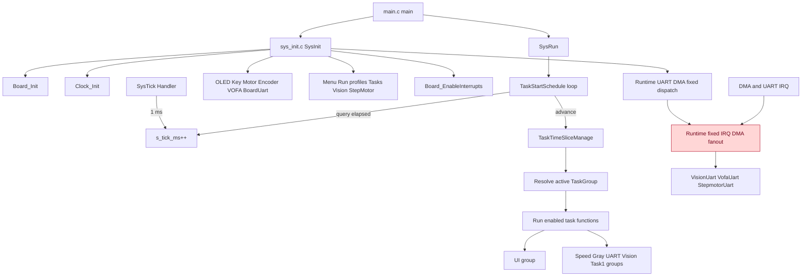

# 拓扑分层文件：Middleware 与 App API 类图（§3）、启动与调度逻辑图（§4）

本文件是 `agent/api_architecture_topology.md`（拓扑索引，唯一入口）的分层部分，承载 §3 与 §4。
阅读规则（§1）、数据流（§5）、风险登记（§6）、覆盖清单（§7）、执行前后检查（§8/§9）与更新日志（§10）都在索引文件。
章节编号沿用原单文件，不重排 —— `§3`/`§4` 锚点被 AGENTS.md、agent 定义与历史冻结契约引用。
维护义务与索引文件一体生效：Middleware/App API 或启动调度变化必须同步本图，并在索引文件 §10 追加日志（AGENTS.md §14）。

## 3. Middleware 与 App API 类图

```mermaid
classDiagram
direction LR

class System_API {
  <<app:system>>
  +main()
  +SysInit()
  +SysRun()
}

class Scheduler_API {
  <<app:scheduler, OLD, frozen SCH01>>
  +Sys_EnterRunEntry()
  +Sys_LeaveRunEntry()
  +Sys_GetActiveRunEntry()
  +TaskTimeSliceManage()
  +g_eSysFlagManage
}

class SchedulerEntry_API {
  <<app:scheduler, NEW SCH01>>
  +Scheduler_Init(entries, entry_count, background_step)
  +Scheduler_GetEntryCount()
  +Scheduler_GetEntryName(index)
  +Scheduler_EnterEntry(index) bool
  +Scheduler_LeaveEntry()
  +Scheduler_GetActiveEntry() int16_t
  +Scheduler_Run(now_ms)
}

class Clock_API { <<driver>> }
class Board_API { <<driver>> }
class BoardGpio_API { <<driver>> }

class RunRegistry_API {
  <<app:scheduler>>
  +RunRegistry_FindById()
  +RunRegistry_BuildMenuItems()
  +g_run_entries
}

class VofaRegister_API {
  <<app:scheduler>>
  +VofaRegister_Init()
  +VofaRegister_EnterProfile()
  +VofaRegister_ExitProfile()
  +VofaRegister_GetActiveProfile()
  +VofaRegister_GetXxxCtx()
}

class Menu_API {
  <<app:ui, OLD, frozen menu_core/menu_pages>>
  +Menu_Init()
  +Menu_HandleKey()
  +Menu_RenderIfDirty()
  +Menu_SetCurrentPage()
  +Menu_RequestRedraw()
  +Menu_IsDirty()
  +Menu_GetCurrentPage()
  +MenuPages_Init()
}

class MenuUI_API {
  <<app:ui, NEW UI01>>
  +Menu_Setup(params, param_count)
  +Menu_Tick(now_ms)
  +Menu_GetScreen() Menu_Screen
}

class MenuParam_API {
  <<app:ui, private to menu, not in public face>>
  +MenuParam_Init(params, count)
  +MenuParam_Enter()
  +MenuParam_Handle(Hmi_Input) Menu_Screen
  +MenuParam_Render()
  +MenuParam_FormatValue(value, buf, cap)
}

class TaskGroups_API {
  <<app:tasks>>
  +Task_UiService5ms()
  +Task_EncoderSpeedSample()
  +Task_MotorPidControl()
  +Task_StepmotorBusService5ms()
  +Task_VisionBusService5ms()
  +Task_VisionTrack10ms()
  +Task_VisionControl5ms()
  +Task_VisionTelemetry10ms()
  +Task_VofaService()
  +Task_SpeedLoop_Xxx()
  +Task_UartTest_Xxx()
  +Task_GrayTest_Xxx()
  +Task_UartStress_Xxx()
  +Task_Debug_Xxx()
  +Task_Task1_Xxx()
  +g_TaskGroups
}

class PID_API {
  <<middleware:pid>>
  +Pid_Init(Pid_T*, const Pid_Config_T*)
  +Pid_Reset(Pid_T*)
  +Pid_SetGains(Pid_T*, kp, ki, kd)
  +Pid_SetLimits(Pid_T*, out_limit, integral_limit)
  +Pid_UpdateIncremental(Pid_T*, target, feedback) float
  +Pid_UpdatePositional(Pid_T*, target, feedback) float
  +Pid_GetTelemetry(const Pid_T*, Pid_Telemetry_T*)
}

class TrackError_API {
  <<middleware:track_error>>
  +TrackError_FromDarkBitmap(const TrackError_Config_T*, dark_bitmap, out_error_mm*) bool
}

class Chassis_API {
  <<app:service>>
  +Chassis_Init()
  +Chassis_SetSpeedGains(Chassis_Side, kp, ki, kd)
  +Chassis_SetTargetMps(left_mps, right_mps)
  +Chassis_Update()
  +Chassis_Stop()
  +Chassis_GetTelemetry(Chassis_Telemetry_T*)
}

class LineFollow_API {
  <<app:service>>
  +LineFollow_Init(const LineFollow_Config_T*)
  +LineFollow_SetGains(kp, ki, kd)
  +LineFollow_Start() bool
  +LineFollow_Update()
  +LineFollow_Stop()
  +LineFollow_GetState() LineFollow_State
  +LineFollow_GetTelemetry(LineFollow_Telemetry_T*)
}

class LostLine_API {
  <<app:service, private to line_follow>>
  +LostLine_Init(LostLine_T*, recovery_error_mm, timeout_ms)
  +LostLine_NoteValid(LostLine_T*, error_mm)
  +LostLine_Tick(LostLine_T*, elapsed_ms, out_error_mm*) bool
}

class Tuning_API {
  <<app:service>>
  +Tuning_Init()
  +Tuning_EnterProfile(Tuning_Profile) bool
  +Tuning_Update()
  +Tuning_ExitProfile()
  +Tuning_GetActiveProfile() Tuning_Profile
}

class TuningChassis_API {
  <<app:service, private to tuning>>
  +TuningChassis_Enter()
  +TuningChassis_Apply()
  +TuningChassis_RefreshTx()
  +TuningChassis_PumpInner()
  +TuningChassis_Exit()
}

class Hmi_API {
  <<app:service>>
  +Hmi_Init()
  +Hmi_Update()
  +Hmi_PollInput() Hmi_Input
  +Hmi_IsDisplayReady() bool
  +Hmi_PrintLine(row, text) bool
  +Hmi_ClearDisplay() bool
}

class SpeedLoop_API {
  <<app:task>>
  +SpeedLoop_Init()
  +SpeedLoop_Enter_Exit()
  +SpeedLoop_Sample10ms()
  +SpeedLoop_Control10ms()
  +SpeedLoop_Telemetry20ms()
}

class Task1_API {
  <<app:task>>
  +Task1_Init()
  +Task1_Enter_Exit()
  +Task1_Sample10ms()
  +Task1_Control10ms()
  +Task1_Telemetry20ms()
}

class TrackFollow_API {
  <<app:task>>
  +Track_UpdateSample()
  +Track_GetBitmap()
  +TrackN_To_BitmapString()
  +Calculate_Track_Error()
  +TrackN
}

class GrayTest_API {
  <<app:task>>
  +GrayTest_Init()
  +GrayTest_Enter_Exit()
  +GrayTest_SampleAndTelemetry10ms()
}

class UartTest_API {
  <<app:task>>
  +UartTest_Init()
  +UartTest_Enter_Exit()
  +UartTest_Telemetry10ms()
}

class UartStress_API {
  <<app:task>>
  +UartStress_Init()
  +UartStress_Enter_Exit()
  +UartStress_Tick5ms()
}

class VisionBus_API {
  <<app:task>>
  +VisionBus_Init()
  +VisionBus_Service5ms()
}

class VisionCoord_API {
  <<app:task>>
  +VisionCoord_Init()
  +VisionCoord_HandleFrame()
  +VisionCoord_GetLatest()
  +VisionCoord_GetState()
  +VisionCoord_GetStateUpdateMeta()
  +VisionCoord_GetTopic()
}

class StepMotorBus_API {
  <<app:task>>
  +StepmotorBus_Init()
  +StepmotorBus_Service5ms()
  +StepmotorBus_RequestBypass()
  +StepmotorBus_SetBypass()
  +StepmotorBus_SetControlGate()
  +StepmotorBus_ResetDiagCounters()
  +StepmotorBus_GetControlErrorCount()
  +StepmotorBus_GetLastReturnCode()
  +StepmotorBus_ClearControlFrames()
  +StepmotorBus_IsControlPathIdle()
  +StepmotorBus_GetLastSpeedRpm()
  +StepmotorBus_GetLastSpeedRaw()
}

class Platform2D_API {
  <<app:task>>
  +VisionHdl_Init()
  +VisionHdl_Enter_Exit()
  +VisionHdl_Run10ms()
  +VisionHdl_Control5ms()
  +VisionHdl_Telemetry10ms()
  +StepperTestX_Enter_Exit()
  +StepperTestY_Enter_Exit()
  +DebugSmooth_Xxx()
  +DebugVisionData_Xxx()
}

class Runtime_API { <<driver>> }
class VisionUart_API { <<driver>> }
class VofaUart_API { <<driver>> }
class StepmotorUart_API { <<driver>> }
class Motor_API { <<driver>> }
class Encoder_API { <<driver>> }
class Key_API { <<driver>> }
class Gray_API { <<driver>> }
class GrayPort_API { <<driver>> }
class OLED_API { <<driver>> }
class Emm42_API { <<driver>> }
class VofaDriver_API { <<driver>> }
class ImuUart_API { <<driver>> }
class DL_HAL { <<external>> }

System_API --> Scheduler_API : starts scheduler
System_API --> Board_API : board init and interrupt enable
System_API --> Clock_API : clock init
System_API --> Runtime_API : UART DMA init (transitional)
System_API --> Motor_API : init and stop
System_API --> Encoder_API : init
System_API --> Key_API : init
System_API --> OLED_API : init
System_API --> VofaRegister_API : init
System_API --> StepMotorBus_API : init
System_API --> VisionBus_API : init

Scheduler_API --> Clock_API : active elapsed query
Scheduler_API --> RunRegistry_API : resolve active entry
Scheduler_API --> TaskGroups_API : dispatch active group

%% SchedulerEntry_API (SCH01, new) has zero real edges today: E01 scan 0 hits
%% (no include of clock.h/Driver/Middleware/Service), zero callers (S15.1/2 expected state).
%% Q1-decided future wiring (not yet code): System reads Clock_NowMs() and passes
%% now_ms into Scheduler_Run(now_ms) as a plain parameter — Scheduler_Run itself
%% never calls Clock_API. No edge drawn until System_API actually calls it.
RunRegistry_API --> SpeedLoop_API : lifecycle
RunRegistry_API --> GrayTest_API : lifecycle
RunRegistry_API --> UartTest_API : lifecycle
RunRegistry_API --> UartStress_API : lifecycle
RunRegistry_API --> Platform2D_API : lifecycle
RunRegistry_API --> Task1_API : lifecycle

Menu_API --> RunRegistry_API : builds pages
Menu_API --> Scheduler_API : enter and leave
Menu_API ..> Key_API : VIOLATION UI calls Driver
Menu_API ..> OLED_API : VIOLATION UI calls Driver

%% MenuUI_API / MenuParam_API (UI01, new) — zero callers today, E01 dependency scan 0 hits
%% against Driver/DL HAL (S15.1 expected state); SYS01/T01 assembly layer is the future caller.
MenuUI_API --> SchedulerEntry_API : GetEntryCount/GetEntryName/EnterEntry/LeaveEntry, same-layer controlled
MenuUI_API --> Hmi_API : Update/PollInput/IsDisplayReady/PrintLine
MenuUI_API --> MenuParam_API : delegates PARAM_LIST/PARAM_EDIT screens, private submodule
MenuParam_API --> Hmi_API : PrintLine render

TaskGroups_API --> Menu_API : UI task
TaskGroups_API --> SpeedLoop_API
TaskGroups_API --> Task1_API
TaskGroups_API --> GrayTest_API
TaskGroups_API --> UartTest_API
TaskGroups_API --> UartStress_API
TaskGroups_API --> VisionBus_API
TaskGroups_API --> Platform2D_API
TaskGroups_API --> StepMotorBus_API
TaskGroups_API ..> PID_API : VIOLATION Task calls Middleware
TaskGroups_API ..> Motor_API : VIOLATION Task calls Driver
TaskGroups_API ..> Encoder_API : VIOLATION Task calls Driver
TaskGroups_API --> Clock_API : encoder elapsed time
TaskGroups_API ..> VofaDriver_API : VIOLATION Task calls Driver

SpeedLoop_API --> Encoder_API : sample and feedback
SpeedLoop_API --> PID_API : control
SpeedLoop_API --> Motor_API : output
SpeedLoop_API --> VofaRegister_API : telemetry context
SpeedLoop_API --> VofaDriver_API : telemetry send

Task1_API --> Clock_API : time
Task1_API --> Encoder_API : sample
Task1_API --> TrackFollow_API : track sample
Task1_API --> PID_API : control
Task1_API --> Motor_API : output
Task1_API --> VofaRegister_API
Task1_API --> VofaDriver_API

GrayTest_API --> TrackFollow_API
GrayTest_API --> VofaRegister_API
GrayTest_API --> VofaDriver_API
UartTest_API --> VofaRegister_API
UartTest_API --> VofaDriver_API
UartStress_API --> StepMotorBus_API : exclusive pause and resume
UartStress_API ..> StepmotorUart_API : VIOLATION Task calls Driver

VisionBus_API --> Clock_API : time
VisionBus_API --> VisionCoord_API : parsed frames
VisionBus_API --> VisionUart_API : pull buffered bytes
Platform2D_API --> VisionCoord_API : coordinates
Platform2D_API --> StepMotorBus_API : transport state
Gray_API --> GrayPort_API : one port read, then scatter
GrayPort_API --> DL_HAL : GPIO_LINE_SENSOR = GPIOB, single DL_GPIO_readPins for all 12
Platform2D_API --> Emm42_API : commands
Platform2D_API --> PID_API : axis control
Platform2D_API --> VofaRegister_API
Platform2D_API --> VofaDriver_API
StepMotorBus_API --> StepmotorUart_API : shared UART queue and ack
StepMotorBus_API --> Runtime_API : bounded wait helper
StepMotorBus_API --> Clock_API : time
StepMotorBus_API --> Emm42_API : frame packing
TrackFollow_API ..> DL_HAL : VIOLATION App reads GPIO
VisionCoord_API --> Clock_API : state update time

VofaRegister_API ..> VofaDriver_API : VIOLATION direct Driver profile registration
VofaRegister_API ..> TrackFollow_API : VIOLATION exposes task state

Chassis_API --> Clock_API : 10ms period gate, unsigned-subtract elapsed
Chassis_API --> Encoder_API : sole new-chain sampling owner, real elapsed
Chassis_API --> Motor_API : SetOutput + Update
Chassis_API --> PID_API : dual-axis Pid_UpdateIncremental, each side owns static Pid_T

LineFollow_API --> Clock_API : 10ms outer-loop gate, unsigned-subtract elapsed
LineFollow_API --> Gray_API : Gray_ReadDarkBitmap, gated sample trigger
LineFollow_API --> TrackError_API : pitch_mm and bit0_is_left passthrough, first real consumer S02
LineFollow_API --> PID_API : outer Pid_UpdatePositional, out_limit = diff_limit_mps sole owner
LineFollow_API --> LostLine_API : recovery fallback error, caller-owned LostLine_T
LineFollow_API --> Chassis_API : same-layer controlled, SetTargetMps base±diff + cascade Update in TRACKING/RECOVERING

Tuning_API --> Clock_API : 10ms self-gate, unsigned-subtract elapsed
Tuning_API --> VofaDriver_API : vofa_clear_profile + vofa_run, Enter-time RX drain (contract amendment 1)
Tuning_API --> TuningChassis_API : profile lifecycle orchestration, sole caller
TuningChassis_API --> Chassis_API : same-layer controlled, SetSpeedGains + SetTargetMps + GetTelemetry + Stop + Update, sole apply point
TuningChassis_API --> VofaDriver_API : vofa_register_float ×6 tx + vofa_bind_cmd ×8 cmd

Hmi_API --> Key_API : Key_Scan pump + Key_PollPressEvent read-clear
Hmi_API --> OLED_API : OLED_IsReady/OLED_Process/OLED_ShowString/OLED_Clear
Hmi_API --> Clock_API : 5ms self-gate, unsigned-subtract elapsed
```

## 4. 当前启动与调度逻辑图

当前交叉点：App 仍有局部任务直接调用 Driver 或 DL HAL；Runtime ISR 已不再通过回调进入 App/VOFA 解析，但仍是过渡期固定分发层。

