# 拓扑分层文件：Middleware 与 App API 类图（§3）、启动与调度逻辑图（§4）

本文件是 `agent/api_architecture_topology.md`（拓扑索引，唯一入口）的分层部分，承载 §3 与 §4。
阅读规则（§1）、数据流（§5）、风险登记（§6）、覆盖清单（§7）、执行前后检查（§8/§9）与更新日志（§10）都在索引文件。
章节编号沿用原单文件，不重排 —— `§3`/`§4` 锚点被 AGENTS.md、agent 定义与历史冻结契约引用。
维护义务与索引文件一体生效：Middleware/App API 或启动调度变化必须同步本图，并在索引文件 §10 追加日志（AGENTS.md §14）。

## 3. Middleware 与 App API 类图

```mermaid
classDiagram
direction LR

class System_API {
  <<app:system, W2 live entry 2026-07-19>>
  +main()
  +SysInit()
}

class AppCompose_API {
  <<app:system, NEW W2 2026-07-19, assembly layer>>
  +AppCompose_Install()
}

class Scheduler_API {
  <<app:scheduler, OLD, frozen SCH01, unreachable at runtime since W2 2026-07-19 (main no longer calls SysRun)>>
  +Sys_EnterRunEntry()
  +Sys_LeaveRunEntry()
  +Sys_GetActiveRunEntry()
  +TaskTimeSliceManage()
  +g_eSysFlagManage
}

class SchedulerEntry_API {
  <<app:scheduler, NEW SCH01>>
  +Scheduler_Init(entries, entry_count, background_step)
  +Scheduler_GetEntryCount()
  +Scheduler_GetEntryName(index)
  +Scheduler_EnterEntry(index) bool
  +Scheduler_LeaveEntry()
  +Scheduler_GetActiveEntry() int16_t
  +Scheduler_Run(now_ms)
}

class Clock_API { <<driver>> }
class Board_API { <<driver>> }
class BoardGpio_API { <<driver>> }

class RunRegistry_API {
  <<app:scheduler>>
  +RunRegistry_FindById()
  +RunRegistry_BuildMenuItems()
  +g_run_entries
}

class VofaRegister_API {
  <<app:scheduler>>
  +VofaRegister_Init()
  +VofaRegister_EnterProfile()
  +VofaRegister_ExitProfile()
  +VofaRegister_GetActiveProfile()
  +VofaRegister_GetXxxCtx()
}

class Menu_API {
  <<app:ui, OLD, frozen menu_core/menu_pages>>
  +Menu_Init()
  +Menu_HandleKey()
  +Menu_RenderIfDirty()
  +Menu_SetCurrentPage()
  +Menu_RequestRedraw()
  +Menu_IsDirty()
  +Menu_GetCurrentPage()
  +MenuPages_Init()
}

class MenuUI_API {
  <<app:ui, NEW UI01, revision 2 two-level, W7 §29 self-draw opt-in revision 2>>
  +Menu_Setup(groups, group_count)
  +Menu_SetEntrySelfDraw(entry_index)
  +Menu_Tick(now_ms)
  +Menu_GetScreen() Menu_Screen
}

class MenuParam_API {
  <<app:ui, private to menu, not in public face>>
  +MenuParam_Enter(params, count)
  +MenuParam_Handle(Hmi_Input) Menu_Screen
  +MenuParam_Render()
  +MenuParam_FormatValue(value, buf, cap)
}

class TaskGroups_API {
  <<app:tasks>>
  +Task_UiService5ms()
  +Task_EncoderSpeedSample()
  +Task_MotorPidControl()
  +Task_StepmotorBusService5ms()
  +Task_VisionBusService5ms()
  +Task_VisionTrack10ms()
  +Task_VisionControl5ms()
  +Task_VisionTelemetry10ms()
  +Task_VofaService()
  +Task_SpeedLoop_Xxx()
  +Task_UartTest_Xxx()
  +Task_GrayTest_Xxx()
  +Task_UartStress_Xxx()
  +Task_Debug_Xxx()
  +Task_Task1_Xxx()
  +g_TaskGroups
}

class PID_API {
  <<middleware:pid>>
  +Pid_Init(Pid_T*, const Pid_Config_T*)
  +Pid_Reset(Pid_T*)
  +Pid_SetGains(Pid_T*, kp, ki, kd)
  +Pid_SetLimits(Pid_T*, out_limit, integral_limit)
  +Pid_UpdateIncremental(Pid_T*, target, feedback) float
  +Pid_UpdatePositional(Pid_T*, target, feedback) float
  +Pid_GetTelemetry(const Pid_T*, Pid_Telemetry_T*)
}

class TrackError_API {
  <<middleware:track_error>>
  +TrackError_FromDarkBitmap(const TrackError_Config_T*, dark_bitmap, out_error_mm*) bool
}

class TrackElements_API {
  <<middleware:track_elements, consumed by LineFollow_API S02b 2026-07-18>>
  +TrackElements_Init(det, cfg)
  +TrackElements_Update(det, dark_bitmap)
  +TrackElements_PollEvents(det) uint16_t
  +TrackElements_GetConfirmed(det) uint16_t
  +TrackElements_GetConfidence(det, kind) uint8_t
}

class SpeedPlan_API {
  <<middleware:speed_plan, consumed by LineFollow_API S02b 2026-07-18>>
  +SpeedPlan_Init(sp, const SpeedPlan_Config_T*)
  +SpeedPlan_Update(sp, abs_error_mm, elapsed_ms) float
  +SpeedPlan_GetSpeed(const sp) float
  +SpeedPlan_Reset(sp)
}

class Heading_API {
  <<middleware:odometry, NEW M01>>
  +Heading_Reset(Heading_T*)
  +Heading_Unwrap(Heading_T*, yaw_wrapped_deg) float
}

class Odometry_API {
  <<middleware:odometry, NEW M01>>
  +Odometry_Init(Odometry_T*, const Odometry_Config_T*)
  +Odometry_Reset(Odometry_T*)
  +Odometry_Update(Odometry_T*, dL_pulses, dR_pulses, yaw_wrapped_deg, heading_valid)
  +Odometry_GetPose(const Odometry_T*, Odometry_Pose_T*)
}

class VisionAim_API {
  <<middleware:vision_aim, S05b revision 1 2026-07-19: P to positional PD>>
  +VisionAim_Init(const VisionAim_Config_T*)
  +VisionAim_Map(coord_x, coord_y, cur_x_pulse, cur_y_pulse, prev_error_x, prev_error_y, VisionAim_Result_T*)
}

class MoveProfile_API {
  <<middleware:move_profile, NEW MS01 2026-07-20 (§27), stateless>>
  +MoveProfile_Speed(const MoveProfile_Config_T*, dist_done_mm, target_mm) float
}

class Chassis_API {
  <<app:service>>
  +Chassis_Init()
  +Chassis_SetSpeedGains(Chassis_Side, kp, ki, kd)
  +Chassis_SetTargetMps(left_mps, right_mps)
  +Chassis_Update()
  +Chassis_Stop()
  +Chassis_GetTelemetry(Chassis_Telemetry_T*)
}

class LineFollow_API {
  <<app:service>>
  +LineFollow_Init(const LineFollow_Config_T*)
  +LineFollow_SetGains(kp, ki, kd)
  +LineFollow_GetGains(kp*, ki*, kd*)
  +LineFollow_Start() bool
  +LineFollow_Update()
  +LineFollow_Stop()
  +LineFollow_GetState() LineFollow_State
  +LineFollow_GetTelemetry(LineFollow_Telemetry_T*)
  +LineFollow_PollElementEvents() uint16_t
  note: W6 2026-07-19, first real caller = AppCompose_API DEBUG entry idx4 "LineFollow" (Init/Start/Update/Stop wired to scheduler on_enter/on_step/on_exit)
}

class LostLine_API {
  <<app:service, private to line_follow>>
  +LostLine_Init(LostLine_T*, recovery_error_mm, timeout_ms)
  +LostLine_NoteValid(LostLine_T*, error_mm)
  +LostLine_Tick(LostLine_T*, elapsed_ms, out_error_mm*) bool
}

class Tuning_API {
  <<app:service, W8 §30 adds TUNING_PROFILE_GIMBAL_AIM>>
  +Tuning_Init()
  +Tuning_EnterProfile(Tuning_Profile) bool
  +Tuning_Update()
  +Tuning_ExitProfile()
  +Tuning_GetActiveProfile() Tuning_Profile
}

class TuningChassis_API {
  <<app:service, private to tuning>>
  +TuningChassis_Enter()
  +TuningChassis_Apply()
  +TuningChassis_RefreshTx()
  +TuningChassis_PumpInner()
  +TuningChassis_Exit()
}

class TuningGimbal_API {
  <<app:service, private to tuning, NEW W8 §30>>
  +TuningGimbal_Enter()
  +TuningGimbal_Apply()
  +TuningGimbal_RefreshTx()
  +TuningGimbal_PumpInner()
  +TuningGimbal_Exit()
}

class Hmi_API {
  <<app:service>>
  +Hmi_Init()
  +Hmi_Update()
  +Hmi_PollInput() Hmi_Input
  +Hmi_IsDisplayReady() bool
  +Hmi_PrintLine(row, text) bool
  +Hmi_ClearDisplay() bool
}

class Motion_API {
  <<app:service, NEW S06, +S06b arc, +MS01 profiled straight, +MS02 runtime profile params + watchdog 2026-07-20>>
  +Motion_Init(const Motion_Config_T*)
  +Motion_StartStraight(distance_mm, heading_hold) bool
  +Motion_StartProfiledStraight(distance_mm, heading_hold) bool
  +Motion_StartTurn(relative_deg) bool
  +Motion_StartArc(radius_mm, arc_deg) bool
  +Motion_SetProfileParams(cruise_mps, start_mps, accel_mps2, decel_mps2)
  +Motion_GetProfileParams(cruise_mps*, start_mps*, accel_mps2*, decel_mps2*)
  +Motion_Update()
  +Motion_Stop()
  +Motion_GetState() Motion_State
  +Motion_IsDone() bool
  +Motion_GetTelemetry(Motion_Telemetry_T*)
  note: profile_timeout_ticks cfg field (f333333, §8.1 runaway watchdog) — encoder-derailment safety stop, sole owner motion, 0=disabled
}

class Route_API {
  <<app:service, NEW S07, zero callers>>
  +Route_Setup(const Route_Segment_T*, count)
  +Route_Start()
  +Route_Update(now_ms)
  +Route_Stop()
  +Route_GetState() Route_State
  +Route_IsDone() bool
  +Route_GetTelemetry(Route_Telemetry_T*)
}

class Gimbal_API {
  <<app:service, NEW S05c, W8 §30 adds SetAimTuning + ReselectTopic runtime tuning face>>
  +Gimbal_Init(const Gimbal_Config_T*)
  +Gimbal_SelectTopic(main_task, sub_task) bool
  +Gimbal_Update()
  +Gimbal_Stop()
  +Gimbal_SetAimTuning(const Gimbal_AimTuning_T*)
  +Gimbal_ReselectTopic() bool
  +Gimbal_GetState() Gimbal_State
  +Gimbal_GetTelemetry(Gimbal_Telemetry_T*)
}

class GimbalStepbus_API {
  <<app:service, NEW S05c, T-GQ2 2026-07-20 relative to absolute rework, private to gimbal>>
  +GimbalStepbus_Init()
  +GimbalStepbus_Service()
  +GimbalStepbus_IsIdle() bool
  +GimbalStepbus_TrySendDualAbsolute(x_pulse, y_pulse) bool
  +GimbalStepbus_TrySendEnable(axis, on) bool
  +GimbalStepbus_TrySendPreset(axis, speed_rpm) bool
  +GimbalStepbus_TrySendClearZero(axis) bool
  note: T-GQ2 removed TrySendRelative (0xFD relative, pulse to dir/magnitude split) and TrySendSetZero (0x93 single-turn zero); dual-axis absolute one-frame dispatch (0xAA wrapping FC_Y||FC_X), F1 preset (mode=ABSOLUTE), 0x0A clear-position zero
}

class EncoderTest_API {
  <<app:service, NEW W3, DEBUG entry idx1>>
  +EncoderTest_Start()
  +EncoderTest_Update(now_ms)
  +EncoderTest_Stop()
}

class MotorCheck_API {
  <<app:service, NEW W3, DEBUG entry idx2>>
  +MotorCheck_Start()
  +MotorCheck_Update(now_ms)
  +MotorCheck_Stop()
}

class GrayCheck_API {
  <<app:service, NEW W4, W7 §29 field calibration panel + menu self-draw opt-in, DEBUG entry idx3>>
  +GrayCheck_Start()
  +GrayCheck_Update(now_ms)
  +GrayCheck_Stop()
}

class ParamTune_API {
  <<app:service, NEW W5, +MS02 2026-07-20 scope widened to DRIVE group, TUNE+DRIVE menu groups, Model A no gain/profile copy>>
  +ParamTune_Init()
  +ParamTune_GetKp_milli() int32_t
  +ParamTune_GetKi_milli() int32_t
  +ParamTune_GetKd_milli() int32_t
  +ParamTune_SetKp_milli(v)
  +ParamTune_SetKi_milli(v)
  +ParamTune_SetKd_milli(v)
  +ParamTune_GetCruise_milli() int32_t
  +ParamTune_GetStart_milli() int32_t
  +ParamTune_GetAccel_milli() int32_t
  +ParamTune_GetDecel_milli() int32_t
  +ParamTune_SetCruise_milli(v)
  +ParamTune_SetStart_milli(v)
  +ParamTune_SetAccel_milli(v)
  +ParamTune_SetDecel_milli(v)
  +ParamTune_GetDist_mm() int32_t
  +ParamTune_SetDist_mm(v)
  +ParamTune_Save()
  note: sole owner of persistence orchestration + int32 milli<->float x1000 scale (no gain/profile copy, get/set delegate LineFollow_Get/SetGains or Motion_Get/SetProfileParams); MS02: sole self-held owner of test distance s_dist_mm (no Service home for it); blob schema_ver 2 (33B)
}

class SpeedLoop_API {
  <<app:task>>
  +SpeedLoop_Init()
  +SpeedLoop_Enter_Exit()
  +SpeedLoop_Sample10ms()
  +SpeedLoop_Control10ms()
  +SpeedLoop_Telemetry20ms()
}

class Task1_API {
  <<app:task>>
  +Task1_Init()
  +Task1_Enter_Exit()
  +Task1_Sample10ms()
  +Task1_Control10ms()
  +Task1_Telemetry20ms()
}

class TrackFollow_API {
  <<app:task>>
  +Track_UpdateSample()
  +Track_GetBitmap()
  +TrackN_To_BitmapString()
  +Calculate_Track_Error()
  +TrackN
}

class GrayTest_API {
  <<app:task>>
  +GrayTest_Init()
  +GrayTest_Enter_Exit()
  +GrayTest_SampleAndTelemetry10ms()
}

class UartTest_API {
  <<app:task>>
  +UartTest_Init()
  +UartTest_Enter_Exit()
  +UartTest_Telemetry10ms()
}

class UartStress_API {
  <<app:task>>
  +UartStress_Init()
  +UartStress_Enter_Exit()
  +UartStress_Tick5ms()
}

class VisionBus_API {
  <<app:task>>
  +VisionBus_Init()
  +VisionBus_Service5ms()
}

class VisionCoord_API {
  <<app:task>>
  +VisionCoord_Init()
  +VisionCoord_HandleFrame()
  +VisionCoord_GetLatest()
  +VisionCoord_GetState()
  +VisionCoord_GetStateUpdateMeta()
  +VisionCoord_GetTopic()
}

class StepMotorBus_API {
  <<app:task>>
  +StepmotorBus_Init()
  +StepmotorBus_Service5ms()
  +StepmotorBus_RequestBypass()
  +StepmotorBus_SetBypass()
  +StepmotorBus_SetControlGate()
  +StepmotorBus_ResetDiagCounters()
  +StepmotorBus_GetControlErrorCount()
  +StepmotorBus_GetLastReturnCode()
  +StepmotorBus_ClearControlFrames()
  +StepmotorBus_IsControlPathIdle()
  +StepmotorBus_GetLastSpeedRpm()
  +StepmotorBus_GetLastSpeedRaw()
}

class Platform2D_API {
  <<app:task>>
  +VisionHdl_Init()
  +VisionHdl_Enter_Exit()
  +VisionHdl_Run10ms()
  +VisionHdl_Control5ms()
  +VisionHdl_Telemetry10ms()
  +StepperTestX_Enter_Exit()
  +StepperTestY_Enter_Exit()
  +DebugSmooth_Xxx()
  +DebugVisionData_Xxx()
}

class Runtime_API { <<driver>> }
class VisionUart_API { <<driver>> }
class UartVision_API { <<driver>> }
class VofaUart_API { <<driver>> }
class StepmotorUart_API { <<driver>> }
class Motor_API { <<driver>> }
class Encoder_API { <<driver>> }
class Key_API { <<driver>> }
class Gray_API { <<driver>> }
class GrayPort_API { <<driver>> }
class OLED_API { <<driver>> }
class Emm42_API { <<driver>> }
class VofaDriver_API { <<driver>> }
class ImuUart_API { <<driver>> }
class IMU_API { <<driver:imu, NEW consumer S06>> }
class ParamStore_API { <<driver:param_store, NEW W5>> }
class DL_HAL { <<external>> }

System_API ..> Scheduler_API : g_eSysFlagManage = SYS_STA_INIT write only (V13 residual); SysRun/TaskStartSchedule loop no longer called since W2 2026-07-19
System_API --> Board_API : board init and interrupt enable
System_API --> Clock_API : clock init
System_API --> Runtime_API : UART DMA init (transitional)
System_API --> Motor_API : init and stop
System_API --> Encoder_API : init
System_API --> Key_API : init
System_API --> OLED_API : init
System_API --> VofaRegister_API : init
System_API --> StepMotorBus_API : init
System_API --> VisionBus_API : init
System_API --> Hmi_API : Hmi_Init, W2
System_API --> Chassis_API : Chassis_Init, W2
System_API --> Tuning_API : Tuning_Init, W2
System_API --> AppCompose_API : AppCompose_Install, W2, sole caller

AppCompose_API --> SchedulerEntry_API : Scheduler_Init(s_entries, count, background_step=Menu_Tick), first real caller W2
AppCompose_API --> MenuUI_API : Menu_Setup(s_groups, count), first real caller W2
AppCompose_API --> MenuUI_API : Menu_SetEntrySelfDraw(APP_ENTRY_IDX_GRAYTEST), W7 §29 self-draw opt-in registration
AppCompose_API ..> Tuning_API : entry hooks call Tuning_EnterProfile/Update/ExitProfile (Scheduler_Entry_T fn ptrs owned by AppCompose, invoked later by SchedulerEntry_API)
AppCompose_API --> Gimbal_API : Gimbal_Init(&s_gt_cfg)/Gimbal_SelectTopic(main,sub), DEBUG entry idx6 "GimbalTune" on_enter hook, W8 §30, resolves Gimbal_API's zero-caller status
SchedulerEntry_API ..> AppCompose_API : Scheduler_Run invokes active entry's on_enter/on_step/on_exit fn ptrs each tick (opaque, registered by AppCompose)
SchedulerEntry_API ..> MenuUI_API : Scheduler_Run invokes background_step = Menu_Tick each idle tick (fn ptr, registered by AppCompose)

Scheduler_API --> Clock_API : active elapsed query
Scheduler_API --> RunRegistry_API : resolve active entry
Scheduler_API --> TaskGroups_API : dispatch active group

%% SchedulerEntry_API (SCH01) — 2026-07-19 W2: no longer zero callers. AppCompose_API is the
%% real caller of Scheduler_Init; main.c drives Scheduler_Run(Clock_NowMs()) every tick
%% (Q1-decided wiring realized: System reads Clock_NowMs() and passes now_ms as a plain
%% parameter — Scheduler_Run itself still never calls Clock_API directly).
%% W3 (2026-07-19): s_entries[] grows from 1 (SpeedTune) to 3 (+EncoderTest idx1, +MotorDir
%% idx2); s_debug_entries[]={0,1,2}. Single-active-entry invariant unchanged (index V21 W3 note).
%% W4 (2026-07-19): s_entries[] grows to 4 (+GrayTest idx3); s_debug_entries[]={0,1,2,3}.
%% W6 (2026-07-19): s_entries[] grows to 5 (+LineFollow idx4); s_debug_entries[]={0,1,2,3,4}.
%% LineFollow is the second entry (after SpeedTune idx0) whose on_step cascades Chassis_Update;
%% single-active-entry invariant keeps the two mutually exclusive (index V21 W6 note).
%% MS02 (2026-07-20, §28): s_entries[] grows to 6 (+ProfiledStraight idx5); s_debug_entries[]=
%% {0,1,2,3,4,5}. ProfiledStraight resolves Motion_API's zero-caller status; single-active-entry
%% invariant keeps it mutually exclusive with SpeedTune/LineFollow (index V21 MS02 note), does not
%% add a 5th Chassis_Update drive point (motion stays the same single module-level 3rd point).
%% W8 (2026-07-21, §30): s_entries[] grows to 7 (+GimbalTune idx6); s_debug_entries[]=
%% {0,1,2,3,4,5,6}. gimbaltune_enter dispatches Gimbal_Init(&s_gt_cfg) -> Tuning_EnterProfile
%% (TUNING_PROFILE_GIMBAL_AIM) -> Gimbal_SelectTopic(main,sub) in that order (Tuning_EnterProfile's
%% inner Gimbal_Stop would abort an in-flight handshake if SelectTopic ran first); this resolves
%% Gimbal_API's zero-caller status (first direct AppCompose_API->Gimbal_API edge, see edge above).
%% GimbalTune does not drive Chassis_Update (gimbal dispatches EMM42 steppers via gimbal_stepbus,
%% never touches chassis.h/motor.h), so it does not add a 4th Chassis_Update drive point (still
%% tuning_chassis/line_follow/motion, index V21); the single-active-entry invariant now holds
%% across seven entries.
RunRegistry_API --> SpeedLoop_API : lifecycle
RunRegistry_API --> GrayTest_API : lifecycle
RunRegistry_API --> UartTest_API : lifecycle
RunRegistry_API --> UartStress_API : lifecycle
RunRegistry_API --> Platform2D_API : lifecycle
RunRegistry_API --> Task1_API : lifecycle

Menu_API --> RunRegistry_API : builds pages
Menu_API --> Scheduler_API : enter and leave
Menu_API ..> Key_API : VIOLATION UI calls Driver
Menu_API ..> OLED_API : VIOLATION UI calls Driver

%% MenuUI_API / MenuParam_API (UI01) — 2026-07-19 W2: no longer zero callers.
%% AppCompose_API (assembly layer) registers Menu_Setup(s_groups) and wires Menu_Tick as
%% Scheduler background_step; MenuParam_API remains private to menu, invoked only via MenuUI_API.
%% W3 (2026-07-19, contract §23.0 amendment): RUN_ACTIVE display-ownership revision — menu now
%% draws a uniform "RUNNING" banner (row0) + clears row1..3 on every RUN_ACTIVE render, instead of
%% leaving the whole screen to the active entry's on_step. No entry opt-in flag exists yet (future
%% extension point), so today there is no dual-writer conflict — this is still the same
%% MenuUI_API --> Hmi_API : Hmi_PrintLine edge below, not a new dependency.
%% W7 (2026-07-20, contract §29 amendment 2): the opt-in flag predicted above lands —
%% Menu_SetEntrySelfDraw(entry_index) sets a bit in s_self_draw_mask (Menu_Setup resets it);
%% render_run_active() early-returns (zero draw, no banner, no row clear) when
%% Scheduler_GetActiveEntry() is a marked entry, ceding the full screen to that entry's Service
%% (first user: GrayTest -> gray_check, index §6 V29). Single-writer invariant holds via the
%% existing single-active-entry invariant + fixed same-tick order (Menu_Tick's background_step
%% runs, then the active entry's on_step) — never two writers on the same tick.
MenuUI_API --> SchedulerEntry_API : GetEntryCount/GetEntryName/EnterEntry/LeaveEntry/GetActiveEntry (W7 self-draw mask check), same-layer controlled
MenuUI_API --> Hmi_API : Update/PollInput/IsDisplayReady/PrintLine (W3: PrintLine also renders RUN_ACTIVE banner)
MenuUI_API --> MenuParam_API : delegates PARAM_LIST/PARAM_EDIT screens, private submodule
MenuParam_API --> Hmi_API : PrintLine render

TaskGroups_API --> Menu_API : UI task
TaskGroups_API --> SpeedLoop_API
TaskGroups_API --> Task1_API
TaskGroups_API --> GrayTest_API
TaskGroups_API --> UartTest_API
TaskGroups_API --> UartStress_API
TaskGroups_API --> VisionBus_API
TaskGroups_API --> Platform2D_API
TaskGroups_API --> StepMotorBus_API
TaskGroups_API ..> PID_API : VIOLATION Task calls Middleware
TaskGroups_API ..> Motor_API : VIOLATION Task calls Driver
TaskGroups_API ..> Encoder_API : VIOLATION Task calls Driver
TaskGroups_API --> Clock_API : encoder elapsed time
TaskGroups_API ..> VofaDriver_API : VIOLATION Task calls Driver

SpeedLoop_API --> Encoder_API : sample and feedback
SpeedLoop_API --> PID_API : control
SpeedLoop_API --> Motor_API : output
SpeedLoop_API --> VofaRegister_API : telemetry context
SpeedLoop_API --> VofaDriver_API : telemetry send

Task1_API --> Clock_API : time
Task1_API --> Encoder_API : sample
Task1_API --> TrackFollow_API : track sample
Task1_API --> PID_API : control
Task1_API --> Motor_API : output
Task1_API --> VofaRegister_API
Task1_API --> VofaDriver_API

GrayTest_API --> TrackFollow_API
GrayTest_API --> VofaRegister_API
GrayTest_API --> VofaDriver_API
UartTest_API --> VofaRegister_API
UartTest_API --> VofaDriver_API
UartStress_API --> StepMotorBus_API : exclusive pause and resume
UartStress_API ..> StepmotorUart_API : VIOLATION Task calls Driver

VisionBus_API --> Clock_API : time
VisionBus_API --> VisionCoord_API : parsed frames
VisionBus_API --> VisionUart_API : pull buffered bytes
Platform2D_API --> VisionCoord_API : coordinates
Platform2D_API --> StepMotorBus_API : transport state
Gray_API --> GrayPort_API : one port read, then scatter
GrayPort_API --> DL_HAL : GPIO_LINE_SENSOR = GPIOB, single DL_GPIO_readPins for all 12
Platform2D_API --> Emm42_API : commands
Platform2D_API --> PID_API : axis control
Platform2D_API --> VofaRegister_API
Platform2D_API --> VofaDriver_API
StepMotorBus_API --> StepmotorUart_API : shared UART queue and ack
StepMotorBus_API --> Runtime_API : bounded wait helper
StepMotorBus_API --> Clock_API : time
StepMotorBus_API --> Emm42_API : frame packing
TrackFollow_API ..> DL_HAL : VIOLATION App reads GPIO
VisionCoord_API --> Clock_API : state update time

VofaRegister_API ..> VofaDriver_API : VIOLATION direct Driver profile registration
VofaRegister_API ..> TrackFollow_API : VIOLATION exposes task state

Chassis_API --> Clock_API : 10ms period gate, unsigned-subtract elapsed
Chassis_API --> Encoder_API : primary new-chain sampling owner, real elapsed (W3: EncoderTest_API is a second, mutually-exclusive caller, see index V21 W3 note)
Chassis_API --> Motor_API : SetOutput + Update
Chassis_API --> PID_API : dual-axis Pid_UpdateIncremental, each side owns static Pid_T

LineFollow_API --> Clock_API : 10ms outer-loop gate, unsigned-subtract elapsed
LineFollow_API --> Gray_API : Gray_ReadDarkBitmap, gated sample trigger
LineFollow_API --> TrackError_API : pitch_mm and bit0_is_left passthrough, first real consumer S02
LineFollow_API --> PID_API : outer Pid_UpdatePositional, out_limit = diff_limit_mps sole owner
LineFollow_API --> LostLine_API : recovery fallback error, caller-owned LostLine_T
LineFollow_API --> Chassis_API : same-layer controlled, SetTargetMps base±diff + cascade Update in TRACKING/RECOVERING
LineFollow_API --> TrackElements_API : same dark_bitmap by value, parallel consumer, wired S02b 2026-07-18
LineFollow_API --> SpeedPlan_API : fabsf(error_mm) and elapsed_ms -> base speed feeding base±diff, wired S02b 2026-07-18

%% Odometry_API / Heading_API (M01) — pure algorithm, no Encoder_API/IMU_API include
%% (deltas and yaw passed by value). First real caller landed S06 (Motion_API below).
Odometry_API --> Heading_API : embeds Heading_T, sole caller of Heading_Unwrap

%% TrackElements_API (M02, landed 2026-07-18) — pure algorithm, E01 dependency scan
%% 0 hits against Driver/App/middleware:pid/middleware:track_error/middleware:odometry/DL HAL
%% (position/count/span/touch computed from dark_bitmap passed by value, same pattern as
%% TrackError_API). First real caller landed S02b 2026-07-18 (LineFollow_API edge above):
%% line_follow.c feeds it the same dark_bitmap LineFollow_Update already samples via
%% Gray_ReadDarkBitmap (not a second sample point) and exposes confirmed events via the new
%% public LineFollow_PollElementEvents() exit (zero consumers today, S07 future trigger).

%% SpeedPlan_API (M03, landed 2026-07-18) — pure algorithm, E01 dependency scan
%% 0 hits against Driver/App/other middleware/DL HAL (header only <stdint.h>). Consumes the
%% same abs(error_mm) TrackError_API already produces, no second quantization. First real
%% caller landed S02b 2026-07-18 (LineFollow_API edge above): its output replaces the former
%% static base_speed_mps constant (line_follow.c:63-64, field removed) as the base in
%% base±diff at the sole synthesis point line_follow_apply().

%% VisionAim_API (S05b, landed 2026-07-18) — pure algorithm, E01 dependency scan 0 hits
%% against Driver/App/other middleware/DL HAL (only <stdint.h>/<stdbool.h>/<stddef.h>).
%% Maps float32 pixel coord (S05a UartVision_API transfers coord as float, decoupled here —
%% no edge to UartVision_API: this module takes plain float x/y args, not driver coord type).
%% Sole owner of deadband/proportional-step/floor-1/step-clamp/polarity sign[axis]/travel-limit
%% geometry (see index §6 V26). Axis cumulative position STATE stays with the caller
%% (S05c Gimbal_API, landed 2026-07-18), passed in each tick as cur_pulse — not owned here.
%% First real caller landed S05c (Gimbal_API edge below), Gimbal_API never recomputes this geometry.
%% S05b revision 1 (2026-07-19, contract §21.4): P upgraded to positional PD — VisionAim_Config_T
%% gains kd[axis] (derivative gain, default 0 degrades to pure P bit-for-bit); VisionAim_Map gains
%% prev_error_x/prev_error_y params. Chain adds de = error - prev_error, raw = kp*error + kd*de.
%% NO derivative filter (upstream coords already host-side Kalman-filtered, second filter would
%% violate §8.2, same precedent as IMU built-in Kalman) and NO integral term (cur_pulse accumulation
%% already is the integrator). Sole-owner set widens to include kd (same file/layer, not cross-module).
%% prev_error STATE is NOT owned here — owned by the caller (Gimbal_API), mirrors the existing
%% cur_pulse caller-owned-state precedent; VisionAim_Map stays a pure function, no cross-tick bookkeeping.

%% MoveProfile_API (MS01, landed 2026-07-20, §27) — pure function, stateless, E01 dependency
%% scan 0 hits against Driver/App/other middleware/DL HAL (only <math.h>/<stddef.h>). Trapezoidal
%% speed profile parameterized by distance (accel sqrt(start^2+2a*s) / cruise clamp / decel
%% sqrt(2a*rem)->0), self-feeds position via dist_done_mm each tick (no module-level state).
%% Sole owner of "distance -> feedforward speed" transform; internal mm->m is dimensional
%% alignment only, NOT a second pulse->distance owner (that stays Odometry_Config_T.mm_per_pulse,
%% see index §6 V22 — unchanged this round). Distinct input domain from SpeedPlan_API (lateral
%% error magnitude -> cruise base ramp): non-competing owners, see index §6 V25 boundary note.
%% First and only caller: Motion_API (edge below), motion_step_profiled_straight.

Tuning_API --> Clock_API : 10ms self-gate, unsigned-subtract elapsed
Tuning_API --> VofaDriver_API : vofa_clear_profile + vofa_run, Enter-time RX drain (contract amendment 1)
Tuning_API --> TuningChassis_API : profile lifecycle orchestration, sole caller
TuningChassis_API --> Chassis_API : same-layer controlled, SetSpeedGains + SetTargetMps + GetTelemetry + Stop + Update, sole apply point
TuningChassis_API --> VofaDriver_API : vofa_register_float ×10 tx (gains×6 echo + target×2 + feedback×2, no pid_out, W1) + vofa_bind_cmd ×8 cmd
Tuning_API --> TuningGimbal_API : profile lifecycle orchestration, sole caller, W8 §30
TuningGimbal_API --> Gimbal_API : same-layer controlled, SetAimTuning + ReselectTopic + GetTelemetry, sole apply point
TuningGimbal_API --> VofaDriver_API : vofa_register_float ×13 tx (err/delta/cur×2 + state + gains/DB/MS echo×6) + vofa_bind_cmd ×7 cmd (XP/XD/YP/YD/DB/MS/GO)

Hmi_API --> Key_API : Key_Scan pump + Key_PollPressEvent read-clear
Hmi_API --> OLED_API : OLED_IsReady/OLED_Process/OLED_ShowString/OLED_Clear
Hmi_API --> Clock_API : 5ms self-gate, unsigned-subtract elapsed

Motion_API --> Encoder_API : GetSnapshot read-only, never calls Encoder_Update
Motion_API --> IMU_API : Imu_Update sole owner during active period + Imu_GetSnapshot
Motion_API --> Odometry_API : Init passthrough cfg + one-shot total_pulses delta consume + GetPose, first real caller S06
Motion_API --> PID_API : straight/arc heading-correction outer loop (shared instance), Pid_UpdatePositional, out_limit = hold_diff_limit_mps sole owner
Motion_API --> MoveProfile_API : MS01 2026-07-20, motion_step_profiled_straight feeds dist_done_mm(Euclidean from Pose, motion's existing owner)+target_mm -> longitudinal feedforward base_mps, no longitudinal PID, first and only caller
Motion_API --> Chassis_API : same-layer controlled, SetTargetMps + cascaded Update (STRAIGHT/TURN/ARC/PROFILED_STRAIGHT, S06b/MS01 reuse same drive mechanism) + Stop (DONE/Stop)

%% Route_API (S07, landed 2026-07-18) — segment-table orchestration, E01 dependency scan
%% 0 hits against app:tasks/app:scheduler/app:ui/app:system/middleware/driver/DL HAL (only
%% line_follow.h + motion.h, same-layer Service->Service). Per-tick single-drive invariant
%% (Route_Update RUNNING advances at most one sub-service per tick: FOLLOW_UNTIL->LineFollow_Update
%% XOR motion segment->Motion_Update) means route is NOT a 4th Chassis_Update drive point and NOT
%% a 2nd Imu_Update drain point (see V21/V23). Zero callers today (T01 not yet written, same
%% expected-transition state as Motion_API/LineFollow_API/Chassis_API before their Task wiring).
Route_API --> LineFollow_API : FOLLOW_UNTIL segments — Start/Update/Stop/GetState/PollElementEvents, at most one drive per tick
Route_API --> Motion_API : STRAIGHT/TURN/ARC segments — Update (incl. IDLE catch-up)/StartStraight/StartTurn/StartArc/Stop/IsDone, at most one drive per tick

%% Gimbal_API / GimbalStepbus_API (S05c, landed 2026-07-18) — completes the vision aiming chain:
%% wires S05a UartVision_API (coord/handshake codec) and S05b VisionAim_API (pixel-error to
%% pulse-delta geometry) into a running Service->Driver direct chain (Service->App Task not
%% used; stepmotor bus goes Service->Driver directly, bypassing frozen stepmotor_bus.c mgmt
%% queue). Sole owner of axis cumulative pulse position (accumulated only after a successful
%% send) and of coordinate-staleness judgement (seq stall -> STOPPED); never recomputes
%% VisionAim_API's deadband/kp/kd/step-clamp/polarity/travel-limit geometry (V26 audited pass).
%% odometry feedforward deliberately NOT wired this round (contract §21.3 design decision 2;
%% see index §5.2/§6 V22 — Odometry_GetPose read point reserved, not called).
%% S05b revision 1 (2026-07-19): Gimbal_API now also sole-owns prev_error_px[axis] STATE
%% (s_prev_error_px, mirrors the existing cur_pulse caller-held-state precedent), feeding it into
%% VisionAim_Map each tick and storing back VisionAim_Result_T.error_px every tick (incl. deadband
%% ticks) for the next tick's de. On AIMING entry the first frame is seeded so de=0 (no first-tick
%% derivative kick) before the real dispatch call. gimbal.c never recomputes kp/kd/de itself.
Gimbal_API --> VisionAim_API : VisionAim_Map per tick (adds prev_error_x/y args, PD revision 1), cur_pulse+prev_error fed by caller, no recompute of aim geometry
Gimbal_API --> UartVision_API : Poll/GetLatestCoord+GetCoordSeq/SendTopic/GetTopicAck+GetTopicAckSeq
Gimbal_API --> Clock_API : 10ms self-gate, unsigned-subtract elapsed
Gimbal_API --> GimbalStepbus_API : same-layer controlled, private pulse dispatch submodule
GimbalStepbus_API --> Emm42_API : Build*Frame packing (absolute pulse passed through, no dir/magnitude split — T-GQ2 removed the split; RPM clamp stays emm42.c; label corrected 2026-07-20, was stale post-T-GQ2 doc drift)
GimbalStepbus_API --> StepmotorUart_API : TryWrite/IsTxIdle/ConsumeTxDone/Read (drain+discard, vision is the only feedback path)

%% Gimbal_API / Tuning_API / TuningGimbal_API (W8, landed 2026-07-21, contract §30) — runtime
%% aim-tuning face closes the "no runtime setter" gap noted at V26 landing (index §6 V26 W8
%% addendum): Gimbal_SetAimTuning(const Gimbal_AimTuning_T*) swaps only s_cfg.aim's kp/kd/
%% deadband_px/max_step_pulse fields through the sole existing VisionAim_Init apply point
%% (center_px/sign/travel_limit_pulse stay Init-only, out of tuning's reach — assembly/polarity/
%% travel facts, not runtime-safe to flip); prev_error_px/seeded/state untouched (gain swap does
%% not break the convergence loop, gimbal.c never re-derives PD math). Gimbal_ReselectTopic()
%% re-submits the last successful SelectTopic pair (s_has_topic-gated) to resume handshake after
%% STOPPED without losing the tuning session. Gimbal_Telemetry_T grows last_error_px[2]/
%% last_delta_pulse[2] as a read-only cache of gimbal_aim_dispatch's existing VisionAim_Result_T —
%% zero second computation. New private submodule TuningGimbal_API (tuning_gimbal.c/.h) mirrors
%% TuningChassis_API's Enter/Apply/RefreshTx/PumpInner/Exit pattern: cmd×7 (XP/XD/YP/YD/DB/MS/GO)
%% -> single cleaning point in Apply (negative clamp to 0, MS domain [1,10000] per contract
%% revision 2) -> Gimbal_SetAimTuning; GO>=0.5 edge-consumed (clear then fire) -> Gimbal_
%% ReselectTopic; tx×13 one-way telemetry+echo copy, no reverse path. Safe-entry values: gains=0,
%% DB=10000 (vision_aim's floor-1 semantics mean kp=0 alone is NOT zero output — a still-raw=0
%% pixel error outside deadband still floor-1-crawls ±1 pulse/tick; only an oversized deadband
%% guarantees deterministic zero output), MS=1, GO=0. New AppCompose_API entry "GimbalTune"
%% (idx6) wires Gimbal_Init -> Tuning_EnterProfile(GIMBAL_AIM) -> Gimbal_SelectTopic in that
%% fixed order (see s_entries[] comment block above).

%% EncoderTest_API / MotorCheck_API (W3, landed 2026-07-19) — two new DEBUG-group scheduler
%% entries (app_compose.c s_entries idx1/idx2), diagnostic-only, mutually exclusive with each
%% other and with SpeedTune/route etc. under the single-active-entry invariant (index V21 W3 note).
EncoderTest_API --> Encoder_API : Encoder_Update(elapsed) sampling + Encoder_GetSnapshot, second sampling call point (mutual-exclusion mitigated, not concurrent with chassis.c)
EncoderTest_API --> VofaDriver_API : vofa_clear_profile/vofa_register_int x2/vofa_register_float x2/vofa_run, tx-only (no bind_cmd)
MotorCheck_API --> Motor_API : Motor_SetOutput both wheels +/-200 + Motor_Update(elapsed) + Motor_BrakeAll on Stop, zero re-clamp/re-slew (sole owner stays motor.c)

%% GrayCheck_API (W4, landed 2026-07-19) — third new DEBUG-group scheduler entry (idx3),
%% diagnostic-only, mutually exclusive with SpeedTune/EncoderTest/MotorDir under the
%% single-active-entry invariant (index V21 note). Read-only tx mirror, no cmd, no motor.
%% W7 revision (§29, landed 2026-07-20): GrayCheck_API upgrades from tx-only diagnostic to a
%% field calibration helper — the same Gray_ReadDarkBitmap() read that feeds the tx mirror also
%% feeds internal calibration stats (sticky-OR + per-channel toggle count, accumulate-only, never
%% written back into the bitmap, not a second bitmap owner) and a 4-row OLED panel rendered via
%% Hmi_PrintLine (Service->Service, same-layer controlled; only the display face is used, never
%% Hmi_PollInput — the sole semantic-input consumer stays menu). Public signature unchanged
%% (Start/Update/Stop only, zero new getters). Full-screen display ownership during RUN_ACTIVE is
%% ceded to this entry via Menu_SetEntrySelfDraw(APP_ENTRY_IDX_GRAYTEST) — see MenuUI_API note
%% below and index §6 V29.
GrayCheck_API --> Gray_API : Gray_ReadDarkBitmap() atomic 12-bit read, second call point after line_follow.c (no accumulator, no double-count hazard, see index V21 W4 note)
GrayCheck_API --> VofaDriver_API : vofa_clear_profile/vofa_register_int x12/vofa_run, tx-only (no bind_cmd)
GrayCheck_API --> Hmi_API : Hmi_PrintLine x4 rows, 100ms-gated row-diff calibration panel (W7 §29), same-layer controlled, self-draw during RUN_ACTIVE (index §6 V29)

%% ParamTune_API / ParamStore_API (W5, landed 2026-07-19) — dynamic tuning framework: new
%% TUNE menu group (app_compose.c s_groups[], sibling of DEBUG) button-adjusts the line_follow
%% outer PID gains and persists them to on-chip flash. Model A: param_tune holds NO gain copy —
%% get delegates LineFollow_GetGains (real applied value), set delegates LineFollow_SetGains
%% (instant apply), save serializes the current gains (schema_ver + kp/ki/kd milli, 13B) via
%% ParamStore_Save. param_tune sole-owns int32 milli<->float x1000 scale and persistence
%% orchestration; NV framing (magic/format-version/CRC16, erase-before-write, read-back verify)
%% sole-owned by param_store.c (Driver), which is payload-agnostic (schema_ver lives inside the
%% blob, owned by param_tune). LineFollow_SetGains has exactly one writer in this world
%% (param_tune) — Model A single-owner claim (index V17/new note). Menu wiring is opaque fn
%% ptrs (Menu_Param_T get/set/action), same pattern as AppCompose_API<->Tuning_API above —
%% menu.c core untouched, action dispatch lives in menu_param.c's PARAM_LIST branch.
ParamTune_API --> LineFollow_API : LineFollow_GetGains (display real applied value) + LineFollow_SetGains (instant apply), same-layer controlled, sole writer of line_follow gains
ParamTune_API --> Motion_API : MS02 2026-07-20, same-layer controlled — ParamTune_Get/SetCruise/Start/Accel/Decel_milli delegate Motion_Get/SetProfileParams (int32 milli<->float scale sole owner stays param_tune, applied value sole owner stays motion s_cfg.profile_*, not a new owner)
ParamTune_API --> ParamStore_API : ParamStore_Read (boot load) / ParamStore_Save (SAVE action), 33B blob = schema_ver(2) + kp/ki/kd milli LE + profile cruise/start/accel/decel milli LE + dist_mm LE (MS02 2026-07-20, schema_ver 1 13B legacy record now rejected by length check -> falls back to all-defaults, one-time)
ParamStore_API --> DL_HAL : DL_FlashCTL erase/program/read via param_store_hw.c, last 1KB sector 0x0007FC00
AppCompose_API --> ParamTune_API : ParamTune_Init(), three call sites (AppCompose_Install boot load, W5; LineFollow entry idx4 on_enter re-push after Init zeroes gains, W6; ProfiledStraight entry idx5 on_enter re-push after Motion_Init resets profile params to s_ms_cfg placeholder, MS02), loads persisted gains/profile-params/dist or defaults and applies to line_follow + motion
AppCompose_API ..> ParamTune_API : TUNE + DRIVE group Menu_Param_T get/set/action fn ptrs (opaque, invoked later by MenuParam_API)
MenuParam_API ..> AppCompose_API : PARAM_LIST/PARAM_EDIT invokes registered TUNE/DRIVE get/set/action fn ptrs each op (fn ptr, registered by AppCompose)

%% AppCompose_API / Motion_API / ParamTune_API (MS02, landed 2026-07-20, §28) — Motion_API's
%% "zero external callers" status (recorded at MS01 landing) is resolved: new DEBUG-group
%% scheduler entry "ProfiledStraight" (idx5) wires Motion_Init/StartProfiledStraight/Update/Stop
%% directly from app_compose.c. on_enter order (closes index V28-style wiring note for this
%% entry): Motion_Init(&s_ms_cfg) (resets service + profile params to placeholder) -> ParamTune_Init()
%% (re-pushes persisted/default profile params + test distance, this entry's on_enter is the
%% third ParamTune_Init() call site) -> Motion_StartProfiledStraight(ParamTune_GetDist_mm(), false)
%% (dist<=0 stays IDLE, no motor command). Single-active-entry invariant keeps ProfiledStraight
%% (idx5) mutually exclusive with SpeedTune (idx0) and LineFollow (idx4) — motion remains the
%% same single module-level Chassis_Update drive point (third overall, S06-established), this
%% wiring does NOT add a 5th drive point (see index §6 V21 MS02 note). AppCompose adds zero
%% re-derivation of profile clamp/timeout-watchdog/heading-hold logic (all sole-owned in motion.c).
AppCompose_API --> Motion_API : Motion_Init(&s_ms_cfg)/StartProfiledStraight(dist,false)/Update()/Stop(), DEBUG entry idx5 "ProfiledStraight" three hooks, MS02

%% LineFollow_API (W6, landed 2026-07-19) — fifth DEBUG-group scheduler entry (idx4
%% "LineFollow"), first real caller of the outer line-follow control loop. on_enter order
%% (closes index V28 wiring note): LineFollow_Init(&s_lf_cfg, conservative UNCALIBRATED
%% placeholder, zeroes outer gains) -> ParamTune_Init() (re-pushes persisted/default gains,
%% otherwise the first tracking tick would run with zero gains) -> LineFollow_Start() (IDLE
%% held if config invalid). on_step: LineFollow_Update() (self-gated 10ms, cascades
%% Chassis_Update in TRACKING/RECOVERING — see index V21 W6 note). on_exit: LineFollow_Stop()
%% (-> IDLE + Chassis_Stop, deterministic stop). AppCompose adds zero re-derivation of
%% clamp/reversal/timeout/slew/lost-line fallback (all sole-owned downstream, §8.1).
AppCompose_API --> LineFollow_API : LineFollow_Init(&s_lf_cfg)/Start()/Update()/Stop(), DEBUG entry idx4 "LineFollow" three hooks, W6
```

## 4. 当前启动与调度逻辑图

```mermaid
flowchart TD
  Main[main.c main, World-2 live entry] --> SysInit[sys_init.c SysInit]
  SysInit --> BoardInit[Board_Init]
  SysInit --> ClockInit[Clock_Init]
  SysInit --> RuntimeInit[Runtime UART DMA fixed dispatch]
  SysInit --> DriverInit[OLED Key Motor Encoder VOFA BoardUart, legacy app-task Init retained but never pumped from here]
  SysInit --> ServiceInit[Hmi_Init + Chassis_Init + Tuning_Init]
  SysInit --> AppCompose[AppCompose_Install, W2 SYS02]
  SysInit --> BoardIRQ[Board_EnableInterrupts]
  AppCompose --> SchedulerInit[Scheduler_Init s_entries=SpeedTune,EncoderTest,MotorDir,GrayTest,LineFollow,ProfiledStraight,GimbalTune x7, background_step=Menu_Tick]
  AppCompose --> MenuSetupCall[Menu_Setup s_groups=DEBUG+TUNE+DRIVE x3, DEBUG entries idx0..6, TUNE params=LFKp,LFKi,LFKd,SAVE x4, DRIVE params=Dist,Cruise,Start,Accel,Decel,SAVE x6]
  AppCompose --> MenuSelfDrawCall[Menu_SetEntrySelfDraw APP_ENTRY_IDX_GRAYTEST=3, W7 GrayTest opt-in, menu zero-draws while active]
  AppCompose --> ParamTuneInitCall[ParamTune_Init, W5: read param_store schema_ver 2 or default -> LineFollow_SetGains + Motion_SetProfileParams; also re-invoked by LineFollow on_enter W6 and ProfiledStraight on_enter MS02, three call sites]
  Main --> MainLoop[while 1: Scheduler_Run Clock_NowMs]
  MainLoop -->|idle, no entry active| MenuTickPump[background_step -> Menu_Tick, HMI only]
  MainLoop -->|SpeedTune entered| SpeedTuneStep[on_step -> Tuning_Update -> cascaded Chassis_Update]
  MainLoop -->|EncoderTest entered, W3| EncTestStep[on_step -> EncoderTest_Update -> Encoder_Update 2nd sampling call + vofa_run]
  MainLoop -->|MotorDir entered, W3| MotorDirStep[on_step -> MotorCheck_Update -> Motor_SetOutput +/-200 both wheels + Motor_Update]
  MainLoop -->|GrayTest entered, W4/W7| GrayTestStep[on_step -> GrayCheck_Update -> Gray_ReadDarkBitmap 2nd read point + vofa_run tx-only + 100ms-gated OLED calibration panel, self-draw menu yields row0..3]
  MainLoop -->|LineFollow entered, W6| LineFollowStep[on_enter LineFollow_Init then ParamTune_Init then Start; on_step -> LineFollow_Update -> cascaded Chassis_Update in TRACKING/RECOVERING; on_exit LineFollow_Stop]
  MainLoop -->|ProfiledStraight entered, MS02| ProfiledStraightStep[on_enter Motion_Init then ParamTune_Init reapply profile params+dist then StartProfiledStraight dist,false; on_step -> Motion_Update -> profile watchdog check -> cascaded Chassis_Update; on_exit Motion_Stop]
  MainLoop -->|GimbalTune entered, W8 §30| GimbalTuneStep[on_enter Gimbal_Init s_gt_cfg then Tuning_EnterProfile GIMBAL_AIM then Gimbal_SelectTopic placeholder topic, order fixed; on_step -> Tuning_Update -> vofa_run cmd/tx + TuningGimbal_Apply clean-and-set + PumpInner Gimbal_Update; on_exit Tuning_ExitProfile -> Gimbal_Stop]
  MainLoop -->|TUNE group, K3 on Kp/Ki/Kd row, W5| TuneEditStep[MenuParam_Handle -> ParamTune_Get/Set*_milli -> LineFollow_Get/SetGains, no menu-side scale/copy]
  MainLoop -->|TUNE group, K3 on SAVE row, W5| TuneSaveStep[MenuParam_Handle action -> ParamTune_Save -> ParamStore_Save, flash write]
  MainLoop -->|DRIVE group, K3 on Dist/Cruise/Start/Accel/Decel row, MS02| DriveEditStep[MenuParam_Handle -> ParamTune_Get/SetDist_mm self-held or ParamTune_Get/SetCruise/Start/Accel/Decel_milli -> Motion_Get/SetProfileParams, no menu-side scale/copy]
  MainLoop -->|DRIVE group, K3 on SAVE row, MS02| DriveSaveStep[MenuParam_Handle action -> ParamTune_Save -> ParamStore_Save, same 33B blob as TUNE SAVE]

  SysTick[SysTick Handler] -->|1 ms| TickMs[s_tick_ms++]
  MainLoop -->|query elapsed| TickMs

  SysRunOld[SysRun / task_scheduler.c TaskStartSchedule loop, World-1 legacy]
  TimeSliceOld[TaskTimeSliceManage -> TaskGroups -> UI/Speed/Gray/UART/Vision/Task1 groups]
  SysRunOld -.->|frozen 2026-07-19 W2: no longer called by main| TimeSliceOld

  RuntimeInit --> FixedDispatch[Runtime fixed IRQ DMA fanout]
  DMAIRQ[DMA and UART IRQ] --> FixedDispatch
  FixedDispatch --> RoleDrivers[VisionUart VofaUart StepmotorUart]

  classDef violation fill:#ffd6d6,stroke:#b00020,color:#700018
  class FixedDispatch violation
  classDef frozen fill:#eeeeee,stroke:#888888,color:#555555
  class SysRunOld,TimeSliceOld frozen
```



当前交叉点：App 仍有局部任务直接调用 Driver 或 DL HAL；Runtime ISR 已不再通过回调进入 App/VOFA 解析，但仍是过渡期固定分发层。**2026-07-19 W2 起**：`main.c` 的现役主循环是 `SysInit()` + `while(1){ Scheduler_Run(Clock_NowMs()); }`；旧 `SysRun`/`task_scheduler.c` 主循环不再被 `main` 调用（灰色冻结节点，随 T01 整体删除），`sys_init.c` 里遗留的旧 app-task `*_Init()` 调用仍在执行但其任务此后永不被泵（无双 Driver 所有者，§6 参见 V21 类推理）。SysTick 仍只做 `s_tick_ms++`（`clock.c:32`），不泵任何一条调度链。

