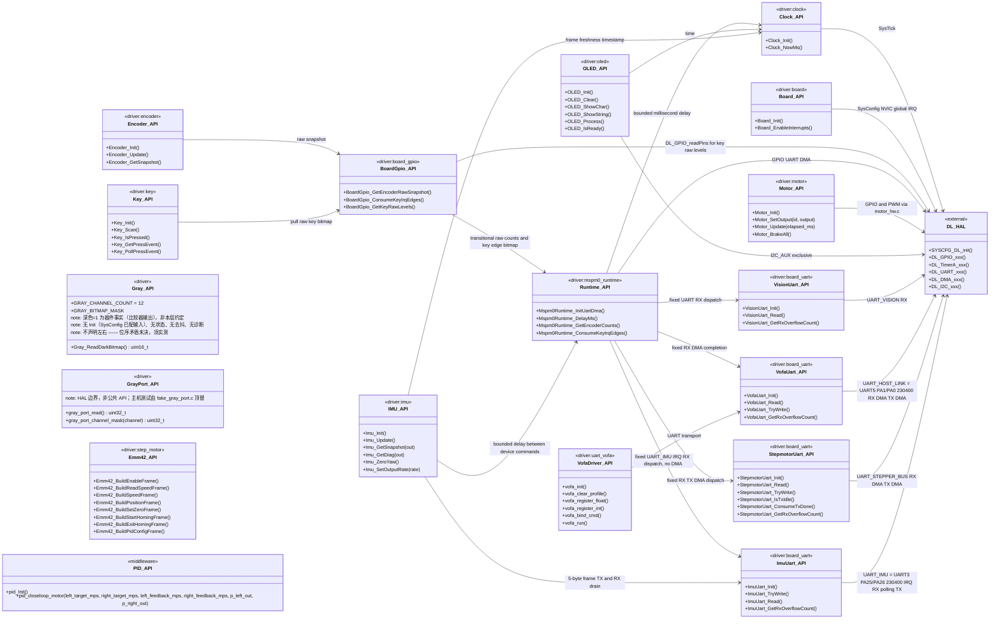

# 拓扑分层文件：Driver API 类图（§2）

本文件是 `agent/api_architecture_topology.md`（拓扑索引，唯一入口）的分层部分，只承载 §2。
阅读规则（§1）、数据流（§5）、风险登记（§6）、覆盖清单（§7）、执行前后检查（§8/§9）与更新日志（§10）都在索引文件。
章节编号沿用原单文件，不重排 —— `§2` 锚点被 AGENTS.md、agent 定义与历史冻结契约引用。
维护义务与索引文件一体生效：Driver API 增删改必须同步本图，并在索引文件 §10 追加日志（AGENTS.md §14）。

## 2. Driver API 类图

