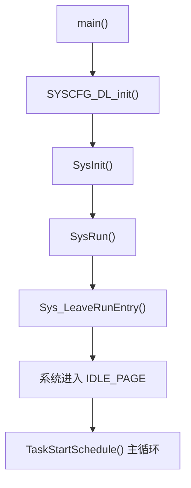
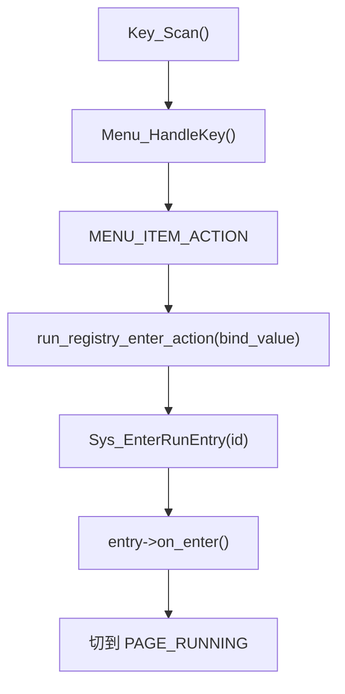

# App 层使用说明

本文档说明当前工程 `hc-team/app/` 这一层的职责边界、运行链路和日常使用方式。

目标不是解释某一个任务的业务细节，而是回答这几个问题：

- `app` 层到底管什么
- 系统上电后是怎么跑起来的
- OLED 菜单、运行项、任务组、VOFA 之间怎么配合
- 新增一个任务时应该改哪些地方

## 1. `app` 层职责

`app` 层是整个工程的业务编排层，位于：

- 底层 `hc-team/driver/mspm0_runtime`
- 驱动层 `hc-team/driver`
- 中间件层 `hc-team/middleware`

之上。

它主要负责四件事：

1. 系统启动初始化
2. 主状态机与任务调度
3. OLED 菜单与运行项切换
4. 业务任务与任务级 VOFA profile 编排

它**不负责**：

- 具体 UART / PWM / GPIO / DMA 的寄存器初始化
- 电机驱动协议组包
- PID 基础公式实现
- VOFA 协议帧编码

这些都应留在 `hc-team/driver/mspm0_runtime`、`driver` 或 `middleware` 层。

## 2. 目录结构

当前 `app` 层目录如下：

```text
app/
├── scheduler/   # 调度核心：状态机、运行项注册、VOFA profile 注册
├── system/      # 启动入口与一次性初始化
├── tasks/       # 所有业务任务与对应任务组
└── ui/          # 纯显示与菜单
```

各目录职责：

### `system/`

- [main.c](/C:/Users/Administrator/workspace_ccstheia/NUEDC/hc-team/app/system/main.c:1)
- [sys_init.c](/C:/Users/Administrator/workspace_ccstheia/NUEDC/hc-team/app/system/sys_init.c:1)

负责：

- MCU 应用入口
- 一次性初始化所有底层、驱动、中间件和 app 模块

### `scheduler/`

- [task_scheduler.h](/C:/Users/Administrator/workspace_ccstheia/NUEDC/hc-team/app/scheduler/task_scheduler.h:1)
- [task_scheduler.c](/C:/Users/Administrator/workspace_ccstheia/NUEDC/hc-team/app/scheduler/task_scheduler.c:1)
- [run_registry.h](/C:/Users/Administrator/workspace_ccstheia/NUEDC/hc-team/app/scheduler/run_registry.h:1)
- [run_registry.c](/C:/Users/Administrator/workspace_ccstheia/NUEDC/hc-team/app/scheduler/run_registry.c:1)
- [vofa_register.h](/C:/Users/Administrator/workspace_ccstheia/NUEDC/hc-team/app/scheduler/vofa_register.h:1)
- [vofa_register.c](/C:/Users/Administrator/workspace_ccstheia/NUEDC/hc-team/app/scheduler/vofa_register.c:1)

负责：

- 系统状态机
- 运行项注册表
- 当前激活任务组选择
- 任务级 VOFA profile 生命周期

### `tasks/`

- [task_groups.h](/C:/Users/Administrator/workspace_ccstheia/NUEDC/hc-team/app/tasks/task_groups.h:1)
- [task_groups.c](/C:/Users/Administrator/workspace_ccstheia/NUEDC/hc-team/app/tasks/task_groups.c:1)
- 以及各业务子目录，例如：
  - `speed_loop/`
  - `gray_test/`
  - `uart_test/`
  - `uart_stress/`
  - `task1/`
  - `platform_2d/`
  - `track_follow/`

负责：

- 各业务模块实现
- 周期任务函数
- 专属任务组定义

### `ui/`

- [menu_core.h](/C:/Users/Administrator/workspace_ccstheia/NUEDC/hc-team/app/ui/oled/menu_core.h:1)
- [menu_core.c](/C:/Users/Administrator/workspace_ccstheia/NUEDC/hc-team/app/ui/oled/menu_core.c:1)
- [menu_pages.h](/C:/Users/Administrator/workspace_ccstheia/NUEDC/hc-team/app/ui/oled/menu_pages.h:1)
- [menu_pages.c](/C:/Users/Administrator/workspace_ccstheia/NUEDC/hc-team/app/ui/oled/menu_pages.c:1)

负责：

- OLED 菜单页面
- 按键导航
- 页面渲染

## 3. 启动链路

上电后的执行顺序很固定：



对应代码：

- [main.c](/C:/Users/Administrator/workspace_ccstheia/NUEDC/hc-team/app/system/main.c:23)
- [sys_init.c](/C:/Users/Administrator/workspace_ccstheia/NUEDC/hc-team/app/system/sys_init.c:55)
- [task_scheduler.c](/C:/Users/Administrator/workspace_ccstheia/NUEDC/hc-team/app/scheduler/task_scheduler.c:39)

### 3.1 `SysInit()` 做什么

`SysInit()` 只做一次性初始化，不做运行时切换。

它的初始化顺序是：

1. 初始化系统状态和基础外设
2. 初始化驱动与中间件
3. 初始化 app 任务模块
4. 注册 UART 接收回调
5. 开中断

重点参考：

- [sys_init.c](/C:/Users/Administrator/workspace_ccstheia/NUEDC/hc-team/app/system/sys_init.c:57)

### 3.2 `SysRun()` 做什么

`SysRun()` 不再返回，它会：

1. 把当前运行项清空
2. 将系统切到 `SYS_STA_IDLE_PAGE`
3. 进入调度器主循环

见：

- [task_scheduler.c](/C:/Users/Administrator/workspace_ccstheia/NUEDC/hc-team/app/scheduler/task_scheduler.c:39)

## 4. 系统运行模型

当前工程采用：

- **粗状态机**
- **当前激活运行项**

的组合模型。

### 4.1 粗状态机

系统状态只有三种：

- `SYS_STA_INIT`
- `SYS_STA_IDLE_PAGE`
- `SYS_STA_RUNNING`

定义在：

- [task_scheduler.h](/C:/Users/Administrator/workspace_ccstheia/NUEDC/hc-team/app/scheduler/task_scheduler.h:42)

含义：

- `INIT`：初始化阶段
- `IDLE_PAGE`：菜单浏览态，只跑 UI 任务
- `RUNNING`：当前存在激活运行项

### 4.2 激活运行项

具体“现在在跑谁”，不是靠页面名判断，而是靠：

- `s_pActiveRunEntry`

见：

- [task_scheduler.c](/C:/Users/Administrator/workspace_ccstheia/NUEDC/hc-team/app/scheduler/task_scheduler.c:25)

也就是说：

- 页面是显示层
- `RunEntry` 才是调度层的真实入口

## 5. OLED 菜单怎么工作

菜单层的职责只有三件事：

1. 显示页面
2. 处理按键
3. 把动作交给调度层

### 5.1 页面来源

菜单项不是手写多份，而是由运行项注册表自动生成：

- [menu_pages.c](/C:/Users/Administrator/workspace_ccstheia/NUEDC/hc-team/app/ui/oled/menu_pages.c:69)
- [run_registry.c](/C:/Users/Administrator/workspace_ccstheia/NUEDC/hc-team/app/scheduler/run_registry.c:116)

### 5.2 按键流转

UI 任务每 5ms 运行一次：

- 扫描按键
- 调 `Menu_HandleKey()`
- 页面脏了才刷新 OLED

见：

- [task_groups.c](/C:/Users/Administrator/workspace_ccstheia/NUEDC/hc-team/app/tasks/task_groups.c:198)

### 5.3 进入一个运行项

链路如下：



关键点：

- 菜单项的 `bind_value` 存的是 `RunEntryId_e`
- `action()` 统一走 `Sys_EnterRunEntry()`

对应：

- [menu_core.c](/C:/Users/Administrator/workspace_ccstheia/NUEDC/hc-team/app/ui/oled/menu_core.c:222)
- [run_registry.c](/C:/Users/Administrator/workspace_ccstheia/NUEDC/hc-team/app/scheduler/run_registry.c:29)
- [task_scheduler.c](/C:/Users/Administrator/workspace_ccstheia/NUEDC/hc-team/app/scheduler/task_scheduler.c:51)

### 5.4 退出一个运行项

按返回键时：

- `Sys_LeaveRunEntry()`
- 调当前项的 `on_exit()`
- 清空当前激活项
- 系统退回 `SYS_STA_IDLE_PAGE`
- 页面回到 `PAGE_HOME`

见：

- [menu_core.c](/C:/Users/Administrator/workspace_ccstheia/NUEDC/hc-team/app/ui/oled/menu_core.c:251)
- [task_scheduler.c](/C:/Users/Administrator/workspace_ccstheia/NUEDC/hc-team/app/scheduler/task_scheduler.c:74)

## 6. 调度器怎么选择任务组

调度器主循环只做一件事：

- 找出“当前状态对应的任务组”
- 遍历这个任务组中的任务
- 对 `Run=1` 的任务执行一次

见：

- [task_scheduler.c](/C:/Users/Administrator/workspace_ccstheia/NUEDC/hc-team/app/scheduler/task_scheduler.c:89)

任务组选择规则：

1. `INIT`：不跑任务组
2. `IDLE_PAGE`：跑 `g_tUiTaskGroup`
3. `RUNNING`：优先跑当前运行项绑定的 `task_group`
4. 如果运行项没绑定任务组，则回落到 `g_tUiTaskGroup`

见：

- [task_scheduler.c](/C:/Users/Administrator/workspace_ccstheia/NUEDC/hc-team/app/scheduler/task_scheduler.c:140)

## 7. 任务组怎么写

任务组定义集中在：

- [task_groups.c](/C:/Users/Administrator/workspace_ccstheia/NUEDC/hc-team/app/tasks/task_groups.c:63)

一个任务组本质上就是：

- 一个 `TaskComps_T[]`
- 一个 `TaskGroup_T`

每个任务项包含：

- 是否启用 `Enable`
- 运行标志 `Run`
- 倒计时 `TimCount`
- 重装值 `TimRload`
- 任务函数 `pTaskFunc`

### 7.1 当前已有任务组

当前工程里已经挂好的典型任务组：

- `g_tUiTaskGroup`
- `g_tSpeedLoopTaskGroup`
- `g_tUartTestTaskGroup`
- `g_tGrayTestTaskGroup`
- `g_tUartStressTaskGroup`
- `g_tDebugSmoothTaskGroup`
- `g_tDebugVisionDataTaskGroup`
- `g_tVisionTrackTaskGroup`
- `g_tTask1TaskGroup`

### 7.2 一个重要规则

如果某个运行项绑定了专属任务组，这个任务组里**通常必须显式保留 `Task_UiService5ms()`**，否则：

- OLED 不刷新
- 按键失效
- 无法通过菜单退出

这一点在现有专属任务组里都已经按这个模式处理了。

## 8. VOFA 怎么接入

任务级 VOFA 不再分散在各个 task 目录里，而是统一收口到：

- [vofa_register.h](/C:/Users/Administrator/workspace_ccstheia/NUEDC/hc-team/app/scheduler/vofa_register.h:1)
- [vofa_register.c](/C:/Users/Administrator/workspace_ccstheia/NUEDC/hc-team/app/scheduler/vofa_register.c:1)

### 8.1 设计规则

统一规则是：

1. 进入任务时注册 profile
2. 退出任务时清空 profile
3. 任务运行中只更新自己的上下文
4. 遥测任务里调用 `vofa_run()`

### 8.2 注意区分两层激活

这里有两个“激活”概念：

- `RunEntryId_e`
  - 决定当前系统跑哪个任务组
- `VofaProfileId_e`
  - 决定当前 VOFA 暴露哪一组变量

二者相关，但不是同一个东西。

### 8.3 正确写法

任务进入时：

```c
VofaRegister_EnterProfile(VOFA_PROFILE_XXX);
```

任务退出时：

```c
VofaRegister_ExitProfile();
```

任务运行时：

```c
VofaXXXCtx_t* ctx = VofaRegister_GetXXXCtx();
ctx->tx_xxx = ...;
vofa_run();
```

### 8.4 不要这样做

不要在业务任务里直接：

- `vofa_clear_profile()`
- `vofa_register_float()`
- `vofa_bind_cmd()`

这些都应该放在 `scheduler/vofa_register.*` 内部统一管理。

## 9. 当前运行项总览

运行项注册表在：

- [run_registry.c](/C:/Users/Administrator/workspace_ccstheia/NUEDC/hc-team/app/scheduler/run_registry.c:48)

当前已经注册的入口包括：

- `TASK1`
- `TASK2`
- `TASK3`
- `TASK4`
- `DEBUG -> Speed`
- `DEBUG -> UART_TEST`
- `DEBUG -> UART_Stress`
- `DEBUG -> GRAY_TEST`
- `DEBUG -> Vision_data`
- `DEBUG -> Track`
- `DEBUG -> Stepper_X`
- `DEBUG -> Stepper_Y`
- `DEBUG -> DEBUG_Smooth`

说明：

- 有些入口已绑定完整后台任务组
- 有些入口还只是占位，未挂实际业务

## 10. 新增一个业务任务怎么接

这是最常用的使用场景。

### 步骤 1：建立任务目录

在 `app/tasks/` 下新增目录，例如：

```text
app/tasks/my_task/
├── my_task.c
└── my_task.h
```

建议至少提供这些接口：

- `MyTask_Init()`
- `MyTask_Enter()`
- `MyTask_Exit()`
- 一个或多个周期任务函数

### 步骤 2：在 `SysInit()` 做一次性初始化

把 `MyTask_Init()` 挂到：

- [sys_init.c](/C:/Users/Administrator/workspace_ccstheia/NUEDC/hc-team/app/system/sys_init.c:55)

规则：

- 初始化只在 `SysInit()` 做一次
- 不要把模块初始化重复放进 `Enter()`

### 步骤 3：在 `task_groups.c` 新增专属任务组

参考现有模式，在：

- [task_groups.c](/C:/Users/Administrator/workspace_ccstheia/NUEDC/hc-team/app/tasks/task_groups.c:63)

新增：

- `static TaskComps_T s_tMyTaskTasks[]`
- `const TaskGroup_T g_tMyTaskTaskGroup`

如果该任务需要运行中还能操作 OLED，记得保留：

- `Task_UiService5ms`

### 步骤 4：在 `run_registry.c` 注册运行项

你需要补三个地方：

1. `RunEntryId_e` 新枚举值
   - [task_scheduler.h](/C:/Users/Administrator/workspace_ccstheia/NUEDC/hc-team/app/scheduler/task_scheduler.h:76)
2. `g_run_entries[]` 注册项
   - [run_registry.c](/C:/Users/Administrator/workspace_ccstheia/NUEDC/hc-team/app/scheduler/run_registry.c:48)
3. `task_group / on_enter / on_exit`

一个典型注册项类似：

```c
{ RUN_ENTRY_DEBUG_MY_TASK, "MY_TASK", RUN_MENU_DEBUG, PAGE_RUNNING, &g_tMyTaskTaskGroup,
  (MenuRenderFn)0, MyTask_Enter, MyTask_Exit },
```

### 步骤 5：如果需要 VOFA，就在 `vofa_register.*` 里补 profile

你需要补：

1. `VofaProfileId_e`
2. 上下文结构体
3. reset 函数
4. profile 注册函数
5. `GetCtx()` 访问函数

并在任务的 `Enter/Exit` 中调用：

- `VofaRegister_EnterProfile(...)`
- `VofaRegister_ExitProfile()`

### 步骤 6：在周期任务中写业务，不在菜单层写业务

业务逻辑应该写在：

- `Task_xxx10ms()`
- `Task_xxx5ms()`
- `Task_xxx20ms()`

而不是写在：

- `Menu_HandleKey()`
- `run_registry_enter_action()`

菜单层只负责切换，不负责执行业务。

## 11. 新增一个纯调试项怎么接

如果只是临时调试，推荐也按正式运行项接，不要散落在 `main()` 或临时钩子里。

建议顺序：

1. 先决定它是：
   - 独立任务组
   - 还是复用已有任务组
2. 若需要实时参数：
   - 统一接到 `vofa_register`
3. 若需要菜单入口：
   - 加入 `run_registry`
4. 若需要单独渲染运行页：
   - 在 `RunEntryReg_t.custom_render` 填自定义渲染函数

## 12. 当前推荐的开发规则

### 12.1 任务代码

- 一个任务目录只负责一个业务域
- `Init` 只做一次性准备
- `Enter/Exit` 只做运行态切换
- 周期任务只做周期内应做的事

### 12.2 调度代码

- 不要在调度器里写业务 if/else
- 调度器只负责“当前该跑哪组任务”

### 12.3 OLED 菜单

- 不要在 `menu_core` 里硬编码具体业务任务
- 菜单内容尽量来自 `run_registry`

### 12.4 VOFA

- 统一进 `scheduler/vofa_register`
- 一个时刻只允许一个 active profile
- 进入注册，退出清空

## 13. 排查顺序建议

如果一个运行项“进不去”或“进去没反应”，按下面顺序查：

1. `run_registry.c` 是否注册了这一项
2. `RunEntryId_e` 是否有对应枚举
3. `task_group` 是否非空
4. 任务组里是否真的有任务函数
5. 任务组里是否保留了 `Task_UiService5ms`
6. `Enter()` 是否有初始化运行态
7. 如果涉及 VOFA：
   - `EnterProfile()` 是否调用
   - `Telemetry` 任务里是否 `vofa_run()`

如果 OLED 能进页面但后台没跑，通常先查：

- `task_group`
- `TaskTimeSliceManage()`
- 1ms 中断是否正常推进

如果 VOFA 没变量或变量串台，通常先查：

- `VofaRegister_EnterProfile()`
- `VofaRegister_ExitProfile()`
- 当前任务是不是忘了清 profile

## 14. 相关文件索引

系统入口：

- [main.c](/C:/Users/Administrator/workspace_ccstheia/NUEDC/hc-team/app/system/main.c:1)
- [sys_init.c](/C:/Users/Administrator/workspace_ccstheia/NUEDC/hc-team/app/system/sys_init.c:1)

调度：

- [task_scheduler.h](/C:/Users/Administrator/workspace_ccstheia/NUEDC/hc-team/app/scheduler/task_scheduler.h:1)
- [task_scheduler.c](/C:/Users/Administrator/workspace_ccstheia/NUEDC/hc-team/app/scheduler/task_scheduler.c:1)

运行项注册：

- [run_registry.h](/C:/Users/Administrator/workspace_ccstheia/NUEDC/hc-team/app/scheduler/run_registry.h:1)
- [run_registry.c](/C:/Users/Administrator/workspace_ccstheia/NUEDC/hc-team/app/scheduler/run_registry.c:1)

VOFA：

- [vofa_register.h](/C:/Users/Administrator/workspace_ccstheia/NUEDC/hc-team/app/scheduler/vofa_register.h:1)
- [vofa_register.c](/C:/Users/Administrator/workspace_ccstheia/NUEDC/hc-team/app/scheduler/vofa_register.c:1)

任务组：

- [task_groups.h](/C:/Users/Administrator/workspace_ccstheia/NUEDC/hc-team/app/tasks/task_groups.h:1)
- [task_groups.c](/C:/Users/Administrator/workspace_ccstheia/NUEDC/hc-team/app/tasks/task_groups.c:1)

菜单：

- [menu_core.h](/C:/Users/Administrator/workspace_ccstheia/NUEDC/hc-team/app/ui/oled/menu_core.h:1)
- [menu_core.c](/C:/Users/Administrator/workspace_ccstheia/NUEDC/hc-team/app/ui/oled/menu_core.c:1)
- [menu_pages.h](/C:/Users/Administrator/workspace_ccstheia/NUEDC/hc-team/app/ui/oled/menu_pages.h:1)
- [menu_pages.c](/C:/Users/Administrator/workspace_ccstheia/NUEDC/hc-team/app/ui/oled/menu_pages.c:1)
